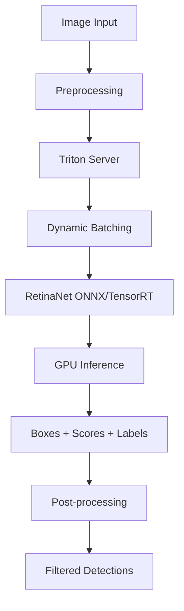

> 💡 **Quick Answer:** Export RetinaNet to ONNX, optimize with TensorRT, and serve via Triton Inference Server on Kubernetes. Use batch processing for throughput (up to 100+ images/sec on A100) or real-time inference with <20ms latency.

## The Problem

Deploying computer vision models like RetinaNet for production object detection requires:

- **Low latency** — real-time detection for video streams needs <30ms per frame
- **High throughput** — batch processing thousands of images for offline analysis
- **Model optimization** — raw PyTorch models are 3-5x slower than TensorRT-optimized versions
- **Scaling** — handling variable load from multiple camera feeds or batch upload spikes

## The Solution

### Step 1: Export RetinaNet to ONNX

```yaml
apiVersion: batch/v1
kind: Job
metadata:
  name: retinanet-export
  namespace: ai-inference
spec:
  template:
    spec:
      restartPolicy: Never
      containers:
        - name: export
          image: pytorch/pytorch:2.2.0-cuda12.1-cudnn8-runtime
          command:
            - /bin/bash
            - -c
            - |
              pip install torchvision onnx onnxruntime

              python3 << 'EOF'
              import torch
              import torchvision

              # Load pretrained RetinaNet
              model = torchvision.models.detection.retinanet_resnet50_fpn_v2(
                  weights=torchvision.models.detection.RetinaNet_ResNet50_FPN_V2_Weights.DEFAULT
              )
              model.eval()

              # Export to ONNX
              dummy_input = torch.randn(1, 3, 800, 800)
              torch.onnx.export(
                  model, dummy_input,
                  "/models/retinanet/1/model.onnx",
                  opset_version=17,
                  input_names=["images"],
                  output_names=["boxes", "scores", "labels"],
                  dynamic_axes={
                      "images": {0: "batch_size"},
                      "boxes": {0: "batch_size"},
                      "scores": {0: "batch_size"},
                      "labels": {0: "batch_size"},
                  }
              )
              print("ONNX export complete")
              EOF
          resources:
            limits:
              nvidia.com/gpu: "1"
              memory: 16Gi
          volumeMounts:
            - name: models
              mountPath: /models
      volumes:
        - name: models
          persistentVolumeClaim:
            claimName: model-repository
```

### Step 2: Create Triton Model Configuration

```yaml
apiVersion: v1
kind: ConfigMap
metadata:
  name: retinanet-config
  namespace: ai-inference
data:
  config.pbtxt: |
    name: "retinanet"
    platform: "onnxruntime_onnx"
    max_batch_size: 16

    input [
      {
        name: "images"
        data_type: TYPE_FP32
        dims: [ 3, 800, 800 ]
      }
    ]

    output [
      {
        name: "boxes"
        data_type: TYPE_FP32
        dims: [ -1, 4 ]
      },
      {
        name: "scores"
        data_type: TYPE_FP32
        dims: [ -1 ]
      },
      {
        name: "labels"
        data_type: TYPE_INT64
        dims: [ -1 ]
      }
    ]

    dynamic_batching {
      preferred_batch_size: [ 4, 8, 16 ]
      max_queue_delay_microseconds: 100000
    }

    instance_group [
      {
        count: 2
        kind: KIND_GPU
      }
    ]
```

### Step 3: Deploy Triton with RetinaNet

```yaml
apiVersion: apps/v1
kind: Deployment
metadata:
  name: retinanet-triton
  namespace: ai-inference
spec:
  replicas: 1
  selector:
    matchLabels:
      app: retinanet-triton
  template:
    metadata:
      labels:
        app: retinanet-triton
    spec:
      containers:
        - name: triton
          image: nvcr.io/nvidia/tritonserver:25.01-py3
          args:
            - "tritonserver"
            - "--model-repository=/models"
            - "--log-verbose=0"
          ports:
            - containerPort: 8000
              name: http
            - containerPort: 8001
              name: grpc
            - containerPort: 8002
              name: metrics
          resources:
            limits:
              nvidia.com/gpu: "1"
              memory: 16Gi
              cpu: "8"
          volumeMounts:
            - name: models
              mountPath: /models
          livenessProbe:
            httpGet:
              path: /v2/health/live
              port: 8000
            periodSeconds: 30
          readinessProbe:
            httpGet:
              path: /v2/health/ready
              port: 8000
            periodSeconds: 10
      volumes:
        - name: models
          persistentVolumeClaim:
            claimName: model-repository
---
apiVersion: v1
kind: Service
metadata:
  name: retinanet-triton
  namespace: ai-inference
spec:
  selector:
    app: retinanet-triton
  ports:
    - port: 8000
      targetPort: 8000
      name: http
    - port: 8001
      targetPort: 8001
      name: grpc
```

### Step 4: Client Inference

```bash
# Test with curl
kubectl run test-retinanet --rm -it --image=python:3.11-slim -- bash -c '
pip install tritonclient[http] pillow numpy

python3 << "EOF"
import numpy as np
import tritonclient.http as httpclient

client = httpclient.InferenceServerClient("retinanet-triton:8000")

# Create test image (800x800 RGB)
image = np.random.rand(1, 3, 800, 800).astype(np.float32)

inputs = [httpclient.InferInput("images", image.shape, "FP32")]
inputs[0].set_data_from_numpy(image)

outputs = [
    httpclient.InferRequestedOutput("boxes"),
    httpclient.InferRequestedOutput("scores"),
    httpclient.InferRequestedOutput("labels"),
]

result = client.infer("retinanet", inputs, outputs=outputs)
boxes = result.as_numpy("boxes")
scores = result.as_numpy("scores")
labels = result.as_numpy("labels")

# Filter high-confidence detections
mask = scores > 0.5
print(f"Detected {mask.sum()} objects")
print(f"Labels: {labels[mask]}")
print(f"Scores: {scores[mask]}")
EOF
'
```



## Common Issues

### Dynamic batching not triggering

```text
# Increase max queue delay for better batching
max_queue_delay_microseconds: 200000  # 200ms
# Or reduce preferred batch sizes for lower latency
preferred_batch_size: [ 2, 4 ]
```

### ONNX export fails with detection models

```python
# RetinaNet has custom ops — use opset 17+
# If export fails, try tracing instead of scripting:
torch.onnx.export(model, dummy_input, "model.onnx",
    opset_version=17, do_constant_folding=True)
```

### TensorRT optimization for maximum throughput

```bash
# Convert ONNX to TensorRT engine
trtexec --onnx=model.onnx \
  --saveEngine=model.plan \
  --fp16 \
  --optShapes=images:8x3x800x800 \
  --maxShapes=images:16x3x800x800 \
  --minShapes=images:1x3x800x800
```

## Best Practices

- **TensorRT optimization** — 2-3x speedup over ONNX Runtime on NVIDIA GPUs
- **Dynamic batching** — accumulate requests for better GPU utilization
- **FP16 inference** — halves memory with negligible accuracy loss for detection
- **Multiple model instances** — run 2 instances per GPU for pipeline overlap
- **Preprocess on CPU** — resize and normalize images before sending to GPU

## Key Takeaways

- Export RetinaNet to **ONNX** then optionally convert to **TensorRT** for maximum performance
- Triton's **dynamic batching** accumulates requests for better GPU utilization
- Single A100 can process **100+ images/sec** with TensorRT FP16 optimization
- Use **2 model instances per GPU** to overlap data transfer and computation
- COCO-pretrained RetinaNet detects **80 object classes** out of the box
