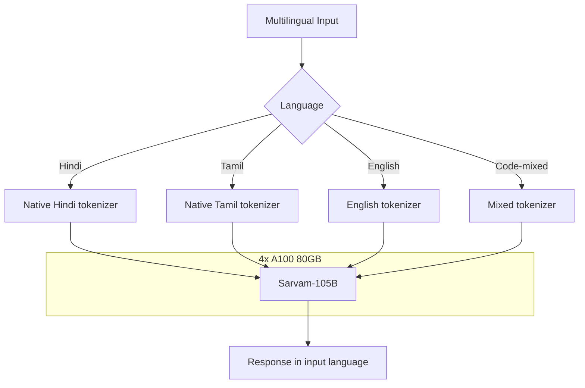

> 💡 **Quick Answer:** Deploy Sarvam-105B with vLLM using `--tensor-parallel-size 4` on 4x A100 80GB. India's largest open LLM with native support for Hindi, Tamil, Telugu, Bengali, Marathi, and 5+ other Indic languages. Also available as Sarvam-30B for 2-GPU setups.

## The Problem

Multilingual AI in non-English markets faces challenges:

- **English-centric models** — Llama, GPT-4 struggle with Indic languages, code-mixing, and cultural context
- **Translation pipelines** — translating to English, processing, translating back loses nuance
- **Native multilingual models** — needed for customer support, content generation, and document processing in India and South Asia

Sarvam AI built 105B and 30B models specifically for multilingual use cases across Indic languages.

## The Solution

### Step 1: Deploy Sarvam-105B

```yaml
apiVersion: apps/v1
kind: Deployment
metadata:
  name: sarvam-105b
  namespace: ai-inference
  labels:
    app: sarvam-105b
spec:
  replicas: 1
  selector:
    matchLabels:
      app: sarvam-105b
  template:
    metadata:
      labels:
        app: sarvam-105b
    spec:
      containers:
        - name: vllm
          image: vllm/vllm-openai:latest
          args:
            - "--model"
            - "sarvamai/sarvam-105b"
            - "--tensor-parallel-size"
            - "4"
            - "--max-model-len"
            - "16384"
            - "--gpu-memory-utilization"
            - "0.92"
            - "--max-num-seqs"
            - "32"
            - "--enable-chunked-prefill"
            - "--trust-remote-code"
            - "--port"
            - "8000"
          ports:
            - containerPort: 8000
          env:
            - name: HUGGING_FACE_HUB_TOKEN
              valueFrom:
                secretKeyRef:
                  name: huggingface-token
                  key: token
            - name: NCCL_DEBUG
              value: "WARN"
          resources:
            limits:
              nvidia.com/gpu: "4"
              memory: 128Gi
              cpu: "32"
          volumeMounts:
            - name: model-cache
              mountPath: /root/.cache/huggingface
            - name: shm
              mountPath: /dev/shm
          startupProbe:
            httpGet:
              path: /health
              port: 8000
            initialDelaySeconds: 300
            periodSeconds: 30
            failureThreshold: 30
          readinessProbe:
            httpGet:
              path: /health
              port: 8000
            periodSeconds: 15
      volumes:
        - name: model-cache
          persistentVolumeClaim:
            claimName: sarvam-model-cache
        - name: shm
          emptyDir:
            medium: Memory
            sizeLimit: 16Gi
      terminationGracePeriodSeconds: 120
---
apiVersion: v1
kind: Service
metadata:
  name: sarvam-105b
  namespace: ai-inference
spec:
  selector:
    app: sarvam-105b
  ports:
    - port: 8000
      targetPort: 8000
```

### Step 2: Sarvam-30B (Smaller Deployment)

```yaml
apiVersion: apps/v1
kind: Deployment
metadata:
  name: sarvam-30b
  namespace: ai-inference
spec:
  replicas: 1
  selector:
    matchLabels:
      app: sarvam-30b
  template:
    metadata:
      labels:
        app: sarvam-30b
    spec:
      containers:
        - name: vllm
          image: vllm/vllm-openai:latest
          args:
            - "--model"
            - "sarvamai/sarvam-30b"
            - "--tensor-parallel-size"
            - "1"
            - "--max-model-len"
            - "16384"
            - "--gpu-memory-utilization"
            - "0.90"
            - "--max-num-seqs"
            - "64"
            - "--trust-remote-code"
          resources:
            limits:
              nvidia.com/gpu: "1"
              memory: 96Gi
              cpu: "8"
```

### Step 3: Multilingual Inference

```bash
# Hindi instruction
kubectl run test-sarvam --rm -it --image=curlimages/curl -- \
  curl -s http://sarvam-105b:8000/v1/chat/completions \
  -H "Content-Type: application/json" \
  -d '{
    "model": "sarvamai/sarvam-105b",
    "messages": [
      {"role": "user", "content": "कुबर्नेटीस में पॉड क्या है? सरल हिंदी में समझाइए।"}
    ],
    "max_tokens": 1024
  }'

# Code-mixed Hindi-English (common in India)
curl -s http://sarvam-105b:8000/v1/chat/completions \
  -H "Content-Type: application/json" \
  -d '{
    "model": "sarvamai/sarvam-105b",
    "messages": [
      {"role": "user", "content": "Kubernetes cluster mein pod crash ho raha hai, kaise debug karein?"}
    ],
    "max_tokens": 1024
  }'

# Tamil
curl -s http://sarvam-105b:8000/v1/chat/completions \
  -H "Content-Type: application/json" \
  -d '{
    "model": "sarvamai/sarvam-105b",
    "messages": [
      {"role": "user", "content": "குபர்னெட்டீஸ் டிப்ளாய்மென்ட் என்றால் என்ன?"}
    ],
    "max_tokens": 1024
  }'
```

### Model Comparison

```text
| Model          | Params | GPUs (FP16)  | Indic Languages | English Quality |
|----------------|--------|-------------|-----------------|-----------------|
| Sarvam-105B    | 106B   | 4x A100 80GB | Native 10+      | Very good       |
| Sarvam-30B     | 32B    | 1x A100 80GB | Native 10+      | Good            |
| Llama 3.1 70B  | 70B    | 4x A100 80GB | Limited Indic    | Excellent       |
| Llama 3.1 8B   | 8B     | 1x A100 40GB | Basic Indic      | Very good       |
```



## Common Issues

### Tokenizer not recognized

```bash
# Sarvam uses custom tokenizer for Indic scripts
--trust-remote-code  # Required

# Ensure HuggingFace token has access to the model
```

### Indic text rendering in logs

```bash
# Kubernetes logs may not render Indic scripts properly
# Use kubectl logs with proper terminal encoding
export LANG=en_US.UTF-8
kubectl logs -f deployment/sarvam-105b
```

### Sarvam-30B for cost-sensitive deployments

```bash
# 30B fits on 1x A100 80GB — same language support
# Quality is lower but sufficient for customer support, FAQs
# 4x cheaper than 105B deployment
```

## Best Practices

- **Sarvam-30B for most use cases** — single GPU, good Indic language support
- **Sarvam-105B for enterprise** — best quality, complex reasoning in Indic languages
- **`--trust-remote-code`** — required for custom Indic tokenizer
- **UTF-8 everywhere** — ensure application, database, and API support UTF-8 for Devanagari, Tamil, Telugu scripts
- **Code-mixed support** — Sarvam handles Hindi-English mixing natively (common in Indian market)

## Key Takeaways

- Sarvam-105B is **India's largest open LLM** — native support for 10+ Indic languages
- Requires **4x A100 80GB** for 105B or **1x A100 80GB** for 30B
- **Native multilingual** — no translation pipeline needed for Hindi, Tamil, Telugu, Bengali, etc.
- Handles **code-mixed text** (Hindi-English, Tamil-English) natively
- **5K+ downloads** — growing adoption for Indian market AI applications
- Use **Sarvam-30B** for cost-sensitive single-GPU deployments
