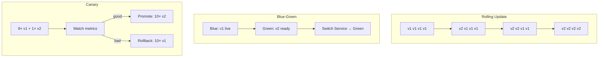

> 💡 **Quick Answer:** Kubernetes has two built-in Deployment strategies: **RollingUpdate** (default, gradual, zero downtime) and **Recreate** (kill all, then start — downtime). **Blue-green** and **canary** are patterns on top: blue-green runs two full Deployments and flips the Service selector from `version: blue` to `version: green`; canary sends a small share of traffic to the new version via replica ratio, Ingress/Gateway API weights, or Argo Rollouts/Flagger. Rollback: `kubectl rollout undo`, flip the selector back, or scale the canary to 0.
>
> **Gotcha:** Replica-ratio canaries are coarse (1 of 10 pods ≈ 10%). For exact percentages, header routing or automated analysis, use Gateway API `HTTPRoute` weights, a service mesh, Argo Rollouts or Flagger.

## Strategy Comparison

| Strategy | Downtime | Rollback speed | Resource cost | Blast radius |
|----------|----------|---------------|---------------|------|
| **Rolling Update** | None | Slow (re-roll) | Normal + surge | All users, gradually |
| **Recreate** | Yes | Slow | Normal | All users at once |
| **Blue-Green** | None | Instant (selector flip) | 2× during release | All users at cutover |
| **Canary** | None | Fast (scale canary to 0) | + canary pods | Small % of users |



Rule of thumb: rolling update for most releases, canary for risky changes to high-traffic services, blue-green when you need instant cutover/rollback and can afford 2× capacity, Recreate only when two versions must never coexist.

## Rolling Update (Default)

```yaml
apiVersion: apps/v1
kind: Deployment
metadata:
  name: web-app
spec:
  replicas: 6
  strategy:
    type: RollingUpdate
    rollingUpdate:
      maxSurge: 2          # up to 2 extra pods during the update
      maxUnavailable: 0    # never drop below 6 available
  # selector/template omitted
```

```bash
kubectl set image deployment/web-app web=myapp:v2
kubectl rollout status deployment/web-app
kubectl rollout undo deployment/web-app
```

Tuning `maxSurge`/`maxUnavailable`, preStop drain and rollback details: [rolling update strategy](/recipes/deployments/kubernetes-rolling-update-strategy/).

## Recreate

```yaml
spec:
  strategy:
    type: Recreate   # all old pods terminated before new ones start
```

Use for a single-replica app with a `ReadWriteOnce` PVC, or when old and new versions can't share a schema or protocol.

## Blue-Green Deployment

```yaml
# Blue deployment (current production)
# blue-deployment.yaml
apiVersion: apps/v1
kind: Deployment
metadata:
  name: app-blue
  labels:
    app: myapp
    version: blue
spec:
  replicas: 3
  selector:
    matchLabels:
      app: myapp
      version: blue
  template:
    metadata:
      labels:
        app: myapp
        version: blue
    spec:
      containers:
        - name: app
          image: myapp:v1
          ports:
            - containerPort: 8080
---
# Green deployment (new version)
# green-deployment.yaml
apiVersion: apps/v1
kind: Deployment
metadata:
  name: app-green
  labels:
    app: myapp
    version: green
spec:
  replicas: 3
  selector:
    matchLabels:
      app: myapp
      version: green
  template:
    metadata:
      labels:
        app: myapp
        version: green
    spec:
      containers:
        - name: app
          image: myapp:v2
          ports:
            - containerPort: 8080
```

```yaml
# Service pointing to blue (current)
# service.yaml
apiVersion: v1
kind: Service
metadata:
  name: myapp
spec:
  selector:
    app: myapp
    version: blue  # Switch to 'green' for cutover
  ports:
    - port: 80
      targetPort: 8080
```

```bash
# Blue-Green switch process:
# 1. Deploy green version
kubectl apply -f green-deployment.yaml

# 2. Wait for green to be ready
kubectl rollout status deployment/app-green

# 3. Test green internally (via pod IP or a temporary green-only Service)
kubectl port-forward deployment/app-green 8080:8080

# 4. Switch traffic to green
kubectl patch svc myapp -p '{"spec":{"selector":{"version":"green"}}}'

# 5. If issues, rollback to blue
kubectl patch svc myapp -p '{"spec":{"selector":{"version":"blue"}}}'

# 6. After validation, delete blue
kubectl delete deployment app-blue
```

## Canary with Multiple Deployments

```yaml
# stable-deployment.yaml
apiVersion: apps/v1
kind: Deployment
metadata:
  name: app-stable
spec:
  replicas: 9  # 90% traffic
  selector:
    matchLabels:
      app: myapp
      track: stable
  template:
    metadata:
      labels:
        app: myapp
        track: stable
    spec:
      containers:
        - name: app
          image: myapp:v1
          ports:
            - containerPort: 8080
---
# canary-deployment.yaml
apiVersion: apps/v1
kind: Deployment
metadata:
  name: app-canary
spec:
  replicas: 1  # 10% traffic
  selector:
    matchLabels:
      app: myapp
      track: canary
  template:
    metadata:
      labels:
        app: myapp
        track: canary
    spec:
      containers:
        - name: app
          image: myapp:v2
          ports:
            - containerPort: 8080
---
# Service selects both (kube-proxy picks endpoints randomly, so traffic ≈ pod ratio)
apiVersion: v1
kind: Service
metadata:
  name: myapp
spec:
  selector:
    app: myapp  # Matches both stable and canary
  ports:
    - port: 80
      targetPort: 8080
```

```bash
# Progressive canary rollout:
# 10% -> 25% -> 50% -> 100%

# Start: stable=9, canary=1 (10%)
kubectl scale deployment app-canary --replicas=1
kubectl scale deployment app-stable --replicas=9

# Increase: stable=3, canary=1 (25%)
kubectl scale deployment app-stable --replicas=3

# Half: stable=1, canary=1 (50%)
kubectl scale deployment app-stable --replicas=1

# Full: canary=3 (100%)
kubectl scale deployment app-canary --replicas=3
kubectl delete deployment app-stable
```

## Canary with Ingress (NGINX)

Weight-based routing needs **separate** Services for stable and canary (`app-stable`, `app-canary`), each selecting only its own `track` label. Traffic share is then independent of replica counts.

> The community ingress-nginx controller was retired in March 2026. The annotations below still work on existing installs; for new clusters prefer Gateway API weights — see [canary with Gateway API](/recipes/deployments/canary-deployment-gateway-api-traffic-splitting/).

```yaml
# main-ingress.yaml
apiVersion: networking.k8s.io/v1
kind: Ingress
metadata:
  name: myapp-main
spec:
  ingressClassName: nginx
  rules:
    - host: myapp.example.com
      http:
        paths:
          - path: /
            pathType: Prefix
            backend:
              service:
                name: app-stable
                port:
                  number: 80
---
# canary-ingress.yaml
apiVersion: networking.k8s.io/v1
kind: Ingress
metadata:
  name: myapp-canary
  annotations:
    nginx.ingress.kubernetes.io/canary: "true"
    nginx.ingress.kubernetes.io/canary-weight: "10"  # 10% traffic
spec:
  ingressClassName: nginx
  rules:
    - host: myapp.example.com
      http:
        paths:
          - path: /
            pathType: Prefix
            backend:
              service:
                name: app-canary
                port:
                  number: 80
```

```bash
# Increase canary traffic
kubectl annotate ingress myapp-canary \
  nginx.ingress.kubernetes.io/canary-weight="25" --overwrite

# 50% traffic
kubectl annotate ingress myapp-canary \
  nginx.ingress.kubernetes.io/canary-weight="50" --overwrite

# Full rollout: move stable to v2 first, then drop the canary route
kubectl set image deployment/app-stable app=myapp:v2
kubectl rollout status deployment/app-stable
kubectl delete ingress myapp-canary
kubectl scale deployment app-canary --replicas=0
```

## Header-Based Canary

```yaml
# canary-header.yaml
apiVersion: networking.k8s.io/v1
kind: Ingress
metadata:
  name: myapp-canary
  annotations:
    nginx.ingress.kubernetes.io/canary: "true"
    nginx.ingress.kubernetes.io/canary-by-header: "X-Canary"
    nginx.ingress.kubernetes.io/canary-by-header-value: "true"
spec:
  ingressClassName: nginx
  rules:
    - host: myapp.example.com
      http:
        paths:
          - path: /
            pathType: Prefix
            backend:
              service:
                name: app-canary
                port:
                  number: 80
```

```bash
# Test canary with header
curl -H "X-Canary: true" https://myapp.example.com

# Normal traffic goes to stable
curl https://myapp.example.com
```

## Canary with Gateway API

```yaml
apiVersion: gateway.networking.k8s.io/v1
kind: HTTPRoute
metadata:
  name: myapp
spec:
  parentRefs:
    - name: public-gateway
  hostnames: ["myapp.example.com"]
  rules:
    - backendRefs:
        - name: app-stable
          port: 80
          weight: 90
        - name: app-canary
          port: 80
          weight: 10
```

Change the weights (`90/10` → `50/50` → `0/100`) with `kubectl patch` or in Git.

## Argo Rollouts (Advanced)

```yaml
# Install Argo Rollouts
# kubectl create namespace argo-rollouts
# kubectl apply -n argo-rollouts -f https://github.com/argoproj/argo-rollouts/releases/latest/download/install.yaml

# rollout.yaml
apiVersion: argoproj.io/v1alpha1
kind: Rollout
metadata:
  name: myapp
spec:
  replicas: 5
  selector:
    matchLabels:
      app: myapp
  template:
    metadata:
      labels:
        app: myapp
    spec:
      containers:
        - name: app
          image: myapp:v1
          ports:
            - containerPort: 8080
  strategy:
    canary:
      steps:
        - setWeight: 10
        - pause: {duration: 5m}
        - setWeight: 25
        - pause: {duration: 5m}
        - setWeight: 50
        - pause: {duration: 10m}
        - setWeight: 100
      canaryService: myapp-canary
      stableService: myapp-stable
```

```bash
# Trigger rollout
kubectl argo rollouts set image myapp app=myapp:v2

# Watch progress
kubectl argo rollouts get rollout myapp -w

# Promote immediately
kubectl argo rollouts promote myapp

# Abort rollout
kubectl argo rollouts abort myapp
```

## Flagger (Progressive Delivery)

```yaml
# flagger-canary.yaml
apiVersion: flagger.app/v1beta1
kind: Canary
metadata:
  name: myapp
spec:
  targetRef:
    apiVersion: apps/v1
    kind: Deployment
    name: myapp
  service:
    port: 80
    targetPort: 8080
  analysis:
    interval: 1m
    threshold: 5
    maxWeight: 50
    stepWeight: 10
    metrics:
      - name: request-success-rate
        thresholdRange:
          min: 99
        interval: 1m
      - name: request-duration
        thresholdRange:
          max: 500
        interval: 1m
```

## Monitor Deployment

```bash
# Watch deployments
kubectl get deployments -w

# Check rollout status
kubectl rollout status deployment/app-canary

# Compare versions
kubectl get pods -l app=myapp -L version

# Check endpoint distribution
kubectl get endpointslices -l kubernetes.io/service-name=myapp

# Monitor traffic split (if using service mesh)
kubectl get virtualservice myapp -o yaml
```

## Rollback Strategies

```bash
# Blue-Green rollback
kubectl patch svc myapp -p '{"spec":{"selector":{"version":"blue"}}}'

# Canary rollback - scale down canary
kubectl scale deployment app-canary --replicas=0

# Argo Rollouts rollback
kubectl argo rollouts undo myapp

# Standard deployment rollback
kubectl rollout undo deployment/myapp
kubectl rollout undo deployment/myapp --to-revision=2
```

## Common Issues

**Rolling update stuck** — new pods fail readiness. `kubectl rollout status`, pod logs, then `kubectl rollout undo`.

**Blue-green: both versions serve traffic** — the Service selector only has `app: myapp`. It must include the `version` label.

**Canary split doesn't match replica ratio** — kube-proxy picks endpoints per connection, and keep-alive/HTTP2 clients pin to one pod. Use weighted routing (Ingress, Gateway API, mesh) for precise splits.

**Blue-green cutover drops long-lived connections** — changing the selector doesn't close existing TCP connections to blue pods. Keep blue running until connections drain.

## Frequently Asked Questions

### What deployment strategies does Kubernetes support natively?

Only `RollingUpdate` (default) and `Recreate`, set in `spec.strategy.type`. Blue-green and canary are built from multiple Deployments plus Service selectors or weighted routing, or automated with Argo Rollouts or Flagger.

### What is the difference between blue-green and canary?

Blue-green switches 100% of traffic from the old to the new environment in one step and keeps the old one for instant rollback. Canary shifts a small percentage first, watches metrics, and increases gradually.

### Which strategy should I use?

Rolling update for most stateless services. Canary for risky changes on high-traffic services, ideally with automated analysis. Blue-green when you need an atomic cutover and can pay for 2× capacity. Recreate only when versions can't coexist.

### How do I roll back each strategy?

Rolling update: `kubectl rollout undo deployment/<name>`. Blue-green: patch the Service selector back to blue. Canary: scale the canary to 0 or set its weight to 0. Argo Rollouts: `kubectl argo rollouts abort` or `undo`.

