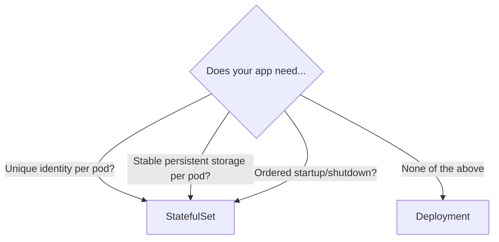

> 💡 **Quick Answer:** Choose between Deployment and StatefulSet for your Kubernetes workloads. Compare identity, storage, ordering, scaling, and use cases for each controller.

## The Problem

This is one of the most searched Kubernetes topics. Having a comprehensive, well-structured guide helps both beginners and experienced users quickly find what they need.

## The Solution

### Side-by-Side Comparison

| Feature | Deployment | StatefulSet |
|---------|-----------|-------------|
| Pod identity | Random names (web-7d9f5) | Ordered names (web-0, web-1, web-2) |
| Storage | Shared PVC or none | Unique PVC per pod |
| Startup order | All at once (parallel) | Sequential (0 → 1 → 2) |
| Scale down | Random pod deleted | Highest ordinal first (2 → 1 → 0) |
| DNS | Service ClusterIP only | Individual pod DNS |
| Rolling update | Replace any pod | Reverse ordinal (2 → 1 → 0) |
| Use case | Stateless apps | Databases, distributed systems |

### Deployment Example

```yaml
apiVersion: apps/v1
kind: Deployment
metadata:
  name: web-app
spec:
  replicas: 3
  selector:
    matchLabels:
      app: web
  template:
    metadata:
      labels:
        app: web
    spec:
      containers:
        - name: nginx
          image: nginx:1.25
# Pods: web-app-7d9f5b6c4-abc, web-app-7d9f5b6c4-def, web-app-7d9f5b6c4-ghi
# All pods are interchangeable — no identity
```

### StatefulSet Example

```yaml
apiVersion: apps/v1
kind: StatefulSet
metadata:
  name: postgres
spec:
  serviceName: postgres      # Required headless service
  replicas: 3
  selector:
    matchLabels:
      app: postgres
  template:
    metadata:
      labels:
        app: postgres
    spec:
      containers:
        - name: postgres
          image: postgres:16
          volumeMounts:
            - name: data
              mountPath: /var/lib/postgresql/data
  volumeClaimTemplates:      # Unique PVC per pod
    - metadata:
        name: data
      spec:
        accessModes: ["ReadWriteOnce"]
        resources:
          requests:
            storage: 50Gi
---
# Required headless service
apiVersion: v1
kind: Service
metadata:
  name: postgres
spec:
  clusterIP: None
  selector:
    app: postgres
  ports:
    - port: 5432
# Pods: postgres-0, postgres-1, postgres-2
# DNS: postgres-0.postgres.default.svc.cluster.local
# PVCs: data-postgres-0, data-postgres-1, data-postgres-2
```

### When to Use Which

| Use Case | Controller |
|----------|-----------|
| Web servers, APIs | Deployment |
| Microservices | Deployment |
| Databases (PostgreSQL, MySQL) | StatefulSet |
| Message queues (Kafka, RabbitMQ) | StatefulSet |
| Distributed storage (Elasticsearch) | StatefulSet |
| Cache (Redis cluster) | StatefulSet |



## Frequently Asked Questions

### Can I use Deployments with persistent storage?

Yes, but all replicas share the same PVC (or use separate PVCs manually). StatefulSet auto-creates a unique PVC per replica.

### What happens when I delete a StatefulSet pod?

It's recreated with the same name (e.g., postgres-1) and reattaches to the same PVC. Data persists.

## Best Practices

- **Start simple** — use the basic form first, add complexity as needed
- **Be consistent** — follow naming conventions across your cluster
- **Document your choices** — add annotations explaining why, not just what
- **Monitor and iterate** — review configurations regularly

## Key Takeaways

- This is fundamental Kubernetes knowledge every engineer needs
- Start with the simplest approach that solves your problem
- Use `kubectl explain` and `kubectl describe` when unsure
- Practice in a test cluster before applying to production
