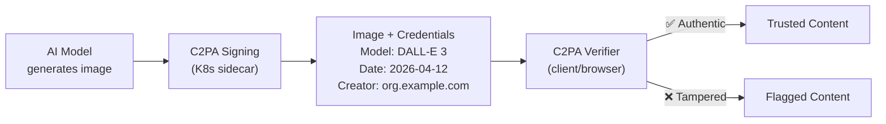

> 💡 **Quick Answer:** Digital provenance tracks where digital content came from and how it was modified. The C2PA standard embeds cryptographic "content credentials" in images, videos, and documents. On Kubernetes, deploy provenance signing as a sidecar or pipeline step — every AI-generated image gets signed with origin metadata (model, timestamp, creator) that viewers can verify.

## The Problem

In the generative AI era, distinguishing real from AI-generated content is critical for trust, journalism, elections, and legal evidence. Without provenance, anyone can claim AI images are real photos or vice versa. C2PA (Coalition for Content Provenance and Authenticity) is the emerging standard — backed by Adobe, Microsoft, Google, and the BBC — that embeds verifiable credentials in digital content.



## The Solution

### C2PA Signing Service on Kubernetes

```yaml
apiVersion: apps/v1
kind: Deployment
metadata:
  name: c2pa-signing-service
spec:
  replicas: 2
  template:
    spec:
      containers:
        - name: signer
          image: myorg/c2pa-signer:v1.0
          ports:
            - containerPort: 8080
          env:
            - name: C2PA_CERT_PATH
              value: "/certs/signing.pem"
            - name: C2PA_KEY_PATH
              value: "/certs/signing.key"
            - name: CLAIM_GENERATOR
              value: "MyOrg AI Pipeline v2.0"
          volumeMounts:
            - name: signing-certs
              mountPath: /certs
              readOnly: true
      volumes:
        - name: signing-certs
          secret:
            secretName: c2pa-signing-certs
---
apiVersion: v1
kind: Service
metadata:
  name: c2pa-signer
spec:
  selector:
    app: c2pa-signing-service
  ports:
    - port: 8080
```

### AI Image Pipeline with Provenance

```yaml
# Tekton pipeline: Generate → Sign → Store
apiVersion: tekton.dev/v1
kind: Pipeline
metadata:
  name: ai-image-pipeline
spec:
  tasks:
    # Step 1: Generate image with AI model
    - name: generate
      taskRef:
        name: ai-image-generate
      params:
        - name: PROMPT
          value: $(params.prompt)
        - name: MODEL
          value: "stable-diffusion-xl"

    # Step 2: Sign with C2PA credentials
    - name: sign-provenance
      runAfter: ["generate"]
      taskRef:
        name: c2pa-sign
      params:
        - name: INPUT_IMAGE
          value: "$(tasks.generate.results.image-path)"
        - name: CLAIM_GENERATOR
          value: "MyOrg AI Pipeline"
        - name: AI_MODEL
          value: "stable-diffusion-xl"
        - name: AI_PROMPT
          value: $(params.prompt)

    # Step 3: Store with provenance metadata
    - name: store
      runAfter: ["sign-provenance"]
      taskRef:
        name: upload-to-cdn
```

### C2PA Verification API

```yaml
apiVersion: apps/v1
kind: Deployment
metadata:
  name: c2pa-verifier
spec:
  template:
    spec:
      containers:
        - name: verifier
          image: myorg/c2pa-verifier:v1.0
          ports:
            - containerPort: 8080
          env:
            - name: TRUST_STORE_PATH
              value: "/trust/trusted-roots.pem"
          volumeMounts:
            - name: trust-store
              mountPath: /trust
              readOnly: true
```

```bash
# Verify content provenance via API
curl -X POST http://c2pa-verifier:8080/verify \
  -F "file=@image-with-credentials.jpg"

# Response:
# {
#   "valid": true,
#   "claim_generator": "MyOrg AI Pipeline v2.0",
#   "assertions": [
#     {"label": "c2pa.ai_generated", "data": {"model": "stable-diffusion-xl"}},
#     {"label": "c2pa.created", "data": {"date": "2026-04-12T10:00:00Z"}},
#     {"label": "c2pa.creator", "data": {"name": "MyOrg"}}
#   ],
#   "signature": {"algorithm": "ES256", "issuer": "CN=MyOrg Content CA"}
# }
```

### Certificate Management for C2PA

```yaml
# cert-manager issuer for C2PA signing certificates
apiVersion: cert-manager.io/v1
kind: Certificate
metadata:
  name: c2pa-signing-cert
spec:
  secretName: c2pa-signing-certs
  issuerRef:
    name: content-ca
    kind: ClusterIssuer
  commonName: "content.example.com"
  usages:
    - digital signature
  duration: 8760h
  renewBefore: 720h
  privateKey:
    algorithm: ECDSA
    size: 256
```

## Common Issues

| Issue | Cause | Fix |
|-------|-------|-----|
| Signature validation fails | Certificate expired or not trusted | Update trust store, renew certs |
| Large file overhead | C2PA metadata adds size | Use external manifest store (C2PA cloud) |
| Signing latency | Crypto operations on every image | Use hardware signing (HSM/KMS) |
| Credentials stripped by CDN | Image processing removes metadata | Use C2PA-aware CDN or external manifests |

## Best Practices

- **Sign at creation, not after** — provenance must be established at the source
- **Include AI model metadata** — which model, prompt, and version generated the content
- **Use cert-manager for certificate lifecycle** — auto-renew signing certificates
- **Store trust anchors as ConfigMaps** — easy to update trusted CA roots
- **Verify before publishing** — validate provenance in your CI/CD pipeline
- **Follow C2PA 2.0 spec** — standard is actively evolving, pin to a spec version

## Key Takeaways

- Digital provenance embeds cryptographic proof of content origin and modifications
- C2PA is the standard (Adobe, Microsoft, Google, BBC) for content credentials
- Deploy signing services as Kubernetes sidecars or pipeline steps
- Every AI-generated image/video should carry provenance metadata
- Verification APIs let consumers check if content is authentic
- 2026 trend: provenance becoming mandatory for AI-generated media
