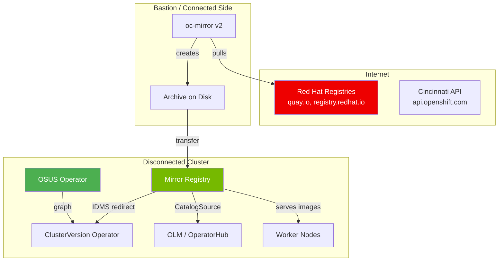

> 💡 **Quick Answer:** A disconnected OpenShift environment is any cluster without full internet access — from restricted networks with firewalls to fully air-gapped installations. Key components: mirror registry (image storage), oc-mirror (mirroring tool), IDMS/ITMS (pull redirection), OLM with mirrored catalogs (Operators), and OSUS (upgrade graph). Red Hat recommends oc-mirror v2 + Agent-based Installer + local OSUS.

## The Problem

Many organizations — government, defense, financial services, healthcare, telco — must run OpenShift clusters without internet access. OpenShift's automation depends on pulling images, catalogs, and update graphs from public registries. Without a structured disconnected strategy:

- Installation fails at image pull
- Operators can't be installed or updated
- Cluster upgrades are blocked
- Security patches can't be applied
- Multi-cluster management becomes chaotic

## The Solution

### Disconnected Environment Types

| Type | Internet Access | Physical Separation | Transfer Method |
|------|----------------|--------------------|-----------------| 
| **Air-gapped** | None | Physical gap | USB/disk transport |
| **Disconnected** | None | Logical separation | Internal network only |
| **Restricted network** | Limited (firewall/proxy) | Firewall boundary | Proxy/allowlist |

### Component Architecture



### The Disconnected Lifecycle

| Phase | Component | Article |
|-------|-----------|---------|
| **1. Registry** | Deploy mirror registry | [Mirror Registry Guide](/recipes/deployments/mirror-registry-disconnected-openshift/) |
| **2. Mirror** | Mirror images with oc-mirror | [oc-mirror Guide](/recipes/deployments/oc-mirror-disconnected-openshift/) |
| **3. Redirect** | Configure IDMS/ITMS | [IDMS/ITMS Guide](/recipes/configuration/idms-itms-disconnected-openshift/) |
| **4. Install** | Agent-based disconnected install | [Disconnected Install](/recipes/deployments/openshift-upgrade-disconnected-environment/) |
| **5. Operators** | OLM with mirrored catalogs | [OLM Disconnected](/recipes/deployments/olm-disconnected-openshift/) |
| **6. Upgrades** | OSUS + mirrored releases | [OSUS Guide](/recipes/deployments/osus-operator-disconnected-openshift/) |
| **7. Convert** | Connected → disconnected | [Conversion Guide](/recipes/deployments/convert-connected-disconnected-openshift/) |

### Red Hat's Recommended Stack

1. **oc-mirror v2** — single tool for all mirroring (replaces v1)
2. **Agent-based Installer** — preferred disconnected install method
3. **OSUS** — local upgrade graph for ClusterVersion operator
4. **IDMS/ITMS** — replaces deprecated ICSP for image pull redirection

### Quick Reference: Key Commands

```bash
# Mirror images (partially disconnected)
oc mirror --v2 -c imageset-config.yaml \
  --workspace file:///opt/workspace \
  docker://mirror.example.com:8443

# Mirror to disk (fully air-gapped)
oc mirror --v2 -c imageset-config.yaml \
  file:///mnt/transfer

# Disk to mirror (in disconnected network)
oc mirror --v2 -c imageset-config.yaml \
  --from file:///mnt/transfer \
  docker://mirror.example.com:8443

# Apply generated resources
oc apply -f working-dir/cluster-resources/

# Check upgrade availability
oc adm upgrade

# Disable default OperatorHub
oc patch OperatorHub cluster --type json \
  -p '[{"op":"add","path":"/spec/disableAllDefaultSources","value":true}]'
```

### Enclave Support (oc-mirror v2)

For environments with multiple security enclaves behind intermediate disconnected networks:

```
Internet → Bastion → Enterprise Registry → Enclave 1 Registry
                                         → Enclave 2 Registry
```

oc-mirror v2 supports multi-enclave workflows with `registries.conf` files and incremental archive generation per enclave.

## Best Practices

- **Start with oc-mirror v2** — v1 is deprecated, v2 generates IDMS/ITMS and handles incremental mirroring
- **Mirror incrementally** — first mirror is large (100s of GB), subsequent ones are delta-only
- **Test the full lifecycle** in staging — mirror, install, upgrade, Operator install
- **Automate mirror refresh** — schedule regular oc-mirror runs on the connected bastion
- **Document your image inventory** — know exactly which images your workloads need
- **Plan storage carefully** — mirror registries grow quickly with multiple OCP versions and Operators

## Key Takeaways

- Disconnected OpenShift requires 7 components: mirror registry, oc-mirror, IDMS/ITMS, OLM catalogs, OSUS, Agent installer, and network configuration
- Each component has a dedicated guide in this series — follow them in order for a complete setup
- oc-mirror v2 is the central tool that generates all required Kubernetes resources
- Red Hat's recommended path: oc-mirror v2 + Agent-based Installer + local OSUS
- Incremental mirroring minimizes ongoing data transfer after initial setup
- Multi-enclave support enables centralized mirroring for multiple security zones
