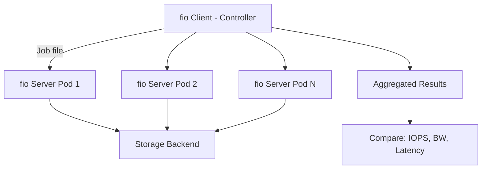

> 💡 **Quick Answer:** Run distributed fio benchmarks on Kubernetes and OpenShift to test storage performance at scale. Covers fio-distributed with k8s Jobs, Red Hat dbench, and CSI throughput validation.

## The Problem

You need to validate storage performance before running production workloads — but single-pod `fio` tests don't represent real multi-tenant I/O patterns. When 50 pods hit the same NFS server, Ceph cluster, or cloud CSI volume simultaneously, bottlenecks appear that single-client tests miss entirely. You need distributed fio across multiple pods, coordinated to hammer storage in parallel, to find the real limits.

## The Solution

### Single-Pod fio Baseline

First, establish a single-pod baseline before going distributed:

```yaml
apiVersion: batch/v1
kind: Job
metadata:
  name: fio-baseline
spec:
  template:
    spec:
      restartPolicy: Never
      containers:
        - name: fio
          image: nixery.dev/fio
          command: ["fio"]
          args:
            - --name=seqwrite
            - --ioengine=libaio
            - --direct=1
            - --bs=1M
            - --size=1G
            - --numjobs=4
            - --runtime=60
            - --time_based
            - --rw=write
            - --group_reporting
            - --directory=/data
            - --output-format=json
          volumeMounts:
            - name: test-vol
              mountPath: /data
          resources:
            requests:
              cpu: "1"
              memory: 2Gi
      volumes:
        - name: test-vol
          persistentVolumeClaim:
            claimName: fio-test-pvc
---
apiVersion: v1
kind: PersistentVolumeClaim
metadata:
  name: fio-test-pvc
spec:
  accessModes: [ReadWriteOnce]
  storageClassName: gp3-csi      # Your StorageClass
  resources:
    requests:
      storage: 50Gi
```

### fio Job Profiles

```ini
# /etc/fio/profiles/sequential-write.fio
[global]
ioengine=libaio
direct=1
time_based
runtime=120
group_reporting
directory=/data

[seq-write-1M]
rw=write
bs=1M
size=4G
numjobs=4
iodepth=32

# /etc/fio/profiles/random-read-4k.fio
[global]
ioengine=libaio
direct=1
time_based
runtime=120
group_reporting
directory=/data

[rand-read-4k]
rw=randread
bs=4k
size=4G
numjobs=8
iodepth=64

# /etc/fio/profiles/mixed-rw-database.fio
[global]
ioengine=libaio
direct=1
time_based
runtime=120
group_reporting
directory=/data

[mixed-rw]
rw=randrw
rwmixread=70
bs=8k
size=4G
numjobs=8
iodepth=32
```

### Distributed fio with Native Client/Server Mode

fio has a built-in client/server mode — one controller node coordinates multiple workers:

```yaml
# ConfigMap with fio job file
apiVersion: v1
kind: ConfigMap
metadata:
  name: fio-jobfile
data:
  distributed.fio: |
    [global]
    ioengine=libaio
    direct=1
    time_based
    runtime=120
    group_reporting
    directory=/data
    
    [distributed-randwrite]
    rw=randwrite
    bs=4k
    size=2G
    numjobs=4
    iodepth=32
---
# fio server DaemonSet (workers) — one per node
apiVersion: apps/v1
kind: DaemonSet
metadata:
  name: fio-server
  labels:
    app: fio-server
spec:
  selector:
    matchLabels:
      app: fio-server
  template:
    metadata:
      labels:
        app: fio-server
    spec:
      containers:
        - name: fio
          image: nixery.dev/fio
          command: ["fio", "--server"]
          ports:
            - containerPort: 8765
              name: fio
          volumeMounts:
            - name: data
              mountPath: /data
          resources:
            requests:
              cpu: "2"
              memory: 4Gi
      volumes:
        - name: data
          persistentVolumeClaim:
            claimName: fio-shared-data
---
# Headless service for fio server discovery
apiVersion: v1
kind: Service
metadata:
  name: fio-server
spec:
  clusterIP: None
  selector:
    app: fio-server
  ports:
    - port: 8765
      name: fio
---
# fio client Job (controller) — sends job to all servers
apiVersion: batch/v1
kind: Job
metadata:
  name: fio-client
spec:
  template:
    spec:
      restartPolicy: Never
      containers:
        - name: fio-client
          image: nixery.dev/fio
          command: ["/bin/sh", "-c"]
          args:
            - |
              echo "Discovering fio servers..."
              # Resolve all fio-server pod IPs
              SERVERS=$(getent hosts fio-server.default.svc.cluster.local | awk '{print $1}' | sort -u)
              echo "Found servers: $SERVERS"
              
              # Build --client args
              CLIENT_ARGS=""
              for ip in $SERVERS; do
                CLIENT_ARGS="$CLIENT_ARGS --client=$ip"
              done
              
              echo "Running distributed fio..."
              fio /etc/fio/distributed.fio $CLIENT_ARGS --output-format=json+
              echo "Done."
          volumeMounts:
            - name: jobfile
              mountPath: /etc/fio
      volumes:
        - name: jobfile
          configMap:
            name: fio-jobfile
```

### Distributed fio with Indexed Jobs (Scalable)

For RWX (ReadWriteMany) storage testing — many pods hitting the same volume:

```yaml
apiVersion: batch/v1
kind: Job
metadata:
  name: fio-distributed
spec:
  completions: 10          # 10 parallel fio workers
  parallelism: 10          # All at once
  completionMode: Indexed
  template:
    spec:
      restartPolicy: Never
      containers:
        - name: fio
          image: nixery.dev/fio
          command: ["/bin/sh", "-c"]
          args:
            - |
              WORKER_ID=$JOB_COMPLETION_INDEX
              echo "Worker $WORKER_ID starting fio..."
              
              # Each worker writes to its own subdirectory
              mkdir -p /data/worker-${WORKER_ID}
              
              fio --name=distributed-write \
                --ioengine=libaio \
                --direct=1 \
                --rw=randwrite \
                --bs=4k \
                --size=1G \
                --numjobs=4 \
                --iodepth=32 \
                --runtime=120 \
                --time_based \
                --group_reporting \
                --directory=/data/worker-${WORKER_ID} \
                --output-format=json \
                --output=/results/worker-${WORKER_ID}.json
              
              echo "Worker $WORKER_ID done."
              cat /results/worker-${WORKER_ID}.json | grep -E '"bw"|"iops"|"lat_ns"'
          volumeMounts:
            - name: data
              mountPath: /data
            - name: results
              mountPath: /results
          resources:
            requests:
              cpu: "2"
              memory: 2Gi
      volumes:
        - name: data
          persistentVolumeClaim:
            claimName: fio-rwx-pvc       # Must be RWX!
        - name: results
          emptyDir: {}
---
apiVersion: v1
kind: PersistentVolumeClaim
metadata:
  name: fio-rwx-pvc
spec:
  accessModes: [ReadWriteMany]
  storageClassName: ceph-filesystem       # Or NFS
  resources:
    requests:
      storage: 100Gi
```

### OpenShift-Specific: Using dbench (Red Hat Pattern)

```yaml
# OpenShift dbench — quick storage benchmark
apiVersion: batch/v1
kind: Job
metadata:
  name: dbench
spec:
  template:
    spec:
      restartPolicy: Never
      containers:
        - name: dbench
          image: sotoaster/dbench:latest
          env:
            - name: DBENCH_MOUNTPOINT
              value: /data
            - name: FIO_SIZE
              value: 2G
            - name: FIO_DIRECT
              value: "1"
            - name: FIO_READWRITE
              value: randrw
            # OpenShift: run as non-root
          securityContext:
            runAsNonRoot: true
            allowPrivilegeEscalation: false
            capabilities:
              drop: [ALL]
            seccompProfile:
              type: RuntimeDefault
          volumeMounts:
            - name: data
              mountPath: /data
      volumes:
        - name: data
          persistentVolumeClaim:
            claimName: dbench-pvc
```

### OpenShift ODF/Ceph Benchmark

```bash
# For OpenShift Data Foundation (ODF), test all three storage types:

# 1. Block (ocs-storagecluster-ceph-rbd) — databases
cat <<'EOF' | oc apply -f -
apiVersion: v1
kind: PersistentVolumeClaim
metadata:
  name: fio-block
spec:
  accessModes: [ReadWriteOnce]
  storageClassName: ocs-storagecluster-ceph-rbd
  resources:
    requests:
      storage: 50Gi
EOF

# 2. File (ocs-storagecluster-cephfs) — shared storage
cat <<'EOF' | oc apply -f -
apiVersion: v1
kind: PersistentVolumeClaim
metadata:
  name: fio-cephfs
spec:
  accessModes: [ReadWriteMany]
  storageClassName: ocs-storagecluster-cephfs
  resources:
    requests:
      storage: 50Gi
EOF

# 3. Object (via S3 with noobaa) — not fio, use s3bench
# oc get route s3 -n openshift-storage
```

### Collecting and Comparing Results

```yaml
# Aggregator Job — collects results from all workers
apiVersion: batch/v1
kind: Job
metadata:
  name: fio-aggregator
spec:
  template:
    spec:
      restartPolicy: Never
      containers:
        - name: aggregator
          image: python:3.11-slim
          command: ["python3", "-c"]
          args:
            - |
              import json, glob, os
              
              results = []
              for f in sorted(glob.glob('/results/worker-*.json')):
                  with open(f) as fh:
                      data = json.load(fh)
                  for job in data.get('jobs', []):
                      results.append({
                          'file': os.path.basename(f),
                          'read_bw_MBs': job['read']['bw'] / 1024,
                          'write_bw_MBs': job['write']['bw'] / 1024,
                          'read_iops': job['read']['iops'],
                          'write_iops': job['write']['iops'],
                          'read_lat_us': job['read']['lat_ns']['mean'] / 1000,
                          'write_lat_us': job['write']['lat_ns']['mean'] / 1000,
                      })
              
              print(f"\n{'='*60}")
              print(f"DISTRIBUTED FIO RESULTS — {len(results)} workers")
              print(f"{'='*60}")
              
              total_read_bw = sum(r['read_bw_MBs'] for r in results)
              total_write_bw = sum(r['write_bw_MBs'] for r in results)
              total_read_iops = sum(r['read_iops'] for r in results)
              total_write_iops = sum(r['write_iops'] for r in results)
              
              print(f"Aggregate Read:  {total_read_bw:.1f} MB/s, {total_read_iops:.0f} IOPS")
              print(f"Aggregate Write: {total_write_bw:.1f} MB/s, {total_write_iops:.0f} IOPS")
              
              avg_read_lat = sum(r['read_lat_us'] for r in results) / len(results)
              avg_write_lat = sum(r['write_lat_us'] for r in results) / len(results)
              print(f"Avg Read Latency:  {avg_read_lat:.1f} µs")
              print(f"Avg Write Latency: {avg_write_lat:.1f} µs")
          volumeMounts:
            - name: results
              mountPath: /results
      volumes:
        - name: results
          persistentVolumeClaim:
            claimName: fio-results-pvc
```

### Performance Reference (What to Expect)

| Storage Backend | Sequential Write | Random 4K IOPS | Latency (avg) |
|----------------|-----------------|-----------------|---------------|
| Local NVMe | 2-3 GB/s | 500K-1M | 20-50 µs |
| AWS gp3 (3000 IOPS) | 125 MB/s | 3,000 | 200-500 µs |
| AWS io2 (64K IOPS) | 1 GB/s | 64,000 | 100-200 µs |
| Ceph RBD (3 replicas) | 500-800 MB/s | 10K-50K | 500-2000 µs |
| CephFS (shared) | 200-500 MB/s | 5K-20K | 1-5 ms |
| NFS v4.1 | 100-500 MB/s | 2K-10K | 1-10 ms |
| NFSoRDMA | 500-2000 MB/s | 10K-50K | 200-500 µs |

### Key fio Parameters

| Parameter | Purpose | Recommended |
|-----------|---------|-------------|
| `--direct=1` | Bypass OS cache (test storage, not RAM) | Always for benchmarks |
| `--ioengine=libaio` | Async Linux I/O | Best for Linux |
| `--iodepth=32` | Outstanding I/O requests | 32-64 for throughput |
| `--numjobs=4` | Parallel threads per pod | Match CPU cores |
| `--runtime=120` | Test duration | Min 60s for stable results |
| `--time_based` | Run for full duration | Always with runtime |
| `--size=4G` | File size per job | 2-4x RAM to avoid cache |
| `--ramp_time=10` | Warmup before measuring | 10-30s |



## Common Issues

| Issue | Cause | Fix |
|-------|-------|-----|
| Low IOPS on cloud | Volume IOPS cap (gp3=3000) | Use io2 or provision higher IOPS |
| Results vary wildly | OS page cache | Use `--direct=1` |
| OOMKilled | fio preallocates file in memory | Reduce `--size` or increase memory limit |
| Permission denied | OpenShift SCC | Use `anyuid` SCC or set `runAsUser` |
| NFS results too high | Client-side caching | `--direct=1` + `nfsvers=4.1,noac` mount option |
| Distributed results inconsistent | Workers start at different times | Use fio client/server mode for synchronized start |

## Best Practices

- **Always use `--direct=1`** — without it you're benchmarking the page cache, not storage
- **Run for at least 120 seconds** — short tests miss throttling and variance
- **Use `--ramp_time=10`** — first seconds are noisy (file creation, cache warmup)
- **Size > 2x RAM** — prevents the OS from caching the entire test file
- **Test all I/O patterns** — sequential write, random read, mixed 70/30 read/write
- **Test at scale** — single-pod results don't predict multi-tenant behavior
- **Compare StorageClasses** — run the same test against each to choose the right backend
- **Document baseline** — store results for regression testing after upgrades

## Key Takeaways

- Single-pod fio misses contention — always test with distributed workers
- fio's native client/server mode coordinates synchronized multi-node tests
- Indexed Jobs with RWX volumes test real multi-tenant I/O patterns
- OpenShift requires non-root security contexts — use restricted SCC-compliant settings
- `--direct=1` is non-negotiable for storage benchmarking
- Performance varies dramatically between storage backends — benchmark before committing
