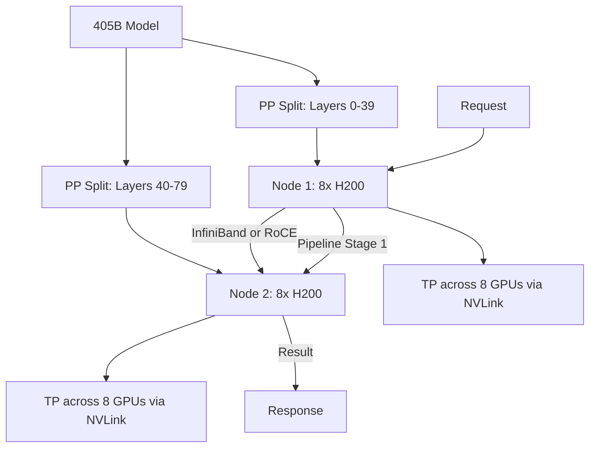

> 💡 **Quick Answer:** Use tensor parallelism (TP) to split model layers across GPUs within a node (NVLink), and pipeline parallelism (PP) to split layer groups across nodes (InfiniBand/RoCE). vLLM: set `--tensor-parallel-size 8 --pipeline-parallel-size 2` for 16-GPU inference across 2 nodes.

## The Problem

Large models (70B+) don't fit in a single GPU's memory. A 70B FP16 model needs ~140GB VRAM — more than one H200 (141GB). A 405B model needs ~810GB. You must split the model across multiple GPUs and potentially multiple nodes. The challenge: minimizing inter-GPU communication latency while maximizing throughput.

## The Solution

### Parallelism Strategies

```yaml
tensor_parallelism:
  what: "Split each layer across GPUs — every GPU computes part of every layer"
  when: "GPUs within a single node connected via NVLink"
  bandwidth: "NVLink 4.0: 900 GB/s (H200)"
  latency: "~1μs per all-reduce"
  max_practical: "TP=8 (one node)"

pipeline_parallelism:
  what: "Split layer groups across nodes — each node handles consecutive layers"
  when: "Model too large for single node; multi-node inference"
  bandwidth: "InfiniBand NDR: 400 Gb/s, RoCE: 200-400 Gb/s"
  latency: "~2-5μs per send/recv"
  note: "Creates micro-batch pipeline bubbles"

combined:
  example: "405B model on 2 nodes × 8 GPUs = TP=8, PP=2"
  total_gpus: 16
  memory_per_gpu: "~51GB (810GB / 16)"
```

### vLLM Distributed Inference (Single Node, TP=8)

```yaml
apiVersion: apps/v1
kind: Deployment
metadata:
  name: vllm-llama-70b
  namespace: tenant-alpha
spec:
  replicas: 1
  selector:
    matchLabels:
      app: vllm-70b
  template:
    metadata:
      labels:
        app: vllm-70b
    spec:
      containers:
        - name: vllm
          image: vllm/vllm-openai:v0.6.6
          args:
            - "--model"
            - "meta-llama/Llama-3.1-70B-Instruct"
            - "--tensor-parallel-size"
            - "8"
            - "--gpu-memory-utilization"
            - "0.92"
            - "--max-model-len"
            - "8192"
            - "--port"
            - "8000"
          ports:
            - containerPort: 8000
          resources:
            limits:
              nvidia.com/gpu: 8
          env:
            - name: NCCL_DEBUG
              value: "WARN"
            - name: CUDA_VISIBLE_DEVICES
              value: "0,1,2,3,4,5,6,7"
          volumeMounts:
            - name: model-cache
              mountPath: /root/.cache/huggingface
            - name: shm
              mountPath: /dev/shm
      volumes:
        - name: model-cache
          persistentVolumeClaim:
            claimName: model-cache-pvc
        - name: shm
          emptyDir:
            medium: Memory
            sizeLimit: 64Gi
```

### vLLM Multi-Node (TP=8, PP=2) via Ray

```yaml
# Head node (Ray head + vLLM controller)
apiVersion: apps/v1
kind: StatefulSet
metadata:
  name: vllm-405b-head
  namespace: tenant-alpha
spec:
  serviceName: vllm-head
  replicas: 1
  selector:
    matchLabels:
      app: vllm-405b
      role: head
  template:
    metadata:
      labels:
        app: vllm-405b
        role: head
    spec:
      containers:
        - name: vllm
          image: vllm/vllm-openai:v0.6.6
          args:
            - "--model"
            - "meta-llama/Llama-3.1-405B-Instruct-FP8"
            - "--tensor-parallel-size"
            - "8"
            - "--pipeline-parallel-size"
            - "2"
            - "--gpu-memory-utilization"
            - "0.92"
            - "--port"
            - "8000"
          ports:
            - containerPort: 8000
              name: api
            - containerPort: 6379
              name: ray-head
          resources:
            limits:
              nvidia.com/gpu: 8
          env:
            - name: RAY_ADDRESS
              value: "local"
            - name: NCCL_IB_HCA
              value: "mlx5_0,mlx5_1"
            - name: NCCL_NET_GDR_LEVEL
              value: "5"
          volumeMounts:
            - name: model-cache
              mountPath: /root/.cache/huggingface
            - name: shm
              mountPath: /dev/shm
      volumes:
        - name: model-cache
          persistentVolumeClaim:
            claimName: model-405b-cache
        - name: shm
          emptyDir:
            medium: Memory
            sizeLimit: 128Gi
---
# Worker node (Ray worker)
apiVersion: apps/v1
kind: StatefulSet
metadata:
  name: vllm-405b-worker
  namespace: tenant-alpha
spec:
  serviceName: vllm-worker
  replicas: 1
  selector:
    matchLabels:
      app: vllm-405b
      role: worker
  template:
    metadata:
      labels:
        app: vllm-405b
        role: worker
    spec:
      containers:
        - name: ray-worker
          image: vllm/vllm-openai:v0.6.6
          command: ["ray", "start", "--block", "--address=vllm-head-0.vllm-head:6379"]
          resources:
            limits:
              nvidia.com/gpu: 8
          env:
            - name: NCCL_IB_HCA
              value: "mlx5_0,mlx5_1"
            - name: NCCL_NET_GDR_LEVEL
              value: "5"
          volumeMounts:
            - name: model-cache
              mountPath: /root/.cache/huggingface
            - name: shm
              mountPath: /dev/shm
      volumes:
        - name: model-cache
          persistentVolumeClaim:
            claimName: model-405b-cache
        - name: shm
          emptyDir:
            medium: Memory
            sizeLimit: 128Gi
---
# Headless service for Ray discovery
apiVersion: v1
kind: Service
metadata:
  name: vllm-head
  namespace: tenant-alpha
spec:
  clusterIP: None
  selector:
    app: vllm-405b
    role: head
  ports:
    - port: 6379
      name: ray
    - port: 8000
      name: api
```

### TensorRT-LLM Multi-GPU (Triton)

```yaml
apiVersion: apps/v1
kind: Deployment
metadata:
  name: triton-trtllm-70b
  namespace: tenant-alpha
spec:
  replicas: 1
  selector:
    matchLabels:
      app: triton-trtllm
  template:
    metadata:
      labels:
        app: triton-trtllm
    spec:
      containers:
        - name: triton
          image: nvcr.io/nvidia/tritonserver:24.12-trtllm-python-py3
          args:
            - "tritonserver"
            - "--model-repository=/models"
            - "--model-control-mode=explicit"
            - "--load-model=llama-70b"
          resources:
            limits:
              nvidia.com/gpu: 8
          env:
            - name: CUDA_VISIBLE_DEVICES
              value: "0,1,2,3,4,5,6,7"
          volumeMounts:
            - name: models
              mountPath: /models
            - name: shm
              mountPath: /dev/shm
      volumes:
        - name: models
          persistentVolumeClaim:
            claimName: trtllm-models
        - name: shm
          emptyDir:
            medium: Memory
            sizeLimit: 64Gi
```

### Model Engine Build (TensorRT-LLM)

```bash
# Build TensorRT-LLM engine with TP=8
python convert_checkpoint.py \
  --model_dir /models/llama-70b-hf \
  --output_dir /engines/llama-70b-tp8 \
  --tp_size 8 \
  --dtype float16

trtllm-build \
  --checkpoint_dir /engines/llama-70b-tp8 \
  --output_dir /models/llama-70b/1/ \
  --gemm_plugin float16 \
  --gpt_attention_plugin float16 \
  --max_batch_size 64 \
  --max_input_len 2048 \
  --max_seq_len 4096

# For multi-node PP=2:
# Build with --tp_size 8 --pp_size 2
# Deploy with MPI across 2 nodes
```

### Sizing Guide

```yaml
# Model size to GPU mapping:
# FP16 memory ≈ 2 × params (bytes)
# FP8 memory ≈ 1 × params (bytes) + KV cache

models:
  "7B-8B":
    fp16_memory: "~16 GB"
    config: "TP=1, 1x H200"

  "13B":
    fp16_memory: "~26 GB"
    config: "TP=1, 1x H200"

  "70B":
    fp16_memory: "~140 GB"
    config: "TP=2 (H200 141GB just fits TP=1 with small context)"
    fp8_config: "TP=1, 1x H200 with FP8 quantization"

  "120B":
    fp16_memory: "~240 GB"
    config: "TP=2 or TP=4"

  "405B":
    fp16_memory: "~810 GB"
    config: "TP=8, PP=1 (8x H200 = 1128 GB)"
    fp8_config: "TP=8, 1 node (8x H200)"

  "405B+":
    fp8_memory: "~405 GB + large KV cache"
    config: "TP=8, PP=2 (2 nodes, 16 GPUs)"
```



## Common Issues

- **OOM on model load** — model too large for TP config; increase TP size or use FP8 quantization
- **Multi-node inference slow** — check NCCL transport: `NCCL_DEBUG=INFO` should show `NET/IB` or `NET/Socket`; ensure GPUDirect RDMA is active
- **Ray worker can't connect** — headless service DNS must resolve; check `nslookup vllm-head-0.vllm-head`
- **/dev/shm too small** — NCCL uses shared memory for intra-node communication; set `sizeLimit: 64Gi+`
- **Pipeline bubbles hurt throughput** — PP adds latency per micro-batch; maximize batch size to fill the pipeline

## Best Practices

- TP within a node (NVLink), PP across nodes (InfiniBand) — never the reverse
- Use FP8 quantization to halve memory requirements with minimal quality loss
- Size `/dev/shm` to at least 1GB per GPU for NCCL shared memory
- Pre-download models to PVC — don't download at pod startup
- Run `genai-perf` after deployment to validate TTFT/ITL SLOs
- Use StatefulSet for multi-node inference — stable network identities for Ray discovery

## Key Takeaways

- Tensor parallelism splits layers across GPUs (intra-node, NVLink)
- Pipeline parallelism splits layer groups across nodes (inter-node, InfiniBand)
- vLLM supports both TP and PP via Ray for multi-node inference
- TensorRT-LLM requires engine compilation with TP/PP baked in
- H200 (141GB) enables 70B on 1-2 GPUs; 405B needs 8+ GPUs across 1-2 nodes
- FP8 quantization halves memory with <1% quality loss on most models
