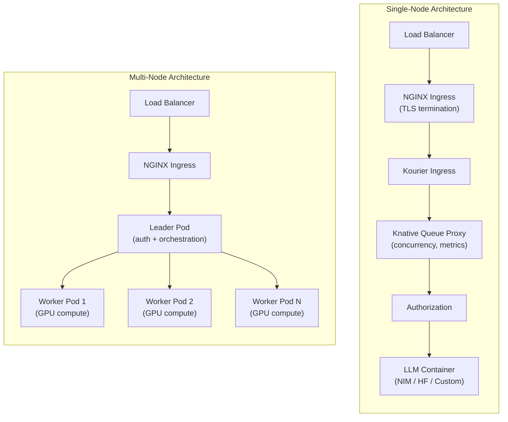

> 💡 **Quick Answer:** NVIDIA Run:ai provides two inference architectures on Kubernetes: **single-node** (Knative Serving with autoscaling and queue proxy) for models that fit on one node, and **multinode** (LeaderWorkerSet) for large models like DeepSeek-R1 671B that span multiple GPU nodes. Both support NIM, Hugging Face, and custom containers with built-in observability.

## The Problem

Deploying AI inference at scale requires solving multiple challenges simultaneously: GPU scheduling and sharing, autoscaling based on inference metrics (not just CPU), rolling updates without downtime, and distributed serving for models too large for a single node. Standard Kubernetes primitives (Deployments, HPAs) lack the GPU-aware scheduling, topology optimization, and inference-specific metrics needed for production LLM serving.



## The Solution

### Architecture Overview

NVIDIA Run:ai supports two deployment architectures for inference:

| Architecture | Use Case | Mechanism | Autoscaling |
|-------------|----------|-----------|-------------|
| **Single-node** | Models fit on 1 node (≤8 GPUs) | Knative Serving | Yes (latency, throughput, concurrency) |
| **Multi-node** | Large LLMs spanning nodes | LeaderWorkerSet (LWS) | Yes (replica-level) |

### Supported Workload Types

Run:ai natively supports three inference workload types:

1. **NVIDIA NIM** — Optimized inference microservices with built-in observability and GPU metrics
2. **Hugging Face** — Deploy transformer models directly from Hugging Face repos
3. **Custom** — Any user-defined inference container (vLLM, TGI, Triton, etc.)

Additional ecosystem workloads are supported via operators:
- **NIM Services** (via NIM Operator)
- **DynamoGraphDeployment** (via Dynamo Operator — graph-based distributed pipelines)
- **LeaderWorkerSet** (Kubernetes-native leader-worker abstraction)

### Single-Node Inference with Knative

Single-node inference uses Knative Serving for serverless capabilities:

```yaml
apiVersion: serving.knative.dev/v1
kind: Service
metadata:
  name: llama-3-inference
  namespace: ai-inference
  annotations:
    run.ai/project: ml-team
    run.ai/gpu-fraction: "1.0"
spec:
  template:
    metadata:
      annotations:
        # Autoscaling configuration
        autoscaling.knative.dev/class: kpa.autoscaling.knative.dev
        autoscaling.knative.dev/metric: concurrency
        autoscaling.knative.dev/target: "10"
        autoscaling.knative.dev/minScale: "1"
        autoscaling.knative.dev/maxScale: "4"
    spec:
      containers:
        - name: nim
          image: nvcr.io/nim/meta/llama-3.1-70b-instruct:1.5.2
          ports:
            - containerPort: 8000
              protocol: TCP
          env:
            - name: NIM_TENSOR_PARALLEL_SIZE
              value: "8"
          resources:
            limits:
              nvidia.com/gpu: "8"
            requests:
              cpu: "16"
              memory: "128Gi"
          readinessProbe:
            httpGet:
              path: /v1/health/ready
              port: 8000
            initialDelaySeconds: 120
            periodSeconds: 10
          livenessProbe:
            httpGet:
              path: /v1/health/live
              port: 8000
            periodSeconds: 30
```

#### Request Flow (Single-Node)

```
Client → Load Balancer → NGINX Ingress (TLS) → Kourier → Queue Proxy → Auth → LLM Container
```

The **Knative Queue Proxy** sits in front of every inference pod and provides:
- **Request queuing** — buffers requests when the model is busy
- **Concurrency control** — limits in-flight requests per pod
- **Metrics collection** — exposes throughput, latency, queue depth
- **Autoscaling signals** — feeds metrics to the Knative Pod Autoscaler (KPA)

### Multi-Node Inference with LeaderWorkerSet

For models that exceed single-node GPU memory (DeepSeek-R1, Llama 405B):

```yaml
apiVersion: leaderworkerset.x-k8s.io/v1
kind: LeaderWorkerSet
metadata:
  name: deepseek-r1
  namespace: ai-inference
  annotations:
    run.ai/project: ml-team
spec:
  replicas: 1
  leaderWorkerTemplate:
    size: 2  # Total nodes (1 leader + 1 worker)
    restartPolicy: RecreateGroupOnPodRestart
    leaderTemplate:
      metadata:
        labels:
          role: leader
      spec:
        containers:
          - name: nim
            image: nvcr.io/nim/deepseek-ai/deepseek-r1:1.7.3
            env:
              - name: NIM_TENSOR_PARALLEL_SIZE
                value: "16"
              - name: NIM_NUM_NODES
                value: "2"
              - name: NIM_NODE_RANK
                value: "0"
              - name: NCCL_IB_HCA
                value: "mlx5"
              - name: NCCL_NET_GDR_LEVEL
                value: "SYS"
            ports:
              - containerPort: 8000
                name: http
            resources:
              limits:
                nvidia.com/gpu: "8"
              requests:
                cpu: "32"
                memory: "256Gi"
            volumeMounts:
              - name: shm
                mountPath: /dev/shm
        volumes:
          - name: shm
            emptyDir:
              medium: Memory
              sizeLimit: 64Gi
        nodeSelector:
          nvidia.com/gpu.product: NVIDIA-H100-80GB-HBM3
    workerTemplate:
      spec:
        containers:
          - name: nim
            image: nvcr.io/nim/deepseek-ai/deepseek-r1:1.7.3
            env:
              - name: NIM_TENSOR_PARALLEL_SIZE
                value: "16"
              - name: NIM_NUM_NODES
                value: "2"
              - name: NIM_NODE_RANK
                value: "1"
              - name: NIM_LEADER_ADDRESS
                value: "$(LWS_LEADER_ADDRESS)"
              - name: NCCL_IB_HCA
                value: "mlx5"
              - name: NCCL_NET_GDR_LEVEL
                value: "SYS"
            resources:
              limits:
                nvidia.com/gpu: "8"
              requests:
                cpu: "32"
                memory: "256Gi"
            volumeMounts:
              - name: shm
                mountPath: /dev/shm
        volumes:
          - name: shm
            emptyDir:
              medium: Memory
              sizeLimit: 64Gi
        nodeSelector:
          nvidia.com/gpu.product: NVIDIA-H100-80GB-HBM3
```

#### Request Flow (Multi-Node)

```
Client → Load Balancer → NGINX Ingress → Leader Pod (auth + orchestrate) → Worker Pods → Leader → Client
```

Key differences from single-node:
- **No Knative** — LeaderWorkerSet manages pod lifecycle directly
- **Leader handles auth** — authorization is validated before computation is delegated
- **Leader aggregates results** — workers return partial results to the leader

### Scheduling and Topology Optimization

Run:ai provides GPU-aware scheduling features critical for inference:

```yaml
# Topology-aware scheduling reduces cross-node communication
apiVersion: scheduling.run.ai/v1
kind: TopologyPolicy
metadata:
  name: inference-topology
spec:
  # Prefer co-locating on same switch/rack
  preferredTopology:
    - topologyKey: topology.kubernetes.io/zone
      weight: 100
    - topologyKey: kubernetes.io/hostname
      weight: 50
```

**Gang scheduling** ensures all pods in a multinode inference workload start together:

```yaml
# Gang scheduling via PodGroup (KAI Scheduler)
apiVersion: scheduling.run.ai/v1
kind: PodGroup
metadata:
  name: deepseek-r1-gang
spec:
  minMember: 2  # All 2 pods must be schedulable
  scheduleTimeoutSeconds: 300
```

**MNNVL support** — Run:ai automatically detects Multi-Node NVLink (MNNVL) systems (like DGX SuperPOD) and optimizes placement for direct GPU-to-GPU NVLink across nodes.

### Dynamic Autoscaling

Configure inference-specific autoscaling based on real metrics:

```yaml
apiVersion: autoscaling/v2
kind: HorizontalPodAutoscaler
metadata:
  name: llama-inference-hpa
  namespace: ai-inference
spec:
  scaleTargetRef:
    apiVersion: serving.knative.dev/v1
    kind: Service
    name: llama-3-inference
  minReplicas: 1
  maxReplicas: 8
  metrics:
    # Scale on inference latency
    - type: Pods
      pods:
        metric:
          name: inference_request_latency_p99
        target:
          type: AverageValue
          averageValue: "500m"  # 500ms target p99
    # Scale on request concurrency
    - type: Pods
      pods:
        metric:
          name: inference_active_requests
        target:
          type: AverageValue
          averageValue: "10"
    # Scale on throughput
    - type: Pods
      pods:
        metric:
          name: inference_requests_per_second
        target:
          type: AverageValue
          averageValue: "50"
```

For Knative-native autoscaling (simpler):

```yaml
metadata:
  annotations:
    # Scale based on concurrent requests per pod
    autoscaling.knative.dev/target: "10"
    # Scale to zero after idle period
    autoscaling.knative.dev/scale-to-zero-grace-period: "5m"
    # Minimum replicas (0 = scale to zero)
    autoscaling.knative.dev/minScale: "1"
    autoscaling.knative.dev/maxScale: "8"
```

### Observability and Metrics

Run:ai exposes comprehensive inference metrics:

#### General Inference Metrics (All Workloads)

| Metric | Description |
|--------|-------------|
| `gpu_utilization` | GPU compute utilization per pod |
| `gpu_memory_used` | GPU memory consumption |
| `inference_request_count` | Total requests processed |
| `inference_request_latency` | End-to-end request latency (p50, p95, p99) |
| `inference_throughput` | Requests per second |
| `inference_active_requests` | Current in-flight requests |
| `replica_count` | Active inference replicas |

#### NIM-Specific Metrics (NVIDIA NIM Workloads)

| Metric | Description |
|--------|-------------|
| `nim_request_concurrency` | Active concurrent requests |
| `nim_time_to_first_token` | TTFT latency (streaming LLMs) |
| `nim_latency_percentiles` | p50/p95/p99 latency breakdown |
| `nim_gpu_kv_cache_utilization` | KV-cache memory pressure |
| `nim_tokens_per_second` | Token generation throughput |

```bash
# Query NIM metrics via Prometheus
curl -s http://prometheus.monitoring.svc:9090/api/v1/query \
  --data-urlencode 'query=nim_time_to_first_token{namespace="ai-inference"}' | jq .

# Check KV-cache pressure (scale up if >80%)
curl -s http://prometheus.monitoring.svc:9090/api/v1/query \
  --data-urlencode 'query=nim_gpu_kv_cache_utilization{pod=~"deepseek.*"}' | jq .
```

### Rolling Updates for Zero-Downtime

Update inference workloads without dropping requests:

```yaml
apiVersion: serving.knative.dev/v1
kind: Service
metadata:
  name: llama-3-inference
spec:
  template:
    metadata:
      # New revision name triggers rolling update
      name: llama-3-inference-v2
    spec:
      containers:
        - image: nvcr.io/nim/meta/llama-3.1-70b-instruct:1.6.0  # Updated version
  traffic:
    # Canary: send 10% to new revision
    - revisionName: llama-3-inference-v2
      percent: 10
    - revisionName: llama-3-inference-v1
      percent: 90
```

Gradually shift traffic:

```bash
# After validating v2 metrics, shift to 100%
kubectl patch ksvc llama-3-inference -n ai-inference --type merge -p '{
  "spec": {
    "traffic": [
      {"revisionName": "llama-3-inference-v2", "percent": 100}
    ]
  }
}'
```

### Access Control and Authentication

Secure inference endpoints with token-based auth:

```yaml
apiVersion: v1
kind: ConfigMap
metadata:
  name: inference-access-policy
  namespace: ai-inference
data:
  policy.yaml: |
    # Public endpoint (no auth)
    - endpoint: /v1/health/*
      access: public

    # Authenticated users only
    - endpoint: /v1/chat/completions
      access: authenticated
      allowedGroups:
        - ml-engineers
        - data-scientists

    # Service accounts for CI/CD
    - endpoint: /v1/completions
      access: service-account
      allowedAccounts:
        - ci-pipeline-sa
```

### Extending with Custom Workload Types

Register custom inference frameworks via the Resource Interface:

```bash
# Register a custom vLLM workload type
curl -X POST "https://runai.cluster.example.com/api/v1/workload-types" \
  -H "Authorization: Bearer $TOKEN" \
  -H "Content-Type: application/json" \
  -d '{
    "name": "vLLM",
    "kind": "Deployment",
    "apiVersion": "apps/v1",
    "category": "inference",
    "description": "vLLM inference serving engine"
  }'
```

Once registered, submit via YAML with full Run:ai scheduling and monitoring.

## Common Issues

| Issue | Cause | Fix |
|-------|-------|-----|
| Inference pod stuck Pending | No GPU node matches request | Check `nvidia.com/gpu` resource availability, verify node labels |
| Multinode NCCL timeout | Workers can't reach leader | Verify headless Service, check NetworkPolicy allows NCCL ports |
| Queue proxy returning 503 | Concurrency limit exceeded | Increase `autoscaling.knative.dev/target` or add replicas |
| KV-cache OOM | Too many concurrent long-context requests | Monitor `nim_gpu_kv_cache_utilization`, reduce `max_tokens` or scale up |
| Slow autoscaling response | Knative scale-up delay | Reduce `scale-to-zero-grace-period`, set `minScale: 1` |
| Rolling update drops requests | Old revision terminated before new is ready | Ensure readiness probe passes on new revision before shifting traffic |
| Gang scheduling failure | Not enough GPUs for all pods simultaneously | Check cluster GPU capacity, reduce `minMember` or free resources |

## Best Practices

- **Start single-node, scale to multinode** — only use LeaderWorkerSet when the model genuinely exceeds single-node memory
- **Set minScale ≥ 1 for latency-sensitive services** — scale-to-zero adds cold start delay (model loading can take minutes)
- **Monitor KV-cache utilization** — scale up before it hits 80% to avoid request rejections
- **Use topology-aware scheduling** — reduces inter-node communication overhead for distributed inference
- **Pin NIM versions** — avoid `latest` tag; use specific versions like `1.7.3` for reproducibility
- **Canary new model versions** — use Knative traffic splitting (10% → 50% → 100%) before full rollout
- **Size /dev/shm for NCCL** — minimum 64Gi for multinode; NCCL uses shared memory for GPU communication
- **Separate inference from training** — use Run:ai projects to isolate inference GPU quotas from training

## Key Takeaways

- Run:ai provides two inference architectures: **Knative** (single-node, serverless) and **LeaderWorkerSet** (multinode, distributed)
- Single-node uses Knative Queue Proxy for request management, concurrency control, and autoscaling
- Multinode routes all requests through the leader pod, which delegates computation to workers
- Supports NIM, Hugging Face, and custom containers with topology-aware gang scheduling
- NIM-specific metrics (TTFT, KV-cache utilization, token throughput) enable inference-aware autoscaling
- Rolling updates with Knative traffic splitting enable zero-downtime model upgrades
