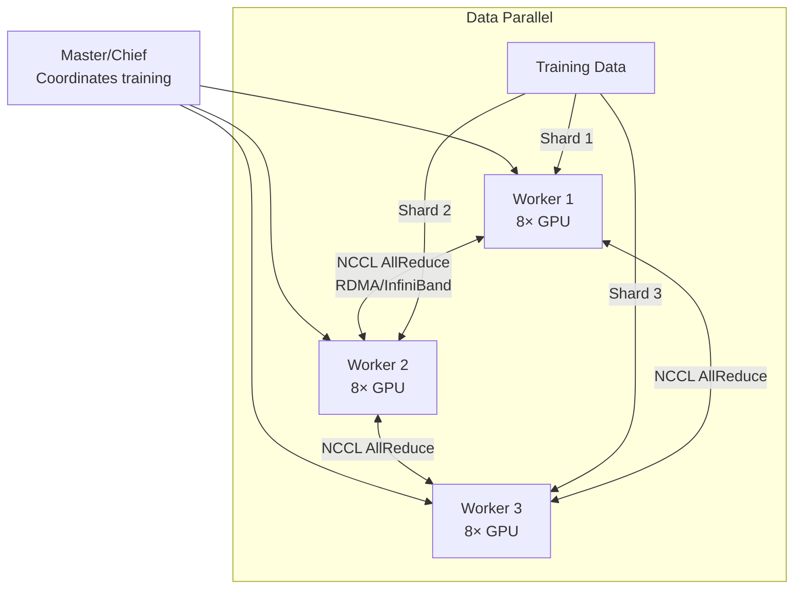

> 💡 **Quick Answer:** Use Kubeflow Training Operator to run distributed training as `TFJob` (TensorFlow) or `PyTorchJob` (PyTorch). Configure NCCL for GPU-to-GPU communication, set `NCCL_IB_DISABLE=0` for RDMA-enabled clusters, and use elastic training for fault tolerance.

## The Problem

Training large models takes days or weeks on a single GPU. Distributed training across multiple GPUs and nodes reduces training time linearly — but requires proper NCCL configuration, data parallelism strategy, and fault handling. Kubernetes Training Operator manages the multi-worker lifecycle.

## The Solution

### PyTorch Distributed Training

```yaml
apiVersion: kubeflow.org/v1
kind: PyTorchJob
metadata:
  name: bert-finetune
spec:
  elasticPolicy:
    minReplicas: 2
    maxReplicas: 8
    rdzvBackend: c10d
  pytorchReplicaSpecs:
    Worker:
      replicas: 4
      template:
        spec:
          containers:
            - name: pytorch
              image: registry.example.com/training:1.0
              env:
                - name: NCCL_DEBUG
                  value: "INFO"
                - name: NCCL_IB_DISABLE
                  value: "0"
                - name: NCCL_NET_GDR_LEVEL
                  value: "SYS"
              command:
                - torchrun
                - --nproc_per_node=8
                - --nnodes=$(PET_NNODES)
                - --rdzv_backend=c10d
                - --rdzv_endpoint=$(PET_RDZV_ENDPOINT)
                - train.py
                - --model=bert-large
                - --batch-size-per-gpu=32
              resources:
                limits:
                  nvidia.com/gpu: 8
                  rdma/rdma_shared_device_a: 1
                  memory: 256Gi
```

### TensorFlow Distributed Training

```yaml
apiVersion: kubeflow.org/v1
kind: TFJob
metadata:
  name: resnet-train
spec:
  tfReplicaSpecs:
    Chief:
      replicas: 1
      template:
        spec:
          containers:
            - name: tensorflow
              image: registry.example.com/tf-train:1.0
              command: ["python", "train.py"]
              env:
                - name: TF_FORCE_GPU_ALLOW_GROWTH
                  value: "true"
              resources:
                limits:
                  nvidia.com/gpu: 8
    Worker:
      replicas: 3
      template:
        spec:
          containers:
            - name: tensorflow
              image: registry.example.com/tf-train:1.0
              command: ["python", "train.py"]
              resources:
                limits:
                  nvidia.com/gpu: 8
```

### NCCL Environment Variables

| Variable | Value | Purpose |
|----------|-------|---------|
| `NCCL_DEBUG` | `INFO` | Verify transport (IB vs Socket) |
| `NCCL_IB_DISABLE` | `0` | Enable InfiniBand/RoCE |
| `NCCL_NET_GDR_LEVEL` | `SYS` | GPU Direct RDMA level |
| `NCCL_IB_QPS_PER_CONNECTION` | `4` | Queue pairs per connection |
| `NCCL_SOCKET_IFNAME` | `eth0` | TCP fallback interface |



## Common Issues

**Training hangs at NCCL initialization**

Workers can't reach each other. Check: NCCL is using IB (`NET/IB` in logs), not falling back to TCP. Verify RDMA device availability with `ibstat`.

**Gradient NaN after multi-node training**

Learning rate needs scaling with world size. Use linear scaling: `lr = base_lr * world_size`. Enable gradient clipping: `torch.nn.utils.clip_grad_norm_(model.parameters(), 1.0)`.

## Best Practices

- **Elastic training** for fault tolerance — jobs continue if a worker fails
- **NCCL_DEBUG=INFO** during initial setup — verify RDMA transport, then disable for performance
- **Data parallel for most workloads** — simpler than model parallel
- **Checkpoint every N steps** — recover from failures without restarting
- **Linear learning rate scaling** with world size — prevents divergence

## Key Takeaways

- Training Operator manages multi-worker lifecycle on Kubernetes
- PyTorchJob with elastic policy enables auto-scaling and fault tolerance
- NCCL handles GPU-to-GPU communication — RDMA/IB is 10-100x faster than TCP
- Data parallelism: each worker trains on a shard, gradients are synchronized via AllReduce
- Checkpointing is mandatory — multi-node jobs are prone to failures
