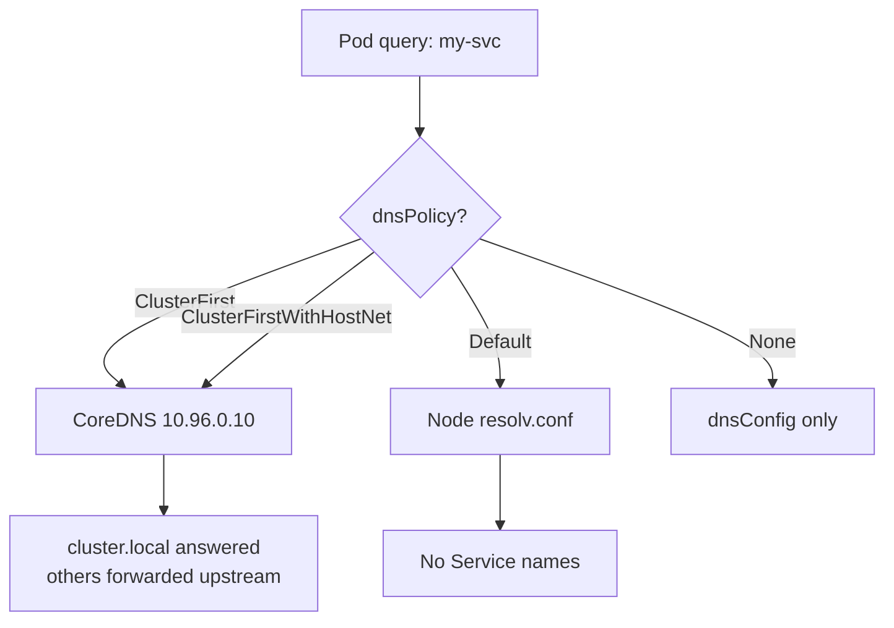

> 💡 **Quick Answer:** Set `spec.dnsPolicy` on the pod: **ClusterFirst** (the default — cluster DNS via CoreDNS, non-cluster names forwarded upstream), **ClusterFirstWithHostNet** (required for `hostNetwork: true` pods that need Service names), **Default** (inherit the node's resolv.conf — *not* the default!), **None** (you supply everything in `dnsConfig`). `dnsConfig` merges extra nameservers, search domains and options (e.g. `ndots: 2`) into any policy.
>
> **Gotcha:** A `hostNetwork: true` pod with `dnsPolicy: ClusterFirst` silently falls back to `Default` behavior and can't resolve `my-svc.my-ns`.

## dnsPolicy Comparison

| Policy | Nameserver in resolv.conf | Service discovery | Use case |
|---|---|:---:|---|
| `ClusterFirst` (default) | CoreDNS ClusterIP (or NodeLocal DNSCache IP) | ✅ | Normal pods |
| `ClusterFirstWithHostNet` | CoreDNS ClusterIP | ✅ | `hostNetwork: true` pods (agents, ingress, CNI helpers) |
| `Default` | Node's `/etc/resolv.conf` (kubelet `--resolv-conf`) | ❌ | Pods that must use node/corporate DNS only |
| `None` | Only what `dnsConfig` lists | Only if you add cluster DNS | Full control, split-horizon |



## ClusterFirst (Default)

```yaml
apiVersion: v1
kind: Pod
metadata:
  name: app
spec:
  dnsPolicy: ClusterFirst    # default — can be omitted
  containers:
    - name: app
      image: busybox:1.36
      command: ["sleep", "3600"]
```

```
# /etc/resolv.conf in the pod
nameserver 10.96.0.10
search default.svc.cluster.local svc.cluster.local cluster.local
options ndots:5
```

Names in the cluster domain are answered by CoreDNS; everything else is forwarded to CoreDNS's upstream (`forward . /etc/resolv.conf` by default — the node's resolvers).

## ClusterFirstWithHostNet

```yaml
apiVersion: v1
kind: Pod
metadata:
  name: monitoring-agent
spec:
  hostNetwork: true
  dnsPolicy: ClusterFirstWithHostNet   # without this, the pod uses node DNS
  containers:
    - name: agent
      image: datadog/agent:7
```

```bash
kubectl exec monitoring-agent -- cat /etc/resolv.conf
# ClusterFirst + hostNetwork:        nameserver <node resolver>   ← no Service names
# ClusterFirstWithHostNet:           nameserver 10.96.0.10        ← works
```

More detail, including DaemonSet and OpenShift cases: [ClusterFirstWithHostNet](/recipes/networking/kubernetes-dnspolicy-clusterfirstwithhostnet/).

## Default (Node DNS)

```yaml
spec:
  dnsPolicy: Default      # inherits node resolv.conf; my-svc.my-ns will NOT resolve
```

Use it for pods that must bypass CoreDNS (e.g. CoreDNS itself, or bootstrap components that run before cluster DNS is up).

## None + dnsConfig (Fully Custom)

```yaml
apiVersion: v1
kind: Pod
metadata:
  name: custom-dns
spec:
  dnsPolicy: None
  dnsConfig:
    nameservers:            # required with None; max 3 in total
      - 10.0.0.53
      - 10.0.0.54
    searches:
      - corp.example.com
    options:
      - name: ndots
        value: "2"
      - name: timeout
        value: "3"
      - name: attempts
        value: "2"
  containers:
    - name: app
      image: myapp:v1
```

To keep Service discovery with `None`, add the CoreDNS ClusterIP as a nameserver and `<ns>.svc.cluster.local svc.cluster.local cluster.local` as searches.

## dnsConfig With Any Policy (Merge)

`dnsConfig` extends the policy-generated resolv.conf: nameservers and searches are appended (duplicates removed), options override by name.

```yaml
spec:
  dnsPolicy: ClusterFirst
  dnsConfig:
    nameservers:
      - 10.0.0.53              # appended after CoreDNS — only used if CoreDNS fails, not for corp names
    searches:
      - corp.example.com
    options:
      - name: ndots
        value: "2"
```

An extra nameserver is a *fallback*, not a split-horizon rule — the resolver tries servers in order. To send `corp.example.com` to corporate DNS for every pod, configure a CoreDNS stub domain instead:

```
corp.example.com:53 {
    errors
    cache 30
    forward . 10.0.0.53 10.0.0.54
}
```

See [CoreDNS configuration](/recipes/networking/coredns-configuration/) for the full Corefile.

## Tune ndots

With the default `ndots:5`, any name with fewer than 5 dots is tried against every search domain before being tried as-is:

```bash
# ndots:5, "api.example.com" (2 dots):
# 1. api.example.com.default.svc.cluster.local  NXDOMAIN
# 2. api.example.com.svc.cluster.local          NXDOMAIN
# 3. api.example.com.cluster.local              NXDOMAIN
# 4. (+ any node search domains, e.g. ec2.internal)
# 5. api.example.com                            answer
#
# ndots:2 — "api.example.com" has 2 dots, so it's tried as absolute first.
# "my-svc" (0 dots) and "my-svc.my-ns" (1 dot) still expand via search domains.
```

```yaml
spec:
  dnsConfig:
    options:
      - name: ndots
        value: "2"
      - name: single-request-reopen   # glibc: work around A/AAAA conntrack races
```

Alternatively, use FQDNs with a trailing dot (`api.example.com.`) in app config to skip search expansion entirely. Don't go below `ndots:2` if apps call `svc.namespace` names.

## Limits

| Item | Limit |
|---|---|
| Nameservers | 3 (policy + dnsConfig combined; extras are dropped with a warning event) |
| Search domains | 32, total 2048 chars (since 1.28; older: 6 / 256) |
| `nameservers` with `None` | At least one required |

## Stable Pod DNS for StatefulSets

A headless Service (`clusterIP: None`) referenced by `serviceName` gives each replica a record like `mysql-0.mysql.default.svc.cluster.local`. For static overrides, `hostAliases` writes entries into the pod's `/etc/hosts`:

```yaml
spec:
  hostAliases:
    - ip: "10.0.0.100"
      hostnames: ["legacy-db", "old-database.local"]
```

## Debug DNS

```bash
kubectl exec my-pod -- cat /etc/resolv.conf

kubectl run dnsutils --rm -it --restart=Never \
  --image=registry.k8s.io/e2e-test-images/jessie-dnsutils:1.7 -- sh
nslookup kubernetes.default
dig +search my-svc
dig @10.96.0.10 my-svc.my-ns.svc.cluster.local

kubectl get pods -n kube-system -l k8s-app=kube-dns
kubectl logs -n kube-system -l k8s-app=kube-dns
kubectl get events --field-selector reason=DNSConfigForming   # nameserver/search limit exceeded
```

On OpenShift, cluster DNS runs in `openshift-dns` (`oc get pods -n openshift-dns`) and the Service is `dns-default`.

## Common Issues

| Issue | Cause | Fix |
|---|---|---|
| hostNetwork pod can't resolve Services | `ClusterFirst` falls back to node DNS | `dnsPolicy: ClusterFirstWithHostNet` |
| Slow external lookups, high NXDOMAIN in CoreDNS | `ndots:5` search expansion | `ndots: 2` or trailing-dot FQDNs |
| Corporate names don't resolve via extra nameserver | Appended nameserver is only a fallback | CoreDNS stub domain |
| `DNSConfigForming` warning event | >3 nameservers or too many search domains | Trim `dnsConfig` / node resolv.conf |
| No DNS at all after NetworkPolicy | Egress UDP/TCP 53 to CoreDNS blocked | Allow DNS egress ([NetworkPolicy guide](/recipes/networking/kubernetes-networkpolicy-guide/)) |
| `dnsPolicy: None` rejected | No `dnsConfig.nameservers` | Add at least one nameserver |

## Frequently Asked Questions

### What is the default dnsPolicy in Kubernetes?

`ClusterFirst`. Despite its name, `dnsPolicy: Default` is *not* the default — it makes the pod inherit the node's DNS settings and lose Service discovery.

### What is the difference between ClusterFirst and ClusterFirstWithHostNet?

They behave the same for normal pods. For `hostNetwork: true` pods, `ClusterFirst` falls back to the node's resolvers, while `ClusterFirstWithHostNet` keeps CoreDNS as the nameserver so Service names resolve.

### How do I set ndots in Kubernetes?

Add `dnsConfig.options: [{name: ndots, value: "2"}]` to the pod spec (or the Deployment's pod template). It works with any dnsPolicy.

### Can I add a custom DNS server to a pod?

Yes — `dnsConfig.nameservers`. With `ClusterFirst` it is appended as a fallback; with `dnsPolicy: None` it is the only resolver. For per-domain routing, use a CoreDNS stub domain.

## Key Takeaways

- `ClusterFirst` is the default; `Default` means node DNS
- hostNetwork pods need `ClusterFirstWithHostNet` for Service names
- `dnsConfig` merges into any policy; `None` requires it
- Lower `ndots` for external-heavy workloads
- Max 3 nameservers; per-domain forwarding belongs in CoreDNS

---

## 📘 Go Further with Kubernetes Recipes

**Love this recipe? There's so much more!** This is just one of **100+ hands-on recipes** in our comprehensive **[Kubernetes Recipes book](https://amzn.to/3DzC8QA)**.

Inside the book, you'll master:
- ✅ Production-ready deployment strategies
- ✅ Advanced networking and security patterns  
- ✅ Observability, monitoring, and troubleshooting
- ✅ Real-world best practices from industry experts

> *"The practical, recipe-based approach made complex Kubernetes concepts finally click for me."*

**👉 [Get Your Copy Now](https://amzn.to/3DzC8QA)** — Start building production-grade Kubernetes skills today!
