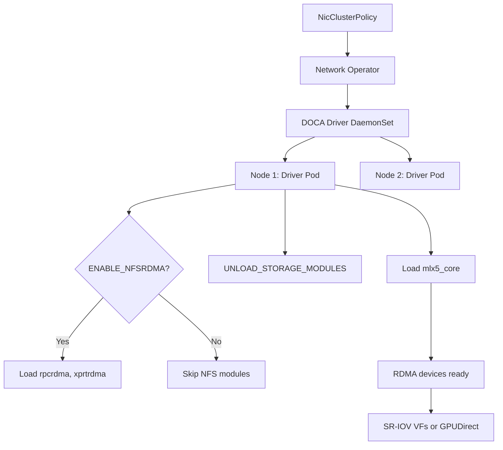

> 💡 **Quick Answer:** Configure the NVIDIA DOCA Driver container via `NicClusterPolicy.spec.ofedDriver` environment variables to control driver loading, NFS-RDMA enablement, and storage module behavior on Kubernetes worker nodes.

## The Problem

NVIDIA ConnectX NICs require kernel-level DOCA (formerly MLNX_OFED) drivers for RDMA, GPUDirect, and high-performance networking. Installing drivers directly on nodes is fragile across kernel upgrades. You need containerized driver deployment that survives node updates and supports precompiled builds for air-gapped or RHCOS environments.

## The Solution

Use the NVIDIA Network Operator's DOCA Driver container with NicClusterPolicy to deploy drivers as DaemonSet pods, with environment variables controlling runtime behavior.

### NicClusterPolicy with DOCA Driver Configuration

```yaml
apiVersion: mellanox.com/v1alpha1
kind: NicClusterPolicy
metadata:
  name: nic-cluster-policy
spec:
  ofedDriver:
    image: doca-driver
    repository: nvcr.io/nvidia/mellanox
    version: 25.01-0.6.0.0
    startupProbe:
      initialDelaySeconds: 10
      periodSeconds: 20
    livenessProbe:
      initialDelaySeconds: 30
      periodSeconds: 30
    readinessProbe:
      initialDelaySeconds: 10
      periodSeconds: 30
    env:
      - name: RESTORE_DRIVER_ON_POD_TERMINATION
        value: "true"
      - name: UNLOAD_STORAGE_MODULES
        value: "true"
      - name: CREATE_IFNAMES_UDEV
        value: "true"
```

### Enable NFS-RDMA Storage Modules

```yaml
apiVersion: mellanox.com/v1alpha1
kind: NicClusterPolicy
metadata:
  name: nic-cluster-policy
spec:
  ofedDriver:
    image: doca-driver
    repository: nvcr.io/nvidia/mellanox
    version: 25.01-0.6.0.0
    env:
      - name: ENABLE_NFSRDMA
        value: "true"
      - name: UNLOAD_STORAGE_MODULES
        value: "true"
      - name: RESTORE_DRIVER_ON_POD_TERMINATION
        value: "true"
```

> ⚠️ **Warning:** When `ENABLE_NFSRDMA` is `true`, NVMe-related storage modules cannot load if the system is actively using NVMe SSDs. Blacklist conflicting modules before enabling.

### Blacklist NVMe Modules Before DOCA Driver

```yaml
apiVersion: machineconfiguration.openshift.io/v1
kind: MachineConfig
metadata:
  name: 99-blacklist-nvme-rdma
  labels:
    machineconfiguration.openshift.io/role: worker
spec:
  config:
    ignition:
      version: 3.2.0
    storage:
      files:
        - path: /etc/modprobe.d/blacklist-nvme-rdma.conf
          mode: 0644
          contents:
            source: data:text/plain;charset=utf-8;base64,YmxhY2tsaXN0IG52bWVfcmRtYQpibGFja2xpc3QgbnZtZXRfcmRtYQ==
          # Decoded: blacklist nvme_rdma\nblacklist nvmet_rdma
```

### DOCA Driver Environment Variables Reference

| Variable | Default | Description |
|----------|---------|-------------|
| `CREATE_IFNAMES_UDEV` | `true` (Ubuntu 20.04, RHEL 8.x, OCP ≤4.13) / `false` (newer) | Create udev rules for path-based netdev names (e.g., `enp3s0f0`) |
| `UNLOAD_STORAGE_MODULES` | `false` | Unload host storage modules before loading DOCA: `ib_isert`, `nvme_rdma`, `nvmet_rdma`, `rpcrdma`, `xprtrdma`, `ib_srpt` |
| `ENABLE_NFSRDMA` | `false` | Load NFS and NVMe RDMA storage modules from the DOCA container |
| `RESTORE_DRIVER_ON_POD_TERMINATION` | `true` | Restore host inbox drivers when the DOCA container terminates |

### Proxy and Air-Gapped Configuration

```yaml
apiVersion: mellanox.com/v1alpha1
kind: NicClusterPolicy
metadata:
  name: nic-cluster-policy
spec:
  ofedDriver:
    image: doca-driver
    repository: registry.internal.company.com/nvidia/mellanox
    version: 25.01-0.6.0.0
    env:
      - name: HTTP_PROXY
        value: "http://proxy.company.com:8080"
      - name: HTTPS_PROXY
        value: "http://proxy.company.com:8080"
      - name: NO_PROXY
        value: "10.0.0.0/8,172.16.0.0/12,192.168.0.0/16,.company.com"
```

### Precompiled Driver Build for RHCOS (OpenShift)

For OpenShift, build precompiled DOCA driver containers matched to your exact kernel:

```bash
# 1. Get the DriverToolKit image for your OCP version
DTK=$(oc adm release info 4.16.0 --image-for=driver-toolkit)
echo "DTK: $DTK"
# quay.io/openshift-release-dev/ocp-v4.0-art-dev@sha256:dde3cd6...

# 2. Pull DTK with your pull secret
podman pull --authfile=/path/to/pull-secret.txt docker://$DTK

# 3. Get the kernel version from DTK
KERNEL_VER=$(podman run --rm -ti $DTK \
  cat /etc/driver-toolkit-release.json | jq -r '.KERNEL_VERSION')
echo "Kernel: $KERNEL_VER"
# 5.14.0-427.22.1.el9_4.x86_64

# 4. Download build files
for f in RHEL_Dockerfile entrypoint.sh dtk_nic_driver_build.sh; do
  wget "https://raw.githubusercontent.com/Mellanox/doca-driver-build/\
f5de72596d639bc369566676038ac251c9575ca3/$f"
done
chmod +x entrypoint.sh dtk_nic_driver_build.sh

# 5. Build precompiled container
podman build \
  --build-arg D_OS=rhcos4.16 \
  --build-arg D_ARCH=x86_64 \
  --build-arg D_KERNEL_VER=$KERNEL_VER \
  --build-arg D_DOCA_VERSION=2.10.0 \
  --build-arg D_OFED_VERSION=25.01-0.6.0.0 \
  --build-arg D_BASE_IMAGE="$DTK" \
  --build-arg D_FINAL_BASE_IMAGE=registry.access.redhat.com/ubi9/ubi:9.4 \
  --tag 25.01-0.6.0.0-0-${KERNEL_VER}-rhcos4.16-amd64 \
  -f RHEL_Dockerfile \
  --target precompiled .
```

### Precompiled Driver Build for Ubuntu

```bash
docker build \
  --build-arg D_OS=ubuntu22.04 \
  --build-arg D_ARCH=x86_64 \
  --build-arg D_BASE_IMAGE=ubuntu:22.04 \
  --build-arg D_KERNEL_VER=5.15.0-25-generic \
  --build-arg D_DOCA_VERSION=2.10.0 \
  --build-arg D_OFED_VERSION=25.01-0.6.0.0 \
  --tag 25.01-0.6.0.0-0-5.15.0-25-generic-ubuntu22.04-amd64 \
  -f Ubuntu_Dockerfile \
  --target precompiled .
```

### Verify DOCA Driver Deployment

```bash
# Check DOCA driver pods
kubectl get pods -n nvidia-network-operator \
  -l app=mofed-ubuntu -o wide

# Verify RDMA devices on a node
kubectl exec -it <doca-driver-pod> -n nvidia-network-operator -- \
  ibstat

# Check loaded modules
kubectl exec -it <doca-driver-pod> -n nvidia-network-operator -- \
  lsmod | grep -E "mlx5|rdma|nfs"

# Verify driver version
kubectl exec -it <doca-driver-pod> -n nvidia-network-operator -- \
  ofed_info -s
# MLNX_OFED_LINUX-25.01-0.6.0.0
```



## Common Issues

- **Pod CrashLoopBackOff after kernel upgrade** — precompiled containers are kernel-version-specific; rebuild for the new kernel or use non-precompiled (slower startup but auto-compiles)
- **NVMe drives unavailable after ENABLE_NFSRDMA** — NVMe RDMA modules conflict with system NVMe; blacklist `nvme_rdma` and `nvmet_rdma` via MachineConfig before enabling
- **Network interface names changed** — `CREATE_IFNAMES_UDEV` is auto-set by Network Operator based on OS; override only if you need stable path-based names on newer OS
- **Host drivers not restored after pod termination** — ensure `RESTORE_DRIVER_ON_POD_TERMINATION` is `true`; check for stuck finalizers on the pod
- **Precompiled container tag mismatch** — tag must follow pattern `driver_ver-container_ver-kernel_ver-os-arch` exactly (e.g., `25.01-0.6.0.0-0-5.14.0-427.22.1.el9_4.x86_64-rhcos4.16-amd64`)

## Best Practices

- Use precompiled containers for OpenShift/RHCOS to avoid DTK dependency at runtime
- Always set `RESTORE_DRIVER_ON_POD_TERMINATION: "true"` to avoid bricked networking on pod eviction
- Set `UNLOAD_STORAGE_MODULES: "true"` when using RDMA — prevents module conflicts
- Test `ENABLE_NFSRDMA` on non-production nodes first; verify no NVMe conflicts
- Pin DOCA version in NicClusterPolicy to avoid unexpected driver upgrades
- Build and push precompiled images to your internal registry for air-gapped environments

## Key Takeaways

- DOCA Driver container replaces manual MLNX_OFED installation with DaemonSet-based deployment
- Environment variables in NicClusterPolicy control driver behavior without node SSH access
- Precompiled builds eliminate runtime compilation — faster startup, smaller attack surface
- `ENABLE_NFSRDMA` and `UNLOAD_STORAGE_MODULES` are critical for storage-over-RDMA workloads
- Tag naming convention must match exactly for Network Operator to pull the right image
