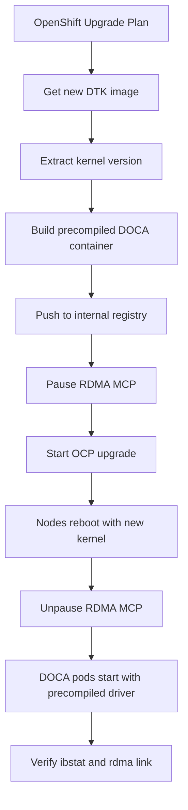

> 💡 **Quick Answer:** Build kernel-matched precompiled DOCA Driver containers using OpenShift's DriverToolKit (DTK), push to your registry, and deploy via NicClusterPolicy with MachineConfig for module blacklisting and upgrade coordination.

## The Problem

OpenShift uses immutable CoreOS nodes where you cannot install drivers with `yum` or `dnf`. Each OpenShift upgrade changes the kernel version, breaking any previously compiled DOCA drivers. You need a workflow that builds kernel-matched driver containers and coordinates upgrades with the Machine Config Operator (MCO).

## The Solution

Use the DriverToolKit (DTK) container matching your OpenShift version to compile DOCA drivers at build time, producing a precompiled container that loads instantly without runtime compilation.

### Step 1: Get DTK Image for Your OpenShift Version

```bash
# Get DTK image for your OCP release
OCP_VERSION="4.16.0"
DTK=$(oc adm release info ${OCP_VERSION} --image-for=driver-toolkit)
echo "DTK: $DTK"

# Get kernel version from DTK
podman pull --authfile=/path/to/pull-secret.txt docker://$DTK
KERNEL_VER=$(podman run --rm $DTK \
  cat /etc/driver-toolkit-release.json | jq -r '.KERNEL_VERSION')
echo "Kernel: $KERNEL_VER"
# 5.14.0-427.22.1.el9_4.x86_64

# Get RHCOS version
RHCOS_VER=$(podman run --rm $DTK \
  cat /etc/driver-toolkit-release.json | jq -r '.RHCOS_VERSION')
echo "RHCOS: $RHCOS_VER"
```

### Step 2: Build Precompiled DOCA Driver Container

```bash
# Download build files from Mellanox
COMMIT="f5de72596d639bc369566676038ac251c9575ca3"
BASE="https://raw.githubusercontent.com/Mellanox/doca-driver-build/${COMMIT}"
for f in RHEL_Dockerfile entrypoint.sh dtk_nic_driver_build.sh; do
  wget "${BASE}/$f"
done
chmod +x entrypoint.sh dtk_nic_driver_build.sh

# Build the precompiled container
DOCA_VERSION="2.10.0"
OFED_VERSION="25.01-0.6.0.0"
TAG="${OFED_VERSION}-0-${KERNEL_VER}-rhcos4.16-amd64"

podman build \
  --build-arg D_OS=rhcos4.16 \
  --build-arg D_ARCH=x86_64 \
  --build-arg D_KERNEL_VER=${KERNEL_VER} \
  --build-arg D_DOCA_VERSION=${DOCA_VERSION} \
  --build-arg D_OFED_VERSION=${OFED_VERSION} \
  --build-arg D_BASE_IMAGE="${DTK}" \
  --build-arg D_FINAL_BASE_IMAGE=registry.access.redhat.com/ubi9/ubi:9.4 \
  --tag ${TAG} \
  -f RHEL_Dockerfile \
  --target precompiled .

# Push to internal registry
podman tag ${TAG} registry.company.com/nvidia/doca-driver:${TAG}
podman push registry.company.com/nvidia/doca-driver:${TAG}
```

### Step 3: NicClusterPolicy with Precompiled Image

```yaml
apiVersion: mellanox.com/v1alpha1
kind: NicClusterPolicy
metadata:
  name: nic-cluster-policy
spec:
  ofedDriver:
    image: doca-driver
    repository: registry.company.com/nvidia
    version: 25.01-0.6.0.0
    startupProbe:
      initialDelaySeconds: 10
      periodSeconds: 20
    livenessProbe:
      initialDelaySeconds: 30
      periodSeconds: 30
    readinessProbe:
      initialDelaySeconds: 10
      periodSeconds: 30
    env:
      - name: RESTORE_DRIVER_ON_POD_TERMINATION
        value: "true"
      - name: UNLOAD_STORAGE_MODULES
        value: "true"
      - name: ENABLE_NFSRDMA
        value: "true"
```

### Step 4: MachineConfig for RDMA Prerequisites

```yaml
apiVersion: machineconfiguration.openshift.io/v1
kind: MachineConfig
metadata:
  name: 99-rdma-prerequisites
  labels:
    machineconfiguration.openshift.io/role: worker
spec:
  config:
    ignition:
      version: 3.2.0
    storage:
      files:
        # Blacklist conflicting NVMe modules
        - path: /etc/modprobe.d/blacklist-nvme-rdma.conf
          mode: 0644
          overwrite: true
          contents:
            inline: |
              blacklist nvme_rdma
              blacklist nvmet_rdma
        # Load RDMA modules at boot
        - path: /etc/modules-load.d/rdma.conf
          mode: 0644
          overwrite: true
          contents:
            inline: |
              ib_core
              ib_uverbs
              mlx5_core
              mlx5_ib
              rdma_ucm
        # RDMA sysctl tuning
        - path: /etc/sysctl.d/99-rdma.conf
          mode: 0644
          overwrite: true
          contents:
            inline: |
              net.core.rmem_max=16777216
              net.core.wmem_max=16777216
              net.core.rmem_default=4194304
              net.core.wmem_default=4194304
              vm.zone_reclaim_mode=0
```

### Step 5: Dedicated MCP for RDMA Nodes

```yaml
apiVersion: machineconfiguration.openshift.io/v1
kind: MachineConfigPool
metadata:
  name: rdma-worker
spec:
  machineConfigSelector:
    matchExpressions:
      - key: machineconfiguration.openshift.io/role
        operator: In
        values:
          - worker
          - rdma-worker
  nodeSelector:
    matchLabels:
      node-role.kubernetes.io/rdma-worker: ""
  maxUnavailable: 1
  paused: false
```

Label your RDMA nodes:

```bash
# Label nodes with ConnectX NICs
oc label node worker-gpu-01 \
  node-role.kubernetes.io/rdma-worker=""
oc label node worker-gpu-02 \
  node-role.kubernetes.io/rdma-worker=""
```

### Step 6: ImageDigestMirrorSet for Disconnected Clusters

```yaml
apiVersion: config.openshift.io/v1
kind: ImageDigestMirrorSet
metadata:
  name: nvidia-doca-mirror
spec:
  imageDigestMirrors:
    - source: nvcr.io/nvidia/mellanox
      mirrors:
        - registry.company.com/nvidia/mellanox
    - source: nvcr.io/nvidia/networking
      mirrors:
        - registry.company.com/nvidia/networking
```

### OpenShift Upgrade Workflow

When upgrading OpenShift, the kernel changes. You must rebuild DOCA driver containers before upgrading:

```bash
#!/bin/bash
set -euo pipefail

# === Pre-upgrade: Build new DOCA driver ===
NEW_OCP="4.17.0"

# 1. Get new DTK and kernel
NEW_DTK=$(oc adm release info ${NEW_OCP} --image-for=driver-toolkit)
podman pull --authfile=pull-secret.txt docker://$NEW_DTK
NEW_KERNEL=$(podman run --rm $NEW_DTK \
  cat /etc/driver-toolkit-release.json | jq -r '.KERNEL_VERSION')

echo "New OCP: ${NEW_OCP}, Kernel: ${NEW_KERNEL}"

# 2. Build precompiled driver for new kernel
NEW_TAG="${OFED_VERSION}-0-${NEW_KERNEL}-rhcos4.17-amd64"
podman build \
  --build-arg D_OS=rhcos4.17 \
  --build-arg D_ARCH=x86_64 \
  --build-arg D_KERNEL_VER=${NEW_KERNEL} \
  --build-arg D_DOCA_VERSION=${DOCA_VERSION} \
  --build-arg D_OFED_VERSION=${OFED_VERSION} \
  --build-arg D_BASE_IMAGE="${NEW_DTK}" \
  --build-arg D_FINAL_BASE_IMAGE=registry.access.redhat.com/ubi9/ubi:9.4 \
  --tag ${NEW_TAG} \
  -f RHEL_Dockerfile \
  --target precompiled .

# 3. Push to registry
podman tag ${NEW_TAG} registry.company.com/nvidia/doca-driver:${NEW_TAG}
podman push registry.company.com/nvidia/doca-driver:${NEW_TAG}

# 4. Pause RDMA MCP during upgrade
oc patch mcp rdma-worker --type merge \
  -p '{"spec":{"paused":true}}'

echo "Ready for OCP upgrade. DOCA driver image available: ${NEW_TAG}"
echo "After upgrade completes, unpause MCP:"
echo "  oc patch mcp rdma-worker --type merge -p '{\"spec\":{\"paused\":false}}'"
```

### CI/CD Pipeline for Automated DOCA Builds

```yaml
# .tekton/doca-driver-build.yaml
apiVersion: tekton.dev/v1
kind: Pipeline
metadata:
  name: doca-driver-build
  namespace: nvidia-build
spec:
  params:
    - name: ocp-version
      type: string
    - name: doca-version
      type: string
      default: "2.10.0"
    - name: ofed-version
      type: string
      default: "25.01-0.6.0.0"
  tasks:
    - name: get-dtk-info
      taskRef:
        name: openshift-client
      params:
        - name: SCRIPT
          value: |
            DTK=$(oc adm release info $(params.ocp-version) \
              --image-for=driver-toolkit)
            KERNEL=$(podman run --rm $DTK \
              cat /etc/driver-toolkit-release.json | \
              jq -r '.KERNEL_VERSION')
            echo -n "$DTK" > $(results.dtk-image.path)
            echo -n "$KERNEL" > $(results.kernel-version.path)
      results:
        - name: dtk-image
        - name: kernel-version

    - name: build-push
      runAfter: ["get-dtk-info"]
      taskRef:
        name: buildah
      params:
        - name: IMAGE
          value: >-
            registry.company.com/nvidia/doca-driver:$(params.ofed-version)-0-$(tasks.get-dtk-info.results.kernel-version)-rhcos$(params.ocp-version)-amd64
        - name: DOCKERFILE
          value: RHEL_Dockerfile
        - name: BUILD_EXTRA_ARGS
          value: >-
            --build-arg D_OS=rhcos$(params.ocp-version)
            --build-arg D_ARCH=x86_64
            --build-arg D_KERNEL_VER=$(tasks.get-dtk-info.results.kernel-version)
            --build-arg D_DOCA_VERSION=$(params.doca-version)
            --build-arg D_OFED_VERSION=$(params.ofed-version)
            --build-arg D_BASE_IMAGE=$(tasks.get-dtk-info.results.dtk-image)
            --build-arg D_FINAL_BASE_IMAGE=registry.access.redhat.com/ubi9/ubi:9.4
            --target precompiled
```

### Verify DOCA Driver on OpenShift

```bash
# Check DOCA driver pods across nodes
oc get pods -n nvidia-network-operator \
  -l nvidia.com/ofed-driver -o wide

# Verify on a specific node
oc debug node/worker-gpu-01 -- chroot /host \
  bash -c "lsmod | grep mlx5 && ibstat"

# Check driver version from DOCA pod
DOCA_POD=$(oc get pods -n nvidia-network-operator \
  -l nvidia.com/ofed-driver \
  -o jsonpath='{.items[0].metadata.name}')
oc exec -n nvidia-network-operator $DOCA_POD -- ofed_info -s

# Verify RDMA devices
oc exec -n nvidia-network-operator $DOCA_POD -- rdma link show

# Check NFS-RDMA modules loaded
oc exec -n nvidia-network-operator $DOCA_POD -- \
  lsmod | grep -E "rpcrdma|xprtrdma|svcrdma"

# MCP status
oc get mcp rdma-worker \
  -o jsonpath='{.status.conditions[?(@.type=="Updated")].status}'
```



## Common Issues

- **DOCA pod stuck in Init after OCP upgrade** — precompiled image doesn't match new kernel; rebuild with new DTK
- **MCP degraded after MachineConfig change** — check `oc describe mcp rdma-worker` for failed nodes; `oc debug node` to inspect
- **DTK pull fails in disconnected cluster** — mirror DTK image via IDMS; ensure pull secret includes `quay.io/openshift-release-dev`
- **Module load order conflict** — `UNLOAD_STORAGE_MODULES: true` must run before RDMA modules load; if storage modules are in use, drain workloads first
- **Multiple OCP minor versions in cluster** — each kernel version needs its own precompiled container tag; Network Operator selects by kernel match

## Best Practices

- Automate DOCA builds in CI/CD triggered by OCP release notifications
- Build precompiled containers for N+1 OCP version before upgrading
- Use dedicated MCP for RDMA nodes — pause during upgrades to control rollout
- Mirror DTK and DOCA images for disconnected clusters via IDMS
- Test driver loading on a single node before rolling out cluster-wide
- Keep both old and new kernel driver images in registry during upgrade window
- Tag images strictly: `ofed_ver-0-kernel_ver-os-arch`

## Key Takeaways

- OpenShift requires precompiled DOCA containers matched to each kernel version
- DTK provides the build environment — one DTK per OCP release
- MachineConfig handles module blacklisting and sysctl tuning on CoreOS
- Dedicated RDMA MCP isolates driver rollouts from general worker updates
- Pre-build drivers for the next OCP version before upgrading to avoid RDMA downtime
- CI/CD automation (Tekton pipeline) eliminates manual rebuild toil
