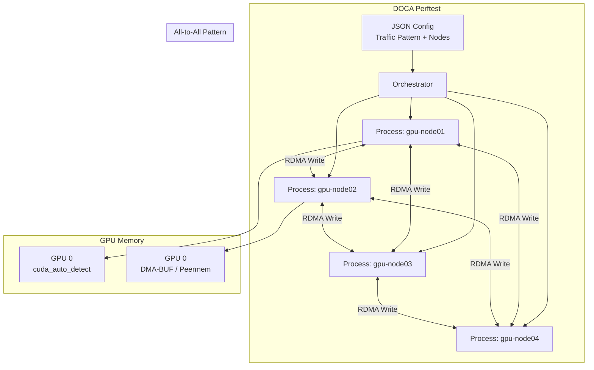

> 💡 **Quick Answer:** NVIDIA DOCA perftest (`doca_perftest`) is the next-generation RDMA benchmarking tool that replaces legacy `ib_write_bw`/`ib_read_lat`. It supports traffic patterns (ALL_TO_ALL, BISECTION), GPU memory modes (GPUDirect, DMA-BUF), multi-process testing, and JSON-driven multi-node orchestration — all critical for validating AI cluster networking before training.

## The Problem

Before running distributed training on a GPU cluster, you need to validate:
- RDMA bandwidth between every node pair (is the fabric healthy?)
- GPUDirect RDMA is working (GPU memory ↔ NIC without CPU copies)
- All-to-all communication patterns match NCCL's real traffic shape
- No silent data corruption on the wire
- Switch-level bisection bandwidth under realistic load

Legacy tools (`ib_write_bw`, `ib_read_lat`) test one pair at a time, have no GPU awareness, no traffic patterns, and no data validation. DOCA perftest solves all of this.

## The Solution

### DOCA Perftest Container Image

DOCA perftest ships in the DOCA SDK container. Build or use the official image:

```yaml
apiVersion: v1
kind: ConfigMap
metadata:
  name: perftest-config
  namespace: ai-infra
data:
  a2a-test.json: |
    {
      "testNodes": [
        {"hostname": "perftest-0.perftest-svc", "deviceName": "mlx5_0"},
        {"hostname": "perftest-1.perftest-svc", "deviceName": "mlx5_0"},
        {"hostname": "perftest-2.perftest-svc", "deviceName": "mlx5_0"},
        {"hostname": "perftest-3.perftest-svc", "deviceName": "mlx5_0"}
      ],
      "trafficPattern": "ALL_TO_ALL",
      "trafficDirection": "BIDIR",
      "verb": "write",
      "msgSize": 8388608,
      "metric": "bw",
      "num_processes": 1,
      "Duration": 30
    }
```

### Multi-Node Benchmark Job

```yaml
apiVersion: batch/v1
kind: Job
metadata:
  name: doca-perftest
  namespace: ai-infra
spec:
  parallelism: 4
  completions: 4
  completionMode: Indexed
  template:
    metadata:
      annotations:
        k8s.v1.cni.cncf.io/networks: rdma-net
    spec:
      restartPolicy: Never
      subdomain: perftest-svc
      setHostnameAsFQDN: true
      containers:
        - name: perftest
          image: nvcr.io/nvidia/doca/doca_container:2.9.1
          command:
            - bash
            - -c
            - |
              # Wait for all peers to be DNS-resolvable
              for i in $(seq 0 3); do
                while ! getent hosts perftest-${i}.perftest-svc; do
                  sleep 2
                done
              done
              
              # Node 0 runs the orchestrator
              if [ "$JOB_COMPLETION_INDEX" = "0" ]; then
                doca_perftest --json /config/a2a-test.json
              else
                # Workers wait for orchestrator to connect
                doca_perftest --json /config/a2a-test.json
              fi
          resources:
            requests:
              nvidia.com/gpu: 1
              openshift.io/mlxrdma: "1"
              cpu: "8"
              memory: 16Gi
            limits:
              nvidia.com/gpu: 1
              openshift.io/mlxrdma: "1"
              cpu: "8"
              memory: 16Gi
          securityContext:
            capabilities:
              add: ["IPC_LOCK"]
          volumeMounts:
            - name: config
              mountPath: /config
            - name: dshm
              mountPath: /dev/shm
      volumes:
        - name: config
          configMap:
            name: perftest-config
        - name: dshm
          emptyDir:
            medium: Memory
            sizeLimit: 8Gi
---
apiVersion: v1
kind: Service
metadata:
  name: perftest-svc
  namespace: ai-infra
spec:
  clusterIP: None
  selector:
    job-name: doca-perftest
  ports:
    - port: 18515
      name: perftest
```

### CLI Quick Tests (Two-Pod)

Deploy a server and client pod for quick point-to-point tests:

```yaml
apiVersion: v1
kind: Pod
metadata:
  name: perftest-server
  namespace: ai-infra
  annotations:
    k8s.v1.cni.cncf.io/networks: rdma-net
spec:
  containers:
    - name: perftest
      image: nvcr.io/nvidia/doca/doca_container:2.9.1
      command: ["doca_perftest", "-d", "mlx5_2", "-M", "cuda"]
      resources:
        requests:
          nvidia.com/gpu: 1
          openshift.io/mlxrdma: "1"
        limits:
          nvidia.com/gpu: 1
          openshift.io/mlxrdma: "1"
      securityContext:
        capabilities:
          add: ["IPC_LOCK"]
```

```bash
# Run server
kubectl exec -it perftest-server -- doca_perftest -d mlx5_2 -M cuda

# Run client (from another pod)
kubectl exec -it perftest-client -- doca_perftest -d mlx5_2 -n perftest-server -M cuda

# Bidirectional test
kubectl exec -it perftest-client -- doca_perftest -d mlx5_2 -n perftest-server -M cuda -b

# Multi-process (4 cores)
kubectl exec -it perftest-client -- doca_perftest -d mlx5_2 -n perftest-server -M cuda -N 4
```

### Traffic Patterns

Use JSON mode for multi-node patterns:

```json
{
  "testNodes": [
    {"hostname": "node[01-16]", "deviceName": "mlx5_[0-1]"}
  ],
  "trafficPattern": "ALL_TO_ALL",
  "trafficDirection": "BIDIR",
  "verb": "write",
  "msgSize": 8388608,
  "metric": "bw",
  "Duration": 60
}
```

| Pattern | Use Case | Connections (N nodes) |
|---------|----------|----------------------|
| `ONE_TO_ONE` | Baseline NIC-to-NIC bandwidth | 1 |
| `ONE_TO_MANY` | Storage server ingest test | N-1 |
| `MANY_TO_ONE` | Aggregation bottleneck test | N-1 |
| `ALL_TO_ALL` | NCCL all-reduce simulation | N×(N-1) unidir |
| `BISECTION` | Switch fabric bandwidth test | N/2 |

### Per-Iteration Sync (AI Workload Simulation)

Lock-step benchmarking mimics AI collective operations:

```json
{
  "testNodes": [
    {"hostname": "gpu-node[01-08]", "deviceName": "mlx5_0"}
  ],
  "trafficPattern": "ALL_2_ALL",
  "trafficDirection": "BIDIR",
  "verb": "write",
  "msgSize": 67108864,
  "metric": "bw",
  "iterations": 100,
  "iterationSync": "true",
  "dataValidation": true
}
```

This mode:
1. **Data phase** — every node writes to every peer (split across QPs)
2. **Sync phase** — zero-length RDMA Write with Immediate signals completion
3. **Barrier phase** — waits for all peers to confirm
4. **Validation phase** — bit-exact data verification (catches silent corruption)

### GPU Memory Modes

```bash
# Auto-detect best mode (recommended)
doca_perftest -d mlx5_0 -n server -M cuda

# Selection order: Data Direct → DMA-BUF → Peermem
# Data Direct: ConnectX-7 + BlueField-3, newest and fastest
# DMA-BUF:    Open GPU kernel modules required
# Peermem:    Legacy nvidia-peermem kernel module

# Manually select GPU
doca_perftest -d mlx5_0 -n server -M cuda -G 0

# Custom CUDA library path
doca_perftest -d mlx5_0 -n server -M cuda --cuda_lib_path /usr/local/cuda-12/lib64
```

### Hostname Range Expansion

```json
{
  "testNodes": [
    {"hostname": "gpu-node[01-16]", "deviceName": "mlx5_[0-3]"}
  ]
}
```

This expands to 64 entries (16 hosts × 4 devices) — Cartesian product. Zero-padded ranges are preserved (`01`, `02`, ... `16`).



## Common Issues

**`doca_perftest: command not found`**

The binary ships in DOCA SDK containers. Use `nvcr.io/nvidia/doca/doca_container:2.9.1` or install the `doca-tools` package:
```bash
# Check available version
apt list --installed 2>/dev/null | grep doca-perftest
```

**Low bandwidth — expected 200 Gb/s, got 50 Gb/s**

Check GPU memory mode. Without `-M cuda`, data goes through CPU memory (PCIe bounce):
```bash
# Bad: host memory (CPU bottleneck)
doca_perftest -d mlx5_0 -n server

# Good: GPU memory (GPUDirect)
doca_perftest -d mlx5_0 -n server -M cuda
```

Also verify PFC is enabled — packet drops cause retransmissions:
```bash
ethtool -S mlx5_2 | grep rx_prio3_discard
```

**Per-iteration-sync shows lower bandwidth than continuous**

Expected. Sync barriers add coordination overhead between iterations. The measured bandwidth reflects what AI workloads actually achieve (collective operations are inherently synchronized).

**Data validation failures**

Bit-exact errors indicate silent data corruption — this is a critical finding:
- Check cable integrity (replace suspect cables)
- Verify ECC is enabled on switch and NIC
- Check for FEC (Forward Error Correction) counters: `ethtool -S mlx5_0 | grep fec`
- Run with smaller message sizes to narrow down the failure pattern

**Hostname not resolving in multi-node JSON mode**

Pods need stable DNS names. Use a headless Service + `setHostnameAsFQDN: true`:
```yaml
subdomain: perftest-svc
setHostnameAsFQDN: true
```

Hostnames in JSON must match the FQDN or short hostname exactly.

**GPU auto-select picks wrong GPU**

DOCA perftest selects by PCIe topology proximity (NV > PIX > PXB > PHB). Override with `-G`:
```bash
# Check topology
nvidia-smi topo -m

# Force specific GPU
doca_perftest -d mlx5_0 -n server -M cuda -G 2
```

## Best Practices

- Run ALL_TO_ALL bidirectional as the standard cluster health check — it exercises every link
- Use `-M cuda` (auto-detect) for GPU memory — let DOCA pick the optimal path
- Enable `dataValidation` for acceptance testing — catches silent corruption before training starts
- Use BISECTION pattern to measure switch fabric bandwidth (validates non-blocking topology)
- Start with ONE_TO_ONE for baseline, then scale to ALL_TO_ALL for fabric-level testing
- Run multi-process (`-N 4`) to saturate NICs — single-process may not hit line rate
- Pin to specific cores (`-C 0-3`) on NUMA node closest to the NIC for best results
- Compare DOCA perftest results against NCCL all-reduce — if DOCA shows full bandwidth but NCCL doesn't, the issue is in NCCL configuration, not the fabric
- Keep message size at 8MB+ for bandwidth tests (matches typical NCCL all-reduce chunk size)
- Use per-iteration-sync for AI workload simulation — it shows realistic achievable bandwidth

## Key Takeaways

- DOCA perftest replaces legacy `ib_write_bw`/`ib_read_lat` with multi-node, GPU-aware, pattern-based benchmarking
- Traffic patterns (ALL_TO_ALL, BISECTION, ONE_TO_MANY) collapse complex topologies into one JSON config
- GPU memory modes auto-detect the best path: Data Direct → DMA-BUF → Peermem
- Per-iteration-sync mimics AI collective operations with barrier synchronization and data validation
- Hostname range expansion (`node[01-16]`) + device ranges (`mlx5_[0-3]`) = concise configs for large clusters
- `dataValidation: true` performs bit-exact verification — essential for pre-training fabric acceptance
- On Kubernetes: deploy as Indexed Job with headless Service for stable DNS + SR-IOV VF for RDMA
- Always test with DOCA perftest before NCCL — it isolates fabric issues from training framework issues
