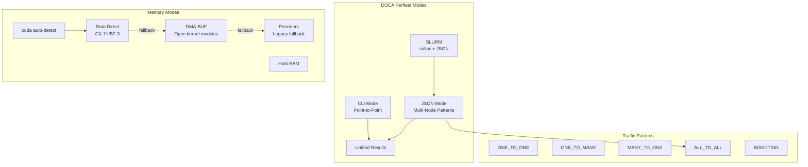

> 💡 **Quick Answer:** NVIDIA DOCA perftest (`doca_perftest`) is the next-generation RDMA benchmarking tool that replaces legacy `ib_write_bw`/`ib_read_lat`. It supports traffic patterns (ALL_TO_ALL, BISECTION), GPU memory modes (Data Direct, DMA-BUF, Peermem), multi-process testing, QP histograms, data validation, BlueField-3, SLURM integration, and JSON-driven multi-node orchestration.

## The Problem

Before running distributed training on a GPU cluster, you need to validate:
- RDMA bandwidth and latency between every node pair
- GPUDirect RDMA is working (GPU memory ↔ NIC without CPU copies)
- All-to-all communication patterns match NCCL's real traffic shape
- No silent data corruption on the wire
- Switch-level bisection bandwidth under realistic load

Legacy tools (`ib_write_bw`, `ib_read_lat`) test one pair at a time, require manual orchestration scripts, have no GPU awareness, no traffic patterns, and no data validation. DOCA perftest replaces all of this with a single unified tool.

### DOCA Perftest vs Legacy Perftest

| Feature | Legacy Perftest | DOCA Perftest |
|---------|----------------|---------------|
| Scope | Point-to-point only | Single-node to cluster-wide |
| Orchestration | Manual scripts | Built-in (single-host initiation) |
| Concurrency | Single-process | Native multi-process/multi-core |
| Synchronization | Loose (serial start) | Hardware-aligned (synchronized) |
| Results | Per-process manual extraction | Automatic cluster-wide aggregation |
| GPU support | None | CUDA/GPUDirect RDMA integration |
| Data validation | None | Bit-exact verification |

## The Solution

### Quick Start: Point-to-Point CLI

```bash
# Simplest test — auto-launches server via SSH, auto-selects cores
doca_perftest -d mlx5_0 -n <server-hostname>

# This is equivalent to:
# -N 1 (one process, auto core) -c RC (reliable connection)
# -v write -m bw -s 65536 -D 10

# Bidirectional bandwidth
doca_perftest -d mlx5_0 -n <server> -b

# Latency test
doca_perftest -d mlx5_0 -n <server> -m lat

# Multi-process (saturate NIC)
doca_perftest -d mlx5_0 -n <server> -N 4

# Specific cores (NUMA-aware)
doca_perftest -d mlx5_0 -n <server> -C 0-3

# With GPUDirect RDMA (auto-detect best mode)
doca_perftest -d mlx5_0 -n <server> -M cuda

# QP histogram (work distribution across queue pairs)
doca_perftest -d mlx5_0 -n <server> -q 8 -H
```

### CLI Parameter Reference

| Parameter | Description |
|-----------|-------------|
| `-d mlx5_0` | RDMA device name |
| `-n <host>` | Remote server hostname |
| `-N <num>` | Number of processes (cores auto-selected) |
| `-C <cores>` | Explicit core IDs (`5`, `5,7`, `5-9`) |
| `-c RC` | Transport: RC (Reliable Connection) |
| `-v write` | RDMA verb: write, read, send |
| `-m bw` | Metric: bw (bandwidth) or lat (latency) |
| `-s 65536` | Message size in bytes |
| `-D 10` | Duration in seconds |
| `-b` | Bidirectional traffic |
| `-M <type>` | Memory type (see GPU Memory section) |
| `-G <id>` | GPU device ID |
| `-q <num>` | Number of Queue Pairs |
| `-H` | Enable QP histogram |
| `-r ibv\|dv` | RDMA driver: ibv (libibverbs) or dv (doca_verbs) |
| `--use_ece` | Enable Enhanced Connection Establishment |

### Traffic Patterns (JSON Mode)

For multi-node tests, use JSON configuration:

```bash
doca_perftest -f scenario.json
```

#### All-to-All (NCCL simulation)

```json
{
  "testNodes": [
    {"hostname": "gpu-node[01-16]", "deviceName": "mlx5_0"}
  ],
  "trafficPattern": "ALL_TO_ALL",
  "trafficDirection": "BIDIR",
  "verb": "write",
  "msgSize": 8388608,
  "metric": "bw",
  "Duration": 60
}
```

#### Bisection (switch fabric test)

```json
{
  "testNodes": [
    {"hostname": "rack1-[01-10]", "deviceName": "mlx5_0"},
    {"hostname": "rack2-[01-10]", "deviceName": "mlx5_0"}
  ],
  "trafficPattern": "BISECTION"
}
```

#### One-to-Many / Many-to-One

```json
{
  "testNodes": [
    {"hostname": "aggregator", "deviceName": "mlx5_0"},
    {"hostname": "client[01-20]", "deviceName": "mlx5_0"}
  ],
  "trafficPattern": "MANY_TO_ONE"
}
```

| Pattern | Use Case | Connections (N nodes) |
|---------|----------|----------------------|
| `ONE_TO_ONE` | Baseline NIC-to-NIC bandwidth | 1 |
| `ONE_TO_MANY` | Storage server ingest test | N-1 |
| `MANY_TO_ONE` | Aggregation bottleneck test | N-1 |
| `ALL_TO_ALL` | NCCL all-reduce simulation | N×(N-1) unidir |
| `BISECTION` | Switch fabric bandwidth (even N) | N/2 |

### Hostname Range Expansion

```json
{"hostname": "gpu-node[01-16]", "deviceName": "mlx5_[0-3]"}
```

Expands to 64 entries (Cartesian product: 16 hosts × 4 devices). Zero-padded ranges preserved.

| Syntax | Example | Result |
|--------|---------|--------|
| Numeric range | `host[0-3]` | host0, host1, host2, host3 |
| Comma list | `host[0,2,4]` | host0, host2, host4 |
| Zero-padded | `node[01-03]` | node01, node02, node03 |

### GPU Memory Modes

```bash
# Auto-detect best mode (recommended)
# Falls back: Data Direct → DMA-BUF → Peermem
doca_perftest -d mlx5_0 -n <server> -M cuda -G 0

# Explicit modes
doca_perftest -d mlx5_0 -n <server> -M cuda_data_direct -G 0   # Fastest (ConnectX-7+/BF-3)
doca_perftest -d mlx5_0 -n <server> -M cuda_dmabuf -G 0        # DMA-BUF (open kernel modules)
doca_perftest -d mlx5_0 -n <server> -M cuda_peermem -G 0       # Legacy nvidia-peermem
doca_perftest -d mlx5_0 -n <server> -M host                    # Host RAM (default)
doca_perftest -d mlx5_0 -n <server> -M device                  # NIC on-board memory
doca_perftest -d mlx5_0 -n <server> -M nullmr                  # No allocation (synthetic)
```

| Memory Mode | Data Path | Use Case |
|-------------|-----------|----------|
| `cuda` (auto) | GPU↔NIC direct | Production benchmarking |
| `cuda_data_direct` | Direct PCIe mapping | Lowest latency (CX-7+) |
| `cuda_dmabuf` | Linux DMA-BUF zero-copy | CUDA 11.7+, open kernel modules |
| `cuda_peermem` | nvidia-peermem kernel module | Universal fallback |
| `host` | NIC↔PCIe↔Host RAM | CPU-side baseline |
| `device` | NIC on-board memory | Adapter capacity test |
| `nullmr` | No real allocation | Ultra-low-latency synthetic |

GPU auto-selection follows PCIe topology proximity: **NV > PIX > PXB > PHB > NODE > SYS** (same as `nvidia-smi topo`).

### RDMA Drivers

```bash
# libibverbs (default, all IB/RoCE adapters)
doca_perftest -d mlx5_0 -n <server> -r ibv

# DOCA RDMA Verbs (high-performance, DOCA SDK optimized)
doca_perftest -d mlx5_0 -n <server> -r dv
```

| Driver | Flag | Notes |
|--------|------|-------|
| IBV (libibverbs) | `-r ibv` | Default. Standard RDMA verbs, broad compatibility |
| DV (doca_verbs) | `-r dv` | High-performance DOCA-optimized. Required for QP hints/PCC |

### Per-Iteration Sync (AI Workload Simulation)

Lock-step benchmarking that mimics AI collective operations:

```json
{
  "testNodes": [
    {"hostname": "gpu-node[01-08]", "deviceName": "mlx5_0"}
  ],
  "trafficPattern": "ALL_2_ALL",
  "trafficDirection": "BIDIR",
  "verb": "write",
  "msgSize": 67108864,
  "metric": "bw",
  "iterations": 100,
  "iterationSync": "true",
  "dataValidation": true
}
```

Each iteration has 4 phases:
1. **Data phase** — every process writes to all peers (msgSize split across QPs)
2. **Sync phase** — zero-length RDMA Write with Immediate Data signals completion
3. **Barrier phase** — waits for all peers to confirm
4. **Post-iteration phase** — data validation, QP modification, pointer updates (untimed)

Constraints: JSON only (no CLI), requires ALL_2_ALL + BIDIR, iteration count required (no time-based duration).

### Data Validation

```json
{
  "dataValidation": true,
  "warmupTime": 0
}
```

- Requestor generates deterministic payload; responder bit-verifies received data
- Catches silent data corruption from cables, switches, or firmware bugs
- In iteration-sync mode: validation runs in the inter-iteration gap (no perf impact)
- Output: `invalidDataSampleCount` in JSON results (first 5000 failures logged individually)
- Constraints: bandwidth tests only, `rxDepth ≥ txDepth`, warmup must be disabled

### QP Histogram

```bash
doca_perftest -d mlx5_0 -n <server> -q 8 -H
```

Shows per-QP bandwidth distribution — identifies load imbalance across queue pairs:
```
Qp num 0:  ████████████████████████  45.23 Gbit/sec | Deviation: -2.1%
Qp num 1:  █████████████████████████ 46.89 Gbit/sec | Deviation: +1.5%
Qp num 2:  ████████████████████████  45.67 Gbit/sec | Deviation: -1.2%
Qp num 3:  █████████████████████████ 48.21 Gbit/sec | Deviation: +4.3%
```

### Enhanced Connection Establishment (ECE)

```bash
# CLI
doca_perftest -d mlx5_0 -n <server> --use_ece
```

```json
{"useEce": true}
```

ECE negotiates connection capabilities (features, optimizations) between client and server during QP setup. Only supported with IBV driver on RC QPs.

### TPH (Transaction Processing Hints)

PCIe optimization for CPU cache management — reduces memory-access latency:

```bash
# Processing hint + core pinning
doca_perftest -d mlx5_0 -n <server> --ph 1 --tph_core_id 0 --tph_mem pm
```

| Option | Values |
|--------|--------|
| `--ph` | 0=Bidirectional, 1=Requester, 2=Completer, 3=High-priority |
| `--tph_core_id` | Target CPU core |
| `--tph_mem` | `pm` (persistent) or `vm` (volatile) |

Requires ConnectX-6+ and a TPH-enabled kernel. `--tph_core_id` and `--tph_mem` must both be set or both omitted.

### Auto-Launching Remote Server

```bash
# Default: auto-launches server via passwordless SSH
doca_perftest -d mlx5_0 -n <server>

# Disable auto-launch (manual server start)
doca_perftest -d mlx5_0 -n <server> --launch_server disable

# Server overrides
doca_perftest -d mlx5_0 -n <server> --server_device mlx5_1      # Different device
doca_perftest -d mlx5_0 -n <server> --server_cores 4-7           # Different cores
doca_perftest -d mlx5_0 -n <server> --server_mem_type cuda       # Different memory
doca_perftest -d mlx5_0 -n <server> --server_username testuser   # SSH user
```

### Running on BlueField-3

DOCA perftest generates traffic from either x86 host or BlueField Arm cores:

**x86 Host (server-side DMA):**
- Data path: NIC ↔ PCIe ↔ Host Memory
- JSON: `hostName` = x86 hostname, `deviceName` = `mlx5_0`

**BlueField Arm cores:**
- Data path: NIC ↔ DPU DDR (no PCIe hop)
- JSON: `hostName` = BlueField hostname, `deviceName` = `p0` or `mlx5_2`
- Set `mpiTcpNetworkInterfaces` to management subnet (e.g., `"10.7.8.0/24"`)

### SLURM Integration

```bash
# Allocate nodes
salloc -N8

# Run with SLURM-allocated nodes in JSON
doca_perftest -f scenario.json
```

```json
{
  "testNodes": [
    {"hostname": "rack1-[01-04]", "deviceName": "mlx5_0"},
    {"hostname": "rack2-[01-04]", "deviceName": "mlx5_0"}
  ],
  "trafficPattern": "BISECTION"
}
```

### Kubernetes Deployment

Deploy as an Indexed Job with headless Service for stable DNS:

```yaml
apiVersion: v1
kind: ConfigMap
metadata:
  name: perftest-config
  namespace: ai-infra
data:
  a2a-test.json: |
    {
      "testNodes": [
        {"hostname": "perftest-0.perftest-svc", "deviceName": "mlx5_2"},
        {"hostname": "perftest-1.perftest-svc", "deviceName": "mlx5_2"},
        {"hostname": "perftest-2.perftest-svc", "deviceName": "mlx5_2"},
        {"hostname": "perftest-3.perftest-svc", "deviceName": "mlx5_2"}
      ],
      "trafficPattern": "ALL_TO_ALL",
      "trafficDirection": "BIDIR",
      "verb": "write",
      "msgSize": 8388608,
      "metric": "bw",
      "Duration": 30,
      "dataValidation": true,
      "warmupTime": 0
    }
---
apiVersion: batch/v1
kind: Job
metadata:
  name: doca-perftest
  namespace: ai-infra
spec:
  parallelism: 4
  completions: 4
  completionMode: Indexed
  template:
    metadata:
      annotations:
        k8s.v1.cni.cncf.io/networks: rdma-net
    spec:
      restartPolicy: Never
      subdomain: perftest-svc
      setHostnameAsFQDN: true
      containers:
        - name: perftest
          image: nvcr.io/nvidia/doca/doca_container:2.9.1
          command:
            - bash
            - -c
            - |
              for i in $(seq 0 3); do
                while ! getent hosts perftest-${i}.perftest-svc; do sleep 2; done
              done
              doca_perftest --json /config/a2a-test.json
          resources:
            requests:
              nvidia.com/gpu: 1
              openshift.io/mlxrdma: "1"
            limits:
              nvidia.com/gpu: 1
              openshift.io/mlxrdma: "1"
          securityContext:
            capabilities:
              add: ["IPC_LOCK"]
          volumeMounts:
            - name: config
              mountPath: /config
            - name: dshm
              mountPath: /dev/shm
      volumes:
        - name: config
          configMap:
            name: perftest-config
        - name: dshm
          emptyDir:
            medium: Memory
            sizeLimit: 8Gi
---
apiVersion: v1
kind: Service
metadata:
  name: perftest-svc
  namespace: ai-infra
spec:
  clusterIP: None
  selector:
    job-name: doca-perftest
  ports:
    - port: 18515
      name: perftest
```

### Benchmark Results Interpretation

**Bandwidth metrics:**

| Observation | Possible Cause |
|-------------|---------------|
| High message rate, low bandwidth | Small message sizes |
| High bandwidth, moderate message rate | Large messages, fewer CQEs |
| Lower than expected | PFC not enabled, TCP fallback, wrong memory type |

**Latency metrics:**

| Pattern | Insight |
|---------|---------|
| Low mean/median, high max/tail | Jitter or queue buildup |
| Low standard deviation | Stable, predictable performance |
| High 99%/99.9% tail | Potential SLA breaches |

Latency stats: min, max, mean, median, stddev, p99, p99.9.



## Common Issues

**Low bandwidth — expected 200 Gb/s, got 50 Gb/s**

Without `-M cuda`, data bounces through CPU memory:
```bash
# Bad: host memory path
doca_perftest -d mlx5_0 -n server
# Good: GPUDirect path
doca_perftest -d mlx5_0 -n server -M cuda
```

Also verify PFC is enabled: `ethtool -S mlx5_2 | grep rx_prio3_discard`

**Per-iteration-sync bandwidth lower than continuous**

Expected. Sync barriers add coordination overhead. This reflects what AI workloads actually achieve — collective operations are inherently synchronized.

**Data validation failures (invalidDataSampleCount > 0)**

Critical finding — silent data corruption:
- Check cable integrity (replace suspect cables)
- Verify FEC counters: `ethtool -S mlx5_0 | grep fec`
- Check ECC on switch and NIC
- Run smaller message sizes to narrow failure pattern

**Hostname not resolving in K8s JSON mode**

Pods need stable DNS. Use headless Service + `setHostnameAsFQDN: true`. Hostnames in JSON must match exactly.

**GPU auto-select picks wrong GPU**

Override with `-G`:
```bash
nvidia-smi topo -m  # Check topology
doca_perftest -d mlx5_0 -n server -M cuda -G 2
```

**ECE negotiation fails**

ECE only works with IBV driver (`-r ibv`) on RC QPs. Not supported with DV driver.

## Best Practices

- Run ALL_TO_ALL bidirectional as standard cluster health check
- Use `-M cuda` (auto-detect) — let DOCA pick the optimal GPU memory path
- Enable `dataValidation` for acceptance testing before training starts
- Use BISECTION pattern to measure switch fabric bandwidth
- Run multi-process (`-N 4`) to saturate high-speed NICs (200G/400G+)
- Pin to NUMA-local cores (`-C`) for consistent results
- Use QP histogram (`-H`) to identify load imbalance across queue pairs
- Compare results against NCCL all-reduce — if DOCA shows full bandwidth but NCCL doesn't, debug NCCL config
- Keep message size ≥ 8MB for bandwidth tests (matches NCCL chunk size)
- Use `-r dv` (DOCA verbs) for highest performance when available
- For BlueField-3: set `mpiTcpNetworkInterfaces` to management subnet
- Example JSON configs available at `/usr/share/doc/doca-perftest/examples/`

## Key Takeaways

- DOCA perftest is a native replacement for legacy `ib_write_bw`/`ib_read_lat` — not a wrapper
- Single tool for all RDMA verbs (write, read, send), metrics (bw, lat), and scales (P2P to cluster)
- Traffic patterns collapse complex topologies into one-line JSON configs
- GPU auto-detection selects NIC-closest GPU via PCIe topology ranking
- Memory mode fallback chain: Data Direct → DMA-BUF → Peermem (use `-M cuda`)
- Per-iteration-sync mimics AI collectives with barrier synchronization
- Data validation catches silent corruption — essential for fabric acceptance
- Two RDMA drivers: IBV (universal) and DV (DOCA-optimized, enables QP hints/PCC)
- Integrates with SLURM (`salloc` + JSON) and Kubernetes (Indexed Job + headless Service)
- Auto-launches remote server via SSH for quick P2P tests
- Always benchmark with DOCA perftest before NCCL to isolate fabric from framework issues
