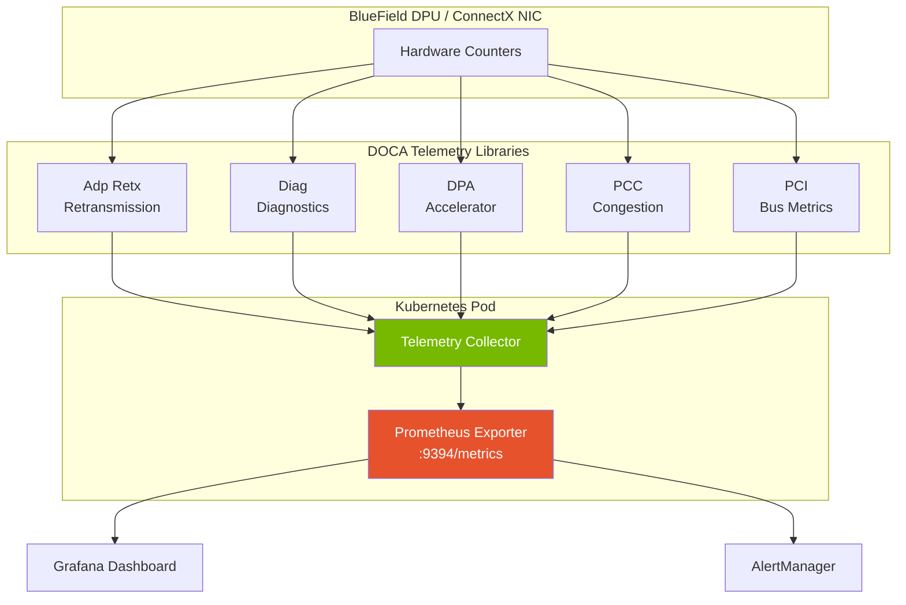

> 💡 **Quick Answer:** DOCA Telemetry is a suite of libraries for collecting hardware-level metrics from NVIDIA BlueField DPUs and ConnectX NICs. Deploy a telemetry collector DaemonSet on Kubernetes to gather adaptive retransmission stats, diagnostic counters, DPA metrics, programmable congestion control data, and PCI performance — then export to Prometheus for dashboarding and alerting.

## The Problem

BlueField DPUs and ConnectX SmartNICs offload networking, security, and storage — but their internal telemetry is invisible to standard Kubernetes monitoring:

- **Packet retransmission** rates on RDMA links go undetected until GPU training stalls
- **Congestion control** (PCC) tuning requires real-time feedback that `ethtool` can't provide
- **PCI bus bottlenecks** between GPU and NIC are invisible to Prometheus node-exporter
- **DPA accelerator** utilization has no standard metric endpoint
- **Diagnostic counters** for link errors, CRC failures, and buffer overruns require vendor-specific tools
- Network performance degrades silently — you find out when a distributed training job takes 2× longer

## The Solution

### DOCA Telemetry Library Stack

DOCA Telemetry v3.3 includes five specialized libraries:

| Library | What It Monitors | Use Case |
|---------|-----------------|----------|
| **Adp Retx** | Adaptive retransmission stats | RDMA link quality, RoCE packet loss |
| **Diag** | High-frequency diagnostic counters | Link errors, CRC, buffer overruns |
| **DPA** | Data Path Accelerator utilization | DPA program cycles, queue occupancy |
| **PCC** | Programmable Congestion Control | ECN marking, rate limiting, RTT |
| **PCI** | PCI Express metrics | Bandwidth utilization, TLP errors, latency |



### Prerequisites

```bash
# BlueField DPU or ConnectX-7 with firmware supporting DOCA 3.3
# DOCA SDK installed on host or available as container image

# Verify DOCA version on nodes
kubectl get nodes -l nvidia.com/dpu.present=true -o name | \
  xargs -I{} kubectl debug {} --image=nvcr.io/nvidia/doca/doca_base:3.3.0 -- \
  dpkg -l | grep doca-telemetry

# Check BlueField firmware
kubectl get nodes -l nvidia.com/dpu.present=true -o name | \
  xargs -I{} kubectl debug {} -- mlxfwmanager --query
```

### Step 1: DOCA Telemetry Collector DaemonSet

```yaml
apiVersion: apps/v1
kind: DaemonSet
metadata:
  name: doca-telemetry-collector
  namespace: nvidia-monitoring
  labels:
    app: doca-telemetry
spec:
  selector:
    matchLabels:
      app: doca-telemetry
  template:
    metadata:
      labels:
        app: doca-telemetry
      annotations:
        prometheus.io/scrape: "true"
        prometheus.io/port: "9394"
        prometheus.io/path: "/metrics"
    spec:
      hostNetwork: true
      hostPID: true
      nodeSelector:
        nvidia.com/dpu.present: "true"
      tolerations:
      - key: nvidia.com/gpu
        operator: Exists
        effect: NoSchedule
      containers:
      - name: telemetry-collector
        image: nvcr.io/nvidia/doca/doca_telemetry:3.3.0
        securityContext:
          privileged: true
          capabilities:
            add:
            - IPC_LOCK
            - SYS_RESOURCE
            - NET_RAW
        env:
        - name: NODE_NAME
          valueFrom:
            fieldRef:
              fieldPath: spec.nodeName
        - name: TELEMETRY_INTERVAL_MS
          value: "1000"
        - name: ENABLE_ADP_RETX
          value: "true"
        - name: ENABLE_DIAG
          value: "true"
        - name: ENABLE_DPA
          value: "true"
        - name: ENABLE_PCC
          value: "true"
        - name: ENABLE_PCI
          value: "true"
        - name: PROMETHEUS_PORT
          value: "9394"
        - name: DOCA_DEVICES
          value: "mlx5_0,mlx5_1"
        ports:
        - name: metrics
          containerPort: 9394
          protocol: TCP
        volumeMounts:
        - name: dev-infiniband
          mountPath: /dev/infiniband
        - name: sys
          mountPath: /sys
          readOnly: true
        - name: devfs
          mountPath: /dev
        resources:
          requests:
            cpu: 100m
            memory: 256Mi
          limits:
            cpu: 500m
            memory: 512Mi
        livenessProbe:
          httpGet:
            path: /healthz
            port: 9394
          initialDelaySeconds: 10
          periodSeconds: 30
        readinessProbe:
          httpGet:
            path: /metrics
            port: 9394
          initialDelaySeconds: 5
      volumes:
      - name: dev-infiniband
        hostPath:
          path: /dev/infiniband
      - name: sys
        hostPath:
          path: /sys
      - name: devfs
        hostPath:
          path: /dev
```

### Step 2: Custom Telemetry Collector Application

Build a custom collector using the DOCA Telemetry C API:

```c
/* doca_telemetry_collector.c — collect all 5 telemetry streams */
#include <doca_telemetry_adp_retx.h>
#include <doca_telemetry_diag.h>
#include <doca_telemetry_dpa.h>
#include <doca_telemetry_pcc.h>
#include <doca_telemetry_pci.h>
#include <doca_dev.h>
#include <doca_log.h>
#include <stdio.h>
#include <unistd.h>

DOCA_LOG_REGISTER(TELEMETRY_COLLECTOR);

/* Adaptive Retransmission metrics */
static void collect_adp_retx(struct doca_dev *dev) {
    struct doca_telemetry_adp_retx *ctx;
    doca_error_t result;
    
    result = doca_telemetry_adp_retx_create(dev, &ctx);
    if (result != DOCA_SUCCESS) {
        DOCA_LOG_ERR("Failed to create adp_retx context: %s",
                     doca_error_get_descr(result));
        return;
    }
    
    result = doca_telemetry_adp_retx_start(ctx);
    if (result != DOCA_SUCCESS) {
        DOCA_LOG_ERR("Failed to start adp_retx: %s",
                     doca_error_get_descr(result));
        doca_telemetry_adp_retx_destroy(ctx);
        return;
    }
    
    /* Read retransmission counters */
    uint64_t retx_count, retx_bytes, avg_rtt_ns;
    doca_telemetry_adp_retx_get_retx_packets(ctx, &retx_count);
    doca_telemetry_adp_retx_get_retx_bytes(ctx, &retx_bytes);
    doca_telemetry_adp_retx_get_avg_rtt(ctx, &avg_rtt_ns);
    
    printf("# HELP doca_adp_retx_packets Total retransmitted packets\n");
    printf("# TYPE doca_adp_retx_packets counter\n");
    printf("doca_adp_retx_packets %lu\n", retx_count);
    printf("doca_adp_retx_bytes %lu\n", retx_bytes);
    printf("doca_adp_retx_avg_rtt_ns %lu\n", avg_rtt_ns);
    
    doca_telemetry_adp_retx_stop(ctx);
    doca_telemetry_adp_retx_destroy(ctx);
}

/* PCI Express metrics */
static void collect_pci(struct doca_dev *dev) {
    struct doca_telemetry_pci *ctx;
    doca_error_t result;
    
    result = doca_telemetry_pci_create(dev, &ctx);
    if (result != DOCA_SUCCESS) return;
    
    result = doca_telemetry_pci_start(ctx);
    if (result != DOCA_SUCCESS) {
        doca_telemetry_pci_destroy(ctx);
        return;
    }
    
    uint64_t rx_bytes, tx_bytes, tlp_errors;
    doca_telemetry_pci_get_rx_bytes(ctx, &rx_bytes);
    doca_telemetry_pci_get_tx_bytes(ctx, &tx_bytes);
    doca_telemetry_pci_get_tlp_errors(ctx, &tlp_errors);
    
    printf("doca_pci_rx_bytes %lu\n", rx_bytes);
    printf("doca_pci_tx_bytes %lu\n", tx_bytes);
    printf("doca_pci_tlp_errors %lu\n", tlp_errors);
    
    doca_telemetry_pci_stop(ctx);
    doca_telemetry_pci_destroy(ctx);
}

int main(int argc, char **argv) {
    struct doca_dev *dev;
    /* Open device — mlx5_0 by default */
    doca_error_t result = doca_dev_open_by_name("mlx5_0", &dev);
    if (result != DOCA_SUCCESS) {
        DOCA_LOG_ERR("Failed to open device: %s",
                     doca_error_get_descr(result));
        return 1;
    }
    
    while (1) {
        collect_adp_retx(dev);
        collect_pci(dev);
        /* Add collect_diag(), collect_dpa(), collect_pcc() similarly */
        sleep(1);
    }
    
    doca_dev_close(dev);
    return 0;
}
```

```dockerfile
# Dockerfile for custom collector
FROM nvcr.io/nvidia/doca/doca_base:3.3.0

RUN apt-get update && apt-get install -y \
    libdoca-telemetry-dev \
    libdoca-common-dev \
    && rm -rf /var/lib/apt/lists/*

COPY doca_telemetry_collector.c /opt/collector/
WORKDIR /opt/collector

RUN gcc -o collector doca_telemetry_collector.c \
    -ldoca_telemetry_adp_retx \
    -ldoca_telemetry_diag \
    -ldoca_telemetry_dpa \
    -ldoca_telemetry_pcc \
    -ldoca_telemetry_pci \
    -ldoca_common -ldoca_log

CMD ["/opt/collector/collector"]
```

### Step 3: ServiceMonitor for Prometheus

```yaml
apiVersion: monitoring.coreos.com/v1
kind: ServiceMonitor
metadata:
  name: doca-telemetry
  namespace: nvidia-monitoring
  labels:
    app: doca-telemetry
spec:
  selector:
    matchLabels:
      app: doca-telemetry
  endpoints:
  - port: metrics
    interval: 10s
    path: /metrics
  namespaceSelector:
    matchNames:
    - nvidia-monitoring

---
apiVersion: v1
kind: Service
metadata:
  name: doca-telemetry
  namespace: nvidia-monitoring
  labels:
    app: doca-telemetry
spec:
  clusterIP: None  # Headless — one endpoint per node
  selector:
    app: doca-telemetry
  ports:
  - name: metrics
    port: 9394
    targetPort: 9394
```

### Step 4: Prometheus Alerting Rules

```yaml
apiVersion: monitoring.coreos.com/v1
kind: PrometheusRule
metadata:
  name: doca-telemetry-alerts
  namespace: nvidia-monitoring
spec:
  groups:
  - name: doca-network-health
    interval: 30s
    rules:
    - alert: HighRetransmissionRate
      expr: |
        rate(doca_adp_retx_packets[5m]) > 100
      for: 5m
      labels:
        severity: warning
        component: network
      annotations:
        summary: "High RDMA retransmission on {{ $labels.node }}"
        description: "{{ $value | printf \"%.0f\" }} retransmissions/sec — check link quality, PFC config, or cable."
    
    - alert: PCIBandwidthSaturation
      expr: |
        (rate(doca_pci_rx_bytes[1m]) + rate(doca_pci_tx_bytes[1m])) 
        / (16 * 1e9) > 0.85
      for: 2m
      labels:
        severity: warning
        component: pci
      annotations:
        summary: "PCI Express bandwidth >85% on {{ $labels.node }}"
        description: "GPU-NIC PCI link near saturation — may bottleneck RDMA transfers."
    
    - alert: PCITLPErrors
      expr: |
        rate(doca_pci_tlp_errors[5m]) > 0
      for: 1m
      labels:
        severity: critical
        component: pci
      annotations:
        summary: "PCI TLP errors on {{ $labels.node }}"
        description: "Transaction Layer Protocol errors — possible hardware issue, reseat card or check riser."
    
    - alert: HighAvgRTT
      expr: |
        doca_adp_retx_avg_rtt_ns > 5000
      for: 5m
      labels:
        severity: warning
        component: network
      annotations:
        summary: "High RDMA RTT on {{ $labels.node }}"
        description: "Average RTT {{ $value }}ns — expected <2000ns for local fabric. Check switch hops or congestion."
    
    - alert: DiagLinkErrors
      expr: |
        rate(doca_diag_link_errors[5m]) > 0
      for: 1m
      labels:
        severity: critical
        component: link
      annotations:
        summary: "Link errors on {{ $labels.node }}"
        description: "CRC/symbol errors detected — check cable, transceiver, or port."
```

### Step 5: Grafana Dashboard

```json
{
  "title": "DOCA Telemetry - BlueField DPU Monitoring",
  "panels": [
    {
      "title": "RDMA Retransmission Rate",
      "type": "timeseries",
      "targets": [{"expr": "rate(doca_adp_retx_packets[5m])"}],
      "fieldConfig": {"defaults": {"unit": "pps"}}
    },
    {
      "title": "Average RDMA RTT",
      "type": "timeseries",
      "targets": [{"expr": "doca_adp_retx_avg_rtt_ns"}],
      "fieldConfig": {"defaults": {"unit": "ns"}}
    },
    {
      "title": "PCI Bandwidth Utilization",
      "type": "gauge",
      "targets": [{"expr": "(rate(doca_pci_rx_bytes[1m]) + rate(doca_pci_tx_bytes[1m])) / (16e9) * 100"}],
      "fieldConfig": {"defaults": {"unit": "percent", "max": 100}}
    },
    {
      "title": "PCI TLP Errors",
      "type": "stat",
      "targets": [{"expr": "rate(doca_pci_tlp_errors[5m])"}],
      "fieldConfig": {"defaults": {"thresholds": {"steps": [{"value": 0, "color": "green"}, {"value": 1, "color": "red"}]}}}
    },
    {
      "title": "Diagnostic Link Errors by Node",
      "type": "table",
      "targets": [{"expr": "doca_diag_link_errors", "format": "table"}]
    }
  ]
}
```

### Telemetry Integration with DOCA Telemetry Exporter

For environments already running the DOCA Telemetry Exporter (DTE), the telemetry libraries can feed into it:

```yaml
# ConfigMap for DTE data sources
apiVersion: v1
kind: ConfigMap
metadata:
  name: dte-sources
  namespace: nvidia-monitoring
data:
  sources.yaml: |
    data_sources:
    - name: adp_retx
      type: doca_telemetry_adp_retx
      devices: ["mlx5_0", "mlx5_1"]
      interval_ms: 1000
      
    - name: diagnostics
      type: doca_telemetry_diag
      devices: ["mlx5_0", "mlx5_1"]
      interval_ms: 5000
      high_frequency: true
      
    - name: pcc
      type: doca_telemetry_pcc
      devices: ["mlx5_0"]
      interval_ms: 1000
      
    - name: pci_metrics
      type: doca_telemetry_pci
      devices: ["mlx5_0", "mlx5_1"]
      interval_ms: 2000
    
    export:
      prometheus:
        port: 9394
        path: /metrics
      fluent_bit:
        enabled: true
        host: fluent-bit.logging.svc
        port: 24224
```

## Common Issues

**"Device not found" when opening mlx5_0**

The device name depends on SR-IOV and VF configuration. Use `ibstat` or `ls /sys/class/infiniband/` on the node to find correct device names. In containers, ensure `/dev/infiniband` is mounted.

**Telemetry returns zeros**

Some counters require traffic to be flowing. Run an `ib_write_bw` test while reading telemetry to verify. Also check that the firmware version supports DOCA 3.3 telemetry features.

**PCC metrics unavailable**

Programmable Congestion Control requires BlueField-3 or newer. ConnectX-7 supports a subset. Check `doca_devinfo_get_capabilities()` for PCC support.

**High CPU usage from diagnostic counters**

DOCA Telemetry Diag in high-frequency mode can consume significant CPU. Increase `interval_ms` to 5000+ for production, or limit to specific counters rather than collecting all.

## Best Practices

- **Start with Adp Retx and PCI** — these catch the most common performance issues
- **Set intervals appropriately** — 1s for retransmission, 5s for diagnostics, 2s for PCI
- **Alert on retransmission rate, not count** — use `rate()` in Prometheus, not raw counters
- **Correlate with NCCL metrics** — retransmission spikes should align with training slowdowns
- **Label by device and node** — multi-NIC nodes need per-device granularity
- **Use DOCA Telemetry Exporter** when available — avoids writing custom collector code
- **Monitor PCI TLP errors** — these indicate hardware problems that software can't fix

## Key Takeaways

- DOCA Telemetry provides hardware-level visibility into BlueField DPU and ConnectX NIC internals
- Five libraries cover retransmission, diagnostics, DPA, congestion control, and PCI metrics
- Deploy as a DaemonSet on DPU/SmartNIC nodes with privileged access and InfiniBand device mounts
- Critical alerts: retransmission rate, PCI saturation, TLP errors, link errors, high RTT
- Correlate DOCA telemetry with NCCL performance to pinpoint network-caused training slowdowns
- PCC telemetry is key for tuning RoCE congestion control in shared fabrics
