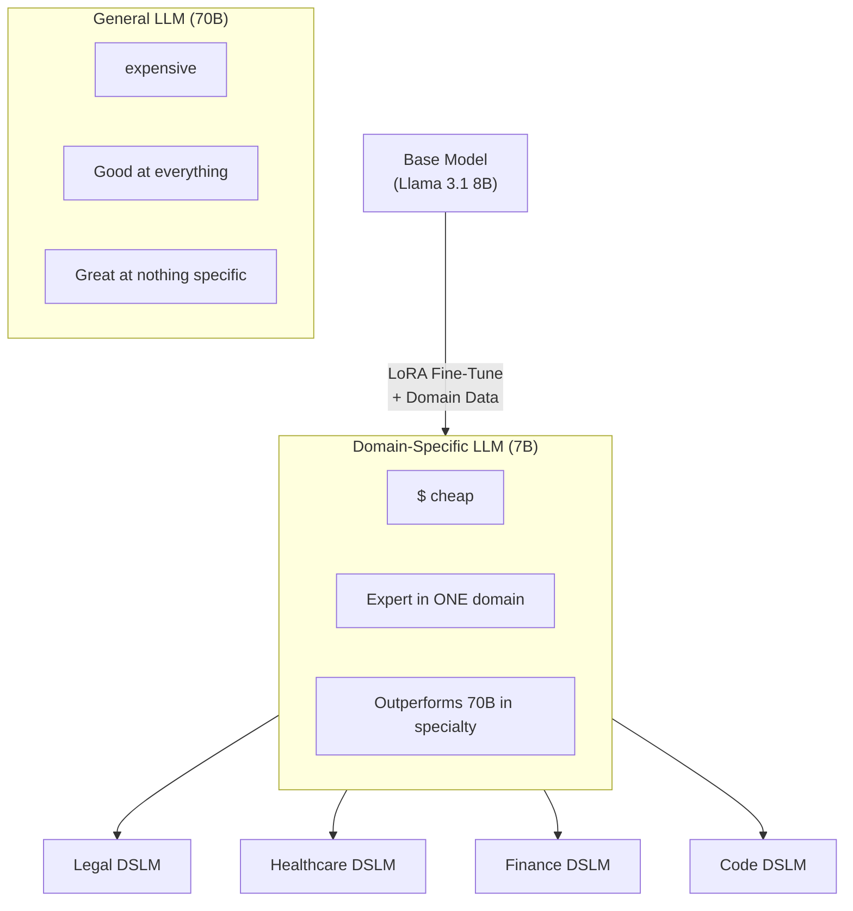

> 💡 **Quick Answer:** Domain-Specific Language Models (DSLMs) are smaller, cheaper, and more accurate than general-purpose LLMs for specialized tasks. Deploy them on Kubernetes using NIM or vLLM for serving, fine-tune with LoRA adapters on a single GPU, and enhance with RAG pipelines for domain knowledge. A 7B domain model often outperforms a 70B general model in its specialty.

## The Problem

General-purpose LLMs (GPT-4, Llama 70B) are expensive, slow, and often inaccurate for specialized domains. A legal firm doesn't need a model that can write poetry — they need one that understands contract law precisely. In 2026, DSLMs are rising because they're 10-100× cheaper to run, faster to respond, and more accurate in their domain.



## The Solution

### LoRA Fine-Tuning Job on Kubernetes

```yaml
apiVersion: batch/v1
kind: Job
metadata:
  name: finetune-legal-model
spec:
  template:
    spec:
      containers:
        - name: trainer
          image: nvcr.io/nvidia/pytorch:24.04-py3
          command: ["python", "finetune.py"]
          args:
            - "--base-model=meta-llama/Meta-Llama-3.1-8B"
            - "--dataset=/data/legal-corpus"
            - "--output=/models/legal-llama-8b"
            - "--lora-r=16"
            - "--lora-alpha=32"
            - "--epochs=3"
            - "--batch-size=4"
            - "--learning-rate=2e-4"
          env:
            - name: HF_TOKEN
              valueFrom:
                secretKeyRef:
                  name: hf-token
                  key: token
          resources:
            limits:
              nvidia.com/gpu: 1       # Single A100 for LoRA
              memory: "40Gi"
          volumeMounts:
            - name: data
              mountPath: /data
            - name: models
              mountPath: /models
            - name: shm
              mountPath: /dev/shm
      volumes:
        - name: data
          persistentVolumeClaim:
            claimName: training-data
        - name: models
          persistentVolumeClaim:
            claimName: model-storage
        - name: shm
          emptyDir:
            medium: Memory
            sizeLimit: 16Gi
      restartPolicy: Never
```

### Serve Domain Model with NIM

```yaml
# Model-free NIM with custom LoRA model
apiVersion: apps/v1
kind: Deployment
metadata:
  name: legal-llm
spec:
  template:
    spec:
      containers:
        - name: nim
          image: nvcr.io/nim/nim-llm:2.0.2
          env:
            - name: NIM_MODEL_PATH
              value: "/models/legal-llama-8b"
            - name: NIM_MAX_MODEL_LEN
              value: "8192"
          ports:
            - containerPort: 8000
          resources:
            limits:
              nvidia.com/gpu: 1
          volumeMounts:
            - name: models
              mountPath: /models
      volumes:
        - name: models
          persistentVolumeClaim:
            claimName: model-storage
---
apiVersion: v1
kind: Service
metadata:
  name: legal-llm
spec:
  selector:
    app: legal-llm
  ports:
    - port: 8000
```

### RAG Pipeline for Domain Knowledge

```yaml
# Vector store for domain documents
apiVersion: apps/v1
kind: StatefulSet
metadata:
  name: domain-vectordb
spec:
  template:
    spec:
      containers:
        - name: qdrant
          image: qdrant/qdrant:v1.12.0
          ports:
            - containerPort: 6333
          volumeMounts:
            - name: data
              mountPath: /qdrant/storage
  volumeClaimTemplates:
    - metadata:
        name: data
      spec:
        resources:
          requests:
            storage: 100Gi
---
# RAG service that combines retrieval + domain LLM
apiVersion: apps/v1
kind: Deployment
metadata:
  name: legal-rag-service
spec:
  template:
    spec:
      containers:
        - name: rag
          image: myorg/rag-service:v1.0
          env:
            - name: LLM_URL
              value: "http://legal-llm:8000/v1"
            - name: VECTOR_DB_URL
              value: "http://domain-vectordb:6333"
            - name: EMBEDDING_MODEL
              value: "BAAI/bge-large-en-v1.5"
          ports:
            - containerPort: 8080
```

### Multi-Domain Router

Serve multiple domain models and route based on query:

```yaml
apiVersion: apps/v1
kind: Deployment
metadata:
  name: model-router
spec:
  template:
    spec:
      containers:
        - name: router
          image: myorg/model-router:v1.0
          env:
            - name: LEGAL_MODEL_URL
              value: "http://legal-llm:8000/v1"
            - name: FINANCE_MODEL_URL
              value: "http://finance-llm:8000/v1"
            - name: HEALTH_MODEL_URL
              value: "http://health-llm:8000/v1"
            - name: GENERAL_MODEL_URL
              value: "http://general-llm:8000/v1"
            - name: CLASSIFIER_MODEL
              value: "domain-classifier-v1"
          ports:
            - containerPort: 8080
```

### Domain Model Examples

| Domain | Base Model | Fine-Tune Data | GPU Needs | Use Case |
|--------|-----------|---------------|:---------:|----------|
| Legal | Llama 3.1 8B | Contract corpus, case law | 1× A100 | Contract review, clause extraction |
| Healthcare | Llama 3.1 8B | Clinical notes, PubMed | 1× A100 | Medical coding, diagnosis assist |
| Finance | Llama 3.1 8B | SEC filings, earnings calls | 1× A100 | Risk analysis, compliance |
| Code | CodeLlama 13B | Internal codebase | 1× A100 | Code completion, review |
| Customer Support | Llama 3.1 8B | Support tickets, KB articles | 1× A100 | Auto-response, ticket routing |

## Common Issues

| Issue | Cause | Fix |
|-------|-------|-----|
| Fine-tuned model worse than base | Bad training data or overfitting | Clean data, reduce epochs, increase \`lora-r\` |
| Model hallucinating domain facts | No RAG, relying on memorization | Add RAG pipeline with verified documents |
| High GPU cost for multiple domains | Each domain needs dedicated GPU | Use LoRA adapter switching (single base model) |
| Slow LoRA training | Large dataset on slow storage | Use SSD/NVMe PVCs, reduce dataset size |
| Model doesn't follow format | Fine-tune data lacks instruction format | Use instruction-tuned base model + formatted data |

## Best Practices

- **Start with RAG before fine-tuning** — often sufficient and much cheaper
- **Use LoRA, not full fine-tuning** — trains in hours on 1 GPU vs days on many
- **Validate with domain experts** — automated metrics miss domain-specific errors
- **Version your models** — tag images and PVCs with model version + training date
- **A/B test against general models** — prove the domain model is actually better
- **Use 7B-8B base models** — sweet spot for cost vs capability for most domains

## Key Takeaways

- DSLMs outperform general LLMs in their specialty while being 10-100× cheaper to run
- LoRA fine-tuning trains domain models on a single GPU in hours
- Model-free NIM (\`nim-llm:2.0.2\`) serves any custom model without rebuilding containers
- RAG + domain model > general model for knowledge-intensive tasks
- Multi-domain routing lets one cluster serve legal, finance, health, and code models
- 2026 trend: enterprises building domain model portfolios, not relying on one general LLM
