## The Problem

Running distributed GPU workloads across multiple nodes requires high-bandwidth, low-latency interconnects. Multi-Node NVLink (MNNVL) provides this, but orchestrating MNNVL workloads securely while ensuring network isolation between different workloads is complex.

## The Solution

Use ComputeDomains with the NVIDIA DRA Driver to create isolated, ephemeral domains that guarantee NVLink reachability between pods while providing secure isolation from other workloads.

## Understanding ComputeDomains

```mermaid
flowchart TB
    subgraph cluster["☸️ KUBERNETES CLUSTER"]
        subgraph cd1["🔷 ComputeDomain A"]
            direction LR
            P1["Pod 1<br/>GPU 0-3"]
            P2["Pod 2<br/>GPU 4-7"]
            P1 <-->|"NVLink"| P2
        end
        
        subgraph cd2["🔶 ComputeDomain B"]
            direction LR
            P3["Pod 3<br/>GPU 0-3"]
            P4["Pod 4<br/>GPU 4-7"]
            P3 <-->|"NVLink"| P4
        end
        
        subgraph isolation["🔒 ISOLATION"]
            I1["CD-A pods cannot<br/>reach CD-B GPUs"]
            I2["Secure IMEX<br/>channels"]
        end
    end
    
    cd1 -.->|"Isolated"| cd2
```



## Key Concepts

| Concept | Description |
|---------|-------------|
| **ComputeDomain** | Abstraction guaranteeing MNNVL reachability between pods |
| **MNNVL** | Multi-Node NVLink for high-bandwidth GPU-to-GPU communication |
| **IMEX** | Inter-Memory Exchange - underlying technology for ComputeDomains |
| **Ephemeral Lifetime** | CD lifetime is bound to the consuming workload |

## Step 1: Install NVIDIA DRA Driver with ComputeDomain Support

```bash
# Install with compute-domain plugin enabled
helm install nvidia-dra-driver nvidia/nvidia-dra-driver \
  --namespace nvidia-dra-driver \
  --create-namespace \
  --set computeDomain.enabled=true \
  --set gpu.enabled=true
```

Verify the compute-domain kubelet plugin is running:

```bash
kubectl get pods -n nvidia-dra-driver -l app=compute-domain-kubelet-plugin

# Check ComputeDomain CRD
kubectl get crd computedomains.nvidia.com
```

## Step 2: Create a ComputeDomain ResourceClaimTemplate

```yaml
# compute-domain-template.yaml
apiVersion: resource.k8s.io/v1
kind: ResourceClaimTemplate
metadata:
  name: compute-domain-template
  namespace: distributed-training
spec:
  spec:
    devices:
      requests:
      - name: compute-domain
        deviceClassName: nvidia.com/compute-domain
        count: 1
      config:
      - requests: ["compute-domain"]
        opaque:
          driver: nvidia.com/compute-domain
          parameters:
            # Number of nodes in the domain
            nodeCount: "4"
            # GPUs per node
            gpusPerNode: "8"
```

```bash
kubectl create namespace distributed-training
kubectl apply -f compute-domain-template.yaml
```

## Step 3: Deploy Multi-Node Training Job

```yaml
# multi-node-training-job.yaml
apiVersion: batch/v1
kind: Job
metadata:
  name: llm-distributed-training
  namespace: distributed-training
spec:
  parallelism: 4  # 4 pods across nodes
  completions: 4
  completionMode: Indexed
  template:
    spec:
      restartPolicy: Never
      containers:
      - name: trainer
        image: nvcr.io/nvidia/pytorch:24.01-py3
        command:
        - torchrun
        - --nnodes=4
        - --nproc_per_node=8
        - --node_rank=$(JOB_COMPLETION_INDEX)
        - --master_addr=$(MASTER_ADDR)
        - --master_port=29500
        - train_llm.py
        env:
        - name: NCCL_DEBUG
          value: "INFO"
        - name: NCCL_IB_DISABLE
          value: "0"
        resources:
          claims:
          - name: gpu-claim
          - name: cd-claim
      resourceClaims:
      - name: gpu-claim
        resourceClaimTemplateName: multi-gpu-template
      - name: cd-claim
        resourceClaimTemplateName: compute-domain-template
      # All pods share the same ComputeDomain
      shareProcessNamespace: true
```

## Step 4: Configure GPU Claim for Multi-Node

```yaml
# multi-node-gpu-template.yaml
apiVersion: resource.k8s.io/v1
kind: ResourceClaimTemplate
metadata:
  name: multi-gpu-template
  namespace: distributed-training
spec:
  spec:
    devices:
      requests:
      - name: gpus
        deviceClassName: nvidia.com/gpu
        count: 8  # All GPUs on the node
        allocationMode: ExactCount
      constraints:
      - requests: ["gpus"]
        matchAttribute: "nvidia.com/nvlink-capable"
```

## Step 5: Shared ComputeDomain Across Pods

For pods that need to communicate via NVLink, they must share the same ComputeDomain claim:

```yaml
# shared-compute-domain.yaml
apiVersion: v1
kind: Pod
metadata:
  name: training-coordinator
  namespace: distributed-training
spec:
  containers:
  - name: coordinator
    image: nvcr.io/nvidia/pytorch:24.01-py3
    resources:
      claims:
      - name: shared-cd
  resourceClaims:
  - name: shared-cd
    resourceClaimName: my-compute-domain  # Named claim, not template
---
apiVersion: v1
kind: Pod
metadata:
  name: training-worker-1
  namespace: distributed-training
spec:
  containers:
  - name: worker
    image: nvcr.io/nvidia/pytorch:24.01-py3
    resources:
      claims:
      - name: shared-cd
  resourceClaims:
  - name: shared-cd
    resourceClaimName: my-compute-domain  # Same named claim
---
apiVersion: resource.k8s.io/v1
kind: ResourceClaim
metadata:
  name: my-compute-domain
  namespace: distributed-training
spec:
  devices:
    requests:
    - name: cd
      deviceClassName: nvidia.com/compute-domain
```

## Step 6: NCCL Configuration for MNNVL

Optimize NCCL for Multi-Node NVLink:

```yaml
# nccl-optimized-pod.yaml
apiVersion: v1
kind: Pod
metadata:
  name: nccl-optimized-training
  namespace: distributed-training
spec:
  containers:
  - name: trainer
    image: nvcr.io/nvidia/pytorch:24.01-py3
    env:
    # Enable NVLink for inter-GPU communication
    - name: NCCL_P2P_LEVEL
      value: "NVL"  # NVLink level
    - name: NCCL_NET_GDR_LEVEL
      value: "PIX"  # GPU Direct RDMA
    - name: NCCL_CROSS_NIC
      value: "1"
    - name: NCCL_SOCKET_IFNAME
      value: "eth0"
    # Debug settings
    - name: NCCL_DEBUG
      value: "INFO"
    - name: NCCL_DEBUG_SUBSYS
      value: "INIT,GRAPH,ENV"
    resources:
      claims:
      - name: gpus
      - name: compute-domain
    # ... rest of pod spec
```

## Step 7: Monitor ComputeDomain Status

```bash
# List all ComputeDomains
kubectl get computedomains -n distributed-training

# Detailed ComputeDomain info
kubectl describe computedomain <cd-name> -n distributed-training

# Check IMEX daemon status
kubectl get pods -n nvidia-dra-driver -l app=imex-daemon

# View ComputeDomain events
kubectl get events -n distributed-training --field-selector involvedObject.kind=ComputeDomain
```

## Step 8: Verify NVLink Connectivity

```bash
# Inside a pod, verify NVLink topology
kubectl exec -it training-coordinator -- nvidia-smi topo -m

# Check NVLink status
kubectl exec -it training-coordinator -- nvidia-smi nvlink -s

# Test NCCL all-reduce across nodes
kubectl exec -it training-coordinator -- \
  python -c "
import torch
import torch.distributed as dist
dist.init_process_group('nccl')
tensor = torch.ones(1000000).cuda()
dist.all_reduce(tensor)
print(f'All-reduce successful, sum: {tensor.sum()}')
"
```

## Step 9: ComputeDomain with MPI Jobs

```yaml
# mpi-compute-domain-job.yaml
apiVersion: kubeflow.org/v2beta1
kind: MPIJob
metadata:
  name: nccl-test-mpi
  namespace: distributed-training
spec:
  slotsPerWorker: 8
  runPolicy:
    cleanPodPolicy: Running
  mpiReplicaSpecs:
    Launcher:
      replicas: 1
      template:
        spec:
          containers:
          - name: launcher
            image: nvcr.io/nvidia/pytorch:24.01-py3
            command:
            - mpirun
            - --allow-run-as-root
            - -np
            - "32"
            - -bind-to
            - none
            - python
            - nccl_test.py
    Worker:
      replicas: 4
      template:
        spec:
          containers:
          - name: worker
            image: nvcr.io/nvidia/pytorch:24.01-py3
            resources:
              claims:
              - name: gpus
              - name: cd
          resourceClaims:
          - name: gpus
            resourceClaimTemplateName: multi-gpu-template
          - name: cd
            resourceClaimTemplateName: compute-domain-template
```

## Troubleshooting

### ComputeDomain Not Creating

```bash
# Check DRA driver logs
kubectl logs -n nvidia-dra-driver -l app=compute-domain-kubelet-plugin --tail=100

# Verify IMEX is available on nodes
kubectl get nodes -o jsonpath='{.items[*].status.allocatable}' | jq

# Check for node label requirements
kubectl get nodes --show-labels | grep nvlink
```

### NVLink Not Detected

```bash
# Verify hardware supports MNNVL
kubectl exec -it <pod> -- nvidia-smi nvlink -c

# Check for NVSwitch
kubectl exec -it <pod> -- nvidia-smi -L

# Verify NCCL sees NVLink
kubectl exec -it <pod> -- bash -c "NCCL_DEBUG=INFO python -c 'import torch; torch.cuda.init()'"
```

## Best Practices

1. **Size ComputeDomains appropriately** - Match domain size to workload requirements
2. **Use shared claims** for pods that need NVLink connectivity
3. **Configure NCCL optimally** for your network topology
4. **Monitor IMEX daemon health** for ComputeDomain reliability
5. **Plan for ephemeral lifetime** - ComputeDomains are tied to workload lifecycle

## Summary

ComputeDomains provide a Kubernetes-native abstraction for Multi-Node NVLink workloads. They guarantee MNNVL reachability between pods while maintaining secure isolation, making distributed GPU training on systems like NVIDIA GB200 both powerful and manageable.

---

## 📘 Go Further with Kubernetes Recipes

**Love this recipe? There's so much more!** This is just one of **100+ hands-on recipes** in our comprehensive **[Kubernetes Recipes book](https://amzn.to/3DzC8QA)**.

Inside the book, you'll master:
- ✅ Production-ready deployment strategies
- ✅ Advanced networking and security patterns  
- ✅ Observability, monitoring, and troubleshooting
- ✅ Real-world best practices from industry experts

> *"The practical, recipe-based approach made complex Kubernetes concepts finally click for me."*

**👉 [Get Your Copy Now](https://amzn.to/3DzC8QA)** — Start building production-grade Kubernetes skills today!
