## The Problem

Traditional Kubernetes device plugins have limitations: GPUs can only be allocated as whole units, configuration is static, and sharing GPUs between containers requires complex workarounds. You need flexible GPU allocation with dynamic configuration.

## The Solution

Use Kubernetes Dynamic Resource Allocation (DRA) with the NVIDIA DRA Driver to enable flexible GPU allocation, sharing between containers, and dynamic reconfiguration without pod restarts.

## Understanding DRA for GPUs

```mermaid
flowchart TB
    subgraph dra["🎯 DYNAMIC RESOURCE ALLOCATION"]
        direction TB
        
        subgraph traditional["Traditional Device Plugin"]
            T1["❌ Whole GPU only"]
            T2["❌ Static configuration"]
            T3["❌ No sharing"]
            T4["❌ Restart required"]
        end
        
        subgraph modern["DRA Approach"]
            D1["✅ Flexible partitioning"]
            D2["✅ Dynamic config"]
            D3["✅ Container sharing"]
            D4["✅ Runtime changes"]
        end
        
        subgraph components["DRA Components"]
            RC["ResourceClaim"]
            RCT["ResourceClaimTemplate"]
            DC["DeviceClass"]
            RP["Resource Plugin"]
        end
    end
    
    traditional --> modern
    modern --> components
```



## Step 1: Enable DRA Feature Gate

Ensure your Kubernetes cluster has DRA enabled:

```yaml
# kube-apiserver configuration
apiVersion: v1
kind: Pod
metadata:
  name: kube-apiserver
spec:
  containers:
  - name: kube-apiserver
    command:
    - kube-apiserver
    - --feature-gates=DynamicResourceAllocation=true
    # ... other flags
```

For managed Kubernetes, check your provider's documentation:
- **GKE**: Enable via cluster feature flags
- **EKS**: Available in recent versions
- **AKS**: Check preview features

## Step 2: Install NVIDIA DRA Driver

```bash
# Clone the NVIDIA DRA driver repository
git clone https://github.com/NVIDIA/k8s-dra-driver-gpu.git
cd k8s-dra-driver-gpu

# For kind clusters (development)
export KIND_CLUSTER_NAME="dra-gpu-cluster"
./demo/clusters/kind/build-dra-driver-gpu.sh
./demo/clusters/kind/create-cluster.sh
./demo/clusters/kind/install-dra-driver-gpu.sh

# For production clusters with Helm
helm repo add nvidia https://helm.ngc.nvidia.com/nvidia
helm repo update

helm install nvidia-dra-driver nvidia/nvidia-dra-driver \
  --namespace nvidia-dra-driver \
  --create-namespace \
  --set gpu.enabled=true
```

## Step 3: Verify Installation

```bash
# Check DRA driver pods
kubectl get pods -n nvidia-dra-driver

# Verify DeviceClass is created
kubectl get deviceclass

# Check available GPU resources
kubectl get resourceslices -o wide
```

Expected output:
```
NAME                                    DRIVER              POOL       AGE
gpu-node-1-nvidia-com-gpu-slice-abc     nvidia.com/gpu      default    5m
```

## Step 4: Create a ResourceClaimTemplate

```yaml
# gpu-claim-template.yaml
apiVersion: resource.k8s.io/v1
kind: ResourceClaimTemplate
metadata:
  name: gpu-claim-template
  namespace: ml-workloads
spec:
  spec:
    devices:
      requests:
      - name: gpu
        deviceClassName: nvidia.com/gpu
        count: 1
      config:
      - requests: ["gpu"]
        opaque:
          driver: nvidia.com/gpu
          parameters:
            # Request specific GPU capabilities
            compute: "true"
            graphics: "false"
```

```bash
kubectl apply -f gpu-claim-template.yaml
```

## Step 5: Deploy Pod with DRA GPU

```yaml
# gpu-workload.yaml
apiVersion: v1
kind: Pod
metadata:
  name: gpu-training-job
  namespace: ml-workloads
spec:
  containers:
  - name: trainer
    image: nvcr.io/nvidia/pytorch:24.01-py3
    command: ["python", "-c", "import torch; print(f'CUDA available: {torch.cuda.is_available()}')"]
    resources:
      claims:
      - name: gpu-claim
  resourceClaims:
  - name: gpu-claim
    resourceClaimTemplateName: gpu-claim-template
```

```bash
kubectl apply -f gpu-workload.yaml

# Check pod status
kubectl get pod gpu-training-job -n ml-workloads

# View GPU allocation
kubectl describe resourceclaim -n ml-workloads
```

## Step 6: Share GPU Between Containers

One of DRA's powerful features is sharing a single GPU across multiple containers:

```yaml
# shared-gpu-pod.yaml
apiVersion: v1
kind: Pod
metadata:
  name: shared-gpu-pod
  namespace: ml-workloads
spec:
  containers:
  - name: model-server
    image: nvcr.io/nvidia/tritonserver:24.01-py3
    resources:
      claims:
      - name: shared-gpu
  - name: preprocessor
    image: nvcr.io/nvidia/pytorch:24.01-py3
    command: ["python", "preprocess.py"]
    resources:
      claims:
      - name: shared-gpu  # Same claim - shared GPU!
  resourceClaims:
  - name: shared-gpu
    resourceClaimTemplateName: gpu-claim-template
```

```bash
kubectl apply -f shared-gpu-pod.yaml

# Verify both containers see the same GPU
kubectl logs shared-gpu-pod -c model-server | head -5
kubectl logs shared-gpu-pod -c preprocessor | head -5
```

## Step 7: Request Multiple GPUs

```yaml
# multi-gpu-claim.yaml
apiVersion: resource.k8s.io/v1
kind: ResourceClaimTemplate
metadata:
  name: multi-gpu-template
  namespace: ml-workloads
spec:
  spec:
    devices:
      requests:
      - name: gpus
        deviceClassName: nvidia.com/gpu
        count: 4  # Request 4 GPUs
        allocationMode: ExactCount
      constraints:
      - requests: ["gpus"]
        matchAttribute: "nvidia.com/gpu-memory"
        # All GPUs should have same memory size
```

```yaml
# distributed-training.yaml
apiVersion: v1
kind: Pod
metadata:
  name: distributed-training
  namespace: ml-workloads
spec:
  containers:
  - name: trainer
    image: nvcr.io/nvidia/pytorch:24.01-py3
    command: 
    - torchrun
    - --nproc_per_node=4
    - train.py
    resources:
      claims:
      - name: multi-gpu
  resourceClaims:
  - name: multi-gpu
    resourceClaimTemplateName: multi-gpu-template
```

## Step 8: GPU Selection with Attributes

Select GPUs based on specific attributes:

```yaml
# specific-gpu-claim.yaml
apiVersion: resource.k8s.io/v1
kind: ResourceClaimTemplate
metadata:
  name: a100-gpu-template
  namespace: ml-workloads
spec:
  spec:
    devices:
      requests:
      - name: gpu
        deviceClassName: nvidia.com/gpu
        count: 1
        selectors:
        - cel:
            expression: 'device.attributes["nvidia.com/gpu-product"].stringValue == "NVIDIA A100-SXM4-80GB"'
      - name: gpu-alt
        deviceClassName: nvidia.com/gpu
        count: 1
        selectors:
        - cel:
            expression: 'device.attributes["nvidia.com/gpu-memory"].quantity >= quantity("40Gi")'
```

## Step 9: Monitor GPU Allocations

```bash
# View all ResourceClaims
kubectl get resourceclaims -A

# Detailed claim information
kubectl describe resourceclaim gpu-claim -n ml-workloads

# Check ResourceSlices for available GPUs
kubectl get resourceslices -o yaml

# Monitor GPU utilization (requires DCGM)
kubectl exec -it gpu-training-job -- nvidia-smi
```

## Troubleshooting

### Claim Stuck in Pending

```bash
# Check scheduler events
kubectl describe resourceclaim <claim-name>

# Verify DeviceClass exists
kubectl get deviceclass nvidia.com/gpu -o yaml

# Check DRA driver logs
kubectl logs -n nvidia-dra-driver -l app=nvidia-dra-driver
```

### GPU Not Visible in Container

```bash
# Verify NVIDIA runtime is configured
kubectl exec -it <pod> -- nvidia-smi

# Check container device mounts
kubectl describe pod <pod-name> | grep -A5 "Mounts:"

# Verify ResourceClaim is allocated
kubectl get resourceclaim <claim-name> -o jsonpath='{.status.allocation}'
```

## Best Practices

1. **Use ResourceClaimTemplates** for reusable GPU configurations
2. **Set appropriate selectors** to match workload requirements with GPU capabilities
3. **Enable sharing** only when workloads can safely share GPU memory
4. **Monitor GPU utilization** to optimize allocation
5. **Use namespaces** to isolate GPU resources by team or project

## Summary

Kubernetes DRA with the NVIDIA DRA Driver provides a modern, flexible approach to GPU allocation. Key benefits include GPU sharing between containers, attribute-based selection, and dynamic configuration—all without the limitations of traditional device plugins.

---

## 📘 Go Further with Kubernetes Recipes

**Love this recipe? There's so much more!** This is just one of **100+ hands-on recipes** in our comprehensive **[Kubernetes Recipes book](https://amzn.to/3DzC8QA)**.

Inside the book, you'll master:
- ✅ Production-ready deployment strategies
- ✅ Advanced networking and security patterns  
- ✅ Observability, monitoring, and troubleshooting
- ✅ Real-world best practices from industry experts

> *"The practical, recipe-based approach made complex Kubernetes concepts finally click for me."*

**👉 [Get Your Copy Now](https://amzn.to/3DzC8QA)** — Start building production-grade Kubernetes skills today!
