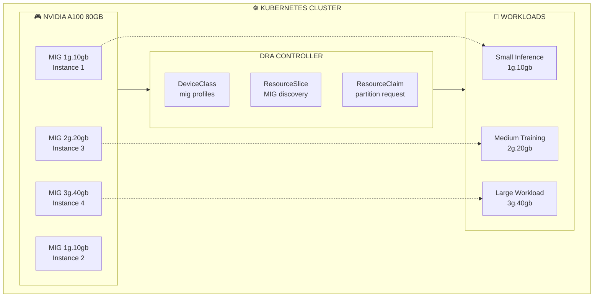

> 💡 **Quick Answer:** Partition A100/H100 GPUs using **MIG + DRA** for efficient resource sharing. Enable MIG mode on GPUs (`nvidia-smi mig -i 0 -cgi`), install NVIDIA DRA Driver, then create `ResourceClaim` requesting specific MIG profiles (e.g., `mig-1g.5gb`, `mig-3g.20gb`). DRA dynamically allocates appropriate slices.
>
> **Key benefit:** Run 7 isolated workloads on a single A100 by partitioning into `1g.5gb` slices—each with dedicated memory and compute.
>
> **Gotcha:** MIG profiles must be pre-configured on GPUs; not all workloads benefit from MIG—memory-intensive jobs need larger slices.

## The Problem

NVIDIA A100 and H100 GPUs are powerful but expensive. Running small workloads on a full GPU wastes resources. Multi-Instance GPU (MIG) technology can partition a single GPU into multiple isolated instances, but managing MIG slices in Kubernetes has been challenging.

## The Solution

Use DRA with NVIDIA's MIG support to dynamically allocate and manage GPU partitions. This enables efficient resource utilization by matching workload requirements to appropriately-sized GPU slices.

## MIG Architecture with DRA



## Step 1: Enable MIG Mode on GPUs

```bash
# Check if MIG is supported (requires A100, A30, or H100)
nvidia-smi -i 0 --query-gpu=mig.mode.current --format=csv

# Enable MIG mode (requires GPU reset)
sudo nvidia-smi -i 0 -mig 1

# Verify MIG mode is enabled
nvidia-smi mig -lgip
```

## Step 2: Configure MIG Profiles in DRA Config

```yaml
# mig-dra-config.yaml
apiVersion: v1
kind: ConfigMap
metadata:
  name: nvidia-dra-driver-config
  namespace: nvidia-dra-driver
data:
  config.yaml: |
    version: v1
    flags:
      migStrategy: "mixed"  # Allow both MIG and non-MIG
    sharing:
      mig:
        renameByDefault: true  # Rename devices to include profile
    mig:
      strategy: "mixed"  # single, mixed, or none
      devices:
        # A100 80GB partitioning configurations
        - model: "NVIDIA A100 80GB PCIe"
          profiles:
            - "1g.10gb"  # 7 instances possible
            - "2g.20gb"  # 3 instances possible
            - "3g.40gb"  # 2 instances possible
            - "7g.80gb"  # 1 instance (full GPU)
        # H100 partitioning configurations
        - model: "NVIDIA H100 80GB HBM3"
          profiles:
            - "1g.10gb"
            - "2g.20gb"
            - "3g.40gb"
            - "4g.40gb"
            - "7g.80gb"
```

```bash
kubectl apply -f mig-dra-config.yaml
kubectl rollout restart daemonset nvidia-dra-driver -n nvidia-dra-driver
```

## Step 3: Create MIG DeviceClasses

```yaml
# mig-device-classes.yaml
apiVersion: resource.k8s.io/v1
kind: DeviceClass
metadata:
  name: nvidia.com/mig-1g.10gb
spec:
  selectors:
  - cel:
      expression: 'device.driver == "nvidia.com/gpu" && device.attributes["nvidia.com/mig-profile"].stringValue == "1g.10gb"'
  suitableNodes:
    nodeSelectorTerms:
    - matchExpressions:
      - key: nvidia.com/mig.capable
        operator: In
        values: ["true"]
---
apiVersion: resource.k8s.io/v1
kind: DeviceClass
metadata:
  name: nvidia.com/mig-2g.20gb
spec:
  selectors:
  - cel:
      expression: 'device.driver == "nvidia.com/gpu" && device.attributes["nvidia.com/mig-profile"].stringValue == "2g.20gb"'
  suitableNodes:
    nodeSelectorTerms:
    - matchExpressions:
      - key: nvidia.com/mig.capable
        operator: In
        values: ["true"]
---
apiVersion: resource.k8s.io/v1
kind: DeviceClass
metadata:
  name: nvidia.com/mig-3g.40gb
spec:
  selectors:
  - cel:
      expression: 'device.driver == "nvidia.com/gpu" && device.attributes["nvidia.com/mig-profile"].stringValue == "3g.40gb"'
  suitableNodes:
    nodeSelectorTerms:
    - matchExpressions:
      - key: nvidia.com/mig.capable
        operator: In
        values: ["true"]
---
apiVersion: resource.k8s.io/v1
kind: DeviceClass
metadata:
  name: nvidia.com/mig-7g.80gb
spec:
  selectors:
  - cel:
      expression: 'device.driver == "nvidia.com/gpu" && device.attributes["nvidia.com/mig-profile"].stringValue == "7g.80gb"'
  suitableNodes:
    nodeSelectorTerms:
    - matchExpressions:
      - key: nvidia.com/mig.capable
        operator: In
        values: ["true"]
```

```bash
kubectl apply -f mig-device-classes.yaml
kubectl get deviceclass | grep mig
```

## Step 4: Create ResourceClaimTemplates for Each Profile

```yaml
# mig-claim-templates.yaml
apiVersion: resource.k8s.io/v1
kind: ResourceClaimTemplate
metadata:
  name: mig-small
  namespace: inference
spec:
  spec:
    devices:
      requests:
      - name: mig
        deviceClassName: nvidia.com/mig-1g.10gb
        count: 1
---
apiVersion: resource.k8s.io/v1
kind: ResourceClaimTemplate
metadata:
  name: mig-medium
  namespace: inference
spec:
  spec:
    devices:
      requests:
      - name: mig
        deviceClassName: nvidia.com/mig-2g.20gb
        count: 1
---
apiVersion: resource.k8s.io/v1
kind: ResourceClaimTemplate
metadata:
  name: mig-large
  namespace: inference
spec:
  spec:
    devices:
      requests:
      - name: mig
        deviceClassName: nvidia.com/mig-3g.40gb
        count: 1
---
apiVersion: resource.k8s.io/v1
kind: ResourceClaimTemplate
metadata:
  name: mig-full
  namespace: inference
spec:
  spec:
    devices:
      requests:
      - name: mig
        deviceClassName: nvidia.com/mig-7g.80gb
        count: 1
```

```bash
kubectl create namespace inference
kubectl apply -f mig-claim-templates.yaml
```

## Step 5: Deploy Workloads with MIG Slices

```yaml
# mig-inference-deployment.yaml
apiVersion: apps/v1
kind: Deployment
metadata:
  name: small-inference
  namespace: inference
spec:
  replicas: 7  # Can run 7 on a single A100 with 1g.10gb
  selector:
    matchLabels:
      app: small-inference
  template:
    metadata:
      labels:
        app: small-inference
    spec:
      containers:
      - name: inference
        image: nvcr.io/nvidia/tritonserver:24.01-py3
        args:
        - tritonserver
        - --model-repository=/models
        - --model-control-mode=explicit
        ports:
        - containerPort: 8000
          name: http
        - containerPort: 8001
          name: grpc
        resources:
          claims:
          - name: mig-claim
          requests:
            memory: "4Gi"
        volumeMounts:
        - name: models
          mountPath: /models
      volumes:
      - name: models
        persistentVolumeClaim:
          claimName: model-storage
      resourceClaims:
      - name: mig-claim
        resourceClaimTemplateName: mig-small
---
apiVersion: v1
kind: Service
metadata:
  name: small-inference
  namespace: inference
spec:
  selector:
    app: small-inference
  ports:
  - name: http
    port: 8000
  - name: grpc
    port: 8001
```

```bash
kubectl apply -f mig-inference-deployment.yaml
```

## Step 6: Mixed MIG Profile Workloads

```yaml
# mixed-mig-workloads.yaml
apiVersion: v1
kind: Pod
metadata:
  name: llm-inference-small
  namespace: inference
  labels:
    workload: inference
    model-size: small
spec:
  containers:
  - name: inference
    image: python:3.11
    command:
    - python
    - -c
    - |
      import torch
      print(f"CUDA available: {torch.cuda.is_available()}")
      print(f"Device count: {torch.cuda.device_count()}")
      print(f"Device name: {torch.cuda.get_device_name(0)}")
      print(f"Memory: {torch.cuda.get_device_properties(0).total_memory / 1e9:.1f} GB")
      # This should show ~10GB for 1g.10gb profile
    resources:
      claims:
      - name: mig
  resourceClaims:
  - name: mig
    resourceClaimTemplateName: mig-small
---
apiVersion: v1
kind: Pod
metadata:
  name: llm-inference-medium
  namespace: inference
  labels:
    workload: inference
    model-size: medium
spec:
  containers:
  - name: inference
    image: python:3.11
    command:
    - python
    - -c
    - |
      import torch
      print(f"Device name: {torch.cuda.get_device_name(0)}")
      print(f"Memory: {torch.cuda.get_device_properties(0).total_memory / 1e9:.1f} GB")
      # This should show ~20GB for 2g.20gb profile
    resources:
      claims:
      - name: mig
  resourceClaims:
  - name: mig
    resourceClaimTemplateName: mig-medium
---
apiVersion: v1
kind: Pod
metadata:
  name: training-job
  namespace: inference
  labels:
    workload: training
spec:
  containers:
  - name: trainer
    image: nvcr.io/nvidia/pytorch:24.01-py3
    command: [python, train.py]
    resources:
      claims:
      - name: mig
  resourceClaims:
  - name: mig
    resourceClaimTemplateName: mig-large
```

## Step 7: Dynamic MIG Reconfiguration

```yaml
# mig-controller.yaml
apiVersion: apps/v1
kind: Deployment
metadata:
  name: mig-controller
  namespace: nvidia-dra-driver
spec:
  replicas: 1
  selector:
    matchLabels:
      app: mig-controller
  template:
    metadata:
      labels:
        app: mig-controller
    spec:
      serviceAccountName: mig-controller
      containers:
      - name: controller
        image: nvcr.io/nvidia/k8s/mig-manager:0.6.0
        env:
        - name: CONFIG_FILE
          value: /config/mig-config.yaml
        volumeMounts:
        - name: config
          mountPath: /config
        securityContext:
          privileged: true
      volumes:
      - name: config
        configMap:
          name: mig-parted-config
---
apiVersion: v1
kind: ConfigMap
metadata:
  name: mig-parted-config
  namespace: nvidia-dra-driver
data:
  mig-config.yaml: |
    version: v1
    mig-configs:
      all-1g.10gb:
        - devices: all
          mig-enabled: true
          mig-devices:
            "1g.10gb": 7
      
      mixed-workload:
        - devices: all
          mig-enabled: true
          mig-devices:
            "1g.10gb": 2
            "2g.20gb": 1
            "3g.40gb": 1
      
      all-balanced:
        - devices: all
          mig-enabled: true
          mig-devices:
            "2g.20gb": 3
      
      training-optimized:
        - devices: all
          mig-enabled: true
          mig-devices:
            "7g.80gb": 1
```

## Step 8: MIG Profile Selection by Workload

```yaml
# intelligent-mig-selection.yaml
apiVersion: resource.k8s.io/v1
kind: ResourceClaimTemplate
metadata:
  name: auto-mig
  namespace: inference
spec:
  spec:
    devices:
      requests:
      - name: mig
        deviceClassName: nvidia.com/gpu
        allocationMode: ExactCount
        count: 1
        selectors:
        # Select smallest profile that meets memory requirement
        - cel:
            expression: >
              device.attributes["nvidia.com/mig-enabled"].boolValue == true &&
              device.attributes["nvidia.com/gpu-memory"].quantity >= quantity("10Gi")
---
apiVersion: v1
kind: Pod
metadata:
  name: auto-select-workload
  namespace: inference
  annotations:
    gpu.memory.required: "15Gi"
spec:
  containers:
  - name: workload
    image: nvcr.io/nvidia/pytorch:24.01-py3
    command:
    - python
    - -c
    - |
      import torch
      import os
      required = os.environ.get('REQUIRED_MEMORY', '10')
      available = torch.cuda.get_device_properties(0).total_memory / 1e9
      print(f"Required: {required}GB, Available: {available:.1f}GB")
      assert available >= float(required), "Insufficient GPU memory"
    env:
    - name: REQUIRED_MEMORY
      value: "15"
    resources:
      claims:
      - name: mig
  resourceClaims:
  - name: mig
    resourceClaimTemplateName: auto-mig
```

## Step 9: Monitor MIG Usage

```bash
# View MIG instances on node
nvidia-smi mig -lgi

# List MIG compute instances
nvidia-smi mig -lci

# View memory allocation per MIG instance
nvidia-smi -L

# Monitor MIG utilization
watch -n1 "nvidia-smi mig -lgip && echo '---' && nvidia-smi"

# Check DRA resource claims for MIG
kubectl get resourceclaims -A -o wide

# View allocated MIG profiles
kubectl get resourceclaims -A -o jsonpath='{range .items[*]}{.metadata.name}{"\t"}{.spec.devices.requests[*].deviceClassName}{"\n"}{end}'
```

## MIG Profile Sizes Reference

| Profile | GPU Slices | Memory | Compute Units | Max Instances (A100 80GB) |
|---------|-----------|--------|---------------|---------------------------|
| 1g.10gb | 1/7 | 10GB | 1 SM | 7 |
| 2g.20gb | 2/7 | 20GB | 2 SM | 3 |
| 3g.40gb | 3/7 | 40GB | 3 SM | 2 |
| 4g.40gb | 4/7 | 40GB | 4 SM | 1 (H100 only) |
| 7g.80gb | 7/7 | 80GB | 7 SM | 1 |

## Troubleshooting

### MIG devices not appearing

```bash
# Check MIG mode status
nvidia-smi -i 0 --query-gpu=mig.mode.current --format=csv

# Create MIG instances manually
sudo nvidia-smi mig -cgi 9,9,9,9,9,9,9 -i 0  # 7x 1g.10gb
sudo nvidia-smi mig -cci -i 0

# Restart DRA driver to rediscover
kubectl rollout restart daemonset nvidia-dra-driver -n nvidia-dra-driver
```

### Profile allocation fails

```bash
# Check available profiles
nvidia-smi mig -lgip

# View resource slices
kubectl get resourceslices -o yaml | grep -A20 "nvidia.com/mig"

# Check node labels
kubectl get nodes -L nvidia.com/mig.capable,nvidia.com/mig.config
```

## Best Practices

| Practice | Description |
|----------|-------------|
| **Right-size profiles** | Match profile to workload memory requirements |
| **Use mixed strategy** | Combine different profiles for diverse workloads |
| **Monitor utilization** | Track MIG slice usage to optimize partitioning |
| **Plan for isolation** | MIG provides memory and fault isolation between instances |
| **Consider reconfiguration** | Use mig-manager for dynamic profile changes |

## Summary

MIG with DRA enables efficient GPU utilization by partitioning expensive A100/H100 GPUs into smaller isolated instances. This allows running multiple small inference workloads on a single GPU while maintaining isolation, or dynamically reconfiguring partitions based on workload requirements.

---

## 📘 Go Further with Kubernetes Recipes

**Love this recipe? There's so much more!** This is just one of **100+ hands-on recipes** in our comprehensive **[Kubernetes Recipes book](https://amzn.to/3DzC8QA)**.

Inside the book, you'll master:
- ✅ Production-ready deployment strategies
- ✅ Advanced networking and security patterns  
- ✅ Observability, monitoring, and troubleshooting
- ✅ Real-world best practices from industry experts

> *"The practical, recipe-based approach made complex Kubernetes concepts finally click for me."*

**👉 [Get Your Copy Now](https://amzn.to/3DzC8QA)** — Start building production-grade Kubernetes skills today!
