## The Problem

Modern AI/ML pipelines often require different accelerator types for different stages: GPUs for training, TPUs for large-scale inference, FPGAs for low-latency serving, and custom ASICs for specific operations. Managing this heterogeneous infrastructure in Kubernetes is complex.

## The Solution

Use Kubernetes DRA to orchestrate mixed accelerator workloads with flexible allocation, enabling pipelines that span multiple accelerator types with unified resource management.

## Heterogeneous Accelerator Architecture

```mermaid
flowchart TB
    subgraph cluster["☸️ KUBERNETES CLUSTER"]
        subgraph accel["🚀 ACCELERATOR TYPES"]
            direction LR
            GPU["🎮 NVIDIA GPU<br/>Training, General"]
            TPU["🧠 Google TPU<br/>Large Models"]
            FPGA["⚡ Intel FPGA<br/>Low Latency"]
            ASIC["🔷 Custom ASIC<br/>Specialized Ops"]
        end
        
        subgraph dra["DRA UNIFIED MANAGEMENT"]
            DC["DeviceClass<br/>per accelerator"]
            RC["ResourceClaim<br/>flexible allocation"]
            RS["ResourceSlice<br/>discovery"]
        end
        
        subgraph pipeline["ML PIPELINE"]
            P1["Preprocess<br/>CPU"]
            P2["Train<br/>GPU"]
            P3["Optimize<br/>TPU"]
            P4["Serve<br/>FPGA"]
        end
    end
    
    accel --> dra
    dra --> pipeline
    P1 --> P2 --> P3 --> P4
```



## Step 1: Configure Multiple DeviceClasses

```yaml
# device-classes.yaml
apiVersion: resource.k8s.io/v1
kind: DeviceClass
metadata:
  name: nvidia.com/gpu
spec:
  selectors:
  - cel:
      expression: 'device.driver == "nvidia.com/gpu"'
  suitableNodes:
    nodeSelectorTerms:
    - matchExpressions:
      - key: accelerator/nvidia-gpu
        operator: Exists
---
apiVersion: resource.k8s.io/v1
kind: DeviceClass
metadata:
  name: google.com/tpu
spec:
  selectors:
  - cel:
      expression: 'device.driver == "google.com/tpu"'
  suitableNodes:
    nodeSelectorTerms:
    - matchExpressions:
      - key: cloud.google.com/gke-tpu-accelerator
        operator: Exists
---
apiVersion: resource.k8s.io/v1
kind: DeviceClass
metadata:
  name: intel.com/fpga
spec:
  selectors:
  - cel:
      expression: 'device.driver == "intel.com/fpga"'
  suitableNodes:
    nodeSelectorTerms:
    - matchExpressions:
      - key: accelerator/intel-fpga
        operator: Exists
---
apiVersion: resource.k8s.io/v1
kind: DeviceClass
metadata:
  name: habana.ai/gaudi
spec:
  selectors:
  - cel:
      expression: 'device.driver == "habana.ai/gaudi"'
  suitableNodes:
    nodeSelectorTerms:
    - matchExpressions:
      - key: accelerator/habana-gaudi
        operator: Exists
```

```bash
kubectl apply -f device-classes.yaml
kubectl get deviceclass
```

## Step 2: Create ResourceClaimTemplates for Each Accelerator

```yaml
# accelerator-templates.yaml
apiVersion: resource.k8s.io/v1
kind: ResourceClaimTemplate
metadata:
  name: gpu-training-template
  namespace: ml-pipeline
spec:
  spec:
    devices:
      requests:
      - name: gpu
        deviceClassName: nvidia.com/gpu
        count: 4
        selectors:
        - cel:
            expression: 'device.attributes["nvidia.com/gpu-memory"].quantity >= quantity("40Gi")'
---
apiVersion: resource.k8s.io/v1
kind: ResourceClaimTemplate
metadata:
  name: tpu-inference-template
  namespace: ml-pipeline
spec:
  spec:
    devices:
      requests:
      - name: tpu
        deviceClassName: google.com/tpu
        count: 8
---
apiVersion: resource.k8s.io/v1
kind: ResourceClaimTemplate
metadata:
  name: fpga-serving-template
  namespace: ml-pipeline
spec:
  spec:
    devices:
      requests:
      - name: fpga
        deviceClassName: intel.com/fpga
        count: 1
        selectors:
        - cel:
            expression: 'device.attributes["intel.com/fpga-family"].stringValue == "Agilex"'
---
apiVersion: resource.k8s.io/v1
kind: ResourceClaimTemplate
metadata:
  name: gaudi-template
  namespace: ml-pipeline
spec:
  spec:
    devices:
      requests:
      - name: gaudi
        deviceClassName: habana.ai/gaudi
        count: 8
```

```bash
kubectl create namespace ml-pipeline
kubectl apply -f accelerator-templates.yaml
```

## Step 3: Multi-Stage Pipeline with Different Accelerators

```yaml
# ml-pipeline.yaml
apiVersion: argoproj.io/v1alpha1
kind: Workflow
metadata:
  name: multi-accelerator-pipeline
  namespace: ml-pipeline
spec:
  entrypoint: ml-pipeline
  templates:
  - name: ml-pipeline
    dag:
      tasks:
      - name: preprocess
        template: preprocess-template
      - name: train-gpu
        template: gpu-training
        dependencies: [preprocess]
      - name: optimize-tpu
        template: tpu-optimization
        dependencies: [train-gpu]
      - name: serve-fpga
        template: fpga-serving
        dependencies: [optimize-tpu]

  - name: preprocess-template
    container:
      image: python:3.11
      command: [python, preprocess.py]
      resources:
        requests:
          cpu: "4"
          memory: "16Gi"

  - name: gpu-training
    podSpecPatch: |
      resourceClaims:
      - name: gpu-claim
        resourceClaimTemplateName: gpu-training-template
    container:
      image: nvcr.io/nvidia/pytorch:24.01-py3
      command: [python, train.py]
      resources:
        claims:
        - name: gpu-claim

  - name: tpu-optimization
    podSpecPatch: |
      resourceClaims:
      - name: tpu-claim
        resourceClaimTemplateName: tpu-inference-template
    container:
      image: gcr.io/cloud-tpu-images/jax:latest
      command: [python, optimize.py]
      resources:
        claims:
        - name: tpu-claim

  - name: fpga-serving
    podSpecPatch: |
      resourceClaims:
      - name: fpga-claim
        resourceClaimTemplateName: fpga-serving-template
    container:
      image: intel/fpga-inference:latest
      command: [./serve]
      resources:
        claims:
        - name: fpga-claim
```

## Step 4: Hybrid GPU+CPU Inference Pod

```yaml
# hybrid-inference.yaml
apiVersion: v1
kind: Pod
metadata:
  name: hybrid-inference
  namespace: ml-pipeline
spec:
  containers:
  # GPU container for heavy inference
  - name: gpu-inference
    image: nvcr.io/nvidia/tritonserver:24.01-py3
    args: ["tritonserver", "--model-repository=/models"]
    ports:
    - containerPort: 8000
    resources:
      claims:
      - name: gpu
      requests:
        memory: "16Gi"
  
  # CPU container for preprocessing
  - name: preprocessor
    image: python:3.11
    command: [python, -m, http.server, "8080"]
    resources:
      requests:
        cpu: "4"
        memory: "8Gi"
  
  # Optional FPGA sidecar for specific ops
  - name: fpga-accelerator
    image: intel/openvino:latest
    resources:
      claims:
      - name: fpga
    
  resourceClaims:
  - name: gpu
    resourceClaimTemplateName: gpu-training-template
  - name: fpga
    resourceClaimTemplateName: fpga-serving-template
```

## Step 5: Accelerator Preference with Fallback

```yaml
# flexible-training.yaml
apiVersion: resource.k8s.io/v1
kind: ResourceClaimTemplate
metadata:
  name: flexible-accelerator
  namespace: ml-pipeline
spec:
  spec:
    devices:
      requests:
      # Primary: NVIDIA A100
      - name: primary-gpu
        deviceClassName: nvidia.com/gpu
        count: 1
        selectors:
        - cel:
            expression: 'device.attributes["nvidia.com/gpu-product"].stringValue.contains("A100")'
      # Alternative: Any NVIDIA GPU with 24GB+
      - name: fallback-gpu
        deviceClassName: nvidia.com/gpu
        count: 1
        selectors:
        - cel:
            expression: 'device.attributes["nvidia.com/gpu-memory"].quantity >= quantity("24Gi")'
      # Match either
      constraints:
      - requests: ["primary-gpu", "fallback-gpu"]
        anyOf: true
```

## Step 6: Intel Gaudi2 Workloads

```yaml
# gaudi-training.yaml
apiVersion: v1
kind: Pod
metadata:
  name: gaudi-llm-training
  namespace: ml-pipeline
spec:
  containers:
  - name: trainer
    image: vault.habana.ai/gaudi-docker/1.14.0/ubuntu22.04/habanalabs/pytorch-installer-2.1.1:latest
    command:
    - python
    - -c
    - |
      import habana_frameworks.torch as htorch
      import torch
      
      # Initialize HPU
      device = torch.device('hpu')
      print(f"Using device: {device}")
      
      # Simple computation
      x = torch.randn(1000, 1000, device=device)
      y = torch.matmul(x, x)
      print(f"Result shape: {y.shape}")
    env:
    - name: HABANA_VISIBLE_DEVICES
      value: "all"
    resources:
      claims:
      - name: gaudi-claim
  resourceClaims:
  - name: gaudi-claim
    resourceClaimTemplateName: gaudi-template
  nodeSelector:
    accelerator/habana-gaudi: "true"
```

## Step 7: AWS Inferentia/Trainium

```yaml
# aws-accelerator-templates.yaml
apiVersion: resource.k8s.io/v1
kind: DeviceClass
metadata:
  name: aws.amazon.com/neuron
spec:
  selectors:
  - cel:
      expression: 'device.driver == "aws.amazon.com/neuron"'
  suitableNodes:
    nodeSelectorTerms:
    - matchExpressions:
      - key: node.kubernetes.io/instance-type
        operator: In
        values: ["inf2.xlarge", "inf2.8xlarge", "trn1.32xlarge"]
---
apiVersion: resource.k8s.io/v1
kind: ResourceClaimTemplate
metadata:
  name: inferentia-template
  namespace: ml-pipeline
spec:
  spec:
    devices:
      requests:
      - name: neuron
        deviceClassName: aws.amazon.com/neuron
        count: 2  # 2 Neuron cores
---
apiVersion: v1
kind: Pod
metadata:
  name: inferentia-inference
  namespace: ml-pipeline
spec:
  containers:
  - name: inference
    image: 763104351884.dkr.ecr.us-east-1.amazonaws.com/pytorch-inference-neuronx:2.1.2-neuronx-py310-sdk2.18.0-ubuntu20.04
    command:
    - python
    - serve.py
    env:
    - name: NEURON_RT_VISIBLE_CORES
      value: "0,1"
    resources:
      claims:
      - name: neuron-claim
  resourceClaims:
  - name: neuron-claim
    resourceClaimTemplateName: inferentia-template
```

## Step 8: AMD GPU Support

```yaml
# amd-gpu-template.yaml
apiVersion: resource.k8s.io/v1
kind: DeviceClass
metadata:
  name: amd.com/gpu
spec:
  selectors:
  - cel:
      expression: 'device.driver == "amd.com/gpu"'
  suitableNodes:
    nodeSelectorTerms:
    - matchExpressions:
      - key: accelerator/amd-gpu
        operator: Exists
---
apiVersion: resource.k8s.io/v1
kind: ResourceClaimTemplate
metadata:
  name: amd-mi300-template
  namespace: ml-pipeline
spec:
  spec:
    devices:
      requests:
      - name: gpu
        deviceClassName: amd.com/gpu
        count: 8
        selectors:
        - cel:
            expression: 'device.attributes["amd.com/gpu-product"].stringValue.contains("MI300")'
---
apiVersion: v1
kind: Pod
metadata:
  name: rocm-training
  namespace: ml-pipeline
spec:
  containers:
  - name: trainer
    image: rocm/pytorch:latest
    command: [python, train.py]
    env:
    - name: HIP_VISIBLE_DEVICES
      value: "0,1,2,3,4,5,6,7"
    resources:
      claims:
      - name: amd-gpu
  resourceClaims:
  - name: amd-gpu
    resourceClaimTemplateName: amd-mi300-template
```

## Step 9: Monitor Heterogeneous Workloads

```bash
# View all resource claims by accelerator type
kubectl get resourceclaims -A -o custom-columns=\
'NAME:.metadata.name,NAMESPACE:.metadata.namespace,DEVICE_CLASS:.spec.devices.requests[0].deviceClassName,STATUS:.status.allocation'

# Monitor accelerator utilization
# NVIDIA
kubectl exec -it <gpu-pod> -- nvidia-smi

# Intel Gaudi
kubectl exec -it <gaudi-pod> -- hl-smi

# AWS Neuron
kubectl exec -it <neuron-pod> -- neuron-ls

# AMD
kubectl exec -it <amd-pod> -- rocm-smi

# Create unified dashboard
kubectl apply -f - <<EOF
apiVersion: v1
kind: ConfigMap
metadata:
  name: accelerator-dashboard
  namespace: monitoring
data:
  dashboard.json: |
    {
      "panels": [
        {"title": "GPU Utilization", "targets": [{"expr": "nvidia_gpu_utilization"}]},
        {"title": "TPU Usage", "targets": [{"expr": "tpu_duty_cycle"}]},
        {"title": "Gaudi Memory", "targets": [{"expr": "habana_memory_used"}]}
      ]
    }
EOF
```

## Best Practices

| Practice | Description |
|----------|-------------|
| **Match accelerator to task** | Use GPUs for training, TPUs for large inference, FPGAs for latency-critical |
| **Use fallback configurations** | Define alternative accelerators for flexibility |
| **Separate claim templates** | One template per accelerator type for clarity |
| **Monitor utilization** | Track usage to optimize allocation |
| **Cost optimization** | Use preemptible/spot instances where appropriate |

## Summary

DRA enables unified management of heterogeneous accelerator workloads in Kubernetes. By using DeviceClasses and ResourceClaimTemplates, you can build flexible ML pipelines that leverage the best accelerator for each stage while maintaining consistent resource management.

---

## 📘 Go Further with Kubernetes Recipes

**Love this recipe? There's so much more!** This is just one of **100+ hands-on recipes** in our comprehensive **[Kubernetes Recipes book](https://amzn.to/3DzC8QA)**.

Inside the book, you'll master:
- ✅ Production-ready deployment strategies
- ✅ Advanced networking and security patterns  
- ✅ Observability, monitoring, and troubleshooting
- ✅ Real-world best practices from industry experts

> *"The practical, recipe-based approach made complex Kubernetes concepts finally click for me."*

**👉 [Get Your Copy Now](https://amzn.to/3DzC8QA)** — Start building production-grade Kubernetes skills today!
