> 💡 **Quick Answer:** Allocate TPUs on GKE using **DRA** for flexible topology-aware scheduling. Create `ResourceClaim` specifying TPU type (v4, v5e, v5p) and slice size. DRA handles multi-slice allocation for distributed training with JAX/TensorFlow, ensuring proper TPU topology and ICI connectivity.
>
> **Key config:** Request TPU slices via `ResourceClaim` with `spec.devices.requests[].deviceClassName: tpu-v5e` and desired topology.
>
> **Gotcha:** TPU pods require `hostNetwork: true` for ICI (Inter-Chip Interconnect); ensure quota and node pool availability in your GKE cluster.

## The Problem

Google Cloud TPUs offer exceptional performance for machine learning workloads, but allocating and managing TPUs in Kubernetes requires understanding complex topologies, multi-slice configurations, and efficient resource sharing. Traditional approaches lack flexibility.

## The Solution

Use Dynamic Resource Allocation (DRA) on GKE to flexibly allocate TPUs with support for multi-slice training, topology-aware placement, and efficient resource sharing between workloads.

## Understanding TPU Architecture

```mermaid
flowchart TB
    subgraph tpu["🧠 TPU ARCHITECTURE"]
        direction TB
        
        subgraph types["TPU Types"]
            V4["TPU v4<br/>BF16, 275 TFLOPS"]
            V5E["TPU v5e<br/>Cost-optimized"]
            V5P["TPU v5p<br/>High performance"]
        end
        
        subgraph topology["Topology"]
            T1["Single Host<br/>1 TPU chip"]
            T2["Multi-Host<br/>Pod slice"]
            T3["Full Pod<br/>4096 chips"]
        end
        
        subgraph dra["DRA Benefits"]
            D1["✅ Flexible allocation"]
            D2["✅ Topology-aware"]
            D3["✅ Multi-slice support"]
            D4["✅ Resource sharing"]
        end
    end
    
    types --> topology --> dra
```



## Step 1: Create GKE Cluster with TPU Support

```bash
# Create cluster with DRA enabled
gcloud container clusters create tpu-dra-cluster \
  --zone=us-central2-b \
  --release-channel=rapid \
  --cluster-version=1.32 \
  --enable-dynamic-resource-allocation \
  --machine-type=n2-standard-8 \
  --num-nodes=3

# Add TPU v5e node pool
gcloud container node-pools create tpu-v5e-pool \
  --cluster=tpu-dra-cluster \
  --zone=us-central2-b \
  --machine-type=ct5lp-hightpu-4t \
  --tpu-topology=2x4 \
  --num-nodes=1 \
  --enable-autoscaling \
  --min-nodes=0 \
  --max-nodes=4
```

## Step 2: Install TPU DRA Driver

```bash
# Apply TPU device plugin with DRA support
kubectl apply -f https://raw.githubusercontent.com/GoogleCloudPlatform/container-engine-accelerators/master/cmd/nvidia_gpu/device-plugin.yaml

# For TPU-specific DRA driver (when available)
kubectl apply -f - <<EOF
apiVersion: v1
kind: Namespace
metadata:
  name: tpu-dra-system
---
apiVersion: apps/v1
kind: DaemonSet
metadata:
  name: tpu-dra-driver
  namespace: tpu-dra-system
spec:
  selector:
    matchLabels:
      app: tpu-dra-driver
  template:
    metadata:
      labels:
        app: tpu-dra-driver
    spec:
      nodeSelector:
        cloud.google.com/gke-tpu-accelerator: "true"
      containers:
      - name: driver
        image: gcr.io/cloud-tpu-images/tpu-dra-driver:latest
        securityContext:
          privileged: true
        volumeMounts:
        - name: device-dir
          mountPath: /dev
      volumes:
      - name: device-dir
        hostPath:
          path: /dev
EOF
```

## Step 3: Create TPU DeviceClass

```yaml
# tpu-device-class.yaml
apiVersion: resource.k8s.io/v1
kind: DeviceClass
metadata:
  name: google.com/tpu
spec:
  selectors:
  - cel:
      expression: 'device.driver == "google.com/tpu"'
  suitableNodes:
    nodeSelectorTerms:
    - matchExpressions:
      - key: cloud.google.com/gke-tpu-accelerator
        operator: Exists
```

```bash
kubectl apply -f tpu-device-class.yaml
```

## Step 4: Create TPU ResourceClaimTemplate

```yaml
# tpu-claim-template.yaml
apiVersion: resource.k8s.io/v1
kind: ResourceClaimTemplate
metadata:
  name: tpu-v5e-template
  namespace: ml-training
spec:
  spec:
    devices:
      requests:
      - name: tpu
        deviceClassName: google.com/tpu
        count: 4  # 4 TPU chips
      config:
      - requests: ["tpu"]
        opaque:
          driver: google.com/tpu
          parameters:
            acceleratorType: "tpu-v5-lite-podslice"
            topology: "2x4"
```

```bash
kubectl create namespace ml-training
kubectl apply -f tpu-claim-template.yaml
```

## Step 5: Deploy JAX Workload on TPU

```yaml
# jax-tpu-training.yaml
apiVersion: v1
kind: Pod
metadata:
  name: jax-tpu-training
  namespace: ml-training
spec:
  containers:
  - name: trainer
    image: gcr.io/cloud-tpu-images/jax:latest
    command:
    - python
    - -c
    - |
      import jax
      print(f"JAX devices: {jax.devices()}")
      print(f"Number of TPU cores: {jax.device_count()}")
      
      # Simple computation on TPU
      import jax.numpy as jnp
      x = jnp.ones((1000, 1000))
      y = jnp.dot(x, x)
      print(f"Computation result shape: {y.shape}")
    env:
    - name: TPU_CHIPS_PER_HOST_BOUNDS
      value: "2,2,1"
    - name: TPU_HOST_BOUNDS
      value: "1,1,1"
    resources:
      claims:
      - name: tpu-claim
  resourceClaims:
  - name: tpu-claim
    resourceClaimTemplateName: tpu-v5e-template
  nodeSelector:
    cloud.google.com/gke-tpu-accelerator: "tpu-v5-lite-podslice"
```

```bash
kubectl apply -f jax-tpu-training.yaml

# Check training logs
kubectl logs -f jax-tpu-training -n ml-training
```

## Step 6: Multi-Slice TPU Training with JobSet

```yaml
# multi-slice-training.yaml
apiVersion: jobset.x-k8s.io/v1alpha2
kind: JobSet
metadata:
  name: llm-multi-slice-training
  namespace: ml-training
spec:
  replicatedJobs:
  - name: slice
    replicas: 4  # 4 TPU slices
    template:
      spec:
        parallelism: 1
        completions: 1
        template:
          spec:
            containers:
            - name: trainer
              image: gcr.io/my-project/llm-trainer:latest
              command:
              - python
              - train.py
              - --num_slices=4
              - --slice_id=$(JOB_COMPLETION_INDEX)
              env:
              - name: JAX_COORDINATOR_ADDRESS
                value: "$(LLM_MULTI_SLICE_TRAINING_SLICE_0_0_HOSTNAME):1234"
              - name: TPU_WORKER_HOSTNAMES
                value: "$(LLM_MULTI_SLICE_TRAINING_SLICE_0_0_HOSTNAME),$(LLM_MULTI_SLICE_TRAINING_SLICE_1_0_HOSTNAME)"
              ports:
              - containerPort: 1234
                name: coordinator
              resources:
                claims:
                - name: tpu
            resourceClaims:
            - name: tpu
              resourceClaimTemplateName: tpu-v5e-template
            restartPolicy: Never
```

## Step 7: TensorFlow on TPU with DRA

```yaml
# tensorflow-tpu.yaml
apiVersion: v1
kind: Pod
metadata:
  name: tensorflow-tpu-training
  namespace: ml-training
spec:
  containers:
  - name: trainer
    image: gcr.io/cloud-tpu-images/tensorflow:latest
    command:
    - python
    - -c
    - |
      import tensorflow as tf
      
      # Initialize TPU
      resolver = tf.distribute.cluster_resolver.TPUClusterResolver()
      tf.config.experimental_connect_to_cluster(resolver)
      tf.tpu.experimental.initialize_tpu_system(resolver)
      
      strategy = tf.distribute.TPUStrategy(resolver)
      print(f"Number of replicas: {strategy.num_replicas_in_sync}")
      
      # Training loop
      with strategy.scope():
          model = tf.keras.Sequential([
              tf.keras.layers.Dense(128, activation='relu'),
              tf.keras.layers.Dense(10)
          ])
          model.compile(optimizer='adam', loss='mse')
    resources:
      claims:
      - name: tpu
  resourceClaims:
  - name: tpu
    resourceClaimTemplateName: tpu-v5e-template
```

## Step 8: TPU Topology Selection

Different topologies for different workload sizes:

```yaml
# small-tpu-template.yaml (Single host)
apiVersion: resource.k8s.io/v1
kind: ResourceClaimTemplate
metadata:
  name: tpu-single-host
  namespace: ml-training
spec:
  spec:
    devices:
      requests:
      - name: tpu
        deviceClassName: google.com/tpu
        count: 4
        selectors:
        - cel:
            expression: 'device.attributes["google.com/tpu-topology"].stringValue == "2x2"'
---
# large-tpu-template.yaml (Multi-host pod slice)
apiVersion: resource.k8s.io/v1
kind: ResourceClaimTemplate
metadata:
  name: tpu-pod-slice
  namespace: ml-training
spec:
  spec:
    devices:
      requests:
      - name: tpu
        deviceClassName: google.com/tpu
        count: 16
        selectors:
        - cel:
            expression: 'device.attributes["google.com/tpu-topology"].stringValue == "4x4"'
      constraints:
      - requests: ["tpu"]
        matchAttribute: "google.com/tpu-accelerator-type"
```

## Step 9: Monitor TPU Workloads

```bash
# Check TPU resource claims
kubectl get resourceclaims -n ml-training

# View TPU node utilization
kubectl top nodes -l cloud.google.com/gke-tpu-accelerator

# TPU-specific metrics (via Cloud Monitoring)
gcloud monitoring dashboards create \
  --config-from-file=tpu-dashboard.json

# Check TPU profiler
kubectl exec -it jax-tpu-training -n ml-training -- \
  python -c "import jax; jax.profiler.start_server(9999)"
```

## Troubleshooting

### TPU Not Detected

```bash
# Verify TPU node pool
gcloud container node-pools describe tpu-v5e-pool \
  --cluster=tpu-dra-cluster --zone=us-central2-b

# Check TPU device visibility
kubectl exec -it <pod> -- ls /dev/accel*

# Verify TPU runtime
kubectl exec -it <pod> -- python -c "import jax; print(jax.devices())"
```

### Multi-Slice Coordination Failures

```bash
# Check coordinator connectivity
kubectl exec -it <pod> -- nc -zv <coordinator-hostname> 1234

# Verify TPU_WORKER_HOSTNAMES
kubectl exec -it <pod> -- env | grep TPU

# Check NCCL/PJRT logs
kubectl logs <pod> | grep -i "pjrt\|coordinator"
```

## Best Practices

1. **Match topology to workload** - Use larger topologies for distributed training
2. **Pre-provision TPU nodes** - TPU node creation takes several minutes
3. **Use Spot/Preemptible TPUs** for cost savings on fault-tolerant workloads
4. **Configure proper checkpointing** - TPU pods can be preempted
5. **Monitor TPU utilization** via Cloud Monitoring dashboards

## Summary

DRA on GKE enables flexible TPU allocation with support for different topologies, multi-slice configurations, and efficient resource management. This approach simplifies running large-scale ML training workloads on TPU infrastructure.

---

## 📘 Go Further with Kubernetes Recipes

**Love this recipe? There's so much more!** This is just one of **100+ hands-on recipes** in our comprehensive **[Kubernetes Recipes book](https://amzn.to/3DzC8QA)**.

Inside the book, you'll master:
- ✅ Production-ready deployment strategies
- ✅ Advanced networking and security patterns  
- ✅ Observability, monitoring, and troubleshooting
- ✅ Real-world best practices from industry experts

> *"The practical, recipe-based approach made complex Kubernetes concepts finally click for me."*

**👉 [Get Your Copy Now](https://amzn.to/3DzC8QA)** — Start building production-grade Kubernetes skills today!
