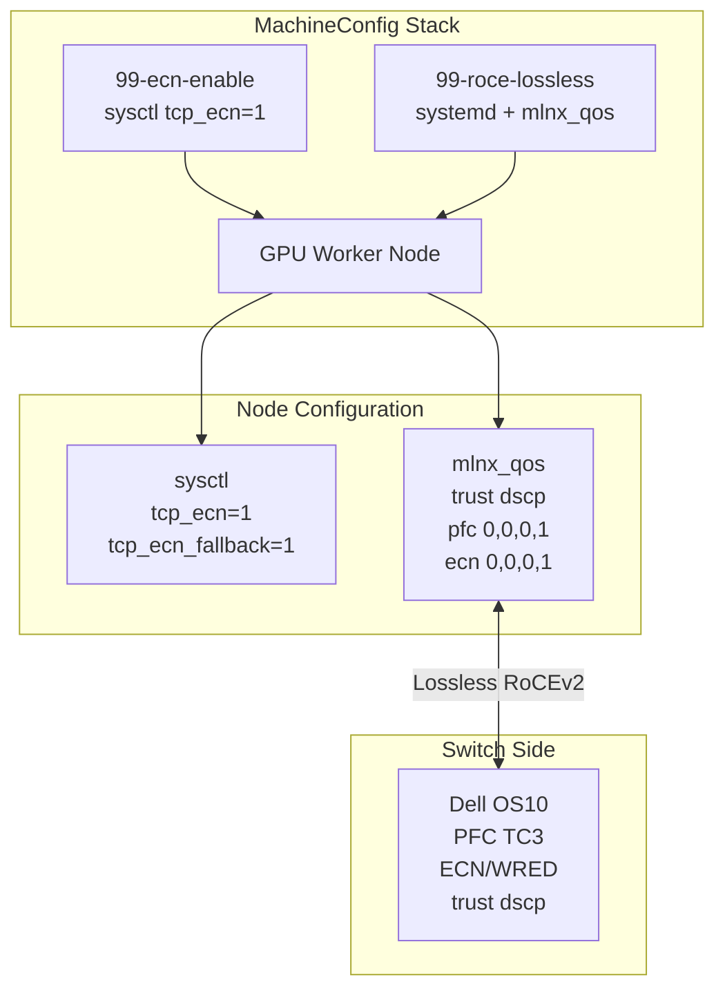

> 💡 **Quick Answer:** Create a MachineConfig with `99-ecn-enable` that sets `net.ipv4.tcp_ecn=1` via sysctl to enable ECN negotiation on OpenShift nodes. For RoCEv2 RDMA, also configure Mellanox NIC ECN parameters via `mlnx_qos` or NetworkManager dispatcher scripts.

## The Problem

ECN (Explicit Congestion Notification) allows switches to signal congestion to endpoints without dropping packets. For RoCEv2 RDMA workloads:
- Without ECN, congestion triggers PFC pause frames which halt ALL traffic on the link
- With ECN, the NIC receives congestion signals and reduces its sending rate proactively
- ECN operates at microsecond granularity vs PFC's nanosecond emergency braking
- Together, ECN + PFC provide a two-tier lossless fabric: ECN prevents congestion, PFC prevents drops

Linux kernels have ECN disabled by default (`tcp_ecn=2` = negotiate only if requested). For RDMA nodes, you must enable it explicitly.

## The Solution

### MachineConfig for ECN Sysctl

```yaml
apiVersion: machineconfiguration.openshift.io/v1
kind: MachineConfig
metadata:
  labels:
    machineconfiguration.openshift.io/role: worker
  name: 99-ecn-enable
spec:
  config:
    ignition:
      version: 3.4.0
    storage:
      files:
        - path: /etc/sysctl.d/99-ecn.conf
          mode: 0644
          overwrite: true
          contents:
            source: data:text/plain;charset=utf-8;base64,IyBFbmFibGUgRUNOIG5lZ290aWF0aW9uIGZvciBSb0NFdjIgUkRNQQojIDAgPSBkaXNhYmxlZCwgMSA9IGVuYWJsZSwgMiA9IG5lZ290aWF0ZS1vbmx5CiMgU2V0IHRvIDEgZm9yIEdQVSBub2RlcyB3aXRoIFJETUEgbmV0d29ya2luZwpuZXQuaXB2NC50Y3BfZWNuPTEKbmV0LmlwdjQudGNwX2Vjbl9mYWxsYmFjaz0xCg==
```

The base64 content decodes to:
```
# Enable ECN negotiation for RoCEv2 RDMA
# 0 = disabled, 1 = enable, 2 = negotiate-only
# Set to 1 for GPU nodes with RDMA networking
net.ipv4.tcp_ecn=1
net.ipv4.tcp_ecn_fallback=1
```

Generate the base64 yourself:
```bash
cat <<'EOF' | base64 -w0
# Enable ECN negotiation for RoCEv2 RDMA
# 0 = disabled, 1 = enable, 2 = negotiate-only
# Set to 1 for GPU nodes with RDMA networking
net.ipv4.tcp_ecn=1
net.ipv4.tcp_ecn_fallback=1
EOF
```

### Target GPU Nodes Only with MCP

If only GPU workers need ECN, create a dedicated MachineConfigPool:

```yaml
apiVersion: machineconfiguration.openshift.io/v1
kind: MachineConfigPool
metadata:
  name: gpu-worker
spec:
  machineConfigSelector:
    matchExpressions:
      - key: machineconfiguration.openshift.io/role
        operator: In
        values: [worker, gpu-worker]
  nodeSelector:
    matchLabels:
      node-role.kubernetes.io/gpu-worker: ""
```

Then label the MachineConfig for `gpu-worker`:
```yaml
metadata:
  labels:
    machineconfiguration.openshift.io/role: gpu-worker
  name: 99-ecn-enable
```

### Mellanox NIC ECN Configuration

Kernel sysctl enables ECN at the TCP/IP level. For RoCEv2, the Mellanox NIC also needs ECN configuration:

```yaml
apiVersion: machineconfiguration.openshift.io/v1
kind: MachineConfig
metadata:
  labels:
    machineconfiguration.openshift.io/role: gpu-worker
  name: 99-mlnx-ecn-config
spec:
  config:
    ignition:
      version: 3.4.0
    storage:
      files:
        - path: /etc/NetworkManager/dispatcher.d/99-mlnx-ecn.sh
          mode: 0755
          overwrite: true
          contents:
            source: data:text/plain;charset=utf-8,#!/bin/bash%0A%23 Configure Mellanox NIC ECN parameters for RoCEv2%0A%23 Runs on interface up events%0A%0AINTERFACE=%241%0AACTION=%242%0A%0Aif [ "%24ACTION" != "up" ]; then exit 0; fi%0A%0A%23 Only configure RDMA-capable interfaces%0Acase %24INTERFACE in%0A  ens*f0|ens*f1|enp*)%0A    %23 Enable ECN on the NIC (if mlnx_qos available)%0A    if command -v mlnx_qos %26>/dev/null; then%0A      mlnx_qos -i %24INTERFACE --ecn 0,0,0,1,0,0,0,0%0A    fi%0A    %0A    %23 Set DSCP trust mode%0A    if command -v mlnx_qos %26>/dev/null; then%0A      mlnx_qos -i %24INTERFACE --trust dscp%0A    fi%0A    ;;%0Aesac%0A
```

Or use a MOFED container DaemonSet for fleet-wide NIC configuration (see related recipe: mlnx-qos MOFED container guide).

### PFC on Mellanox NIC via MachineConfig

Complete the lossless stack — PFC + ECN together:

```yaml
apiVersion: machineconfiguration.openshift.io/v1
kind: MachineConfig
metadata:
  labels:
    machineconfiguration.openshift.io/role: gpu-worker
  name: 99-roce-lossless
spec:
  config:
    ignition:
      version: 3.4.0
    storage:
      files:
        - path: /etc/sysctl.d/99-ecn.conf
          mode: 0644
          overwrite: true
          contents:
            source: data:text/plain;charset=utf-8,net.ipv4.tcp_ecn=1%0Anet.ipv4.tcp_ecn_fallback=1%0A
        - path: /usr/local/bin/configure-roce.sh
          mode: 0755
          overwrite: true
          contents:
            source: data:text/plain;charset=utf-8,#!/bin/bash%0Aset -euo pipefail%0A%0A%23 Configure all Mellanox interfaces for lossless RoCEv2%0Afor dev in /sys/class/infiniband/mlx5_*; do%0A  IBDEV=$(basename %24dev)%0A  NETDEV=$(cat %24dev/device/net/*/operstate 2>/dev/null | head -1 || true)%0A  %0A  %23 Get the net device name%0A  for nd in %24dev/device/net/*; do%0A    NETDEV=$(basename %24nd)%0A    break%0A  done%0A  %0A  if [ -z "%24NETDEV" ]; then continue; fi%0A  %0A  echo "Configuring %24IBDEV (%24NETDEV) for lossless RoCEv2"%0A  %0A  %23 Trust DSCP markings%0A  mlnx_qos -i %24NETDEV --trust dscp 2>/dev/null || true%0A  %0A  %23 Enable PFC on priority 3 only%0A  mlnx_qos -i %24NETDEV --pfc 0,0,0,1,0,0,0,0 2>/dev/null || true%0A  %0A  %23 Enable ECN on priority 3 only%0A  mlnx_qos -i %24NETDEV --ecn 0,0,0,1,0,0,0,0 2>/dev/null || true%0A  %0A  echo "Done: %24IBDEV (%24NETDEV) trust=dscp pfc=3 ecn=3"%0Adone%0A
    systemd:
      units:
        - name: configure-roce.service
          enabled: true
          contents: |
            [Unit]
            Description=Configure Mellanox NICs for lossless RoCEv2
            After=network-online.target
            Wants=network-online.target

            [Service]
            Type=oneshot
            ExecStart=/usr/local/bin/configure-roce.sh
            RemainAfterExit=true

            [Install]
            WantedBy=multi-user.target
```

### Verification

```bash
# Check ECN sysctl is applied
oc debug node/gpu-worker-0 -- chroot /host sysctl net.ipv4.tcp_ecn
# Should output: net.ipv4.tcp_ecn = 1

# Check MachineConfig rollout
oc get mcp gpu-worker
# UPDATED=True, DEGRADED=False

# Verify NIC ECN settings (requires MOFED tools)
oc debug node/gpu-worker-0 -- chroot /host mlnx_qos -i ens1f0 | grep -A1 ecn

# Check PFC counters
oc debug node/gpu-worker-0 -- chroot /host ethtool -S ens1f0 | grep pfc

# Verify DSCP trust
oc debug node/gpu-worker-0 -- chroot /host mlnx_qos -i ens1f0 | grep trust
```



## Common Issues

**MachineConfig causes node to enter `Degraded` state**

Check MachineConfig rendering:
```bash
oc get mcp gpu-worker -o jsonpath='{.status.conditions[?(@.type=="Degraded")]}'
```
Common causes: invalid base64, missing ignition version, conflicting file paths.

**ECN sysctl reverts after reboot**

Ensure the file is under `/etc/sysctl.d/` (persistent) not `/proc/sys/` (ephemeral). MachineConfig handles this correctly.

**`mlnx_qos` command not found on node**

MOFED tools must be installed. Options:
1. MOFED container DaemonSet (recommended — see related recipe)
2. MachineConfig that installs MOFED RPMs (complex, version-coupled)
3. GPU Operator with MOFED driver container

**PFC and ECN both showing priority 0 instead of 3**

Verify the `--pfc` and `--ecn` arguments use the correct bitmap position:
```bash
# Position: 0,1,2,3,4,5,6,7
#           ^     ^
# Priority 3 is the 4th position (0-indexed)
mlnx_qos -i ens1f0 --pfc 0,0,0,1,0,0,0,0
mlnx_qos -i ens1f0 --ecn 0,0,0,1,0,0,0,0
```

## Best Practices

- **Use `99-` prefix** for MachineConfig names — higher numbers take priority over lower
- **Target GPU nodes via dedicated MCP** — don't apply RDMA config to all workers
- **Enable both ECN and PFC** — ECN reduces congestion, PFC prevents drops; they complement each other
- **Set `tcp_ecn_fallback=1`** — allows fallback to non-ECN if remote doesn't support it
- **Use systemd oneshot service** for NIC config — ensures it runs after network is up and persists across reboots
- **Verify both ends**: node ECN + switch ECN/WRED must both be configured
- **Test with `ib_write_bw`** before and after — measure latency improvement from ECN activation
- **Monitor ECN counters**: `ethtool -S ens1f0 | grep ecn` — increasing `rx_ecn_mark` confirms ECN is working

## Key Takeaways

- ECN (`tcp_ecn=1`) enables proactive congestion signaling before packet drops occur
- MachineConfig is the correct way to set persistent sysctl on OpenShift nodes
- DSCP 26 (AF31) → Priority 3 is the RoCEv2 convention — both switch and host must agree
- PFC prevents drops (reactive), ECN prevents congestion (proactive) — use both
- `mlnx_qos` configures NIC-level ECN/PFC — requires MOFED tools on the node
- Dedicated MachineConfigPool for GPU workers prevents RDMA config from affecting non-GPU nodes
- NetworkManager dispatcher scripts run on interface up — good for NIC-level config
- Systemd oneshot services are more reliable for boot-time NIC configuration
