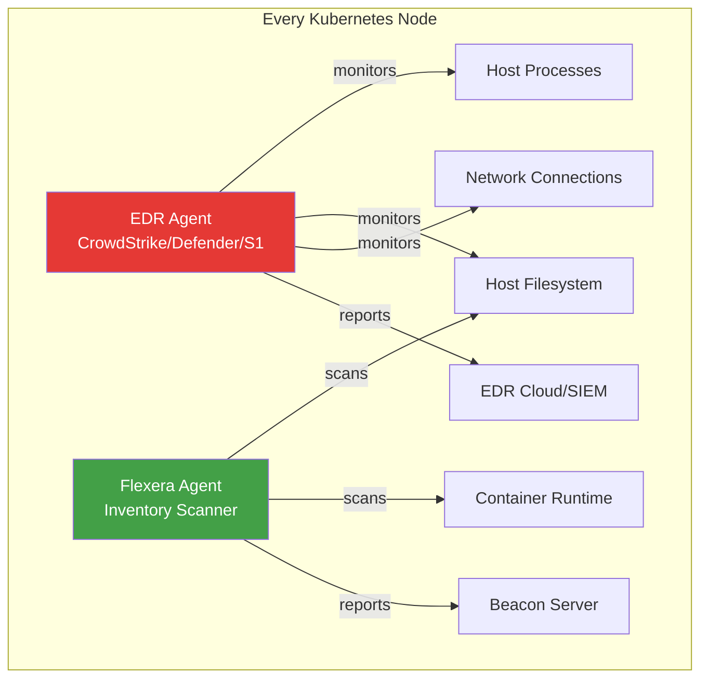

> 💡 **Quick Answer:** Deploy EDR (CrowdStrike Falcon, Microsoft Defender, SentinelOne) and Flexera inventory agents as privileged DaemonSets on Kubernetes nodes. Both require `hostPID`, `hostNetwork`, and access to the host filesystem. Use tolerations to cover all nodes, resource limits to prevent impact, and priority classes to survive node pressure. They can coexist on the same nodes with careful resource planning.

## The Problem

Enterprise Kubernetes clusters must run both security (EDR) and compliance (Flexera) agents on every node:

- **Security mandates EDR everywhere** — SOC teams require endpoint detection on all compute, including Kubernetes nodes
- **License compliance requires Flexera** — audit teams need software inventory from container hosts
- **Both need privileged access** — host PID namespace, filesystem, and network visibility
- **Resource contention** — two privileged DaemonSets competing for CPU/memory on every node
- **Agent conflicts** — EDR kernel modules can interfere with container runtime or NFS mounts
- **Tainted nodes get skipped** — GPU, infra, and master nodes miss agent coverage without proper tolerations

## The Solution

### Architecture: EDR + Flexera Coexistence



### CrowdStrike Falcon Sensor DaemonSet

```yaml
apiVersion: apps/v1
kind: DaemonSet
metadata:
  name: falcon-sensor
  namespace: falcon-system
  labels:
    app: falcon-sensor
spec:
  selector:
    matchLabels:
      app: falcon-sensor
  updateStrategy:
    type: RollingUpdate
    rollingUpdate:
      maxUnavailable: 1
  template:
    metadata:
      labels:
        app: falcon-sensor
    spec:
      hostPID: true
      hostNetwork: true
      hostIPC: true
      nodeSelector:
        kubernetes.io/os: linux
      tolerations:
      - operator: Exists  # Run on ALL nodes — masters, GPU, infra
      priorityClassName: system-node-critical
      serviceAccountName: falcon-sensor
      containers:
      - name: falcon-sensor
        image: registry.crowdstrike.com/falcon-sensor/falcon-sensor:7.20.0
        securityContext:
          privileged: true
          readOnlyRootFilesystem: false
        env:
        - name: FALCONCTL_OPT_CID
          valueFrom:
            secretKeyRef:
              name: falcon-creds
              key: cid
        - name: FALCONCTL_OPT_BACKEND
          value: "auto"
        - name: FALCONCTL_OPT_TRACE
          value: "none"
        - name: NODE_NAME
          valueFrom:
            fieldRef:
              fieldPath: spec.nodeName
        volumeMounts:
        - name: host-root
          mountPath: /host
          readOnly: false
        - name: host-etc
          mountPath: /host/etc
          readOnly: true
        - name: host-proc
          mountPath: /host/proc
          readOnly: true
        - name: dev
          mountPath: /dev
        resources:
          requests:
            cpu: 50m
            memory: 256Mi
          limits:
            cpu: 500m
            memory: 512Mi
        livenessProbe:
          exec:
            command:
            - /opt/CrowdStrike/falconctl
            - -g
            - --rfm-state
          initialDelaySeconds: 60
          periodSeconds: 60
      volumes:
      - name: host-root
        hostPath:
          path: /
      - name: host-etc
        hostPath:
          path: /etc
      - name: host-proc
        hostPath:
          path: /proc
      - name: dev
        hostPath:
          path: /dev
```

### Microsoft Defender for Endpoint DaemonSet

```yaml
apiVersion: apps/v1
kind: DaemonSet
metadata:
  name: mdatp-daemonset
  namespace: mde-system
spec:
  selector:
    matchLabels:
      app: mdatp
  template:
    metadata:
      labels:
        app: mdatp
    spec:
      hostPID: true
      hostNetwork: true
      tolerations:
      - operator: Exists
      priorityClassName: system-node-critical
      containers:
      - name: mdatp
        image: mcr.microsoft.com/mdatp/mdatp-linux:latest
        securityContext:
          privileged: true
        env:
        - name: MDATP_ONBOARDING_BLOB
          valueFrom:
            secretKeyRef:
              name: mde-onboarding
              key: blob
        - name: MDATP_MANAGED
          value: "true"
        volumeMounts:
        - name: host-root
          mountPath: /host
          readOnly: true
        - name: host-proc
          mountPath: /host/proc
          readOnly: true
        - name: etc-mdatp
          mountPath: /etc/opt/microsoft/mdatp
        resources:
          requests:
            cpu: 50m
            memory: 256Mi
          limits:
            cpu: 500m
            memory: 768Mi
      volumes:
      - name: host-root
        hostPath:
          path: /
      - name: host-proc
        hostPath:
          path: /proc
      - name: etc-mdatp
        hostPath:
          path: /etc/opt/microsoft/mdatp
          type: DirectoryOrCreate
```

### SentinelOne DaemonSet

```yaml
apiVersion: apps/v1
kind: DaemonSet
metadata:
  name: sentinelone-agent
  namespace: sentinelone-system
spec:
  selector:
    matchLabels:
      app: sentinelone
  template:
    metadata:
      labels:
        app: sentinelone
    spec:
      hostPID: true
      hostNetwork: true
      tolerations:
      - operator: Exists
      priorityClassName: system-node-critical
      containers:
      - name: sentinelone
        image: registry.sentinelone.net/s1-agent/s1-agent:24.4.1
        securityContext:
          privileged: true
        env:
        - name: S1_AGENT_SITE_TOKEN
          valueFrom:
            secretKeyRef:
              name: s1-creds
              key: site-token
        - name: S1_AGENT_MANAGEMENT_URL
          value: "https://usea1-purple.sentinelone.net"
        volumeMounts:
        - name: host-root
          mountPath: /host
        - name: host-proc
          mountPath: /host/proc
          readOnly: true
        - name: dev
          mountPath: /dev
        resources:
          requests:
            cpu: 100m
            memory: 512Mi
          limits:
            cpu: 1000m
            memory: 1Gi
      volumes:
      - name: host-root
        hostPath:
          path: /
      - name: host-proc
        hostPath:
          path: /proc
      - name: dev
        hostPath:
          path: /dev
```

### Flexera Agent (Coexisting with EDR)

```yaml
apiVersion: apps/v1
kind: DaemonSet
metadata:
  name: flexera-agent
  namespace: flexera-system
spec:
  selector:
    matchLabels:
      app: flexera-agent
  template:
    metadata:
      labels:
        app: flexera-agent
    spec:
      hostPID: true
      hostNetwork: true
      tolerations:
      - operator: Exists
      priorityClassName: system-cluster-critical  # Below EDR priority
      containers:
      - name: inventory-agent
        image: registry.example.com/flexera/fnms-inventory-agent:2026.1
        securityContext:
          privileged: true
        env:
        - name: BEACON_URL
          value: "https://beacon.example.com"
        - name: BEACON_TOKEN
          valueFrom:
            secretKeyRef:
              name: flexera-creds
              key: token
        - name: SCAN_INTERVAL
          value: "86400"
        - name: SCAN_CONTAINERS
          value: "true"
        - name: NODE_NAME
          valueFrom:
            fieldRef:
              fieldPath: spec.nodeName
        volumeMounts:
        - name: host-root
          mountPath: /host
          readOnly: true
        - name: containerd-sock
          mountPath: /var/run/containerd/containerd.sock
          readOnly: true
        - name: flexera-data
          mountPath: /var/opt/flexera
        resources:
          requests:
            cpu: 25m
            memory: 128Mi
          limits:
            cpu: 200m
            memory: 384Mi
      volumes:
      - name: host-root
        hostPath:
          path: /
      - name: containerd-sock
        hostPath:
          path: /var/run/containerd/containerd.sock
      - name: flexera-data
        hostPath:
          path: /var/opt/flexera
          type: DirectoryOrCreate
```

### Resource Budget for Both Agents

```yaml
# Total per-node overhead for EDR + Flexera
# 
# Agent         CPU Req  CPU Lim  Mem Req  Mem Lim
# CrowdStrike   50m      500m     256Mi    512Mi
# Flexera        25m      200m     128Mi    384Mi
# ─────────────────────────────────────────────────
# Total          75m      700m     384Mi    896Mi
#
# On a 16-core / 64GB node: <1% CPU, <1.5% memory overhead

# PriorityClass ensures EDR survives node pressure
apiVersion: scheduling.k8s.io/v1
kind: PriorityClass
metadata:
  name: security-agent-critical
value: 1000000
globalDefault: false
description: "Priority for security/compliance agents — preempts workloads"
```

### OpenShift SCC for EDR/Flexera

```yaml
apiVersion: security.openshift.io/v1
kind: SecurityContextConstraints
metadata:
  name: edr-flexera-scc
allowPrivilegedContainer: true
allowHostDirVolumePlugin: true
allowHostIPC: true
allowHostNetwork: true
allowHostPID: true
allowHostPorts: true
fsGroup:
  type: RunAsAny
runAsUser:
  type: RunAsAny
seLinuxContext:
  type: RunAsAny
volumes:
- hostPath
- secret
- configMap
- emptyDir
users:
- system:serviceaccount:falcon-system:falcon-sensor
- system:serviceaccount:flexera-system:flexera-agent
- system:serviceaccount:mde-system:default
- system:serviceaccount:sentinelone-system:default
```

### EDR Exclusions for Kubernetes

```bash
# CrowdStrike — exclude container runtime and kubelet paths
cat > falcon-exclusions.json << 'EOF'
{
  "exclusions": [
    {"pattern": "/var/lib/containerd/**", "type": "path"},
    {"pattern": "/var/lib/kubelet/**", "type": "path"},
    {"pattern": "/var/run/containerd/**", "type": "path"},
    {"pattern": "/var/lib/etcd/**", "type": "path"},
    {"pattern": "/var/opt/flexera/**", "type": "path"},
    {"pattern": "containerd-shim-runc-v2", "type": "process"},
    {"pattern": "kubelet", "type": "process"},
    {"pattern": "etcd", "type": "process"},
    {"pattern": "mndagent", "type": "process"}
  ]
}
EOF

# Apply via Falcon console API
curl -X POST "https://api.crowdstrike.com/policy/entities/prevention/v1" \
  -H "Authorization: Bearer $CS_TOKEN" \
  -d @falcon-exclusions.json
```

### Monitoring Agent Health

```yaml
apiVersion: monitoring.coreos.com/v1
kind: PrometheusRule
metadata:
  name: agent-health-alerts
  namespace: monitoring
spec:
  groups:
  - name: security-agents
    rules:
    - alert: EDRAgentDown
      expr: |
        kube_daemonset_status_number_unavailable{daemonset="falcon-sensor"} > 0
      for: 10m
      labels:
        severity: critical
      annotations:
        summary: "CrowdStrike Falcon agent not running on {{ $value }} nodes"
    
    - alert: FlexeraAgentDown
      expr: |
        kube_daemonset_status_number_unavailable{daemonset="flexera-agent"} > 0
      for: 30m
      labels:
        severity: warning
      annotations:
        summary: "Flexera agent not running on {{ $value }} nodes"
    
    - alert: AgentHighMemory
      expr: |
        container_memory_usage_bytes{container=~"falcon-sensor|flexera-agent"} 
        / container_spec_memory_limit_bytes > 0.9
      for: 5m
      labels:
        severity: warning
      annotations:
        summary: "{{ $labels.container }} using >90% memory on {{ $labels.node }}"
```

## Common Issues

**EDR kills container processes**

Configure EDR exclusions for containerd-shim, kubelet, and etcd. Without exclusions, EDR heuristics may flag container spawn patterns as suspicious.

**Flexera scan causes I/O spikes**

Schedule Flexera scans during off-peak hours (`SCAN_INTERVAL` + stagger with `SCAN_OFFSET`). The inventory scan reads every binary on disk — this is I/O-intensive on nodes with many container images.

**Both agents compete for memory on small nodes**

Set Flexera to `system-cluster-critical` (below EDR at `system-node-critical`). Under pressure, Flexera gets evicted first — security takes priority over compliance.

**EDR kernel module conflicts with NFS**

Some EDR agents install kernel modules that intercept syscalls. If NFS mounts fail after EDR deployment, add NFS-related paths (`/var/lib/kubelet/pods/*/volumes/kubernetes.io~nfs`) to EDR exclusions.

## Best Practices

- **EDR priority > Flexera priority** — security agent must never be evicted
- **Tolerate everything** — `operator: Exists` ensures coverage on GPU, infra, and tainted nodes
- **Configure EDR exclusions** — container runtime paths, kubelet, etcd, and Flexera data directory
- **Stagger Flexera scans** — avoid all nodes scanning simultaneously
- **Monitor DaemonSet health** — alert if any node is missing an agent pod
- **Use separate namespaces** — `falcon-system`, `flexera-system` for RBAC isolation
- **Test on non-production first** — EDR kernel modules can cause unexpected node behavior

## Key Takeaways

- EDR and Flexera both require privileged DaemonSets with host PID/network/filesystem access
- CrowdStrike, Defender, and SentinelOne all follow the same DaemonSet pattern
- Priority classes ensure EDR survives node pressure while Flexera degrades gracefully
- EDR exclusions for container runtime paths are mandatory to avoid killing pods
- Combined overhead is <1% CPU and <1.5% memory on typical production nodes
- OpenShift requires a custom SCC granting privileged + hostPID + hostNetwork
