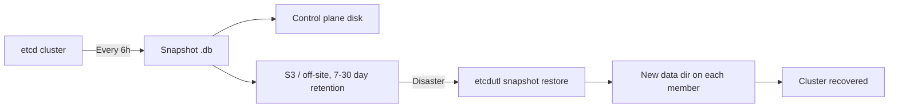

> 💡 **Quick Answer:** Vanilla/kubeadm: `ETCDCTL_API=3 etcdctl snapshot save /backup/etcd-$(date +%F).db --endpoints=https://127.0.0.1:2379 --cacert=/etc/kubernetes/pki/etcd/ca.crt --cert=/etc/kubernetes/pki/etcd/server.crt --key=/etc/kubernetes/pki/etcd/server.key`. OpenShift: `oc debug node/<cp-node>` → `chroot /host` → `/usr/local/bin/cluster-backup.sh /home/core/backup`. Restore with `etcdutl snapshot restore` into a **new** data dir with the API server and etcd static pods stopped. Automate every 6-24h, copy off-node, and test-restore.

## The Problem

etcd stores the entire cluster state — every resource, Secret, RBAC rule and lease. If etcd is corrupted or all control plane nodes are lost:

- The cluster is unrecoverable without an etcd snapshot
- Velero backs up API objects and volumes, but can't rebuild the control plane
- Certificate rotation failures or quorum loss can make etcd inaccessible

## The Solution

### Vanilla Kubernetes (kubeadm) Backup

```bash
ETCDCTL_API=3 etcdctl snapshot save /backup/etcd-$(date +%Y%m%d-%H%M).db \
  --endpoints=https://127.0.0.1:2379 \
  --cacert=/etc/kubernetes/pki/etcd/ca.crt \
  --cert=/etc/kubernetes/pki/etcd/server.crt \
  --key=/etc/kubernetes/pki/etcd/server.key

# Verify (etcd 3.5+: etcdutl; etcdctl snapshot status is deprecated and removed in 3.6)
etcdutl snapshot status /backup/etcd-*.db --write-out=table
```

Also copy `/etc/kubernetes/pki` and `/etc/kubernetes/*.conf` — a snapshot without the CA and certs means regenerating every kubeconfig.

### Automated Backup CronJob (kubeadm) to S3

```yaml
apiVersion: batch/v1
kind: CronJob
metadata:
  name: etcd-backup
  namespace: kube-system
spec:
  schedule: "0 */6 * * *"
  concurrencyPolicy: Forbid
  jobTemplate:
    spec:
      template:
        spec:
          hostNetwork: true
          nodeSelector:
            node-role.kubernetes.io/control-plane: ""
          tolerations:
            - key: node-role.kubernetes.io/control-plane
              effect: NoSchedule
          containers:
            - name: etcd-backup
              # Image must contain etcdctl and the aws CLI (build your own)
              image: registry.example.com/platform/etcd-backup:3.5.15
              command:
                - /bin/sh
                - -c
                - |
                  set -e
                  BACKUP_FILE="/backup/etcd-$(date +%Y%m%d-%H%M%S).db"
                  etcdctl snapshot save "$BACKUP_FILE" \
                    --endpoints=https://127.0.0.1:2379 \
                    --cacert=/etc/kubernetes/pki/etcd/ca.crt \
                    --cert=/etc/kubernetes/pki/etcd/server.crt \
                    --key=/etc/kubernetes/pki/etcd/server.key
                  aws s3 cp "$BACKUP_FILE" s3://cluster-backups/etcd/
                  find /backup -name "etcd-*.db" -mtime +7 -delete
              volumeMounts:
                - name: etcd-certs
                  mountPath: /etc/kubernetes/pki/etcd
                  readOnly: true
                - name: backup
                  mountPath: /backup
          volumes:
            - name: etcd-certs
              hostPath:
                path: /etc/kubernetes/pki/etcd
            - name: backup
              hostPath:
                path: /var/lib/etcd-backups
                type: DirectoryOrCreate
          restartPolicy: OnFailure
```

### OpenShift Backup

```bash
oc debug node/<control-plane-node>
chroot /host
/usr/local/bin/cluster-backup.sh /home/core/backup
# /home/core/backup/snapshot_2026-04-29_020000.db
# /home/core/backup/static_kuberesources_2026-04-29_020000.tar.gz
```

Automated: the script lives on the host, so the job must run it via `chroot` into the host filesystem (privileged pod, service account bound to the `privileged` SCC):

```yaml
apiVersion: batch/v1
kind: CronJob
metadata:
  name: etcd-backup
  namespace: openshift-etcd-backup
spec:
  schedule: "0 2 * * *"
  concurrencyPolicy: Forbid
  jobTemplate:
    spec:
      template:
        spec:
          serviceAccountName: etcd-backup      # oc adm policy add-scc-to-user privileged -z etcd-backup
          hostNetwork: true
          hostPID: true
          nodeSelector:
            node-role.kubernetes.io/master: ""
          tolerations:
            - operator: Exists
          containers:
            - name: backup
              image: registry.redhat.io/openshift4/ose-cli:latest
              securityContext:
                privileged: true
                runAsUser: 0
              command:
                - /bin/sh
                - -c
                - |
                  set -e
                  chroot /host /usr/local/bin/cluster-backup.sh /home/core/backup/$(date +%F)
                  cp -r /host/home/core/backup/$(date +%F) /backup/
                  find /host/home/core/backup -mindepth 1 -maxdepth 1 -mtime +3 -exec rm -rf {} +
              volumeMounts:
                - name: host
                  mountPath: /host
                - name: backup-vol
                  mountPath: /backup
          volumes:
            - name: host
              hostPath:
                path: /
            - name: backup-vol
              persistentVolumeClaim:
                claimName: etcd-backup-pvc
          restartPolicy: OnFailure
```

### Restore (Vanilla Kubernetes)

Always restore into a **new** data directory, with etcd and the API server stopped:

```bash
# On every control plane node: stop static pods
sudo mv /etc/kubernetes/manifests/kube-apiserver.yaml /etc/kubernetes/manifests/etcd.yaml /root/

# On each member, restore the SAME snapshot with that member's name/IP
sudo etcdutl snapshot restore /backup/etcd-20260424.db \
  --data-dir=/var/lib/etcd-restored \
  --name=cp-1 \
  --initial-cluster=cp-1=https://10.0.0.10:2380,cp-2=https://10.0.0.11:2380,cp-3=https://10.0.0.12:2380 \
  --initial-advertise-peer-urls=https://10.0.0.10:2380

# Swap data dirs (or point the etcd manifest hostPath at the new dir)
sudo mv /var/lib/etcd /var/lib/etcd.old
sudo mv /var/lib/etcd-restored /var/lib/etcd

# Start etcd, then the API server
sudo mv /root/etcd.yaml /etc/kubernetes/manifests/
sudo mv /root/kube-apiserver.yaml /etc/kubernetes/manifests/
kubectl get nodes
```

For a single control plane node, `--initial-cluster` contains only that node.

### Restore (OpenShift)

```bash
# On the recovery control plane host:
sudo -E /usr/local/bin/cluster-restore.sh /home/core/backup

# Restart kubelet on all control plane hosts
sudo systemctl restart kubelet

oc get nodes
oc get co etcd kube-apiserver
```

Follow the Red Hat procedure for your exact 4.x version: non-recovery nodes must have their etcd and API server static pods stopped first, and newer releases add a quorum-restore path.

### Verify a Backup Is Actually Restorable

A snapshot you haven't test-restored isn't a backup:

```bash
#!/bin/bash
# verify-etcd-backup.sh <snapshot-file>
set -e
SNAPSHOT=$1
TEMP_DIR=$(mktemp -d)
trap 'rm -rf "$TEMP_DIR"' EXIT

etcdutl snapshot status "$SNAPSHOT" --write-out=table
etcdutl snapshot restore "$SNAPSHOT" \
  --data-dir="${TEMP_DIR}/etcd" \
  --name=test-restore \
  --initial-cluster=test-restore=http://localhost:2380 \
  --initial-advertise-peer-urls=http://localhost:2380
echo "Snapshot is valid and restorable"
```

### Alert on etcd Health

```yaml
apiVersion: monitoring.coreos.com/v1
kind: PrometheusRule
metadata:
  name: etcd-alerts
  namespace: monitoring
spec:
  groups:
    - name: etcd
      rules:
        - alert: EtcdNoLeader
          expr: etcd_server_has_leader == 0
          for: 1m
          labels: {severity: critical}
        - alert: EtcdDatabaseQuotaLow
          expr: (etcd_mvcc_db_total_size_in_bytes / etcd_server_quota_backend_bytes) * 100 > 80
          for: 5m
          labels: {severity: warning}
```



## Common Issues

**Backup file is 0 bytes or `context deadline exceeded`**

etcdctl can't reach the endpoint or the certs are wrong. Run `etcdctl endpoint health` with the same flags first; on kubeadm use the `server.crt` or `healthcheck-client.crt` pair.

**Restore fails with "member already bootstrapped" / "data-dir exists"**

You restored into the existing directory. Restore into a new `--data-dir` and swap.

**Cluster comes back but some members won't join**

Each member must be restored from the same snapshot with its own `--name` and `--initial-advertise-peer-urls`, and identical `--initial-cluster`.

## Frequently Asked Questions

### How do I back up etcd in Kubernetes?
Run `etcdctl snapshot save` against the local member with the etcd CA and a client cert (on kubeadm: `/etc/kubernetes/pki/etcd/`). One snapshot from any healthy member contains the whole keyspace. On OpenShift use `cluster-backup.sh`, which also saves static pod resources.

### What is the difference between etcdctl and etcdutl?
`etcdctl` talks to a running etcd over the network (e.g. `snapshot save`). `etcdutl` operates on files offline (`snapshot restore`, `snapshot status`, `defrag` on a data dir). The file operations were moved from etcdctl to etcdutl in 3.5 and removed from etcdctl in 3.6.

### Does Velero back up etcd?
No. Velero backs up Kubernetes API objects and persistent volumes through the API server. You need etcd snapshots to recover the control plane itself, and Velero to restore workloads selectively into a new cluster.

### How often should I back up etcd?
At least daily, and every 6 hours for busy clusters, plus immediately before any control plane change (upgrades, certificate rotation, etcd defrag). Keep copies off the control plane nodes and encrypt them — snapshots contain Secrets.

## Best Practices

- **Automate** every 6-24h with a CronJob or systemd timer, and alert if it hasn't succeeded in 2 intervals
- **Store off-site** — S3/NFS; local-only backups die with the node
- **Test restore quarterly** on a scratch cluster
- **Back up before any control plane change**
- **Encrypt backups** — Secrets are only base64 in etcd unless encryption at rest is configured

## Key Takeaways

- An etcd snapshot is the only way to recover from total control plane loss
- kubeadm: `etcdctl snapshot save` + copy `/etc/kubernetes/pki`; OpenShift: `cluster-backup.sh`
- Restore with `etcdutl` into a new data dir with etcd and the API server stopped
- Velero and etcd snapshots solve different problems — you need both
