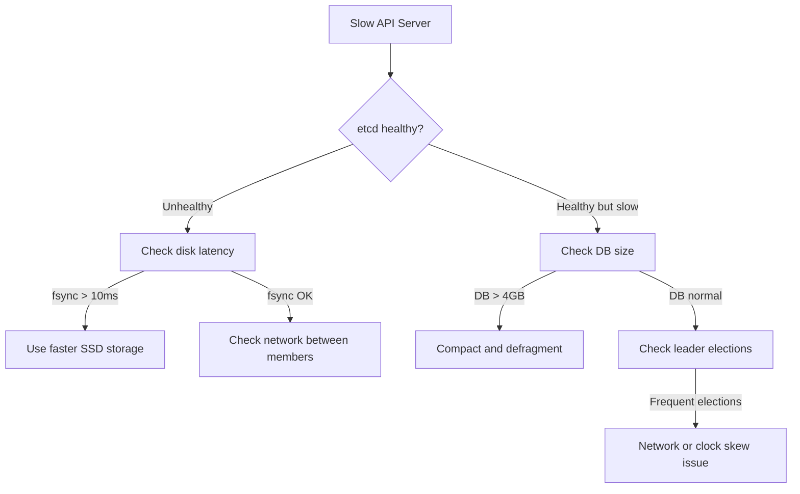

> 💡 **Quick Answer:** Slow `kubectl` responses and API server timeouts are often caused by etcd disk latency. etcd requires <10ms fsync latency for stable operation. Check with `etcdctl endpoint status` and monitor `etcd_disk_wal_fsync_duration_seconds`. Fix: use fast SSDs, run compaction, defragment, or reduce object count.
>
> **Key insight:** etcd stores ALL cluster state. If etcd is slow, everything is slow — scheduling, pod creation, service discovery, everything.

## The Problem

```bash
# kubectl responses are slow (>5 seconds)
$ time kubectl get pods
NAME                    READY   STATUS    RESTARTS   AGE
myapp-7b9f5c6d4-x2k8j  1/1     Running   0          1h
real    0m8.234s

# API server logs show etcd errors
# "etcdserver: request timed out"
# "slow fdatasync"
```

## The Solution

### Step 1: Check etcd Health

```bash
# In OpenShift
oc exec -n openshift-etcd etcd-master-0 -c etcd -- \
  etcdctl endpoint health --cluster -w table

# Standard Kubernetes
ETCDCTL_API=3 etcdctl \
  --endpoints=https://127.0.0.1:2379 \
  --cacert=/etc/kubernetes/pki/etcd/ca.crt \
  --cert=/etc/kubernetes/pki/etcd/server.crt \
  --key=/etc/kubernetes/pki/etcd/server.key \
  endpoint status -w table
```

### Step 2: Check Disk Latency

```bash
# On the etcd node — test fsync latency
fio --rw=write --ioengine=sync --fdatasync=1 --directory=/var/lib/etcd \
    --size=22m --bs=2300 --name=etcd-fsync-test

# etcd needs: 99th percentile fsync < 10ms
# If > 10ms, your storage is too slow for etcd
```

### Step 3: Run Compaction and Defragmentation

```bash
# Get current revision
REV=$(etcdctl endpoint status -w json | jq '.[0].Status.header.revision')

# Compact old revisions
etcdctl compact $REV

# Defragment each member (one at a time!)
etcdctl defrag --endpoints=https://etcd-0:2379
etcdctl defrag --endpoints=https://etcd-1:2379
etcdctl defrag --endpoints=https://etcd-2:2379
```

### Step 4: Check Database Size

```bash
# etcd DB should be < 4GB (default limit is 8GB)
etcdctl endpoint status -w table
# Check DB SIZE column

# If approaching limit, find large objects
etcdctl get / --prefix --keys-only | sed 's|/[^/]*$||' | sort | uniq -c | sort -rn | head -20
```



## Common Issues

### Frequent leader elections
Caused by network latency between etcd members, clock skew, or slow disk. etcd members must have <50ms RTT between them.

### etcd alarm NOSPACE
DB hit the quota limit. Emergency fix:
```bash
etcdctl alarm list
# alarm:NOSPACE
etcdctl compact $(etcdctl endpoint status -w json | jq '.[0].Status.header.revision')
etcdctl defrag
etcdctl alarm disarm
```

### Slow after cluster upgrade
Upgrades can leave fragmented DB. Run defrag after each upgrade.

## Best Practices

- **Use NVMe/SSD for etcd storage** — etcd is latency-sensitive, not throughput-sensitive
- **Separate etcd disks from other I/O** — don't share disks with container storage
- **Monitor `etcd_disk_wal_fsync_duration_seconds`** — alert if 99th percentile > 10ms
- **Run compaction daily** via cron or use `--auto-compaction-retention=1h`
- **Keep DB under 4GB** — large DBs cause slow snapshots and leader elections
- **3 or 5 members only** — more members = slower consensus

## Key Takeaways

- etcd disk latency is the #1 cause of slow Kubernetes API responses
- Requires <10ms fsync latency — use dedicated SSDs
- Compact and defragment regularly to keep DB size healthy
- Monitor with Prometheus: `etcd_disk_wal_fsync_duration_seconds` and `etcd_server_has_leader`
- NOSPACE alarm = emergency — compact and defrag immediately
