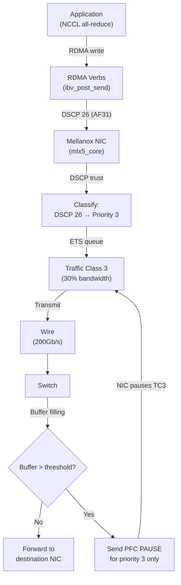

> 💡 **Quick Answer:** Three steps for lossless RoCE on Mellanox ConnectX: **1)** `mlnx_qos -i <iface> --trust dscp` (classify by DSCP field), **2)** `mlnx_qos -i <iface> --pfc 0,0,0,1,0,0,0,0` (make priority 3 lossless), **3)** `mlnx_qos -i <iface> --tc_bw 70,0,0,30,0,0,0,0` (ETS queues: 30% for RoCE). DSCP 26 (AF31) maps to priority 3 by default.

## The Problem

RoCE needs three things configured on every Mellanox NIC: DSCP trust (so the NIC classifies traffic by DSCP value), PFC (so priority 3 is lossless), and ETS queues (so RDMA traffic gets guaranteed bandwidth). Without all three, RoCE either drops packets or starves.

## Step 1: Set DSCP Trust

DSCP trust tells the NIC to classify packets by their IP DSCP field instead of VLAN PCP bits:

```bash
# Check current trust mode
mlnx_qos -i ens8f0np0 | grep -i trust
# Trust state: pcp    ← Default (wrong for RoCE)

# Set DSCP trust
mlnx_qos -i ens8f0np0 --trust dscp

# Verify
mlnx_qos -i ens8f0np0 | grep -i trust
# Trust state: dscp   ← Correct ✅
```

**Why DSCP?** RoCE v2 packets carry DSCP 26 (AF31) in the IP header. With DSCP trust, the NIC reads this value and places traffic into priority 3 automatically — no VLAN tagging required.

## Step 2: Map DSCP to Priority

RoCE v2 default: DSCP 26 → priority 3. Verify the mapping exists:

```bash
# Check DSCP-to-priority mapping
mlnx_qos -i ens8f0np0 --dscp2prio

# Look for DSCP 26 → priority 3
# DSCP  Priority
# ...
# 24    3     ← CS3
# 26    3     ← AF31 (RoCE default) ✅
# 34    4     ← AF41
# ...

# If DSCP 26 doesn't map to priority 3, set it:
mlnx_qos -i ens8f0np0 --dscp2prio set,26,3
```

### DSCP Values Reference

| DSCP Value | Name | Decimal | Binary | Default Priority |
|-----------|------|---------|--------|-----------------|
| 0 | Best Effort | 0 | 000000 | 0 |
| 8 | CS1 | 8 | 001000 | 1 |
| 24 | CS3 | 24 | 011000 | 3 |
| **26** | **AF31** | **26** | **011010** | **3 ← RoCE** |
| 34 | AF41 | 34 | 100010 | 4 |
| 46 | EF | 46 | 101110 | 5 |
| 48 | CS6 | 48 | 110000 | 6 |

### Setting DSCP from NCCL

NCCL uses the `NCCL_IB_TC` environment variable. This sets the **traffic class** byte (TOS field), not DSCP directly:

```bash
# TOS = DSCP << 2
# DSCP 26 = 011010 → TOS = 01101000 = 104 decimal
# But NCCL_IB_TC sets only the 8-bit TC field

# For DSCP 26 (AF31):
NCCL_IB_TC=106    # Some NCCL versions use this mapping
# Or explicitly via RoCE CM:
NCCL_IB_GID_INDEX=3
```

## Step 3: Enable PFC on Priority 3

PFC pauses priority 3 when switch/NIC buffers fill — preventing packet drops:

```bash
# Check current PFC state
mlnx_qos -i ens8f0np0
# PFC configuration:
#   priority:  0  1  2  3  4  5  6  7
#   enabled:   0  0  0  0  0  0  0  0   ← All disabled (default)

# Enable PFC on priority 3 ONLY
mlnx_qos -i ens8f0np0 --pfc 0,0,0,1,0,0,0,0

# Verify
mlnx_qos -i ens8f0np0
# PFC configuration:
#   priority:  0  1  2  3  4  5  6  7
#   enabled:   0  0  0  1  0  0  0  0   ← Priority 3 lossless ✅
```

**⚠️ Never enable PFC on all priorities** — this wastes switch buffer and can cause head-of-line blocking. Only priority 3 (RoCE) needs lossless.

## Step 4: Configure ETS Queues

ETS (Enhanced Transmission Selection) maps priorities to traffic classes and allocates bandwidth:

```bash
# Default state: all bandwidth on TC0
mlnx_qos -i ens8f0np0
# tc:  0    1    2    3    4    5    6    7
# bw:  100  0    0    0    0    0    0    0
# tsa: ets  str  str  str  str  str  str  str

# Configure: 70% best-effort (TC0), 30% RoCE (TC3)
mlnx_qos -i ens8f0np0 \
  --tc_bw 70,0,0,30,0,0,0,0 \
  --tsa ets,strict,strict,ets,strict,strict,strict,strict

# Verify
mlnx_qos -i ens8f0np0
# ETS/BW:
#   tc:  0   1   2   3   4   5   6   7
#   bw:  70  0   0   30  0   0   0   0   ✅
#   tsa: ets str str ets str str str str
```

### ETS Scheduling Modes

| Mode | Behavior | Use For |
|------|----------|---------|
| **ets** | Guaranteed minimum bandwidth (can burst higher) | TC0 (best-effort), TC3 (RoCE) |
| **strict** | Always served first when queued (starves lower TCs) | Control plane traffic |

### ETS Bandwidth Recommendations

| Workload | TC0 (Best Effort) | TC3 (RoCE) |
|----------|-------------------|------------|
| **AI Training (RDMA-heavy)** | 20% | 80% |
| **Mixed (RDMA + regular)** | 50% | 50% |
| **Mostly regular traffic** | 70% | 30% |
| **Storage (NFS-over-RDMA)** | 60% | 40% |

```bash
# AI training cluster — 80% to RDMA
mlnx_qos -i ens8f0np0 \
  --tc_bw 20,0,0,80,0,0,0,0 \
  --tsa ets,strict,strict,ets,strict,strict,strict,strict
```

## Complete Configuration (All-in-One)

```bash
#!/bin/bash
# configure-roce-qos.sh — Complete RoCE QoS setup for Mellanox NIC
IFACE=${1:-ens8f0np0}

echo "=== Configuring RoCE QoS on $IFACE ==="

# 1. DSCP trust
echo "[1/5] Setting DSCP trust..."
mlnx_qos -i "$IFACE" --trust dscp

# 2. DSCP-to-priority mapping
echo "[2/5] Mapping DSCP 26 → priority 3..."
mlnx_qos -i "$IFACE" --dscp2prio set,26,3

# 3. PFC on priority 3
echo "[3/5] Enabling PFC on priority 3..."
mlnx_qos -i "$IFACE" --pfc 0,0,0,1,0,0,0,0

# 4. ETS bandwidth allocation
echo "[4/5] Configuring ETS: TC0=70%, TC3=30%..."
mlnx_qos -i "$IFACE" \
  --tc_bw 70,0,0,30,0,0,0,0 \
  --tsa ets,strict,strict,ets,strict,strict,strict,strict

# 5. ECN on TC3
echo "[5/5] Enabling ECN on TC3..."
echo 1 > /sys/class/net/"$IFACE"/ecn/roce_np/enable/3 2>/dev/null
echo 1 > /sys/class/net/"$IFACE"/ecn/roce_rp/enable/3 2>/dev/null

echo ""
echo "=== Verification ==="
mlnx_qos -i "$IFACE"

echo ""
echo "=== PFC Counters ==="
ethtool -S "$IFACE" | grep prio3

echo ""
echo "✅ RoCE QoS configured on $IFACE"
```

### Apply to All Mellanox NICs

```bash
#!/bin/bash
# configure-all-nics.sh — Apply to every Mellanox NIC on the node
for iface in $(ls /sys/class/net/); do
  if ethtool -i "$iface" 2>/dev/null | grep -q mlx5_core; then
    echo ">>> Configuring $iface"
    ./configure-roce-qos.sh "$iface"
    echo ""
  fi
done
```

## Verification Cheat Sheet

```bash
# Full QoS state
mlnx_qos -i ens8f0np0

# Just PFC
mlnx_qos -i ens8f0np0 | grep -A2 "PFC"

# Just ETS
mlnx_qos -i ens8f0np0 | grep -A3 "tc:"

# DSCP mapping
mlnx_qos -i ens8f0np0 --dscp2prio | grep "26"

# PFC pause counters (non-zero = working)
ethtool -S ens8f0np0 | grep prio3_pause

# Drops (should be ZERO on priority 3)
ethtool -S ens8f0np0 | grep prio3_discard

# RDMA bandwidth test
# Server: ib_write_bw -d mlx5_0 --report_gbits
# Client: ib_write_bw -d mlx5_0 <server-ip> --report_gbits
```

## The Flow: Packet Path Through ETS + PFC



## Common Issues

| Issue | Cause | Fix |
|-------|-------|-----|
| Trust resets to PCP after reboot | mlnx_qos not persistent | Use systemd service or MachineConfig |
| DSCP 26 maps to wrong priority | Firmware default differs | `mlnx_qos --dscp2prio set,26,3` explicitly |
| ETS shows all bandwidth on TC0 | tc_bw not set | `mlnx_qos --tc_bw 70,0,0,30,0,0,0,0` |
| PFC counters all zero | Switch PFC not enabled | Configure PFC on switch port too |
| High pause counts + low throughput | PFC storm / congestion | Enable ECN, check switch buffers |
| `mlnx_qos: No such device` | Wrong interface name | Check `ip link`, use physical interface not bond |

## Best Practices

- **Always configure all three**: DSCP trust + PFC + ETS — missing any one breaks lossless
- **PFC on priority 3 only** — never enable all priorities
- **ETS bandwidth varies by workload** — 80% RDMA for AI training, 30% for mixed
- **Switch must match** — PFC is hop-by-hop, every device must participate
- **Persist configuration** — mlnx_qos is volatile, use systemd or MachineConfig
- **ECN alongside PFC** — reduces pause storm frequency
- **Verify with ib_write_bw** — confirm line-rate before deploying workloads

## Key Takeaways

- **DSCP trust** → NIC classifies by IP DSCP field (not VLAN PCP)
- **DSCP 26 (AF31) → priority 3** → the default RoCE mapping
- **PFC on priority 3** → lossless for RDMA, lossy for everything else
- **ETS queues** → guaranteed bandwidth per traffic class (TC0 + TC3)
- Three commands: `--trust dscp`, `--pfc 0,0,0,1,0,0,0,0`, `--tc_bw 70,0,0,30,0,0,0,0`
- All three are required — skip one and RoCE performance degrades
