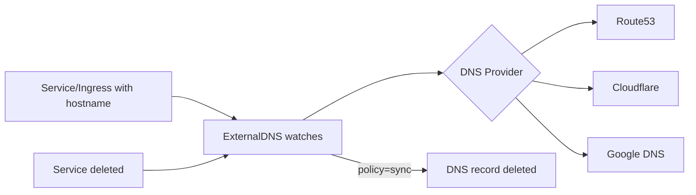

> 💡 **Quick Answer:** networking

## The Problem

Engineers need production-ready guides for these essential Kubernetes ecosystem tools. Incomplete documentation leads to misconfiguration and security gaps.

## The Solution

### Install ExternalDNS

```bash
helm repo add external-dns https://kubernetes-sigs.github.io/external-dns
helm install external-dns external-dns/external-dns \
  --namespace external-dns --create-namespace \
  --set provider.name=aws \
  --set env[0].name=AWS_DEFAULT_REGION \
  --set env[0].value=eu-west-1 \
  --set policy=sync \
  --set domainFilters[0]=example.com
```

### How It Works

```yaml
# Create a Service or Ingress with a hostname annotation
apiVersion: v1
kind: Service
metadata:
  name: web
  annotations:
    external-dns.alpha.kubernetes.io/hostname: app.example.com
    external-dns.alpha.kubernetes.io/ttl: "300"
spec:
  type: LoadBalancer
  selector:
    app: web
  ports:
    - port: 80
# ExternalDNS automatically creates:
# app.example.com → A record → LoadBalancer IP
```

### Works with Ingress Too

```yaml
apiVersion: networking.k8s.io/v1
kind: Ingress
metadata:
  name: web-ingress
spec:
  rules:
    - host: app.example.com     # ExternalDNS picks this up automatically
      http:
        paths:
          - path: /
            pathType: Prefix
            backend:
              service:
                name: web
                port:
                  number: 80
```

### Provider Configuration

| Provider | Helm value | Auth |
|----------|-----------|------|
| AWS Route53 | `provider.name=aws` | IAM role / IRSA |
| Cloudflare | `provider.name=cloudflare` | API token |
| Google Cloud DNS | `provider.name=google` | Service account |
| Azure DNS | `provider.name=azure` | Managed identity |
| DigitalOcean | `provider.name=digitalocean` | API token |

### Policies

| Policy | Behavior |
|--------|----------|
| `sync` | Create + update + delete records |
| `upsert-only` | Create + update, never delete |
| `create-only` | Only create new records |



## Frequently Asked Questions

### Will ExternalDNS delete my manually created records?

With `policy=sync`, it manages records it created (tracked via TXT ownership records). It won't touch records created outside ExternalDNS. Use `upsert-only` for extra safety.

## Best Practices

- Start with default configurations and customize as needed
- Test in a non-production cluster first
- Monitor resource usage after deployment
- Keep components updated for security patches

## Key Takeaways

- This tool fills a critical gap in the Kubernetes ecosystem
- Follow the principle of least privilege for all configurations
- Automate where possible to reduce manual errors
- Monitor and alert on operational metrics
