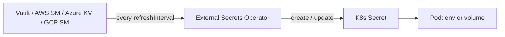

> 💡 **Quick Answer:** Install ESO via Helm (`helm install external-secrets external-secrets/external-secrets -n external-secrets --create-namespace`), create a `SecretStore` (namespaced) or `ClusterSecretStore` (shared) holding the provider auth, then create `ExternalSecret` resources that map remote keys in Vault, AWS Secrets Manager, Azure Key Vault or GCP Secret Manager to a native Kubernetes `Secret`. ESO re-syncs every `refreshInterval`.
>
> **Key flow:** SecretStore (auth config) → ExternalSecret (what to sync) → Kubernetes Secret (auto-created, owned by ESO).
>
> **Gotcha:** Current ESO releases serve `external-secrets.io/v1`; `v1beta1` is deprecated. Update old manifests before upgrading the chart.

External Secrets Operator (ESO) keeps the source of truth in your secret manager — with its audit trail, policies and rotation — and materialises only what each namespace needs as Kubernetes Secrets. Git holds references, never values.

## Install External Secrets Operator

```bash
helm repo add external-secrets https://charts.external-secrets.io
helm install external-secrets external-secrets/external-secrets \
  -n external-secrets --create-namespace

kubectl get pods -n external-secrets
kubectl get crd | grep external-secrets.io
```

On OpenShift, install the Red Hat-supported operator from OperatorHub instead: see [ESO on OpenShift](/recipes/security/external-secrets-operator-openshift/).

## HashiCorp Vault (Kubernetes auth)

```yaml
apiVersion: external-secrets.io/v1
kind: SecretStore
metadata:
  name: vault-backend
  namespace: production
spec:
  provider:
    vault:
      server: "https://vault.example.com:8200"
      path: "secret"            # KV mount
      version: "v2"             # KV v2 - ESO inserts /data/ for you
      auth:
        kubernetes:
          mountPath: "kubernetes"
          role: "production-app"
          serviceAccountRef:
            name: vault-auth
---
apiVersion: external-secrets.io/v1
kind: ExternalSecret
metadata:
  name: db-credentials
  namespace: production
spec:
  refreshInterval: 15m
  secretStoreRef:
    name: vault-backend
    kind: SecretStore
  target:
    name: db-credentials       # K8s Secret to create
    creationPolicy: Owner      # deleting the ExternalSecret deletes the Secret
  data:
    - secretKey: username      # key in the K8s Secret
      remoteRef:
        key: production/database   # relative to the mount: secret/data/production/database
        property: username         # field inside the Vault secret
    - secretKey: password
      remoteRef:
        key: production/database
        property: password
```

The Vault role must bind the `vault-auth` ServiceAccount/namespace and attach a policy allowing `read` on `secret/data/production/*`. Vault server setup: [HashiCorp Vault on Kubernetes](/recipes/security/hashicorp-vault-kubernetes/).

## AWS Secrets Manager (IRSA / Pod Identity)

```yaml
apiVersion: external-secrets.io/v1
kind: ClusterSecretStore
metadata:
  name: aws-secrets
spec:
  provider:
    aws:
      service: SecretsManager      # or ParameterStore
      region: eu-west-1
      auth:
        jwt:
          serviceAccountRef:       # SA annotated with eks.amazonaws.com/role-arn
            name: external-secrets-sa
            namespace: external-secrets
---
apiVersion: external-secrets.io/v1
kind: ExternalSecret
metadata:
  name: api-keys
  namespace: production
spec:
  refreshInterval: 30m
  secretStoreRef:
    name: aws-secrets
    kind: ClusterSecretStore
  target:
    name: api-keys
  data:
    - secretKey: stripe-key
      remoteRef:
        key: production/stripe
        property: api_key
```

Avoid static `accessKeyIDSecretRef`/`secretAccessKeySecretRef` credentials outside labs — they just move the secret-zero problem. The IAM role needs `secretsmanager:GetSecretValue` (and `kms:Decrypt` for CMK-encrypted secrets).

## Azure Key Vault (Workload / Managed Identity)

```yaml
apiVersion: external-secrets.io/v1
kind: SecretStore
metadata:
  name: azure-kv
  namespace: production
spec:
  provider:
    azurekv:
      vaultUrl: "https://my-keyvault.vault.azure.net"
      authType: WorkloadIdentity   # or ManagedIdentity (+ identityId)
      serviceAccountRef:
        name: eso-azure-sa         # annotated with azure.workload.identity/client-id
```

## GCP Secret Manager (Workload Identity)

```yaml
apiVersion: external-secrets.io/v1
kind: SecretStore
metadata:
  name: gcp-secrets
  namespace: production
spec:
  provider:
    gcpsm:
      projectID: my-gcp-project
      auth:
        workloadIdentity:
          clusterLocation: us-central1
          clusterName: my-cluster
          serviceAccountRef:
            name: external-secrets-sa
```

## Sync Every Key (dataFrom)

```yaml
apiVersion: external-secrets.io/v1
kind: ExternalSecret
metadata:
  name: app-config
  namespace: production
spec:
  refreshInterval: 1h
  secretStoreRef:
    name: aws-secrets
    kind: ClusterSecretStore
  target:
    name: app-config
  dataFrom:
    - extract:
        key: production/app-config   # every JSON field becomes a Secret key
```

## Template Connection Strings and Config Files

```yaml
apiVersion: external-secrets.io/v1
kind: ExternalSecret
metadata:
  name: db-connection
  namespace: production
spec:
  refreshInterval: 1h
  secretStoreRef:
    name: vault-backend
    kind: SecretStore
  target:
    name: db-connection
    template:
      engineVersion: v2
      data:
        DATABASE_URL: "postgresql://{{ .username }}:{{ .password }}@db.production:5432/mydb"
        config.yaml: |
          database:
            host: db.production
            username: {{ .username }}
            password: {{ .password }}
  data:
    - secretKey: username
      remoteRef: { key: production/database, property: username }
    - secretKey: password
      remoteRef: { key: production/database, property: password }
```

## Consume in a Deployment

```yaml
spec:
  template:
    spec:
      containers:
        - name: app
          image: myapp:v1
          envFrom:
            - secretRef:
                name: db-connection     # created by ESO
          volumeMounts:
            - name: api-keys            # volume = picks up rotations without restart
              mountPath: /etc/secrets
              readOnly: true
      volumes:
        - name: api-keys
          secret:
            secretName: api-keys
```

## Check Status and Force a Sync

```bash
kubectl get externalsecret -A
# NAME             STORE           REFRESH INTERVAL   STATUS         READY
# db-credentials   vault-backend   15m                SecretSynced   True

kubectl describe externalsecret db-credentials -n production
kubectl get secretstore,clustersecretstore -A     # STATUS should be Valid

# Immediate re-sync after rotating in the vault
kubectl annotate externalsecret db-credentials -n production \
  force-sync=$(date +%s) --overwrite
```



## Common Issues

**ExternalSecret shows `SecretSyncedError`** — auth or path problem. `kubectl describe` the ExternalSecret and the store; typical causes are a missing IAM/Vault policy, wrong `role`, wrong KV version, or the store unable to reach the endpoint (egress NetworkPolicy, proxy).

**SecretStore `InvalidProviderConfig`** — missing auth reference or wrong URL/region. The store must be `Valid` before any ExternalSecret can sync.

**Secret not updated after rotation** — `refreshInterval` hasn't elapsed (check `status.refreshTime`), or pods consume it via env vars. Force-sync as above and restart, or use volume mounts / Reloader.

**Vault `permission denied` with a `secret/data/...` key** — with `version: v2` and `path: secret`, use the key relative to the mount (`production/database`); ESO adds `/data/`.

## Best Practices

- **`ClusterSecretStore` for shared providers**, namespaced `SecretStore` for tenant-owned credentials
- **Workload identity (IRSA, Pod Identity, Azure WI, GCP WI)** for ESO's own auth — no static cloud keys
- **Short `refreshInterval` (5–15m) for credentials that rotate**; longer for static values to limit API cost
- **Restrict who can create ExternalSecrets** that reference a ClusterSecretStore — otherwise any namespace can pull any secret the store can read (use `spec.conditions` namespace selectors)
- **Alert on sync failures** — ESO exposes `externalsecret_status_condition` Prometheus metrics
- **Templates** build connection strings and config files so apps don't concatenate secrets

## Frequently Asked Questions

### What is the difference between SecretStore and ClusterSecretStore?

A `SecretStore` is namespaced and can only be referenced by ExternalSecrets in the same namespace. A `ClusterSecretStore` is cluster-scoped and usable from any namespace (optionally limited with `spec.conditions`), which avoids duplicating provider auth per namespace.

### Does External Secrets Operator rotate secrets automatically?

ESO re-reads the remote secret every `refreshInterval` and updates the Kubernetes Secret when the value changes. Rotation itself happens in your secret manager; volume-mounted consumers pick up the change automatically, env-var consumers need a restart.

### External Secrets Operator vs Sealed Secrets?

ESO references values held in an external manager and syncs them in; Sealed Secrets stores encrypted values in Git and decrypts them in-cluster. Use ESO when you already run Vault or a cloud secret manager, Sealed Secrets when Git must be the only source. See [Secrets management best practices](/recipes/security/secrets-management-best-practices/).

### Which ESO API version should I use?

`external-secrets.io/v1` on current releases. `v1beta1` is deprecated and is being removed, so migrate manifests (the spec is otherwise compatible for common fields) before upgrading.

---

## 📘 Go Further with Kubernetes Recipes

**Love this recipe? There's so much more!** This is just one of **100+ hands-on recipes** in our comprehensive **[Kubernetes Recipes book](https://amzn.to/3DzC8QA)**.

Inside the book, you'll master:
- ✅ Production-ready deployment strategies
- ✅ Advanced networking and security patterns  
- ✅ Observability, monitoring, and troubleshooting
- ✅ Real-world best practices from industry experts

> *"The practical, recipe-based approach made complex Kubernetes concepts finally click for me."*

**👉 [Get Your Copy Now](https://amzn.to/3DzC8QA)** — Start building production-grade Kubernetes skills today!
