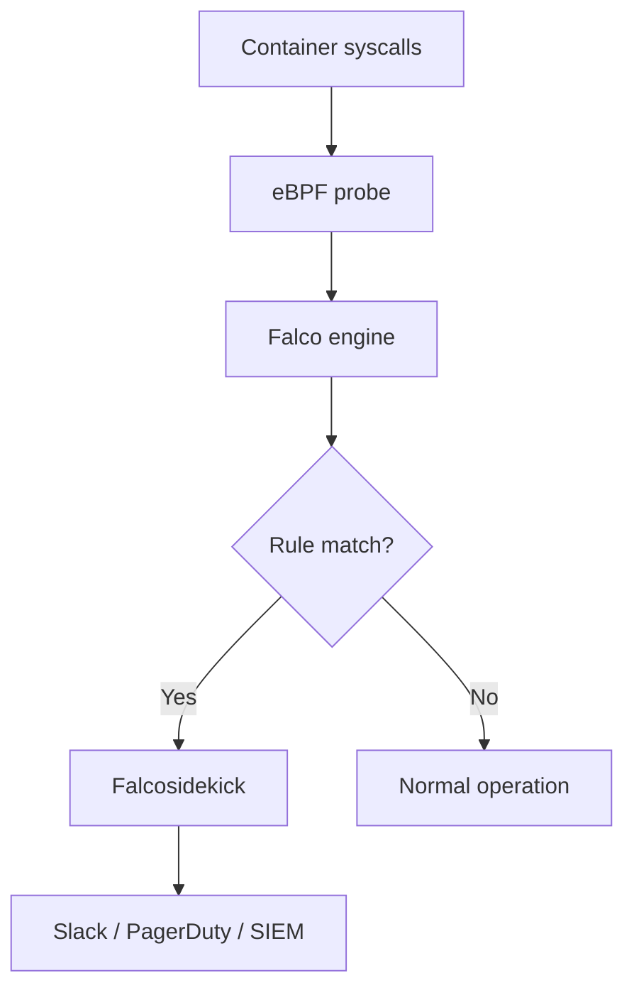

> 💡 **Quick Answer:** security

## The Problem

Engineers need production-ready guides for these essential Kubernetes ecosystem tools. Incomplete documentation leads to misconfiguration and security gaps.

## The Solution

### Install Falco

```bash
helm repo add falcosecurity https://falcosecurity.github.io/charts
helm install falco falcosecurity/falco \
  --namespace falco --create-namespace \
  --set falcosidekick.enabled=true \
  --set falcosidekick.config.slack.webhookurl="https://hooks.slack.com/..." \
  --set driver.kind=ebpf
```

### How Falco Works

Falco uses eBPF probes to monitor system calls in real time — no sidecar needed. It runs as a DaemonSet and detects suspicious behavior inside containers.

### Default Rules Detect

| Threat | Rule | Severity |
|--------|------|----------|
| Shell in container | `Terminal shell in container` | Warning |
| Read sensitive file | `Read sensitive file untrusted` | Warning |
| Write to /etc | `Write below /etc` | Error |
| Privilege escalation | `Container privilege escalation` | Critical |
| Unexpected network | `Unexpected outbound connection` | Warning |
| Crypto mining | `Detect crypto miners using the Stratum protocol` | Critical |

### Custom Rules

```yaml
# /etc/falco/rules.d/custom-rules.yaml
- rule: Unauthorized Process in Nginx
  desc: Detect unexpected processes in nginx containers
  condition: >
    spawned_process and container and
    container.image.repository = "nginx" and
    not proc.name in (nginx)
  output: >
    Unexpected process in nginx (user=%user.name command=%proc.cmdline
    container=%container.name image=%container.image.repository)
  priority: WARNING
  tags: [container, process]

- rule: Database Port Scan
  desc: Detect connections to database ports from non-app containers
  condition: >
    outbound and container and
    fd.sport in (3306, 5432, 27017, 6379) and
    not container.image.repository in (my-app, migration-tool)
  output: >
    Database connection from unauthorized container
    (container=%container.name image=%container.image.repository dest=%fd.name)
  priority: ERROR
```

### Falcosidekick — Alert Routing

```yaml
# Route alerts to multiple destinations
config:
  slack:
    webhookurl: "https://hooks.slack.com/..."
    minimumpriority: warning
  pagerduty:
    routingkey: "<key>"
    minimumpriority: critical
  elasticsearch:
    hostport: "http://elasticsearch:9200"
    index: falco
    minimumpriority: notice
```



## Frequently Asked Questions

### Falco vs Pod Security Standards?

PSS prevents misconfigurations at admission time. Falco detects runtime threats after pods are running. They're complementary — PSS is prevention, Falco is detection.

### Performance impact?

eBPF-based Falco adds <1% CPU overhead per node. It's much lighter than ptrace-based or sidecar approaches.

## Best Practices

- Start with default configurations and customize as needed
- Test in a non-production cluster first
- Monitor resource usage after deployment
- Keep components updated for security patches

## Key Takeaways

- This tool fills a critical gap in the Kubernetes ecosystem
- Follow the principle of least privilege for all configurations
- Automate where possible to reduce manual errors
- Monitor and alert on operational metrics
