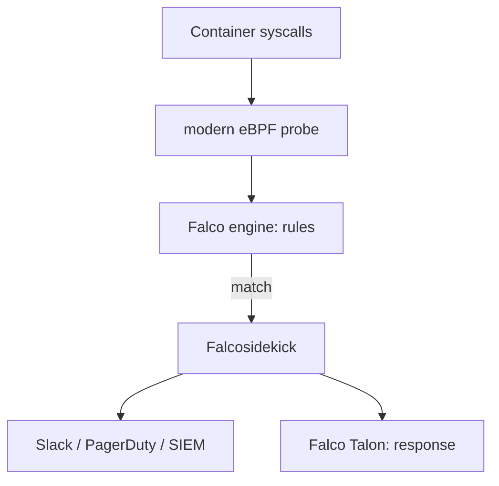

> 💡 **Quick Answer:** Falco watches Linux syscalls on every node (eBPF, DaemonSet) and fires alerts on runtime threats that admission control can't see: a shell spawned in a container, `/etc/shadow` read, writes below `/etc`, crypto miners, unexpected outbound connections. Install: `helm install falco falcosecurity/falco -n falco --create-namespace --set driver.kind=modern_ebpf --set falcosidekick.enabled=true`. Rules are YAML conditions on syscall events; Falcosidekick routes alerts to Slack, PagerDuty, SIEM or webhooks.
>
> **Gotcha:** The chart loads only the **stable** ruleset by default. Rules such as crypto-miner or outbound-connection detection live in the incubating/sandbox rulesets and must be enabled explicitly.

## Why Runtime Detection

Admission controllers (Pod Security Admission, Kyverno) validate at create time. They can't detect:

- An attacker `exec`-ing into a running container
- A container reading `/etc/shadow` or private keys
- Unexpected outbound connections (C2 callbacks, exfiltration)
- Privilege escalation or package installs at runtime
- Crypto-mining processes spawning

PSS is prevention; Falco is detection. Run both.

## Install Falco

```bash
helm repo add falcosecurity https://falcosecurity.github.io/charts
helm repo update
helm install falco falcosecurity/falco \
  -n falco --create-namespace \
  --set driver.kind=modern_ebpf \
  --set falcosidekick.enabled=true \
  --set falcosidekick.webui.enabled=true \
  --set falcosidekick.config.slack.webhookurl=https://hooks.slack.com/services/xxx

kubectl get pods -n falco
# falco-xxxxx               2/2 Running   (DaemonSet, one per node)
# falco-falcosidekick-xxx   1/1 Running   (alert routing)

kubectl logs -n falco -l app.kubernetes.io/name=falco -c falco --tail=20
```

`modern_ebpf` is CO-RE: no kernel headers or module build, needs kernel ≥ 5.8 with BTF (RHEL/RHCOS 9, Ubuntu 22.04+). Fall back to `driver.kind=kmod` only on older kernels. On OpenShift the Falco service account needs the `privileged` SCC.

## Default Rules (Stable Ruleset)

| Threat | Rule | Priority |
|--------|------|----------|
| Interactive shell in container | `Terminal shell in container` | NOTICE |
| Sensitive file read | `Read sensitive file untrusted` | WARNING |
| Binary tampering | `Modify binary dirs` | ERROR |
| Log wiping | `Clear Log Activities` | WARNING |
| Container escape attempts | `Fileless execution via memfd_create`, `Drop and execute new binary in container` | CRITICAL |
| Packet tooling / recon | `Packet socket created in container` | NOTICE |
| Crypto mining | `Detect outbound connections to common miner pool ports` (sandbox) | CRITICAL |

Enable extra rulesets through Helm values:

```yaml
falcoctl:
  config:
    artifact:
      install:
        refs: [falco-rules, falco-incubating-rules, falco-sandbox-rules]   # optionally pin :<major>
      follow:
        refs: [falco-rules, falco-incubating-rules, falco-sandbox-rules]
falco:
  rules_files:
    - /etc/falco/falco_rules.yaml
    - /etc/falco/falco-incubating_rules.yaml
    - /etc/falco/falco-sandbox_rules.yaml
    - /etc/falco/rules.d
```

## Custom Rules

Ship custom rules via `customRules` in Helm values (mounted into `/etc/falco/rules.d`):

```yaml
customRules:
  custom-rules.yaml: |-
    - rule: Unexpected process in nginx
      desc: Anything other than nginx running in an nginx container
      condition: >
        spawned_process and container
        and container.image.repository endswith "nginx"
        and not proc.name in (nginx)
      output: >
        Unexpected process in nginx (user=%user.name command=%proc.cmdline
        pod=%k8s.pod.name ns=%k8s.ns.name image=%container.image.repository)
      priority: WARNING
      tags: [container, process]

    - rule: Crypto mining process
      desc: Known miner binaries or stratum pool URLs
      condition: >
        spawned_process and container
        and (proc.name in (xmrig, minerd, cpuminer, minergate)
             or proc.cmdline contains "stratum+tcp"
             or proc.cmdline contains "mining.pool")
      output: >
        Crypto mining detected (pod=%k8s.pod.name ns=%k8s.ns.name
        process=%proc.name command=%proc.cmdline)
      priority: CRITICAL
      tags: [container, mitre_impact]

    - rule: Container runtime socket mounted
      desc: Container has the host container-runtime socket mounted
      condition: >
        container and container_started
        and (container.mounts contains "/var/run/docker.sock"
             or container.mounts contains "/var/run/crio/crio.sock"
             or container.mounts contains "/run/containerd/containerd.sock")
      output: >
        Runtime socket mounted (pod=%k8s.pod.name image=%container.image.repository
        mounts=%container.mounts)
      priority: WARNING

    - rule: Unauthorized database connection
      desc: Outbound connection to DB ports from images not on the allowlist
      condition: >
        outbound and container
        and fd.sport in (3306, 5432, 27017, 6379)
        and not container.image.repository in (my-app, migration-tool)
      output: >
        DB connection from unexpected container (pod=%k8s.pod.name
        image=%container.image.repository dest=%fd.name)
      priority: ERROR

    - rule: Database credential file access
      desc: Reads of common DB credential files
      condition: >
        open_read and container
        and (fd.name endswith ".pgpass" or fd.name endswith ".my.cnf"
             or fd.name endswith "credentials.json")
      output: >
        DB credential file read (pod=%k8s.pod.name file=%fd.name process=%proc.name)
      priority: CRITICAL
```

Tune noise without editing upstream rules by appending exceptions:

```yaml
- rule: Terminal shell in container
  exceptions:
    - name: debug_namespaces
      fields: [k8s.ns.name]
      comps: [in]
      values: [[debug, sandbox]]
  override:
    exceptions: append
```

Rule syntax, macros and lists in depth: [Falco rules guide](/recipes/security/kubernetes-falco-rules-guide/).

## Falcosidekick Alert Routing

```yaml
falcosidekick:
  config:
    slack:
      webhookurl: "https://hooks.slack.com/services/xxx"
      channel: "#security-alerts"
      minimumpriority: "warning"
    pagerduty:
      routingkey: "<events-v2-routing-key>"
      minimumpriority: "critical"
    elasticsearch:
      hostport: "http://elasticsearch:9200"
      index: "falco"
      minimumpriority: "notice"
    webhook:
      address: "http://incident-handler:8080/falco"
      minimumpriority: "error"
```

Falcosidekick supports 60+ outputs (Teams, OpsGenie, Loki, S3, CloudWatch, Datadog, Kafka, Syslog…) and exposes Prometheus metrics:

```promql
# Alerts per rule (Falcosidekick metrics)
sum(rate(falco_events[5m])) by (rule)

# Critical alerts by namespace
sum(increase(falco_events{priority="Critical"}[1h])) by (k8s_ns_name)
```


```mermaid
graph TD
    A[Container syscalls] --> B[modern eBPF probe]
    B --> C[Falco engine: rules]
    C -->|match| E[Falcosidekick]
    E --> F[Slack / PagerDuty / SIEM]
    E --> T[Falco Talon: response]
```

## Automated Response

[Falco Talon](https://github.com/falcosecurity/falco-talon) receives Falcosidekick events and runs actions: terminate the pod, label it, apply a NetworkPolicy to isolate it, or collect forensics. Start in log-only mode — auto-killing pods on noisy rules causes outages.

## Verify Falco Is Working

```bash
# Interactive shell -> "Terminal shell in container"
kubectl run falco-test --image=alpine --rm -it --restart=Never -- sh

# Sensitive file read -> "Read sensitive file untrusted"
kubectl run falco-test2 --image=alpine --rm -i --restart=Never -- cat /etc/shadow

kubectl logs -n falco -l app.kubernetes.io/name=falco -c falco --tail=20 | grep -E "Notice|Warning"
```

## Common Issues

**Falco pod CrashLoopBackOff** — driver failed to load. Check `kubectl logs -c falco-driver-loader` / `falco`; use `modern_ebpf` (no headers) or confirm the kernel has BTF (`ls /sys/kernel/btf/vmlinux`).

**Too many alerts** — add rule exceptions (above), raise `minimumpriority` per output, and disable rules you don't need with `- rule: X` / `enabled: false`.

**No Kubernetes metadata (`k8s.pod.name=<NA>`)** — Falco reads pod metadata from the container runtime socket; make sure the chart's `collectors` point at your runtime (containerd vs CRI-O).

**Performance** — modern eBPF typically costs ~1–2% CPU per node; heavy syscall workloads cost more. Set requests/limits and watch Falco's own `falcosecurity_falco_*` metrics.

## Best Practices

- **modern_ebpf driver** — no kernel headers, best compatibility on current kernels
- **Start with stable rules, add incubating/sandbox selectively**
- **Tune exceptions per namespace/image** rather than disabling rules globally
- **Route by severity** — critical to PagerDuty, the rest to Slack/SIEM
- **Pair with prevention** — PSS restricted, NetworkPolicy default deny, read-only root FS

## Frequently Asked Questions

### What is Falco in Kubernetes?

Falco is a CNCF-graduated runtime security tool that runs as a DaemonSet, inspects kernel syscalls via eBPF, enriches them with container and Kubernetes metadata, and raises alerts when events match rules describing suspicious behavior.

### Falco vs Pod Security Standards?

Pod Security Standards block risky pod specs at admission time. Falco detects malicious behavior after the pod is running. They're complementary: prevention plus detection.

### Does Falco block attacks?

No, Falco only detects and alerts. Blocking or remediation comes from response tooling such as Falco Talon, or from preventive controls like NetworkPolicy and seccomp.

### What is the performance impact of Falco?

With the modern eBPF driver, typically 1–2% CPU per node for common workloads. Syscall-heavy workloads and very broad custom rules increase the cost.
