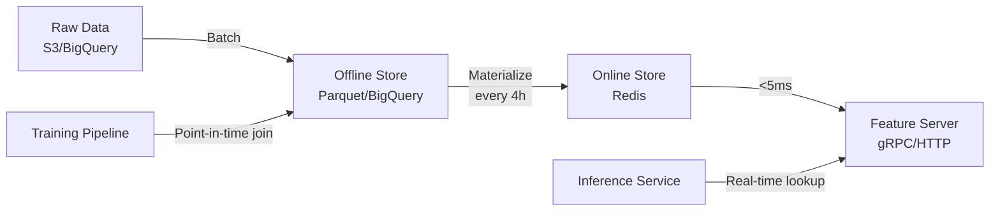

> 💡 **Quick Answer:** Deploy Feast on Kubernetes with a Redis online store for real-time serving (<5ms p99) and an offline store (BigQuery/Redshift/file) for training data. Define features as code in `feature_store.yaml`, materialize from offline to online, and serve via gRPC/HTTP.

## The Problem

ML teams duplicate feature engineering across projects — the same "user_last_7d_purchases" computed differently in 5 training pipelines and 3 serving endpoints. Feature stores centralize feature definitions, ensure consistency between training and serving, and provide point-in-time correctness.

## The Solution

### Install Feast on Kubernetes

```bash
pip install feast[redis]

# Initialize feature repository
feast init my_features
cd my_features
```

### Feature Store Configuration

```yaml
# feature_store.yaml
project: my_ml_project
registry: s3://feast-registry/registry.pb
provider: local
online_store:
  type: redis
  connection_string: "redis-master.feast.svc.cluster.local:6379"
offline_store:
  type: file
entity_key_serialization_version: 2
```

### Feature Definitions

```python
# features.py
from feast import Entity, FeatureView, Field, FileSource
from feast.types import Float32, Int64, String
from datetime import timedelta

# Entity
user = Entity(
    name="user_id",
    join_keys=["user_id"],
)

# Data source
user_stats_source = FileSource(
    path="s3://data/user_stats.parquet",
    timestamp_field="event_timestamp",
)

# Feature view
user_features = FeatureView(
    name="user_features",
    entities=[user],
    schema=[
        Field(name="total_purchases", dtype=Int64),
        Field(name="avg_order_value", dtype=Float32),
        Field(name="account_age_days", dtype=Int64),
        Field(name="preferred_category", dtype=String),
    ],
    source=user_stats_source,
    ttl=timedelta(days=1),
    online=True,
)
```

### Deploy Feature Server on Kubernetes

```yaml
apiVersion: apps/v1
kind: Deployment
metadata:
  name: feast-server
  namespace: feast
spec:
  replicas: 3
  template:
    spec:
      containers:
        - name: feast
          image: registry.example.com/feast-server:0.40
          command: ["feast", "serve", "--host", "0.0.0.0", "--port", "6566"]
          ports:
            - containerPort: 6566
          resources:
            requests:
              cpu: 500m
              memory: 1Gi
---
apiVersion: v1
kind: Service
metadata:
  name: feast-online
spec:
  selector:
    app: feast-server
  ports:
    - port: 6566
      targetPort: 6566
```

### Online Serving (<5ms)

```python
from feast import FeatureStore

store = FeatureStore(repo_path=".")

# Real-time feature retrieval
features = store.get_online_features(
    features=[
        "user_features:total_purchases",
        "user_features:avg_order_value",
    ],
    entity_rows=[{"user_id": "user_123"}],
).to_dict()
```

### Materialization Job (Offline → Online)

```yaml
apiVersion: batch/v1
kind: CronJob
metadata:
  name: feast-materialize
  namespace: feast
spec:
  schedule: "0 */4 * * *"
  jobTemplate:
    spec:
      template:
        spec:
          containers:
            - name: materialize
              image: registry.example.com/feast-server:0.40
              command:
                - feast
                - materialize-incremental
                - "$(date -u +%Y-%m-%dT%H:%M:%S)"
          restartPolicy: OnFailure
```



## Common Issues

**Feature values stale in online store**

Materialization CronJob may have failed. Check: `kubectl get jobs -n feast`. Reduce materialization interval from 4h to 1h for time-sensitive features.

**Training-serving skew (different features in training vs production)**

Always use Feast for both training (offline) and serving (online). Point-in-time joins in offline store prevent data leakage. Never compute features independently in training and serving code.

## Best Practices

- **Materialize frequently** — 1-4 hour intervals depending on freshness requirements
- **Redis for online store** — <5ms p99 latency for real-time serving
- **Point-in-time joins** for training — prevents data leakage from future features
- **Feature monitoring** — alert on staleness, null rates, distribution drift
- **Version features** — changing a feature definition requires retraining models

## Key Takeaways

- Feast centralizes feature definitions — consistent between training and serving
- Online store (Redis) serves features in <5ms; offline store for training data
- Materialization syncs features from offline to online on a schedule
- Point-in-time joins prevent data leakage in training datasets
- Feature store eliminates duplicated feature engineering across ML projects
