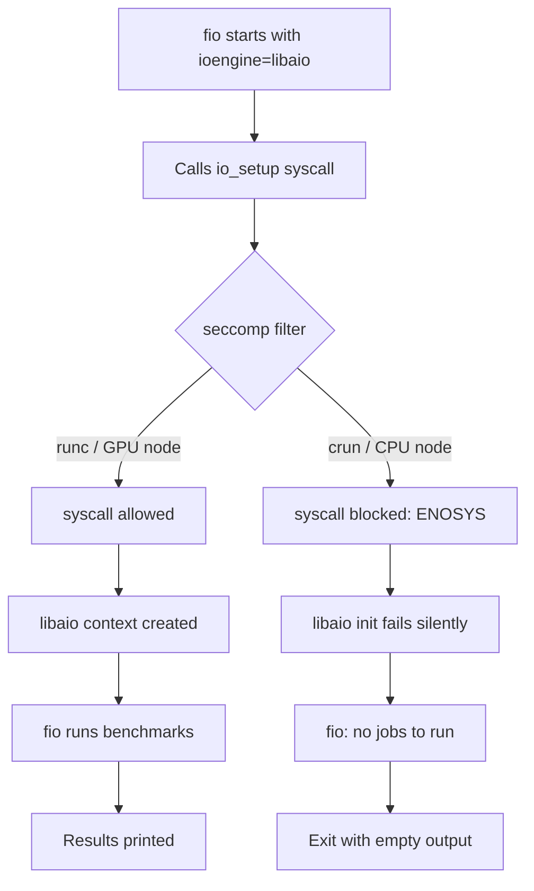

> 💡 **Quick Answer:** fio with `--ioengine=libaio` silently exits on OpenShift CPU nodes using `crun` because seccomp filters block `io_setup`/`io_submit` syscalls. GPU nodes use `runc` which allows them. Fix: switch to `--ioengine=psync`, use `--ioengine=io_uring`, or set `seccompProfile: Unconfined` on the pod.
>
> **Key insight:** fio prints NO error when libaio initialization fails under seccomp — it just exits with zero output, making this extremely hard to diagnose.
>
> **Gotcha:** The mount output looks identical on both node types. The difference is the container runtime (`crun` vs `runc`) and its seccomp profile.

## The Problem

You deploy a fio DaemonSet across OpenShift nodes. On GPU nodes, fio runs perfectly. On CPU nodes, fio immediately exits with zero output:

```
Running:
fio --name=read_4k --ioengine=libaio --bs=4k ...
[FIO OUTPUT FOLLOWS:]
(empty)
```

No error message. No crash. No logs. The pod shows `Completed` status. This is one of the most frustrating debugging experiences in OpenShift because every obvious check passes:

- ✅ Pod is Running with privileged SCC
- ✅ SELinux context is `spc_t`
- ✅ PVC is mounted and writable
- ✅ `/usr/bin/fio` binary exists and is executable
- ✅ No `noexec` on the data filesystem
- ✅ Init container creates the test file successfully

## The Solution

### Root Cause: crun + seccomp + libaio

The difference between GPU and CPU nodes is the **container runtime**:

| Node Type | Runtime | seccomp | libaio |
|-----------|---------|---------|--------|
| GPU nodes | `runc` (NVIDIA runtime) | Permissive | ✅ Works |
| CPU nodes | `crun` | Default profile | ❌ Blocked |

OpenShift CPU nodes use `crun` with the default seccomp profile, which filters these syscalls required by libaio:

- `io_setup` — Initialize async I/O context
- `io_submit` — Submit async I/O operations  
- `io_getevents` — Wait for async I/O completion
- `io_destroy` — Destroy async I/O context

When `io_setup` returns `ENOSYS` or `EPERM`, fio's libaio engine silently fails initialization and exits with no jobs to run. **fio does not print any error** — this is a known behavior.

### Verify the Problem

Check which runtime each node uses:

```bash
# Check container runtime on a CPU node
oc debug node/worker-1 -- chroot /host crictl info 2>/dev/null | grep -i runtime

# Compare with GPU node
oc debug node/gpu-1 -- chroot /host crictl info 2>/dev/null | grep -i runtime
```

Verify seccomp is the issue by checking syscall availability inside the pod:

```bash
# Inside the fio pod on a CPU node
oc exec -n fio-test fio-daemonset-xxxxx -- cat /proc/self/status | grep Seccomp
# Seccomp:    2  (means seccomp filter is active)

# On a GPU node
oc exec -n fio-test fio-daemonset-yyyyy -- cat /proc/self/status | grep Seccomp
# Seccomp:    0  (means no seccomp filtering)
```

Confirm mount points are NOT the issue:

```bash
# Check for noexec on data mounts — these are normal system mounts
oc exec -n fio-test fio-daemonset-xxxxx -- mount | grep noexec
# Only /proc, /sys, devpts, mqueue, resolv.conf — all expected
# The data filesystem will NOT show noexec
```



### Fix Option 1: Switch ioengine to psync (Recommended)

The simplest fix — works on every node without any permission changes:

```bash
# Before (broken on crun nodes)
fio --name=read_4k \
    --filename=/data/testfile \
    --size=1G \
    --rw=randread \
    --bs=4k \
    --numjobs=192 \
    --iodepth=2 \
    --direct=1 \
    --ioengine=libaio \
    --time_based \
    --runtime=60 \
    --group_reporting

# After (works everywhere)
fio --name=read_4k \
    --filename=/data/testfile \
    --size=1G \
    --rw=randread \
    --bs=4k \
    --numjobs=192 \
    --iodepth=1 \
    --direct=1 \
    --ioengine=psync \
    --time_based \
    --runtime=60 \
    --group_reporting
```

> ⚠️ **Note:** `psync` is synchronous — `iodepth` is always 1. If you need async I/O depth, use `io_uring` instead.

### Fix Option 2: Switch to io_uring (Best Performance)

If your kernel is ≥5.10 (most OpenShift 4.12+ clusters):

```bash
fio --name=read_4k \
    --filename=/data/testfile \
    --size=1G \
    --rw=randread \
    --bs=4k \
    --numjobs=192 \
    --iodepth=2 \
    --direct=1 \
    --ioengine=io_uring \
    --time_based \
    --runtime=60 \
    --group_reporting
```

`io_uring` uses different syscalls (`io_uring_setup`, `io_uring_enter`) that are typically allowed by the default seccomp profile.

### Fix Option 3: Unconfined seccomp Profile

If you must use `libaio`, disable seccomp on the pod:

```yaml
apiVersion: apps/v1
kind: DaemonSet
metadata:
  name: fio-daemonset
  namespace: fio-test
spec:
  selector:
    matchLabels:
      app: fio-benchmark
  template:
    metadata:
      labels:
        app: fio-benchmark
    spec:
      serviceAccountName: fio-privileged
      securityContext:
        seccompProfile:
          type: Unconfined  # Disables seccomp filtering
      initContainers:
        - name: init-create-file
          image: registry.access.redhat.com/ubi9/ubi-minimal:latest
          command:
            - sh
            - -c
            - |
              echo "Creating test file..."
              dd if=/dev/zero of=/data/testfile bs=1M count=1024
              echo "Test file created"
          volumeMounts:
            - name: data-volume
              mountPath: /data
          securityContext:
            privileged: true
      containers:
        - name: fio
          image: registry.access.redhat.com/ubi9/ubi-minimal:latest
          command:
            - sh
            - -c
            - |
              dnf install -y fio
              echo "Running fio with libaio on $(hostname)..."
              fio --name=read_4k \
                  --filename=/data/testfile \
                  --size=1G \
                  --rw=randread \
                  --bs=4k \
                  --numjobs=192 \
                  --iodepth=2 \
                  --direct=1 \
                  --ioengine=libaio \
                  --time_based \
                  --runtime=60 \
                  --group_reporting
          volumeMounts:
            - name: data-volume
              mountPath: /data
          securityContext:
            privileged: true
            runAsUser: 0
      volumes:
        - name: data-volume
          persistentVolumeClaim:
            claimName: fio-data
      tolerations:
        - operator: Exists
```

The SCC must allow unconfined seccomp:

```bash
# Verify your SCC allows it
oc get scc privileged -o jsonpath='{.seccompProfiles}'
# Should include: ["*"] or ["unconfined"]

# Create ServiceAccount with privileged SCC
oc create serviceaccount fio-privileged -n fio-test
oc adm policy add-scc-to-user privileged -z fio-privileged -n fio-test
```

### Fix Option 4: Custom seccomp Profile (Targeted)

Allow only the specific libaio syscalls instead of disabling all seccomp:

```json
{
  "defaultAction": "SCMP_ACT_ERRNO",
  "architectures": ["SCMP_ARCH_X86_64"],
  "syscalls": [
    {
      "names": [
        "io_setup",
        "io_submit",
        "io_getevents",
        "io_destroy",
        "io_cancel"
      ],
      "action": "SCMP_ACT_ALLOW"
    }
  ]
}
```

Deploy as a MachineConfig to place the profile on nodes:

```yaml
apiVersion: machineconfiguration.openshift.io/v1
kind: MachineConfig
metadata:
  name: 99-fio-seccomp-profile
  labels:
    machineconfiguration.openshift.io/role: worker
spec:
  config:
    ignition:
      version: 3.2.0
    storage:
      files:
        - path: /var/lib/kubelet/seccomp/fio-libaio.json
          mode: 0644
          contents:
            source: data:application/json;charset=utf-8;base64,ewogICJkZWZhdWx0QWN0aW9uIjogIlNDTVBfQUNUX0VSUk5PIiwKICAiYXJjaGl0ZWN0dXJlcyI6IFsiU0NNUF9BUkNIX1g4Nl82NCJdLAogICJzeXNjYWxscyI6IFsKICAgIHsKICAgICAgIm5hbWVzIjogWyJpb19zZXR1cCIsICJpb19zdWJtaXQiLCAiaW9fZ2V0ZXZlbnRzIiwgImlvX2Rlc3Ryb3kiLCAiaW9fY2FuY2VsIl0sCiAgICAgICJhY3Rpb24iOiAiU0NNUF9BQ1RfQUxMT1ciCiAgICB9CiAgXQp9
```

Then reference it in the pod:

```yaml
securityContext:
  seccompProfile:
    type: Localhost
    localhostProfile: fio-libaio.json
```

## Common Issues

### fio exits immediately but pod shows Completed
This is the classic libaio+seccomp symptom. fio doesn't crash — it just finds zero valid jobs after libaio init fails. Check `Seccomp` in `/proc/self/status`.

### psync is slower than libaio
Expected — psync is synchronous. For high-IOPS benchmarks where you need async I/O depth, use `io_uring` instead of `psync`. It provides similar performance to `libaio` without the seccomp issues.

### io_uring also fails
Some older kernels or hardened seccomp profiles also block `io_uring_*` syscalls. Fall back to the Unconfined seccomp approach or `psync`.

### GPU nodes work but CPU nodes don't
This is the exact scenario this recipe addresses. GPU nodes use `runc` (NVIDIA container runtime), which has a more permissive seccomp profile. CPU nodes use `crun` with the restrictive default.

### iodepth ignored with psync
Correct — `psync` (POSIX synchronous I/O) always operates at iodepth=1. Set `--iodepth=1` explicitly to avoid confusion.

### How to check if a node uses crun vs runc
```bash
oc debug node/worker-1 -- chroot /host crio config 2>/dev/null | grep runtime_path
# crun → /usr/bin/crun
# runc → /usr/bin/runc
```

## Best Practices

- **Default to `psync` for cross-platform benchmarks** — works on every runtime without special permissions
- **Use `io_uring` for performance parity** with libaio when kernel supports it (≥5.10)
- **Never assume libaio works everywhere** — container runtimes and seccomp profiles vary between node types
- **Always check `Seccomp` field in `/proc/self/status`** before debugging mount or permission issues
- **Log the ioengine initialization** — add `--debug=io` to fio for verbose output that reveals syscall failures
- **Test on target node types** — GPU, CPU, infra nodes may all have different runtimes and seccomp profiles
- **Use `strace` inside privileged pods** to confirm which syscalls are blocked: `strace -e trace=io_setup fio ...`

## Key Takeaways

- fio with `libaio` exits **silently** when seccomp blocks `io_setup` — no error, no logs
- OpenShift CPU nodes using `crun` have stricter seccomp than GPU nodes using `runc`
- The mount output and filesystem permissions are **identical** on both node types — this is a red herring
- Switch to `psync` or `io_uring` for the easiest fix without requiring SCC or seccomp changes
- For libaio specifically, set `seccompProfile: Unconfined` or deploy a custom seccomp profile
- Always verify the container runtime (`crun` vs `runc`) when debugging node-specific behavior differences
