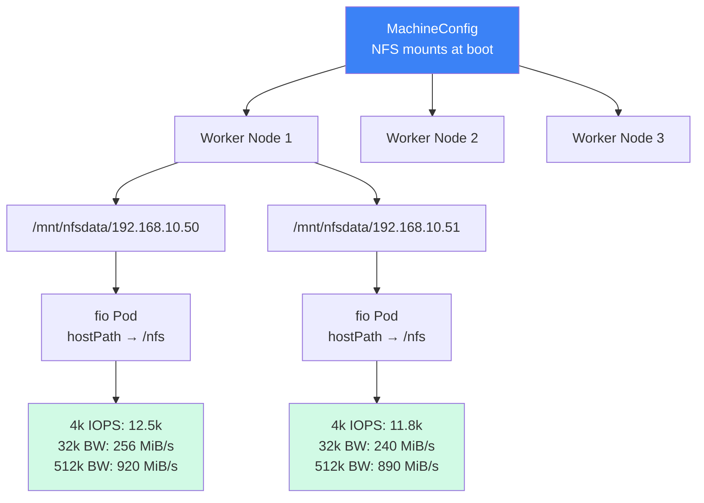

> 💡 **Quick Answer:** Build a custom fio container, deploy parallel pods per NFS endpoint using `hostPath` volumes pointing to node-level NFS mounts, and run 4k/32k/512k random read-write tests. Requires NFS pre-mounted on nodes via MachineConfig — `oc debug` mounts won't persist.

## The Problem

You need to benchmark NFS storage performance across multiple NFS servers from OpenShift worker nodes. You want to measure IOPS, bandwidth, and latency at different block sizes (4k, 32k, 512k) to validate storage infrastructure before running production workloads. Standard tools like `dd` don't give you the detail you need — fio is the industry standard.

## The Solution

### Prerequisites

NFS must be mounted on the worker nodes **before** running fio. See the [MachineConfig NFS Mount recipe](/recipes/storage/machineconfig-nfs-mount-openshift/) — `oc debug` mounts are ephemeral and will cause fio to report zero results.

### Step 1: Build the Fio Container Image

```dockerfile
# Dockerfile
FROM registry.access.redhat.com/ubi9/ubi-minimal:latest

RUN microdnf install -y fio && \
    microdnf clean all

USER 1001
ENTRYPOINT ["/usr/bin/fio"]
```

```bash
# Build and push to your registry
podman build -t registry.example.com/tools/fio:latest .
podman push registry.example.com/tools/fio:latest
```

### Step 2: Create the Test Namespace

```bash
oc new-project fio-test

# Allow hostPath volumes (required for node-level NFS mounts)
oc label namespace fio-test \
  pod-security.kubernetes.io/enforce=baseline \
  pod-security.kubernetes.io/warn=baseline
```

### Step 3: Single NFS Endpoint Benchmark Pod

```yaml
# fio-single.yaml
apiVersion: v1
kind: Pod
metadata:
  name: fio-nfs-benchmark
  namespace: fio-test
spec:
  restartPolicy: Never
  nodeSelector:
    node-role.kubernetes.io/worker: ""
  containers:
    - name: fio
      image: registry.example.com/tools/fio:latest
      command: ["/bin/sh", "-c"]
      args:
        - |
          echo "=== 4K Random Read/Write ==="
          fio --name=4k-randrw \
              --directory=/nfs \
              --rw=randrw \
              --bs=4k \
              --size=1G \
              --numjobs=4 \
              --direct=1 \
              --time_based \
              --runtime=60 \
              --group_reporting \
              --output-format=normal

          echo "=== 32K Random Read/Write ==="
          fio --name=32k-randrw \
              --directory=/nfs \
              --rw=randrw \
              --bs=32k \
              --size=1G \
              --numjobs=4 \
              --direct=1 \
              --time_based \
              --runtime=60 \
              --group_reporting \
              --output-format=normal

          echo "=== 512K Sequential Read/Write ==="
          fio --name=512k-seqrw \
              --directory=/nfs \
              --rw=rw \
              --bs=512k \
              --size=1G \
              --numjobs=4 \
              --direct=1 \
              --time_based \
              --runtime=60 \
              --group_reporting \
              --output-format=normal

          echo "=== ALL TESTS DONE ==="
      securityContext:
        capabilities:
          drop: ["ALL"]
        seccompProfile:
          type: RuntimeDefault
      resources:
        requests:
          cpu: 500m
          memory: 512Mi
        limits:
          cpu: "2"
          memory: 2Gi
      volumeMounts:
        - name: nfs-data
          mountPath: /nfs
  volumes:
    - name: nfs-data
      hostPath:
        path: /mnt/nfsdata/192.168.10.50
        type: Directory
```

### Step 4: Parallel Benchmark Across Multiple NFS Servers

```bash
#!/bin/bash
# run-fio-parallel.sh — Launch fio pods for all NFS endpoints in parallel

NFS_SERVERS=(
  "192.168.10.50"
  "192.168.10.51"
  "192.168.10.52"
  "192.168.10.53"
  "192.168.10.54"
)
NAMESPACE="fio-test"
FIO_IMAGE="registry.example.com/tools/fio:latest"
MOUNT_ROOT="/mnt/nfsdata"

for IP in "${NFS_SERVERS[@]}"; do
  # Convert dots to dashes for valid pod name
  POD_NAME="fio-$(echo $IP | tr '.' '-')"
  MOUNT_PATH="${MOUNT_ROOT}/${IP}"

  echo "Launching ${POD_NAME} ..."

  # Delete existing pod if present
  oc delete pod "${POD_NAME}" -n ${NAMESPACE} --ignore-not-found 2>/dev/null

  cat <<EOF | oc apply -f -
apiVersion: v1
kind: Pod
metadata:
  name: ${POD_NAME}
  namespace: ${NAMESPACE}
  labels:
    app: fio-benchmark
    nfs-server: "${IP}"
spec:
  restartPolicy: Never
  nodeSelector:
    node-role.kubernetes.io/worker: ""
  containers:
    - name: fio
      image: ${FIO_IMAGE}
      command: ["/bin/sh", "-c"]
      args:
        - |
          echo "=== Running 4k on ${IP} ==="
          fio --name=4k --directory=/nfs --rw=randrw --bs=4k --size=1G \
              --numjobs=4 --direct=1 --time_based --runtime=60 \
              --group_reporting --output-format=normal

          echo "=== Running 32k on ${IP} ==="
          fio --name=32k --directory=/nfs --rw=randrw --bs=32k --size=1G \
              --numjobs=4 --direct=1 --time_based --runtime=60 \
              --group_reporting --output-format=normal

          echo "=== Running 512k on ${IP} ==="
          fio --name=512k --directory=/nfs --rw=rw --bs=512k --size=1G \
              --numjobs=4 --direct=1 --time_based --runtime=60 \
              --group_reporting --output-format=normal

          echo "ALL TESTS DONE for ${IP}"
      securityContext:
        capabilities:
          drop: ["ALL"]
        seccompProfile:
          type: RuntimeDefault
      resources:
        requests:
          cpu: 500m
          memory: 512Mi
        limits:
          cpu: "2"
          memory: 2Gi
      volumeMounts:
        - name: nfs-volume
          mountPath: /nfs
  volumes:
    - name: nfs-volume
      hostPath:
        path: ${MOUNT_PATH}
        type: Directory
EOF
done

echo ""
echo "All fio pods launched. Monitor with:"
echo "  oc get pods -n ${NAMESPACE} -w"
echo ""
echo "Collect results with:"
echo "  for pod in \$(oc get pods -n ${NAMESPACE} -l app=fio-benchmark -o name); do"
echo "    echo \"=== \$pod ===\""
echo "    oc logs \$pod -n ${NAMESPACE}"
echo "  done"
```

### Step 5: Collect and Parse Results

```bash
#!/bin/bash
# collect-fio-results.sh — Gather results from all fio pods

NAMESPACE="fio-test"

echo "=== FIO NFS Benchmark Results ==="
echo "Date: $(date -u)"
echo ""

for POD in $(oc get pods -n ${NAMESPACE} -l app=fio-benchmark --no-headers -o custom-columns=NAME:.metadata.name); do
  STATUS=$(oc get pod ${POD} -n ${NAMESPACE} -o jsonpath='{.status.phase}')
  echo "--- ${POD} (${STATUS}) ---"

  if [ "$STATUS" = "Succeeded" ]; then
    oc logs ${POD} -n ${NAMESPACE} | grep -E "(IOPS|BW|lat|READ|WRITE|=== )"
  else
    echo "  Pod not completed yet. Current status: ${STATUS}"
  fi
  echo ""
done
```

**Example output (healthy NFS):**

```
--- fio-192-168-10-50 (Succeeded) ---
=== Running 4k on 192.168.10.50 ===
  read: IOPS=12.5k, BW=48.8MiB/s
  write: IOPS=12.4k, BW=48.6MiB/s
   lat (usec): min=45, max=23400, avg=158.32
=== Running 32k on 192.168.10.50 ===
  read: IOPS=8.2k, BW=256MiB/s
  write: IOPS=8.1k, BW=254MiB/s
=== Running 512k on 192.168.10.50 ===
  read: IOPS=1.8k, BW=920MiB/s
  write: IOPS=1.7k, BW=880MiB/s
ALL TESTS DONE for 192.168.10.50
```

### Step 6: JSON Output for Automated Analysis

For programmatic parsing, use `--output-format=json`:

```yaml
args:
  - |
    fio --name=4k --directory=/nfs --rw=randrw --bs=4k --size=1G \
        --numjobs=4 --direct=1 --time_based --runtime=60 \
        --group_reporting --output-format=json \
        --output=/tmp/results-4k.json

    # Print summary
    cat /tmp/results-4k.json | python3 -c "
    import json, sys
    d = json.load(sys.stdin)
    for job in d['jobs']:
        print(f'Read:  IOPS={job[\"read\"][\"iops\"]:.0f}  BW={job[\"read\"][\"bw\"]/1024:.1f} MiB/s  Lat={job[\"read\"][\"lat_ns\"][\"mean\"]/1000:.1f} us')
        print(f'Write: IOPS={job[\"write\"][\"iops\"]:.0f}  BW={job[\"write\"][\"bw\"]/1024:.1f} MiB/s  Lat={job[\"write\"][\"lat_ns\"][\"mean\"]/1000:.1f} us')
    "
```

### Cleanup

```bash
# Delete all fio pods
oc delete pods -n fio-test -l app=fio-benchmark

# Delete the project
oc delete project fio-test
```



## Common Issues

### Fio Completes Instantly with No Output

The `/nfs` directory is empty — NFS is not mounted on the node. **This is the #1 issue.** Verify:
```bash
oc debug node/worker-1 -- chroot /host ls -la /mnt/nfsdata/192.168.10.50/
# If "total 0" → NFS not mounted
# Apply MachineConfig first!
```

### Pod Fails with "completed pod" Error

```
error: cannot exec into a container in a completed pod; current phase is Succeeded
```
The pod already finished. View logs instead:
```bash
oc logs fio-192-168-10-50 -n fio-test
```

### PodSecurity Warnings

`hostPath` volumes trigger warnings in `restricted` namespaces. This is expected — the pods still run. To suppress warnings, label the namespace as `baseline`.

### Fio Reports Very Low IOPS

Check NFS mount options — default `rsize/wsize` may be too small:
```bash
oc debug node/worker-1 -- chroot /host mount | grep nfsdata
# Look for rsize=, wsize= values
# Optimal: rsize=1048576,wsize=1048576 (1MB)
```

## Best Practices

- **Pre-mount NFS via MachineConfig** — never rely on `oc debug` mounts for benchmarking
- **Use `--direct=1`** — bypasses page cache for accurate storage measurement
- **Use `--time_based --runtime=60`** — consistent test duration regardless of data size
- **Use `--group_reporting`** — aggregates results across numjobs for cleaner output
- **Run 3 block sizes** — 4k (IOPS-bound), 32k (mixed), 512k (throughput-bound)
- **Use DNS-safe pod names** — replace dots with dashes in IP-based names
- **Set resource requests** — prevent fio pods from being evicted mid-benchmark
- **Run tests during a maintenance window** — fio generates significant I/O load

## Key Takeaways

- Fio is the standard tool for NFS storage benchmarking — `dd` doesn't cut it
- NFS must be mounted on nodes via MachineConfig before fio can access data
- Empty `/nfs` directory = mount missing = fio completes instantly with zero results
- Run parallel pods to benchmark multiple NFS endpoints simultaneously
- 4k random tests measure IOPS; 512k sequential tests measure throughput
- Use `--output-format=json` for automated result parsing
- Always verify mounts with `mount | grep` before launching benchmarks
