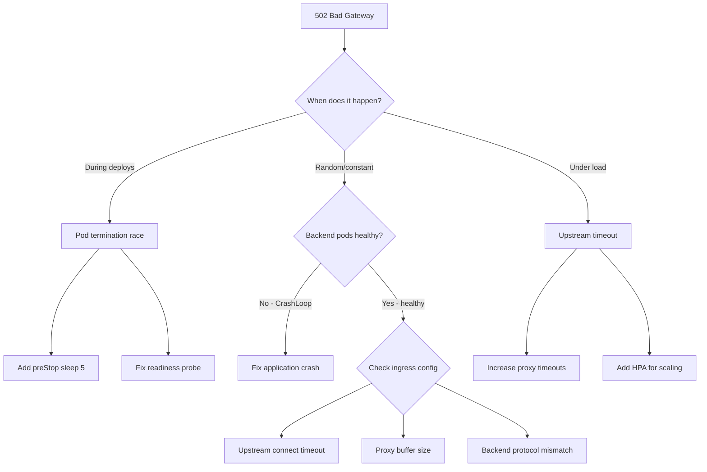

> 💡 **Quick Answer:** 502 Bad Gateway in Kubernetes usually means the ingress/load balancer forwarded a request to a pod that isn't ready (during deploy) or has terminated. Fix with proper readiness probes, preStop hooks with `sleep 5`, and matching upstream timeouts.

## The Problem

You see `502 Bad Gateway` intermittently, typically during:
- Rolling deployments (new pods starting, old pods terminating)
- Pod crashes or OOMKills
- Autoscaling events (pods not ready yet)
- Upstream timeout mismatches

## The Solution

### Root Cause Decision Tree



### Fix 1: Deployment Race Condition (Most Common)

The #1 cause: during rolling updates, the ingress sends traffic to a pod that's already terminating but hasn't been removed from endpoints yet.

```yaml
apiVersion: apps/v1
kind: Deployment
spec:
  template:
    spec:
      terminationGracePeriodSeconds: 30
      containers:
        - name: app
          # Readiness probe — pod only receives traffic when ready
          readinessProbe:
            httpGet:
              path: /healthz
              port: 8080
            initialDelaySeconds: 5
            periodSeconds: 5
            failureThreshold: 2
          # preStop hook — wait for endpoint removal propagation
          lifecycle:
            preStop:
              exec:
                command: ["/bin/sh", "-c", "sleep 5"]
```

**Why `sleep 5`?** After a pod starts terminating:
1. Kubelet sends SIGTERM
2. Endpoints controller removes pod from Service endpoints
3. Ingress controller picks up the change (~1-5s delay)

Without the sleep, requests arrive during step 2-3 gap.

### Fix 2: Ingress Nginx Timeout Configuration

```yaml
apiVersion: networking.k8s.io/v1
kind: Ingress
metadata:
  name: myapp
  annotations:
    # Increase upstream timeouts
    nginx.ingress.kubernetes.io/proxy-connect-timeout: "10"
    nginx.ingress.kubernetes.io/proxy-send-timeout: "60"
    nginx.ingress.kubernetes.io/proxy-read-timeout: "60"
    # Increase buffer size for large headers
    nginx.ingress.kubernetes.io/proxy-buffer-size: "16k"
    # Retry on 502 to next upstream
    nginx.ingress.kubernetes.io/proxy-next-upstream: "error timeout http_502"
    nginx.ingress.kubernetes.io/proxy-next-upstream-tries: "3"
```

### Fix 3: Backend Protocol Mismatch

```yaml
# If backend speaks HTTPS or gRPC
metadata:
  annotations:
    nginx.ingress.kubernetes.io/backend-protocol: "HTTPS"
    # Or for gRPC
    nginx.ingress.kubernetes.io/backend-protocol: "GRPC"
```

### Fix 4: Keep-Alive Timeout Mismatch

```yaml
# Ingress keep-alive must be SHORTER than upstream keep-alive
# If your app closes connections after 60s, nginx must close at 55s
metadata:
  annotations:
    nginx.ingress.kubernetes.io/upstream-keepalive-timeout: "55"
```

### Debugging Commands

```bash
# Check if pods are actually healthy
kubectl get pods -l app=myapp -o wide
kubectl get endpoints myapp

# Check ingress controller logs for upstream errors
kubectl logs -n ingress-nginx -l app.kubernetes.io/component=controller --tail=100 | grep "502\|upstream"

# Test direct pod connectivity (bypass ingress)
kubectl port-forward pod/myapp-abc12 8080:8080
curl localhost:8080/healthz

# Check if endpoints are updating during deploy
kubectl get endpoints myapp -w
```

### Fix 5: Gateway API (Cilium/Envoy)

```yaml
apiVersion: gateway.networking.k8s.io/v1
kind: HTTPRoute
metadata:
  name: myapp
spec:
  rules:
    - backendRefs:
        - name: myapp
          port: 8080
      timeouts:
        request: 60s
        backendRequest: 30s
```

## Common Issues

| Issue | Cause | Fix |
|-------|-------|-----|
| 502 during rolling update | Endpoint removal delay | preStop `sleep 5` + readiness probe |
| 502 on first request | App slow to start | Increase `initialDelaySeconds` |
| 502 under load | All backends busy | Add HPA, increase replicas |
| 502 with large uploads | Proxy buffer overflow | Increase `proxy-buffer-size` |
| 502 on WebSocket | Missing upgrade headers | Add `nginx.ingress.kubernetes.io/proxy-http-version: "1.1"` |
| 502 after idle | Keep-alive mismatch | Ingress timeout < app timeout |

## Best Practices

1. **Always use readiness probes** — never route to unready pods
2. **Add `preStop: sleep 5`** on every production deployment — prevents termination race
3. **Set `proxy-next-upstream` to retry on 502** — handles transient failures
4. **Match timeout chain** — client > ingress > backend (each lower than previous)
5. **Monitor 5xx rates** — alert on sudden 502 spikes during deploys

## Key Takeaways

- 502 during deploys = endpoint propagation delay → fix with preStop hook
- 502 random = check pod health, upstream timeouts, protocol mismatch
- 502 under load = not enough backends → scale up or add HPA
- Always set `proxy-next-upstream` for automatic retry on 502
- The ingress controller logs show the exact upstream error — always check there first
