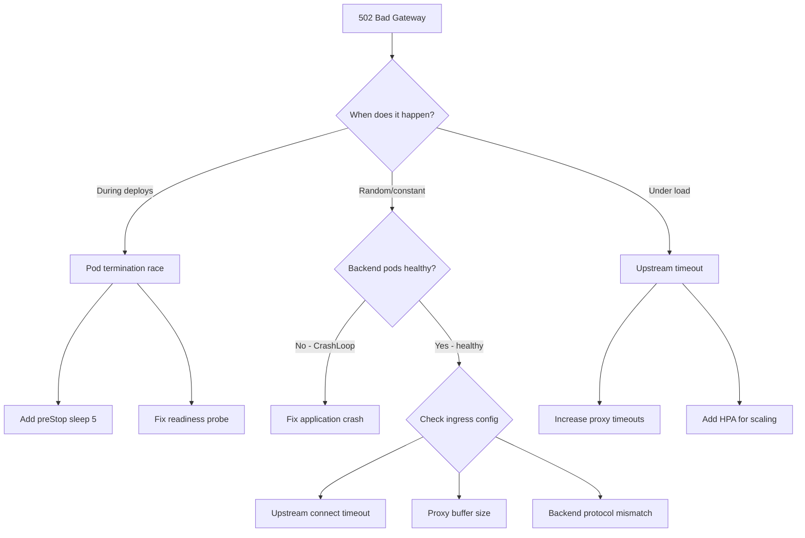

> 💡 **Quick Answer:** A 502 means the Ingress/load balancer couldn't get a valid response from the backend. Constant 502s: run `kubectl get endpoints <svc>` — `<none>` means the Service selector doesn't match Ready pods, or the Ingress points at the wrong Service port. 502s only during deploys: pods are terminating while still in the controller's upstream list — add a readiness probe and a `preStop` sleep. 502s under load or on long requests: tune upstream timeouts and keep-alive.

## The Problem

You see `502 Bad Gateway` intermittently, typically during:
- Rolling deployments (new pods starting, old pods terminating)
- Pod crashes or OOMKills
- Autoscaling events (pods not ready yet)
- Upstream timeout mismatches

## The Solution

### Root Cause Decision Tree


```mermaid
graph TD
    A[502 Bad Gateway] --> B{When does it happen?}
    B -->|During deploys| C[Pod termination race]
    B -->|Random/constant| D{Backend pods healthy?}
    B -->|Under load| E[Upstream timeout]
    
    C --> F[Add preStop sleep 5]
    C --> G[Fix readiness probe]
    
    D -->|No - CrashLoop| H[Fix application crash]
    D -->|Yes - healthy| I{Check ingress config}
    
    I --> J[Upstream connect timeout]
    I --> K[Proxy buffer size]
    I --> L[Backend protocol mismatch]
    
    E --> M[Increase proxy timeouts]
    E --> N[Add HPA for scaling]
```

### Fix 1: Empty Endpoints / Selector or Port Mismatch (Constant 502)

```bash
# Pods Ready? 0/1 pods are removed from endpoints
kubectl get pods -l app=web-app -n production
# web-app-2  0/1  Running  <- NOT READY -> no traffic

# Endpoints — <none> is the #1 cause of constant 502s
kubectl get endpoints web-app -n production

# Selector vs pod labels
kubectl get svc web-app -n production -o jsonpath='{.spec.selector}'
kubectl get pods -n production --show-labels

# Bypass the Ingress
kubectl port-forward svc/web-app 8080:80 -n production
curl -i http://localhost:8080/
```

```yaml
# Service: selector must match pod labels exactly; targetPort = container port
spec:
  selector:
    app: web-app
  ports:
    - port: 80
      targetPort: 8080
---
# Ingress: references the Service port (80), NOT the targetPort
backend:
  service:
    name: web-app
    port:
      number: 80
```

Also confirm the app listens on `0.0.0.0`, not `127.0.0.1` — a localhost-bound app passes `kubectl exec curl localhost` but refuses connections from the controller.

### Fix 2: Deployment Race Condition (502 During Rollouts)

The #1 cause: during rolling updates, the ingress sends traffic to a pod that's already terminating but hasn't been removed from endpoints yet.

```yaml
apiVersion: apps/v1
kind: Deployment
spec:
  template:
    spec:
      terminationGracePeriodSeconds: 30
      containers:
        - name: app
          # Readiness probe — pod only receives traffic when ready
          readinessProbe:
            httpGet:
              path: /healthz
              port: 8080
            initialDelaySeconds: 5
            periodSeconds: 5
            failureThreshold: 2
          # preStop hook — keep serving while endpoint removal propagates
          lifecycle:
            preStop:
              exec:
                command: ["/bin/sh", "-c", "sleep 5"]
              # Distroless images (no shell), K8s 1.30+:
              # sleep:
              #   seconds: 5
```

**Why `sleep 5`?** When a pod is deleted, two things start **in parallel**: the kubelet runs `preStop` and then sends SIGTERM, while the endpoints controller removes the pod from the Service and the Ingress controller reloads its upstreams (~1-5s). Without the sleep the app can exit before the controller stops sending it traffic. Keep `terminationGracePeriodSeconds` greater than the sleep plus your app's drain time.

### Fix 3: Ingress NGINX Timeout Configuration

```yaml
apiVersion: networking.k8s.io/v1
kind: Ingress
metadata:
  name: myapp
  annotations:
    # Increase upstream timeouts
    nginx.ingress.kubernetes.io/proxy-connect-timeout: "10"
    nginx.ingress.kubernetes.io/proxy-send-timeout: "60"
    nginx.ingress.kubernetes.io/proxy-read-timeout: "60"
    # "upstream sent too big header" in logs -> larger response header buffer
    nginx.ingress.kubernetes.io/proxy-buffer-size: "16k"
    # Retry on 502 to next upstream
    nginx.ingress.kubernetes.io/proxy-next-upstream: "error timeout http_502"
    nginx.ingress.kubernetes.io/proxy-next-upstream-tries: "3"
```

### Fix 4: Backend Protocol Mismatch

```yaml
# If backend speaks HTTPS or gRPC
metadata:
  annotations:
    nginx.ingress.kubernetes.io/backend-protocol: "HTTPS"
    # Or for gRPC
    nginx.ingress.kubernetes.io/backend-protocol: "GRPC"
```

### Fix 5: Keep-Alive Timeout Mismatch

```yaml
# Ingress keep-alive must be SHORTER than upstream keep-alive
# If your app closes connections after 60s, nginx must close at 55s
metadata:
  annotations:
    nginx.ingress.kubernetes.io/upstream-keepalive-timeout: "55"
```

### Debugging Commands

```bash
# Check if pods are actually healthy
kubectl get pods -l app=myapp -o wide
kubectl get endpoints myapp

# Check ingress controller logs for upstream errors
kubectl logs -n ingress-nginx -l app.kubernetes.io/component=controller --tail=100 | grep "502\|upstream"

# Test direct pod connectivity (bypass ingress)
kubectl port-forward pod/myapp-abc12 8080:8080
curl localhost:8080/healthz

# Check if endpoints are updating during deploy
kubectl get endpoints myapp -w
```

### Fix 6: Gateway API (Cilium/Envoy)

```yaml
apiVersion: gateway.networking.k8s.io/v1
kind: HTTPRoute
metadata:
  name: myapp
spec:
  rules:
    - backendRefs:
        - name: myapp
          port: 8080
      timeouts:
        request: 60s
        backendRequest: 30s
```

## Common Issues

| Issue | Cause | Fix |
|-------|-------|-----|
| Constant 502, endpoints `<none>` | Selector mismatch or pods not Ready | Fix labels / readiness probe |
| Constant 502, endpoints OK | Wrong Service port, app bound to 127.0.0.1, HTTP vs HTTPS backend | Fix port / bind address / `backend-protocol` |
| 502 during rolling update | Endpoint removal delay | preStop `sleep 5` + readiness probe |
| 502 on first request | App slow to start | Increase `initialDelaySeconds` |
| 502 under load | All backends busy | Add HPA, increase replicas |
| 502 with large response headers/cookies | `upstream sent too big header` | Increase `proxy-buffer-size` |
| 502 when pod OOMKilled/crashing | Backend dies mid-request | Fix limits / crash (see OOMKilled) |
| 502 on WebSocket | Missing upgrade headers | Add `nginx.ingress.kubernetes.io/proxy-http-version: "1.1"` |
| 502 after idle | Keep-alive mismatch | Ingress timeout < app timeout |

## Frequently Asked Questions

### What causes 502 Bad Gateway in Kubernetes Ingress?
The Ingress controller got no valid response from the upstream pod. Most often the Service has no Ready endpoints (selector mismatch or failing readiness probe), the Ingress references the wrong Service port, pods are terminating during a rollout, or the backend speaks HTTPS/gRPC while NGINX sends plain HTTP.

### What is the difference between 502, 503 and 504 in ingress-nginx?
502: the upstream connection failed or returned an invalid response. 503: no upstream at all (Service has zero endpoints, or rate limiting). 504: the upstream accepted the connection but didn't answer within `proxy-read-timeout`.

### How do I find the exact cause of a 502?
Check the controller logs: `kubectl logs -n ingress-nginx deploy/ingress-nginx-controller | grep -E "502|upstream"`. Messages like `connect() failed (111: Connection refused)` point to port/bind problems, `upstream prematurely closed connection` to crashes or keep-alive mismatch, and `too big header` to buffer size.

## Best Practices

1. **Always use readiness probes** — never route to unready pods
2. **Add `preStop: sleep 5`** on every production deployment — prevents termination race
3. **Set `proxy-next-upstream` to retry on 502** — handles transient failures
4. **Match timeout chain** — client > ingress > backend (each lower than previous)
5. **Monitor 5xx rates** — alert on sudden 502 spikes during deploys

## Key Takeaways

- Constant 502 = check `kubectl get endpoints` first — empty endpoints is the most common cause
- 502 during deploys = endpoint propagation delay → fix with preStop hook
- 502 random = check pod health, upstream timeouts, protocol mismatch
- 502 under load = not enough backends → scale up or add HPA
- Always set `proxy-next-upstream` for automatic retry on 502
- The ingress controller logs show the exact upstream error — always check there first
