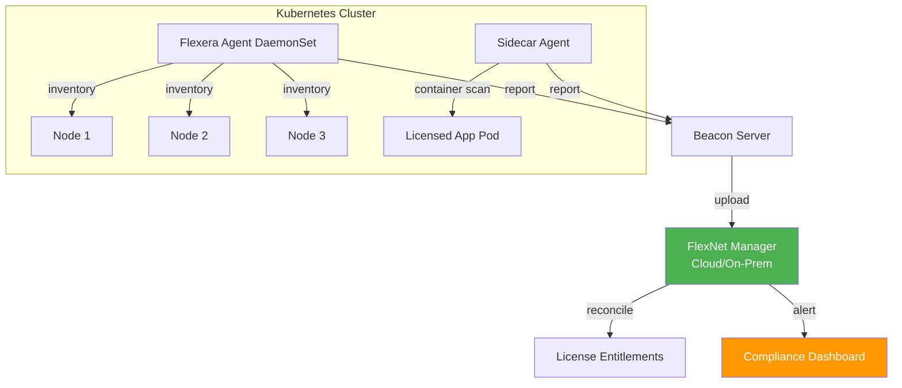

> 💡 **Quick Answer:** Flexera provides software asset management (SAM) and license compliance for Kubernetes environments. Deploy the Flexera inventory agent as a DaemonSet to track software running in containers, map license entitlements to namespaces and clusters, and avoid compliance gaps with GPU software like NVIDIA AI Enterprise, Red Hat OpenShift, and commercial database licenses.

## The Problem

Kubernetes makes software license compliance exponentially harder:

- **Ephemeral containers** — pods spin up and down constantly, traditional license agents lose track
- **Shared nodes** — multiple licensed products run on the same physical host, complicating per-core or per-socket licensing
- **GPU software licensing** — NVIDIA AI Enterprise, CUDA Toolkit Enterprise, and vGPU licenses are tied to GPU counts, not containers
- **OpenShift subscription** — Red Hat licensing is per-core, but pods move across nodes dynamically
- **Audit risk** — "we run it in containers" doesn't exempt you from license audits
- **Multi-cluster sprawl** — licenses must be tracked across dev, staging, and production clusters

Without centralized license management, enterprises face surprise audit bills, over-purchasing, or compliance violations.

## The Solution

### Flexera Architecture for Kubernetes



### Step 1: Deploy the Flexera Inventory Agent

The FlexNet inventory agent runs as a privileged DaemonSet to scan each node's installed software, running processes, and container images:

```yaml
apiVersion: apps/v1
kind: DaemonSet
metadata:
  name: flexera-inventory-agent
  namespace: flexera-system
  labels:
    app: flexera-agent
spec:
  selector:
    matchLabels:
      app: flexera-agent
  template:
    metadata:
      labels:
        app: flexera-agent
    spec:
      hostPID: true
      hostNetwork: true
      nodeSelector:
        kubernetes.io/os: linux
      tolerations:
      - operator: Exists  # Run on ALL nodes including masters and GPU nodes
      containers:
      - name: inventory-agent
        image: registry.example.com/flexera/fnms-inventory-agent:2026.1
        securityContext:
          privileged: true
        env:
        - name: BEACON_URL
          value: "https://beacon.example.com"
        - name: BEACON_TOKEN
          valueFrom:
            secretKeyRef:
              name: flexera-beacon-creds
              key: token
        - name: SCAN_INTERVAL
          value: "86400"  # Daily scan
        - name: SCAN_CONTAINERS
          value: "true"
        - name: NODE_NAME
          valueFrom:
            fieldRef:
              fieldPath: spec.nodeName
        volumeMounts:
        - name: host-root
          mountPath: /host
          readOnly: true
        - name: container-runtime
          mountPath: /var/run/containerd
          readOnly: true
        - name: flexera-data
          mountPath: /var/opt/flexera
        resources:
          requests:
            cpu: 50m
            memory: 128Mi
          limits:
            cpu: 200m
            memory: 512Mi
      volumes:
      - name: host-root
        hostPath:
          path: /
      - name: container-runtime
        hostPath:
          path: /var/run/containerd
      - name: flexera-data
        hostPath:
          path: /var/opt/flexera
          type: DirectoryOrCreate
```

```bash
# Create namespace and credentials
kubectl create namespace flexera-system

kubectl create secret generic flexera-beacon-creds \
  -n flexera-system \
  --from-literal=token="<your-beacon-token>"

# Deploy
kubectl apply -f flexera-daemonset.yaml

# Verify agents running on all nodes
kubectl get pods -n flexera-system -o wide
```

### Step 2: Container Image License Scanning

Track which container images contain licensed software:

```yaml
# CronJob to scan container images for licensed software signatures
apiVersion: batch/v1
kind: CronJob
metadata:
  name: flexera-image-scan
  namespace: flexera-system
spec:
  schedule: "0 2 * * *"  # Daily at 2 AM
  jobTemplate:
    spec:
      template:
        spec:
          serviceAccountName: flexera-scanner
          containers:
          - name: scanner
            image: registry.example.com/flexera/image-scanner:2026.1
            env:
            - name: BEACON_URL
              value: "https://beacon.example.com"
            - name: SCAN_NAMESPACES
              value: "*"  # All namespaces, or comma-separated list
            - name: DETECT_PRODUCTS
              value: "oracle-db,ibm-mq,nvidia-ai-enterprise,redis-enterprise,mongodb-enterprise"
            command:
            - /bin/sh
            - -c
            - |
              # List all running container images
              kubectl get pods --all-namespaces -o jsonpath='{range .items[*]}{.spec.nodeName}{"\t"}{range .spec.containers[*]}{.image}{"\n"}{end}{end}' \
                | sort -u > /tmp/running-images.txt
              
              # Scan each image for license-relevant software
              while read node image; do
                /opt/flexera/scan-image \
                  --image "$image" \
                  --node "$node" \
                  --beacon "$BEACON_URL" \
                  --output /tmp/scan-results/
              done < /tmp/running-images.txt
              
              # Upload results
              /opt/flexera/upload-results --dir /tmp/scan-results/
          restartPolicy: OnFailure
```

### Step 3: GPU and NVIDIA License Tracking

NVIDIA AI Enterprise and vGPU licenses are tied to GPU counts. Track GPU allocation across namespaces:

```yaml
# ConfigMap for GPU license mapping
apiVersion: v1
kind: ConfigMap
metadata:
  name: flexera-gpu-license-map
  namespace: flexera-system
data:
  gpu-licenses.yaml: |
    products:
      nvidia-ai-enterprise:
        metric: per-gpu
        detection:
          - resource: nvidia.com/gpu
          - image-pattern: "nvcr.io/nvidia/*"
          - image-pattern: "nvcr.io/nim/*"
        sku-mapping:
          A100: "NVAIE-A100"
          H100: "NVAIE-H100"
          H200: "NVAIE-H200"
          L40S: "NVAIE-L40S"
      
      nvidia-vgpu:
        metric: per-vgpu
        detection:
          - resource: nvidia.com/vgpu
        
      cuda-toolkit-enterprise:
        metric: per-node
        detection:
          - image-pattern: "*cuda*"
          - process: "nvidia-smi"
```

```bash
# Report: GPU usage per namespace for license reconciliation
kubectl get pods --all-namespaces -o json | jq '
  [.items[] |
    select(.spec.containers[].resources.limits["nvidia.com/gpu"] != null) |
    {
      namespace: .metadata.namespace,
      pod: .metadata.name,
      node: .spec.nodeName,
      gpus: (.spec.containers[] | .resources.limits["nvidia.com/gpu"] // "0")
    }
  ] | group_by(.namespace) | map({
    namespace: .[0].namespace,
    total_gpus: (map(.gpus | tonumber) | add),
    pod_count: length
  })
'
```

### Step 4: OpenShift Subscription Tracking

Red Hat OpenShift is licensed per-core. Track physical core usage:

```bash
#!/bin/bash
# openshift-core-count.sh — for Flexera license reconciliation

echo "=== OpenShift Core Count for Licensing ==="
echo ""

# Physical cores per node (not hyperthreads)
kubectl get nodes -o json | jq -r '
  .items[] | 
  [.metadata.name, 
   (.status.capacity.cpu | tonumber),
   (.metadata.labels["node.kubernetes.io/instance-type"] // "baremetal"),
   (.metadata.labels["node-role.kubernetes.io/worker"] // .metadata.labels["node-role.kubernetes.io/master"] // "unknown" | if . == "" then "yes" else "no" end)
  ] | @tsv
' | column -t -s $'\t' -N "NODE,vCPUs,TYPE,WORKER"

echo ""
echo "=== Total ==="
TOTAL_VCPU=$(kubectl get nodes -o json | jq '[.items[].status.capacity.cpu | tonumber] | add')
# Physical cores = vCPUs / 2 (hyperthreading)
TOTAL_CORES=$((TOTAL_VCPU / 2))
echo "Total vCPUs: $TOTAL_VCPU"
echo "Total physical cores (vCPU/2): $TOTAL_CORES"
echo "OpenShift subscription units needed: $TOTAL_CORES core-pairs ($((TOTAL_CORES / 2)) subscriptions)"
```

### Step 5: FlexNet Manager Reconciliation

Configure license reconciliation rules in FlexNet Manager:

```yaml
# Export format for Flexera bulk import
# license-entitlements.csv
apiVersion: v1
kind: ConfigMap
metadata:
  name: flexera-entitlements
  namespace: flexera-system
data:
  entitlements.yaml: |
    entitlements:
    - product: "Red Hat OpenShift Container Platform"
      metric: "core-pair"
      quantity: 128
      clusters:
        - prod-cluster-1
        - prod-cluster-2
      alert-threshold: 90  # Alert at 90% utilization
    
    - product: "NVIDIA AI Enterprise"
      metric: "per-gpu"
      quantity: 32
      namespaces:
        - ai-inference
        - ml-training
      alert-threshold: 80
    
    - product: "MongoDB Enterprise"
      metric: "per-instance"
      quantity: 10
      detection: "image:mongodb-enterprise-*"
      alert-threshold: 85
```

### Step 6: Compliance Dashboard and Alerts

```yaml
# PrometheusRule for license threshold alerts
apiVersion: monitoring.coreos.com/v1
kind: PrometheusRule
metadata:
  name: license-compliance-alerts
  namespace: flexera-system
spec:
  groups:
  - name: license-compliance
    interval: 1h
    rules:
    - alert: GPULicenseThresholdExceeded
      expr: |
        sum(kube_pod_resource_limit{resource="nvidia_com_gpu"}) 
        > 28  # 90% of 32 licensed GPUs
      for: 1h
      labels:
        severity: warning
        team: platform
      annotations:
        summary: "GPU license utilization above 90%"
        description: "{{ $value }} GPUs in use, 32 licensed. Contact Flexera admin."
    
    - alert: NamespaceUsingUnlicensedSoftware
      expr: |
        flexera_unlicensed_installations > 0
      for: 24h
      labels:
        severity: critical
        team: compliance
      annotations:
        summary: "Unlicensed software detected in Kubernetes"
```

### Reporting Script

```bash
#!/bin/bash
# flexera-k8s-report.sh — weekly license compliance report

echo "=========================================="
echo "  Flexera K8s License Compliance Report"
echo "  $(date '+%Y-%m-%d %H:%M')"
echo "=========================================="

echo ""
echo "--- Node Inventory ---"
kubectl get nodes --no-headers -o custom-columns=\
"NAME:.metadata.name,\
CORES:.status.capacity.cpu,\
MEM:.status.capacity.memory,\
GPU:.status.capacity.nvidia\.com/gpu,\
OS:.status.nodeInfo.osImage" | column -t

echo ""
echo "--- GPU Allocation by Namespace ---"
kubectl get pods -A -o json | jq -r '
  [.items[] | 
   select(.spec.containers[].resources.limits["nvidia.com/gpu"] != null) |
   {ns: .metadata.namespace, gpu: (.spec.containers[].resources.limits["nvidia.com/gpu"] | tonumber)}
  ] | group_by(.ns) | .[] | 
  "\(.[0].ns)\t\(map(.gpu) | add) GPUs"
' | column -t -s $'\t'

echo ""
echo "--- Licensed Container Images Running ---"
kubectl get pods -A -o jsonpath='{range .items[*]}{range .spec.containers[*]}{.image}{"\n"}{end}{end}' \
  | sort -u \
  | grep -iE "oracle|ibm|redis-enterprise|mongodb-enterprise|nvcr.io|mssql|sap"

echo ""
echo "--- Flexera Agent Status ---"
kubectl get ds -n flexera-system flexera-inventory-agent \
  --no-headers -o custom-columns="DESIRED:.status.desiredNumberScheduled,READY:.status.numberReady"
```

## Common Issues

**Agent can't scan container filesystems**

The agent needs `hostPID: true` and access to the container runtime socket (`/var/run/containerd`). On OpenShift, create a custom SCC granting these privileges to the flexera-system service account.

**License counts don't match cloud provider billing**

Cloud provider GPU billing is per-instance-hour. Flexera counts installed/running instances. Reconcile by comparing peak concurrent usage (Flexera) vs total instance-hours (cloud bill).

**Beacon upload fails in disconnected environments**

Deploy an on-premises FlexNet Manager server or use the Flexera batch upload mechanism. Export inventory to CSV and import manually during maintenance windows.

**OpenShift core count is inflated**

Ensure you're counting physical cores, not vCPUs. Hyperthreading doubles the reported CPU count. Divide by 2 for licensing purposes. Some Red Hat agreements count only worker nodes — exclude control plane.

## Best Practices

- **Deploy agents on ALL nodes** — including control plane, infra, and GPU nodes
- **Scan daily** — container churn means yesterday's inventory is already stale
- **Map licenses to namespaces** — makes chargeback and audit response straightforward
- **Track GPU licenses separately** — NVIDIA licensing is per-GPU, not per-core
- **Automate reporting** — weekly compliance reports catch drift before audits find it
- **Keep entitlement records current** — update Flexera when you purchase/renew licenses
- **Test agent resource limits** — the scan is CPU-intensive; don't starve production workloads

## Key Takeaways

- Kubernetes makes license compliance harder — ephemeral containers, shared nodes, and multi-cluster sprawl
- Flexera inventory agents run as DaemonSets to track software across all nodes
- GPU software (NVIDIA AI Enterprise, vGPU) requires per-GPU license tracking
- OpenShift licensing is per physical core — automate core counting for audit readiness
- Set up Prometheus alerts for license threshold breaches before you hit compliance issues
- Weekly automated reports are your best defense against surprise audit findings
