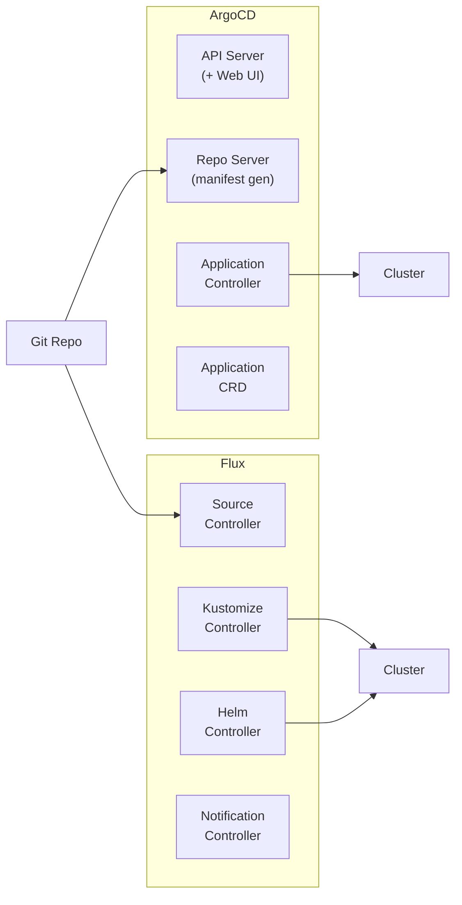

> 💡 **Quick Answer:** **ArgoCD** has a rich UI, Application CRD model, and strong RBAC — best for teams that want a visual GitOps dashboard. **Flux** is controller-based with no UI (BYO Grafana), uses native Kubernetes resources, and excels at multi-tenancy — best for platform teams managing many clusters. Both are CNCF graduated projects; choose based on your team's workflow.

## The Problem

GitOps is the standard delivery model for Kubernetes in 2026. Both Flux and ArgoCD implement the same core pattern: reconcile cluster state with Git. But they differ in architecture, UX, multi-cluster support, and extension model. Choosing wrong creates migration pain later.



## The Solution

### Head-to-Head Comparison

| Feature | ArgoCD | Flux |
|---------|--------|------|
| **CNCF status** | Graduated | Graduated |
| **Architecture** | Monolithic (API server + controllers) | Modular (independent controllers) |
| **UI** | Built-in web UI + CLI | No UI (use Grafana, Weave GitOps, or Capacitor) |
| **Core abstraction** | `Application` CRD | `GitRepository` + `Kustomization` / `HelmRelease` |
| **Manifest sources** | Git, Helm, OCI, Kustomize, Jsonnet | Git, Helm, OCI, S3, Buckets |
| **Multi-tenancy** | AppProject RBAC | Namespace-scoped controllers |
| **Multi-cluster** | Hub-spoke (Application targets remote clusters) | Hub-spoke or per-cluster Flux |
| **Helm support** | Template + apply (no Helm lifecycle) | Native `HelmRelease` (tracks releases) |
| **Secrets** | Sealed Secrets, Vault plugin | SOPS, Vault, External Secrets |
| **Diff engine** | Server-side diff + 3-way merge | Server-side apply |
| **Image automation** | Argo Image Updater (separate project) | Built-in Image Automation controllers |
| **Notifications** | Argo Notifications (built-in) | Notification Controller (Slack, Teams, webhooks) |
| **Scalability** | ~200 apps per instance (shard for more) | 1000+ reconciliations per instance |
| **Learning curve** | Lower (UI helps onboarding) | Higher (YAML-only, more concepts) |

### ArgoCD: Quick Setup

```bash
kubectl create namespace argocd
kubectl apply -n argocd -f \
  https://raw.githubusercontent.com/argoproj/argo-cd/stable/manifests/install.yaml

# Get initial admin password
kubectl -n argocd get secret argocd-initial-admin-secret \
  -o jsonpath="{.data.password}" | base64 -d

# Create an Application
argocd app create my-app \
  --repo https://github.com/myorg/manifests.git \
  --path apps/my-app \
  --dest-server https://kubernetes.default.svc \
  --dest-namespace my-app \
  --sync-policy automated
```

```yaml
# ArgoCD Application
apiVersion: argoproj.io/v1alpha1
kind: Application
metadata:
  name: my-app
  namespace: argocd
spec:
  project: default
  source:
    repoURL: https://github.com/myorg/manifests.git
    path: apps/my-app
    targetRevision: main
  destination:
    server: https://kubernetes.default.svc
    namespace: my-app
  syncPolicy:
    automated:
      selfHeal: true
      prune: true
    syncOptions:
      - ServerSideApply=true
```

### Flux: Quick Setup

```bash
flux bootstrap github \
  --owner=myorg \
  --repository=fleet-infra \
  --path=clusters/production \
  --personal

# This creates:
# - Flux controllers in flux-system namespace
# - GitRepository pointing to your repo
# - Kustomization reconciling clusters/production/
```

```yaml
# Flux GitRepository + Kustomization
apiVersion: source.toolkit.fluxcd.io/v1
kind: GitRepository
metadata:
  name: my-app
  namespace: flux-system
spec:
  interval: 5m
  url: https://github.com/myorg/manifests.git
  ref:
    branch: main
---
apiVersion: kustomize.toolkit.fluxcd.io/v1
kind: Kustomization
metadata:
  name: my-app
  namespace: flux-system
spec:
  interval: 10m
  sourceRef:
    kind: GitRepository
    name: my-app
  path: ./apps/my-app
  prune: true
  targetNamespace: my-app
```

### Flux HelmRelease (Native Helm Lifecycle)

```yaml
# Flux manages full Helm release lifecycle
apiVersion: source.toolkit.fluxcd.io/v1
kind: HelmRepository
metadata:
  name: bitnami
  namespace: flux-system
spec:
  interval: 1h
  url: https://charts.bitnami.com/bitnami
---
apiVersion: helm.toolkit.fluxcd.io/v2
kind: HelmRelease
metadata:
  name: postgresql
  namespace: databases
spec:
  interval: 30m
  chart:
    spec:
      chart: postgresql
      version: "16.x"
      sourceRef:
        kind: HelmRepository
        name: bitnami
        namespace: flux-system
  values:
    auth:
      postgresPassword: "${PG_PASSWORD}"  # SOPS-encrypted
    primary:
      persistence:
        size: 50Gi
  # Automatic rollback on failure
  upgrade:
    remediation:
      retries: 3
  rollback:
    cleanupOnFail: true
```

### When to Choose ArgoCD

- Your team wants a **visual dashboard** for deployments
- You need **RBAC per application/project** (AppProject)
- You use **ApplicationSets** for dynamic app generation
- Your devs are new to GitOps and benefit from the UI
- You need **Jsonnet** or **config management plugins**
- Single cluster or small number of clusters

### When to Choose Flux

- You manage **many clusters** (platform team pattern)
- You need **native Helm lifecycle** (rollback, test, upgrade history)
- You want **namespace-level multi-tenancy** without a shared API server
- You need **image automation** (auto-update image tags from registry)
- You prefer **SOPS for secret encryption** in Git
- You want **minimal footprint** (no API server, no Redis, no UI)

## Common Issues

| Issue | ArgoCD | Flux |
|-------|--------|------|
| App out of sync | Check UI → Sync → verify diff | `flux reconcile ks my-app` |
| Helm values wrong | ArgoCD re-renders, no Helm history | `flux get hr -A` shows Helm status |
| Secret management | Install Vault plugin or Sealed Secrets | Enable SOPS in Kustomization |
| Too many apps | Shard with multiple instances | Scale reconciliation interval |
| Webhook not firing | Check argocd-notifications | Check notification-controller |

## Best Practices

- **Don't mix both** — pick one per cluster; mixing creates confusion
- **Start with automated sync** — manual sync defeats the purpose of GitOps
- **Enable pruning** — remove resources not in Git
- **Use server-side apply** — avoids annotation size limits
- **Monitor reconciliation** — alert on sync failures, not just deploy failures
- **Test in staging** — merge to main only after staging validates

## Key Takeaways

- Both ArgoCD and Flux are CNCF graduated, production-ready GitOps tools
- ArgoCD wins on UX: built-in UI, CLI, visual diffs, application-centric model
- Flux wins on scalability: modular controllers, namespace-scoped, native Helm
- Most teams choose ArgoCD for its UI; platform teams prefer Flux for multi-cluster
- Both support OCI artifacts, Helm, Kustomize, and webhook-driven sync
- Pick based on team workflow, not features — both solve the same core problem
