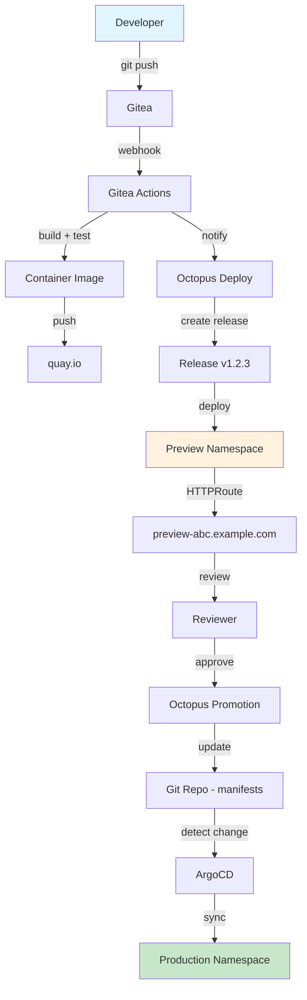

> 💡 **Quick Answer:** The complete pipeline: `git push` → Gitea Actions builds + pushes to quay.io → Octopus Deploy creates release → deploys to ephemeral preview → manual review → promotes to production → ArgoCD syncs desired state to cluster. Full audit trail, zero manual deployments.

## The Problem

You need a production-grade deployment pipeline that:
- Builds and tests on every push (CI)
- Creates versioned releases with deployment history (CD)
- Provides preview environments for review before production
- Maintains GitOps desired-state with ArgoCD
- Has approval gates and rollback capability

## The Solution

Combine four tools, each doing what it does best:
1. **Gitea Actions** — CI (build, test, push image)
2. **quay.io** — Image registry (vulnerability scanning, robot accounts)
3. **Octopus Deploy** — Release orchestration (previews, approvals, promotion)
4. **ArgoCD** — GitOps state reconciliation (desired state → actual state)

### Architecture



### Step 1: Install ArgoCD

```bash
kubectl create namespace argocd

helm repo add argo https://argoproj.github.io/argo-helm
helm repo update

helm install argocd argo/argo-cd \
  --namespace argocd \
  --set server.extraArgs="{--insecure}" \
  --set configs.params."server\.insecure"=true \
  --set controller.resources.requests.memory=256Mi \
  --set server.resources.requests.memory=128Mi
```

### Step 2: ArgoCD Application Definition

```yaml
# argocd-app.yaml
apiVersion: argoproj.io/v1alpha1
kind: Application
metadata:
  name: myapp-production
  namespace: argocd
spec:
  project: default
  source:
    repoURL: https://git.example.com/org/myapp-manifests.git
    targetRevision: main
    path: overlays/production
  destination:
    server: https://kubernetes.default.svc
    namespace: production
  syncPolicy:
    automated:
      prune: true
      selfHeal: true
    syncOptions:
      - CreateNamespace=true
      - PrunePropagationPolicy=foreground
    retry:
      limit: 3
      backoff:
        duration: 5s
        factor: 2
        maxDuration: 3m
```

### Step 3: Kustomize Overlay Structure

```
myapp-manifests/
├── base/
│   ├── kustomization.yaml
│   ├── deployment.yaml
│   ├── service.yaml
│   └── httproute.yaml
├── overlays/
│   ├── preview/
│   │   ├── kustomization.yaml
│   │   └── patch-resources.yaml
│   └── production/
│       ├── kustomization.yaml
│       └── patch-replicas.yaml
```

```yaml
# base/kustomization.yaml
apiVersion: kustomize.config.k8s.io/v1beta1
kind: Kustomization
resources:
  - deployment.yaml
  - service.yaml
  - httproute.yaml
images:
  - name: myapp
    newName: quay.io/myorg/myapp
    newTag: latest  # Updated by CI/Octopus
```

### Step 4: Octopus Deploy Promotion Script

```bash
#!/bin/bash
# promote-to-production.sh
# Called by Octopus Deploy after approval

set -euo pipefail

RELEASE_VERSION="${1}"
MANIFESTS_REPO="https://git.example.com/org/myapp-manifests.git"
BRANCH="main"

# Clone manifests repo
git clone "${MANIFESTS_REPO}" /tmp/manifests
cd /tmp/manifests

# Update image tag in production overlay
cd overlays/production
kustomize edit set image "myapp=quay.io/myorg/myapp:${RELEASE_VERSION}"

# Commit and push
git add .
git commit -m "chore: promote ${RELEASE_VERSION} to production

Approved-by: Octopus Deploy
Release: ${RELEASE_VERSION}
Timestamp: $(date -u +%Y-%m-%dT%H:%M:%SZ)"

git push origin ${BRANCH}

# ArgoCD auto-sync will pick up the change
echo "✅ Production promotion complete. ArgoCD will sync within 3 minutes."
```

### Step 5: Preview Environment Lifecycle

```yaml
# preview-deploy.sh (Octopus step)
#!/bin/bash
PREVIEW_ID=$(echo "${RELEASE_VERSION}" | tr '.' '-')
NAMESPACE="preview-${PREVIEW_ID}"
HOSTNAME="preview-${PREVIEW_ID}.example.com"

# Create preview namespace
kubectl create namespace ${NAMESPACE} --dry-run=client -o yaml | kubectl apply -f -

# Deploy with kustomize
cd overlays/preview
kustomize edit set image "myapp=quay.io/myorg/myapp:${RELEASE_VERSION}"
kustomize edit set namespace ${NAMESPACE}
kustomize build | kubectl apply -f -

# Create HTTPRoute for preview
cat <<EOF | kubectl apply -f -
apiVersion: gateway.networking.k8s.io/v1
kind: HTTPRoute
metadata:
  name: preview-route
  namespace: ${NAMESPACE}
spec:
  parentRefs:
    - name: main-gateway
      namespace: gateway-system
      sectionName: https
  hostnames:
    - "${HOSTNAME}"
  rules:
    - backendRefs:
        - name: myapp
          port: 80
EOF

# Set TTL — auto-cleanup after 24h
kubectl annotate namespace ${NAMESPACE} \
  "janitor/ttl=24h" \
  --overwrite

echo "🔗 Preview: https://${HOSTNAME}"
```

### Complete Pipeline Flow

```bash
# 1. Developer pushes code
git push origin feature/new-thing

# 2. Gitea Actions triggers
#    → runs tests
#    → builds image: quay.io/myorg/myapp:abc1234
#    → pushes to quay.io
#    → notifies Octopus Deploy

# 3. Octopus Deploy
#    → creates Release v1.2.3
#    → deploys to preview-1-2-3 namespace
#    → posts preview URL to PR/chat
#    → waits for manual approval

# 4. Reviewer
#    → visits preview-1-2-3.example.com
#    → tests functionality
#    → approves in Octopus UI

# 5. Octopus promotion
#    → updates manifests repo (image tag)
#    → commits to main branch

# 6. ArgoCD
#    → detects drift (new commit in manifests repo)
#    → syncs production namespace
#    → reports healthy status

# Total time: ~3 minutes (build) + review time + ~30 seconds (promotion + sync)
```

## Common Issues

| Issue | Cause | Fix |
|-------|-------|-----|
| ArgoCD sync loop | Resource modified by external controller | Add `ignoreDifferences` for managed fields |
| Preview DNS not resolving | Wildcard DNS not configured | Add `*.example.com` A record to Hetzner IP |
| Octopus can't push to Git | Auth token expired | Use deploy key with push access |
| ArgoCD prune deletes preview resources | Same namespace | Use separate namespace per environment |
| Rollback fails | No previous image in registry | Keep at least 10 image tags in quay.io |

## Best Practices

1. **Separate app code from manifests** — two repos: `myapp` (source) and `myapp-manifests` (k8s YAML)
2. **ArgoCD auto-sync for production only** — previews are imperative (kubectl apply)
3. **Preview TTL with kube-janitor** — auto-delete stale previews after 24h
4. **Image immutability** — never reuse tags, always push unique SHA or semver
5. **Octopus for orchestration, ArgoCD for reconciliation** — don't make ArgoCD handle approvals

## Key Takeaways

- Four tools, each with a clear responsibility: build → store → orchestrate → reconcile
- Preview environments enable pre-production review without shared staging conflicts
- GitOps means production state is always a git commit — full audit trail
- ArgoCD self-heal ensures no drift between desired and actual state
- Total pipeline time is ~3 minutes + human review time — zero manual deployment steps
