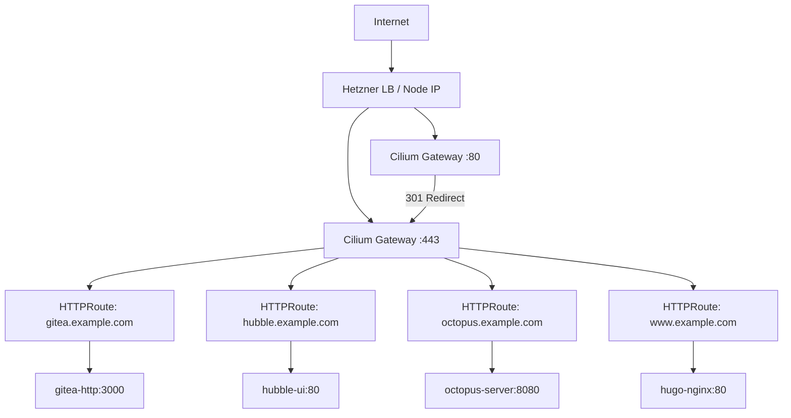

> 💡 **Quick Answer:** Gateway API HTTPRoutes replace Ingress resources with explicit, type-safe routing. Combined with Cilium's native implementation, you get TLS termination, HTTP→HTTPS redirects, and path-based routing without any external ingress controller.

## The Problem

Traditional Ingress resources are limited:
- No standard way to do HTTP-to-HTTPS redirects
- Header manipulation requires controller-specific annotations
- Multi-tenant routing is awkward (one Ingress per namespace, shared controller)
- No separation between infrastructure (Gateway) and application (HTTPRoute) concerns

## The Solution

Gateway API provides a layered model: platform teams manage Gateways, application teams manage HTTPRoutes.

### Architecture



### Step 1: Deploy the Gateway

```yaml
# gateway.yaml
apiVersion: gateway.networking.k8s.io/v1
kind: Gateway
metadata:
  name: main-gateway
  namespace: gateway-system
  annotations:
    # Bind to node's external IP on Hetzner
    io.cilium/lb-ipam-sharing-key: "main"
spec:
  gatewayClassName: cilium
  listeners:
    - name: http
      protocol: HTTP
      port: 80
      allowedRoutes:
        namespaces:
          from: All
    - name: https
      protocol: HTTPS
      port: 443
      tls:
        mode: Terminate
        certificateRefs:
          - name: wildcard-tls
            namespace: cert-manager
      allowedRoutes:
        namespaces:
          from: All
```

### Step 2: HTTP-to-HTTPS Redirect

```yaml
# redirect-http.yaml
apiVersion: gateway.networking.k8s.io/v1
kind: HTTPRoute
metadata:
  name: http-to-https-redirect
  namespace: gateway-system
spec:
  parentRefs:
    - name: main-gateway
      sectionName: http
  rules:
    - filters:
        - type: RequestRedirect
          requestRedirect:
            scheme: https
            statusCode: 301
```

### Step 3: Application HTTPRoutes

```yaml
# routes.yaml
---
apiVersion: gateway.networking.k8s.io/v1
kind: HTTPRoute
metadata:
  name: gitea-route
  namespace: gitea
spec:
  parentRefs:
    - name: main-gateway
      namespace: gateway-system
      sectionName: https
  hostnames:
    - "git.example.com"
  rules:
    - matches:
        - path:
            type: PathPrefix
            value: /
      backendRefs:
        - name: gitea-http
          port: 3000
---
apiVersion: gateway.networking.k8s.io/v1
kind: HTTPRoute
metadata:
  name: hugo-route
  namespace: website
spec:
  parentRefs:
    - name: main-gateway
      namespace: gateway-system
      sectionName: https
  hostnames:
    - "www.example.com"
    - "example.com"
  rules:
    - matches:
        - path:
            type: PathPrefix
            value: /
      backendRefs:
        - name: hugo-nginx
          port: 80
---
apiVersion: gateway.networking.k8s.io/v1
kind: HTTPRoute
metadata:
  name: octopus-route
  namespace: octopus
spec:
  parentRefs:
    - name: main-gateway
      namespace: gateway-system
      sectionName: https
  hostnames:
    - "deploy.example.com"
  rules:
    - matches:
        - path:
            type: PathPrefix
            value: /
      backendRefs:
        - name: octopus-server
          port: 8080
```

### Step 4: ReferenceGrant for Cross-Namespace TLS

```yaml
# reference-grant.yaml
# Allow Gateway in gateway-system to use cert Secret in cert-manager namespace
apiVersion: gateway.networking.k8s.io/v1beta1
kind: ReferenceGrant
metadata:
  name: allow-gateway-cert
  namespace: cert-manager
spec:
  from:
    - group: gateway.networking.k8s.io
      kind: Gateway
      namespace: gateway-system
  to:
    - group: ""
      kind: Secret
```

### Step 5: Verify Routing

```bash
# Check Gateway status
kubectl get gateway -n gateway-system
# NAME           CLASS    ADDRESS        PROGRAMMED   AGE
# main-gateway   cilium   203.0.113.10   True         5m

# Check HTTPRoute status
kubectl get httproute -A
# NAMESPACE   NAME                     HOSTNAMES              AGE
# gateway-system  http-to-https-redirect                     5m
# gitea       gitea-route              ["git.example.com"]    4m
# website     hugo-route               ["www.example.com"...] 4m
# octopus     octopus-route            ["deploy.example.com"] 4m

# Test TLS
curl -v https://git.example.com 2>&1 | grep "subject:"
# subject: CN=*.example.com

# Test redirect
curl -I http://git.example.com
# HTTP/1.1 301 Moved Permanently
# Location: https://git.example.com/
```

## Common Issues

| Issue | Cause | Fix |
|-------|-------|-----|
| HTTPRoute not attached | Wrong parentRef namespace | Specify `namespace` in parentRefs |
| 404 on valid hostname | Listener doesn't allow namespace | Set `allowedRoutes.namespaces.from: All` |
| TLS cert not found | Missing ReferenceGrant | Create cross-namespace grant |
| No external IP | Hetzner LB not provisioned | Use `hostPort` or MetalLB on bare metal |
| Redirect loop | Both listeners route same host | Only attach app routes to `https` sectionName |

## Best Practices

1. **Separate Gateway from HTTPRoutes** — infra team owns Gateway, app teams own routes
2. **Always add HTTP→HTTPS redirect** — catch clients not using HTTPS
3. **Use ReferenceGrant for cross-namespace secrets** — explicit is better than implicit
4. **One Gateway, many HTTPRoutes** — don't create a Gateway per service
5. **Use `sectionName` in parentRefs** — attach routes to specific listeners explicitly

## Key Takeaways

- Gateway API is the successor to Ingress — more expressive, type-safe, multi-tenant
- Cilium implements Gateway API natively — no separate controller needed
- ReferenceGrant is required for cross-namespace references (TLS secrets, backend services)
- HTTP-to-HTTPS redirect is a first-class filter, not an annotation hack
- Each namespace manages its own HTTPRoutes independently
