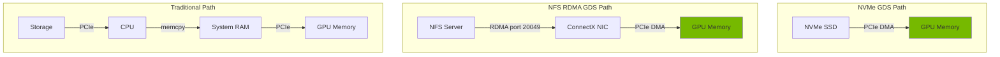

> 💡 **Quick Answer:** Mount NVMe as a hostPath or PV, enable GDS in ClusterPolicy, and use `cufile_sample_*` or kvikio in your pods to verify direct GPU-to-storage DMA transfers are working.

## The Problem

AI training pipelines spend significant time loading data from storage to GPU memory. Even with fast NVMe SSDs, the traditional I/O path wastes bandwidth:

1. Data read from NVMe → CPU processes the I/O → copies to system memory → copies to GPU memory
2. Each copy adds latency and consumes CPU cycles and PCIe bandwidth

GPUDirect Storage (GDS) eliminates steps 2 and 3 by enabling DMA directly between NVMe (or NFS RDMA) and GPU memory.

## The Solution

### Local NVMe Configuration

#### Step 1: Prepare NVMe Volumes

```bash
# Identify NVMe devices
lsblk | grep nvme

# Format and mount (if not already)
mkfs.ext4 /dev/nvme0n1
mkdir -p /mnt/nvme0
mount /dev/nvme0n1 /mnt/nvme0

# Add to fstab for persistence
echo "/dev/nvme0n1 /mnt/nvme0 ext4 defaults,noatime 0 0" >> /etc/fstab
```

#### Step 2: Expose NVMe via PersistentVolume

```yaml
apiVersion: v1
kind: PersistentVolume
metadata:
  name: nvme-gds-pv
spec:
  capacity:
    storage: 1Ti
  accessModes:
    - ReadWriteOnce
  persistentVolumeReclaimPolicy: Retain
  storageClassName: nvme-gds
  local:
    path: /mnt/nvme0
  nodeAffinity:
    required:
      nodeSelectorTerms:
        - matchExpressions:
            - key: nvidia.com/gpu.present
              operator: In
              values: ["true"]
---
apiVersion: v1
kind: PersistentVolumeClaim
metadata:
  name: nvme-gds-pvc
  namespace: ai-training
spec:
  accessModes:
    - ReadWriteOnce
  storageClassName: nvme-gds
  resources:
    requests:
      storage: 1Ti
```

#### Step 3: Pod with GDS NVMe Access

```yaml
apiVersion: v1
kind: Pod
metadata:
  name: gds-nvme-workload
  namespace: ai-training
spec:
  nodeSelector:
    nvidia.com/gpu.present: "true"
  containers:
    - name: trainer
      image: nvcr.io/nvidia/pytorch:24.07-py3
      command: ["python3", "train_with_gds.py"]
      resources:
        limits:
          nvidia.com/gpu: "1"
      securityContext:
        privileged: true
      volumeMounts:
        - name: nvme-data
          mountPath: /data
        - name: dev
          mountPath: /dev
      env:
        - name: CUFILE_ENV_PATH_JSON
          value: "/etc/cufile.json"
  volumes:
    - name: nvme-data
      persistentVolumeClaim:
        claimName: nvme-gds-pvc
    - name: dev
      hostPath:
        path: /dev
        type: Directory
```

### NFS over RDMA Configuration

#### Step 1: Configure NFS Server with RDMA

On the NFS server (must have RDMA-capable NIC):

```bash
# Enable NFS RDMA on the server
modprobe svcrdma
echo "rdma 20049" > /proc/fs/nfsd/portlist

# Export with RDMA
cat >> /etc/exports << 'EOF'
/data/ai-datasets *(rw,sync,no_subtree_check,insecure,no_root_squash)
EOF

exportfs -rav
```

#### Step 2: Create NFS RDMA PV

```yaml
apiVersion: v1
kind: PersistentVolume
metadata:
  name: nfs-rdma-gds-pv
spec:
  capacity:
    storage: 10Ti
  accessModes:
    - ReadWriteMany
  persistentVolumeReclaimPolicy: Retain
  storageClassName: nfs-rdma-gds
  nfs:
    server: 10.10.1.100
    path: /data/ai-datasets
  mountOptions:
    - rdma
    - port=20049
    - vers=4.1
---
apiVersion: v1
kind: PersistentVolumeClaim
metadata:
  name: nfs-rdma-gds-pvc
  namespace: ai-training
spec:
  accessModes:
    - ReadWriteMany
  storageClassName: nfs-rdma-gds
  resources:
    requests:
      storage: 10Ti
```

### Verify GDS is Working

```bash
# Check nvidia-fs module
kubectl exec gds-nvme-workload -- lsmod | grep nvidia_fs

# Check GDS stats
kubectl exec gds-nvme-workload -- cat /proc/driver/nvidia-fs/stats

# Run cuFile sample test
kubectl exec gds-nvme-workload -- bash -c '
  # Write a test file
  dd if=/dev/urandom of=/data/gds_test_file bs=1M count=1024

  # Test GDS read (direct GPU path)
  /usr/local/cuda/gds/tools/gdsio -f /data/gds_test_file \
    -d 0 -w 4 -s 1G -i 1M -x 0 -I 1
  echo "--- GDS path above ---"

  # Test regular path (CPU bounce buffer)
  /usr/local/cuda/gds/tools/gdsio -f /data/gds_test_file \
    -d 0 -w 4 -s 1G -i 1M -x 0 -I 0
  echo "--- Regular path above ---"
'
```

### Python Example with kvikio

```python
#!/usr/bin/env python3
"""train_with_gds.py — Load training data via GPUDirect Storage"""

import kvikio
import cupy as cp
import time

def load_with_gds(filepath, size_bytes):
    """Load file directly to GPU memory via GDS"""
    buf = cp.empty(size_bytes, dtype=cp.uint8)
    f = kvikio.CuFile(filepath, "r")
    start = time.perf_counter()
    nbytes = f.read(buf)
    elapsed = time.perf_counter() - start
    f.close()
    throughput = nbytes / elapsed / 1e9
    print(f"GDS: {nbytes/1e9:.2f} GB in {elapsed:.3f}s = {throughput:.2f} GB/s")
    return buf

def load_without_gds(filepath, size_bytes):
    """Load via CPU path for comparison"""
    import numpy as np
    start = time.perf_counter()
    data = np.fromfile(filepath, dtype=np.uint8, count=size_bytes)
    buf = cp.asarray(data)
    elapsed = time.perf_counter() - start
    throughput = len(data) / elapsed / 1e9
    print(f"CPU: {len(data)/1e9:.2f} GB in {elapsed:.3f}s = {throughput:.2f} GB/s")
    return buf

if __name__ == "__main__":
    filepath = "/data/training-data.bin"
    size = 4 * 1024 * 1024 * 1024  # 4 GB

    print("Loading via GPUDirect Storage:")
    gds_buf = load_with_gds(filepath, size)

    print("\nLoading via CPU path:")
    cpu_buf = load_without_gds(filepath, size)
```



## Common Issues

### "cuFile: driver not loaded"

```bash
# Verify GDS is enabled in ClusterPolicy
kubectl get clusterpolicy cluster-policy -o jsonpath='{.spec.gds.enabled}'

# Check nvidia-fs pod
kubectl get pods -n gpu-operator -l app=nvidia-fs-ctr

# Verify module on node
kubectl debug node/<node> -- chroot /host lsmod | grep nvidia_fs
```

### NFS RDMA Mount Fails

```bash
# Verify RDMA is available on the NFS server
ibv_devices  # Must show devices

# Check if svcrdma module is loaded on NFS server
lsmod | grep svcrdma

# Test RDMA connectivity from client to server
ib_write_bw <nfs-server-rdma-ip>
```

### Insufficient Permissions

GDS requires direct hardware access:

```yaml
# Minimum security context
securityContext:
  privileged: true
# Or more targeted:
securityContext:
  capabilities:
    add: ["SYS_ADMIN", "IPC_LOCK"]
  volumes:
    - hostPath: /dev (for NVMe device access)
```

## Best Practices

- **Use NVMe for single-node workflows** — lowest latency, simplest setup
- **Use NFS RDMA for shared datasets** — multiple GPU nodes can read the same data
- **Always benchmark** — compare GDS vs CPU path throughput with `gdsio`
- **Pre-stage data on fast storage** — GDS can't make slow storage fast, only eliminate CPU copies
- **Use kvikio for Python** — cleaner API than raw cuFile C bindings
- **Monitor `/proc/driver/nvidia-fs/stats`** — verify GDS I/O operations are increasing
- **Grant minimal privileges** — use `SYS_ADMIN` + `IPC_LOCK` instead of full `privileged` where possible

## Key Takeaways

- GDS provides 2-5x I/O throughput improvement by eliminating CPU bounce buffers
- NVMe and NFS over RDMA are the two primary storage backends for GDS
- Applications must use the cuFile API or kvikio — standard file I/O doesn't use GDS
- Always verify with `/proc/driver/nvidia-fs/stats` and `gdsio` benchmarks
