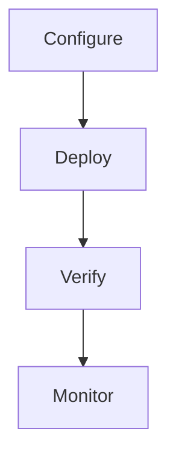

> 💡 **Quick Answer:** Benchmark AI inference endpoints with GenAI-Perf on Kubernetes. Latency profiling, throughput testing, TTFT measurement, and vLLM/TRT-LLM comparison.

## The Problem

Production Kubernetes clusters need genai-perf benchmark kubernetes for reliability and operational maturity. This recipe provides clear configuration examples, common pitfalls, and battle-tested patterns.

## The Solution

### Configuration

```yaml
# GenAI-Perf Benchmark Kubernetes setup
apiVersion: v1
kind: ConfigMap
metadata:
  name: genai-perf-benchmark-kubernetes-config
  namespace: production
data:
  config.yaml: |
    enabled: true
    namespace: production
```

### Deployment

```bash
# Apply configuration
kubectl apply -f config.yaml

# Verify
kubectl get all -n production
```



## Common Issues

**Configuration not applying**

Verify namespace exists and RBAC allows the operation. Check events: `kubectl get events -n production --sort-by=.metadata.creationTimestamp`.

**Unexpected behavior after changes**

Review all related resources. Use `kubectl diff -f config.yaml` before applying to see what will change.

## Best Practices

- Test in staging before production
- Version all configuration in Git
- Monitor metrics after changes
- Document operational procedures
- Use GitOps for consistent deployments

## Key Takeaways

- GenAI-Perf Benchmark Kubernetes is critical for production Kubernetes operations
- Start with safe defaults, tune based on monitoring
- Always test in non-production first
- Combine with observability for full visibility
- Automate repetitive tasks with CI/CD
