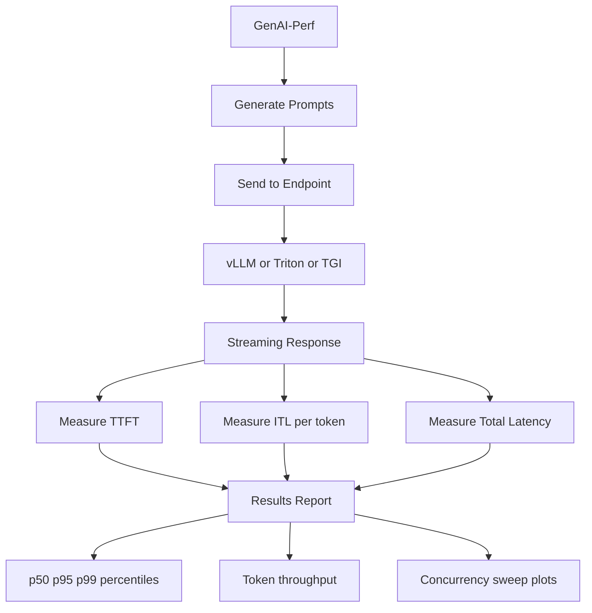

> 💡 **Quick Answer:** Run `genai-perf -m <model> --endpoint-type chat --streaming` against your Triton/vLLM/TGI endpoint. GenAI-Perf measures LLM-specific metrics: time-to-first-token (TTFT), inter-token latency (ITL), output token throughput, and request throughput — critical for SLO validation.

## The Problem

Standard HTTP benchmarking tools (wrk, hey, k6) measure request latency but miss LLM-specific metrics. Users care about how fast the first token appears (TTFT), how smooth streaming feels (ITL), and total throughput (tokens/sec). Without GenAI-Perf, you're flying blind on inference SLOs.

## The Solution

### Install GenAI-Perf

```bash
# GenAI-Perf ships inside the Triton SDK container
# or install via pip
pip install genai-perf

# Or use the NGC container
docker pull nvcr.io/nvidia/tritonserver:24.12-py3-sdk
```

### Basic LLM Benchmark

```bash
# Benchmark a vLLM OpenAI-compatible endpoint
genai-perf \
  -m llama-3.1-70b \
  --endpoint-type chat \
  --service-kind openai \
  --url http://vllm-service:8000 \
  --streaming \
  --num-prompts 100 \
  --concurrency 10 \
  --input-tokens-mean 128 \
  --input-tokens-stddev 32 \
  --output-tokens-mean 256

# Output:
#                        LLM Metrics
# ┌──────────────────────┬──────────┬──────────┬──────────┐
# │ Metric               │ p50      │ p95      │ p99      │
# ├──────────────────────┼──────────┼──────────┼──────────┤
# │ Time to First Token  │ 45ms     │ 120ms    │ 250ms    │
# │ Inter Token Latency  │ 12ms     │ 18ms     │ 25ms     │
# │ Request Latency      │ 3.2s     │ 5.1s     │ 7.8s     │
# │ Output Token Tput    │ 82 tok/s │          │          │
# │ Request Throughput   │ 8.5 req/s│          │          │
# └──────────────────────┴──────────┴──────────┴──────────┘
```

### Benchmark as Kubernetes Job

```yaml
apiVersion: batch/v1
kind: Job
metadata:
  name: genai-perf-benchmark
  namespace: tenant-alpha
spec:
  template:
    spec:
      restartPolicy: Never
      containers:
        - name: genai-perf
          image: nvcr.io/nvidia/tritonserver:24.12-py3-sdk
          command:
            - genai-perf
          args:
            - "-m"
            - "llama-3.1-70b"
            - "--endpoint-type"
            - "chat"
            - "--service-kind"
            - "openai"
            - "--url"
            - "http://vllm-service:8000"
            - "--streaming"
            - "--num-prompts"
            - "200"
            - "--concurrency"
            - "1,5,10,20,50"
            - "--input-tokens-mean"
            - "128"
            - "--output-tokens-mean"
            - "256"
            - "--artifact-dir"
            - "/results"
          volumeMounts:
            - name: results
              mountPath: /results
      volumes:
        - name: results
          persistentVolumeClaim:
            claimName: benchmark-results
```

### Concurrency Sweep

```bash
# Sweep concurrency to find saturation point
genai-perf \
  -m llama-3.1-70b \
  --endpoint-type chat \
  --service-kind openai \
  --url http://vllm-service:8000 \
  --streaming \
  --num-prompts 100 \
  --concurrency 1,2,4,8,16,32,64 \
  --input-tokens-mean 128 \
  --output-tokens-mean 256 \
  --artifact-dir ./sweep-results

# Generates per-concurrency reports:
# concurrency=1:  TTFT p50=25ms,  throughput=15 tok/s
# concurrency=4:  TTFT p50=35ms,  throughput=55 tok/s
# concurrency=8:  TTFT p50=50ms,  throughput=95 tok/s
# concurrency=16: TTFT p50=120ms, throughput=130 tok/s  ← sweet spot
# concurrency=32: TTFT p50=350ms, throughput=140 tok/s  ← diminishing returns
# concurrency=64: TTFT p50=900ms, throughput=135 tok/s  ← saturated
```

### Triton Native Protocol

```bash
# Benchmark Triton native gRPC (not OpenAI-compatible)
genai-perf \
  -m ensemble_model \
  --endpoint-type generate \
  --service-kind triton \
  --url grpc://triton-service:8001 \
  --streaming \
  --num-prompts 100 \
  --concurrency 10
```

### Compare Backends

```bash
# Compare vLLM vs TensorRT-LLM on same model
# vLLM
genai-perf -m llama-70b --service-kind openai \
  --url http://vllm:8000 --streaming \
  --concurrency 16 --artifact-dir ./results-vllm

# TensorRT-LLM
genai-perf -m llama-70b --service-kind openai \
  --url http://trtllm:8000 --streaming \
  --concurrency 16 --artifact-dir ./results-trtllm

# Compare results
genai-perf compare ./results-vllm ./results-trtllm
```

### SLO Validation Script

```bash
#!/bin/bash
# validate-slo.sh — fail CI if SLOs not met
RESULT=$(genai-perf -m $MODEL --service-kind openai \
  --url $ENDPOINT --streaming \
  --concurrency 16 --num-prompts 200 \
  --output-format json 2>/dev/null)

TTFT_P95=$(echo $RESULT | jq '.time_to_first_token.p95')
ITL_P95=$(echo $RESULT | jq '.inter_token_latency.p95')
THROUGHPUT=$(echo $RESULT | jq '.output_token_throughput')

echo "TTFT p95: ${TTFT_P95}ms (SLO: <200ms)"
echo "ITL p95: ${ITL_P95}ms (SLO: <30ms)"
echo "Throughput: ${THROUGHPUT} tok/s (SLO: >50)"

PASS=true
[ $(echo "$TTFT_P95 > 200" | bc) -eq 1 ] && echo "❌ TTFT SLO FAIL" && PASS=false
[ $(echo "$ITL_P95 > 30" | bc) -eq 1 ] && echo "❌ ITL SLO FAIL" && PASS=false
[ $(echo "$THROUGHPUT < 50" | bc) -eq 1 ] && echo "❌ Throughput SLO FAIL" && PASS=false

$PASS && echo "✅ All SLOs PASS" || exit 1
```



## Common Issues

- **Connection refused** — verify endpoint URL; vLLM uses port 8000 by default, Triton gRPC uses 8001
- **TTFT extremely high** — model may be loading on first request; run warmup requests first
- **Throughput drops at high concurrency** — GPU memory saturated; check `nvidia-smi` for memory usage; reduce `--max-tokens` or batch size
- **Streaming metrics missing** — must pass `--streaming` flag for TTFT and ITL; without it, only request-level latency is measured
- **Results vary between runs** — use `--num-prompts 200+` for statistical significance; short runs have high variance

## Best Practices

- Always benchmark with `--streaming` for LLM endpoints — TTFT and ITL are the metrics users feel
- Run concurrency sweeps to find the saturation point — sweet spot is usually where TTFT p95 starts inflecting
- Compare backends (vLLM vs TensorRT-LLM) with identical prompts and concurrency for fair comparison
- Integrate SLO validation into CI/CD — fail deploys that regress inference performance
- Store results in persistent volume for historical comparison across model versions and configs
- Warm up the model before benchmarking — cold start skews TTFT

## Key Takeaways

- GenAI-Perf measures LLM-specific metrics: TTFT, ITL, output token throughput
- Concurrency sweeps reveal the optimal load for your GPU and model size
- SLO validation (TTFT p95 < 200ms, ITL p95 < 30ms) gates deployments
- Works with vLLM, Triton (TensorRT-LLM), TGI, and any OpenAI-compatible endpoint
- Successor path: AIPerf (next-gen) adds multiprocess architecture and plugin system
