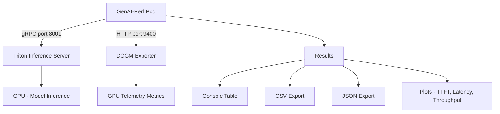

> 💡 **Quick Answer:** Run `genai-perf profile -m <model> --backend tensorrtllm --streaming` against your Triton endpoint. It measures time to first token (TTFT), inter-token latency (ITL), request throughput, and output token throughput — the key metrics for LLM serving performance.

## The Problem

Deploying an LLM on Triton is only half the battle. You need to answer:

- **How fast is the first token?** — TTFT determines perceived responsiveness
- **What's the token generation speed?** — ITL affects streaming UX
- **How many concurrent users can I serve?** — throughput determines capacity planning
- **Where's the bottleneck?** — GPU utilization, memory, or network
- **How do backends compare?** — TensorRT-LLM vs vLLM on your actual hardware

GenAI-Perf (NVIDIA's benchmarking tool) answers all of these with a single command, including GPU telemetry from DCGM.

## The Solution

### Step 1: Deploy GenAI-Perf as a Kubernetes Job

```yaml
apiVersion: batch/v1
kind: Job
metadata:
  name: genai-perf-benchmark
  namespace: ai-inference
spec:
  backoffLimit: 0
  template:
    spec:
      restartPolicy: Never
      containers:
        - name: genai-perf
          image: nvcr.io/nvidia/tritonserver:25.01-trtllm-python-py3
          command:
            - /bin/bash
            - -c
            - |
              pip install genai-perf

              # Basic LLM benchmark
              genai-perf profile \
                -m llama3-8b \
                --backend tensorrtllm \
                --streaming \
                --url triton-trtllm.ai-inference:8001 \
                --concurrency 10 \
                --request-count 100 \
                --synthetic-input-tokens-mean 550 \
                --output-tokens-mean 256 \
                --artifact-dir /results/benchmark-run-1

              # Copy results
              cp -r /results /shared/
          resources:
            limits:
              cpu: "4"
              memory: 8Gi
          volumeMounts:
            - name: results
              mountPath: /shared
      volumes:
        - name: results
          persistentVolumeClaim:
            claimName: benchmark-results
```

### Step 2: Quick Benchmark Commands

Run these from inside a pod with network access to Triton:

```bash
# Install GenAI-Perf
pip install genai-perf

# Basic streaming benchmark (TensorRT-LLM backend)
genai-perf profile \
  -m llama3-8b \
  --backend tensorrtllm \
  --streaming \
  --url triton-trtllm:8001

# Benchmark with specific concurrency levels
genai-perf profile \
  -m llama3-8b \
  --backend tensorrtllm \
  --streaming \
  --url triton-trtllm:8001 \
  --concurrency 32 \
  --request-count 200

# Benchmark vLLM backend
genai-perf profile \
  -m mistral-7b \
  --backend vllm \
  --streaming \
  --url triton-vllm:8001 \
  --concurrency 16
```

### Step 3: Sweep Concurrency Levels

Find the optimal concurrency for your deployment:

```yaml
apiVersion: batch/v1
kind: Job
metadata:
  name: genai-perf-sweep
  namespace: ai-inference
spec:
  backoffLimit: 0
  template:
    spec:
      restartPolicy: Never
      containers:
        - name: sweep
          image: nvcr.io/nvidia/tritonserver:25.01-trtllm-python-py3
          command:
            - /bin/bash
            - -c
            - |
              pip install genai-perf

              for CONCURRENCY in 1 2 4 8 16 32 64 128; do
                echo "=== Concurrency: $CONCURRENCY ==="
                genai-perf profile \
                  -m llama3-8b \
                  --backend tensorrtllm \
                  --streaming \
                  --url triton-trtllm.ai-inference:8001 \
                  --concurrency $CONCURRENCY \
                  --request-count 100 \
                  --synthetic-input-tokens-mean 550 \
                  --output-tokens-mean 256 \
                  --artifact-dir /results/concurrency-$CONCURRENCY \
                  --generate-plots
              done
          resources:
            limits:
              cpu: "4"
              memory: 8Gi
          volumeMounts:
            - name: results
              mountPath: /results
      volumes:
        - name: results
          persistentVolumeClaim:
            claimName: benchmark-results
```

### Step 4: GPU Telemetry Collection

GenAI-Perf collects GPU metrics from DCGM Exporter automatically:

```bash
# Ensure DCGM Exporter is running
kubectl get pods -n gpu-operator | grep dcgm

# Run benchmark with GPU telemetry
genai-perf profile \
  -m llama3-8b \
  --backend tensorrtllm \
  --streaming \
  --url triton-trtllm:8001 \
  --concurrency 32 \
  --server-metrics-urls http://dcgm-exporter.gpu-operator:9400/metrics \
  --verbose

# GPU metrics collected automatically:
# - GPU utilization and SM utilization
# - GPU memory used/free/total
# - GPU power usage and energy consumption
# - GPU temperature
# - PCIe throughput
# - NVLink errors
```

### Step 5: Compare TensorRT-LLM vs vLLM

```bash
# Benchmark TensorRT-LLM
genai-perf profile \
  -m llama3-8b \
  --backend tensorrtllm \
  --streaming \
  --url triton-trtllm:8001 \
  --concurrency 32 \
  --request-count 200 \
  --synthetic-input-tokens-mean 550 \
  --output-tokens-mean 256 \
  --artifact-dir /results/trtllm-c32

# Benchmark vLLM (same model, same parameters)
genai-perf profile \
  -m llama3-8b-vllm \
  --backend vllm \
  --streaming \
  --url triton-vllm:8001 \
  --concurrency 32 \
  --request-count 200 \
  --synthetic-input-tokens-mean 550 \
  --output-tokens-mean 256 \
  --artifact-dir /results/vllm-c32

# Compare results side by side
echo "=== TensorRT-LLM ===" && cat /results/trtllm-c32/*genai_perf.csv
echo "=== vLLM ===" && cat /results/vllm-c32/*genai_perf.csv
```

### Step 6: Use a Config File for Reproducible Benchmarks

```yaml
# genai_perf_config.yaml
apiVersion: v1
kind: ConfigMap
metadata:
  name: genai-perf-config
  namespace: ai-inference
data:
  config.yaml: |
    endpoint:
      model_selection_strategy: round_robin
      backend: tensorrtllm
      type: kserve
      streaming: True
      server_metrics_urls: http://dcgm-exporter.gpu-operator:9400/metrics
      url: triton-trtllm.ai-inference:8001

    input:
      num_dataset_entries: 200
      synthetic_input_tokens_mean: 550
      synthetic_input_tokens_stddev: 50
      output_tokens_mean: 256
      output_tokens_stddev: 32
      warmup_request_count: 10

    profiling:
      concurrency: 32
      request_count: 200

    output:
      artifact_dir: /results
      generate_plots: True
```

```bash
# Run with config file
genai-perf config -f /config/config.yaml

# Override specific settings
genai-perf config -f /config/config.yaml \
  --override-config --concurrency 64 --request-count 500
```

### Understanding the Output

```text
                          NVIDIA GenAI-Perf | LLM Metrics
┏━━━━━━━━━━━━━━━━━━━━━━━━━━━━━━━━━━━┳━━━━━━━━┳━━━━━━━━┳━━━━━━━━┳━━━━━━━━┳━━━━━━━━┓
┃                         Statistic ┃    avg ┃    min ┃    max ┃    p99 ┃    p90 ┃
┡━━━━━━━━━━━━━━━━━━━━━━━━━━━━━━━━━━━╇━━━━━━━━╇━━━━━━━━╇━━━━━━━━╇━━━━━━━━╇━━━━━━━━┩
│          Time to first token (ms) │  16.26 │  12.39 │  17.25 │  17.09 │  16.68 │
│          Inter token latency (ms) │   1.85 │   1.55 │   2.04 │   2.02 │   1.97 │
│              Request latency (ms) │ 499.20 │ 451.01 │ 554.61 │ 548.69 │ 526.13 │
│            Output sequence length │ 261.90 │ 256.00 │ 298.00 │ 296.60 │ 270.00 │
│             Input sequence length │ 550.06 │ 550.00 │ 553.00 │ 551.60 │ 550.00 │
│ Output token throughput (per sec) │ 520.87 │    N/A │    N/A │    N/A │    N/A │
│      Request throughput (per sec) │   1.99 │    N/A │    N/A │    N/A │    N/A │
└───────────────────────────────────┴────────┴────────┴────────┴────────┴────────┘
```

**Key metrics to watch:**
- **TTFT** — under 100ms is excellent for chat, under 500ms is acceptable
- **ITL** — under 30ms feels real-time, under 50ms is good streaming UX
- **Output token throughput** — tokens/sec across all concurrent requests
- **Request throughput** — completed requests per second



## Common Issues

### Connection refused to Triton gRPC

```bash
# GenAI-Perf uses gRPC (port 8001) by default, not HTTP (8000)
# Verify Triton gRPC is accessible
grpc_health_probe -addr=triton-trtllm:8001

# If using HTTP instead:
genai-perf profile \
  -m llama3-8b \
  --url triton-trtllm:8000 \
  --endpoint-type chat
```

### Results vary between runs

```bash
# Use warmup requests to stabilize
genai-perf profile \
  -m llama3-8b \
  --warmup-request-count 20 \
  --request-count 200 \
  --stability-percentage 5

# Run multiple times and compare artifacts
```

### GPU telemetry not collected

```bash
# Verify DCGM Exporter is accessible from the benchmark pod
curl http://dcgm-exporter.gpu-operator:9400/metrics | head -5

# If using custom namespace or port:
--server-metrics-urls http://<dcgm-service>:<port>/metrics

# Use --verbose to see telemetry in console output
```

### Benchmarking OpenAI-compatible endpoints

```bash
# For vLLM or other OpenAI-compatible servers
genai-perf profile \
  -m llama3-8b \
  --endpoint-type chat \
  --streaming \
  --url http://vllm-server:8000

# With API key authentication
genai-perf profile \
  -m gpt-4 \
  --endpoint-type chat \
  --streaming \
  --url https://api.openai.com \
  -H "Authorization: Bearer ${OPENAI_API_KEY}" \
  -H "Accept: text/event-stream"
```

## Best Practices

- **Warm up before measuring** — use `--warmup-request-count 10-20` to fill KV cache and stabilize GPU clocks
- **Test realistic input/output lengths** — set `--synthetic-input-tokens-mean` and `--output-tokens-mean` to match your workload
- **Sweep concurrency levels** — find the sweet spot where throughput plateaus without latency degradation
- **Collect GPU telemetry** — connect to DCGM Exporter to understand GPU utilization and memory pressure
- **Use config files** — reproducible benchmarks are essential for comparing deployments
- **Generate plots** — `--generate-plots` creates visual TTFT and latency analysis automatically
- **Run from inside the cluster** — benchmark from a pod in the same namespace to eliminate network variability

## Key Takeaways

- GenAI-Perf measures the metrics that matter: **TTFT, ITL, token throughput, and request throughput**
- Run it as a **Kubernetes Job** against your Triton Service for reproducible, in-cluster benchmarks
- **Sweep concurrency** (1 to 128) to find the optimal operating point for your model and GPU
- GPU telemetry from **DCGM Exporter** reveals whether you're compute-bound, memory-bound, or network-bound
- Use **config files** with `--override-config` for systematic A/B comparisons between backends
- GenAI-Perf is being phased out in favor of **AIPerf** — but remains the standard tool for Triton benchmarking today
