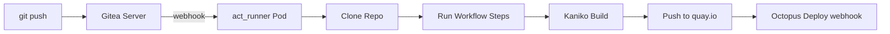

> 💡 **Quick Answer:** Gitea Actions runners execute GitHub Actions-compatible workflows natively. Deploy a Kubernetes-based runner with Kaniko for rootless image builds, pushing directly to quay.io without Docker-in-Docker.

## The Problem

You need CI/CD that:
- Builds container images on every push
- Pushes to an external registry (quay.io) without Docker socket access
- Runs securely without privileged containers
- Scales with workload (multiple concurrent builds)

## The Solution

Deploy the Gitea Actions runner (act_runner) as a Kubernetes Deployment with Kaniko for image builds.

### Architecture



### Step 1: Register the Runner

```bash
# Get registration token from Gitea
# Settings → Actions → Runners → Create new runner
# Or via API:
GITEA_TOKEN=$(kubectl get secret gitea-admin -n gitea -o jsonpath='{.data.password}' | base64 -d)

curl -s -X POST "https://git.example.com/api/v1/user/actions/runners/registration-token" \
  -H "Authorization: token ${GITEA_TOKEN}" | jq -r '.token'
```

### Step 2: Deploy act_runner

```yaml
# act-runner.yaml
apiVersion: v1
kind: Secret
metadata:
  name: runner-secret
  namespace: gitea
stringData:
  token: "YOUR_REGISTRATION_TOKEN"
  config.yaml: |
    log:
      level: info
    runner:
      file: .runner
      capacity: 3
      timeout: 3h
      labels:
        - "ubuntu-latest:docker://node:20-bookworm"
        - "k8s:host"
    cache:
      enabled: true
      dir: /data/cache
    container:
      network: host
      privileged: false
      options: --security-opt=no-new-privileges
---
apiVersion: apps/v1
kind: Deployment
metadata:
  name: gitea-runner
  namespace: gitea
spec:
  replicas: 1
  selector:
    matchLabels:
      app: gitea-runner
  template:
    metadata:
      labels:
        app: gitea-runner
    spec:
      containers:
        - name: runner
          image: gitea/act_runner:0.2.11
          command: ["sh", "-c"]
          args:
            - |
              act_runner register --no-interactive \
                --instance https://git.example.com \
                --token $(cat /secrets/token) \
                --name k3s-runner-01 \
                --labels "ubuntu-latest:docker://node:20-bookworm,k8s:host" && \
              act_runner daemon --config /secrets/config.yaml
          volumeMounts:
            - name: secrets
              mountPath: /secrets
              readOnly: true
            - name: data
              mountPath: /data
            - name: docker-sock
              mountPath: /var/run/docker.sock
          resources:
            requests:
              memory: 512Mi
              cpu: 500m
            limits:
              memory: 2Gi
              cpu: 4
      volumes:
        - name: secrets
          secret:
            secretName: runner-secret
        - name: data
          emptyDir:
            sizeLimit: 10Gi
        - name: docker-sock
          hostPath:
            path: /var/run/docker.sock
            type: Socket
```

### Step 3: Create Quay.io Push Credentials

```bash
# Create robot account on quay.io for CI pushes
kubectl create secret generic quay-push-creds \
  --namespace gitea \
  --from-literal=username='org+ci_robot' \
  --from-literal=password='QUAY_ROBOT_TOKEN'
```

### Step 4: Example Workflow (GitHub Actions-compatible)

```yaml
# .gitea/workflows/build-push.yaml
name: Build and Push
on:
  push:
    branches: [main]
  pull_request:
    branches: [main]

env:
  REGISTRY: quay.io
  IMAGE_NAME: myorg/myapp

jobs:
  build:
    runs-on: ubuntu-latest
    steps:
      - name: Checkout
        uses: actions/checkout@v4

      - name: Set up Docker Buildx
        uses: docker/setup-buildx-action@v3

      - name: Login to Quay.io
        uses: docker/login-action@v3
        with:
          registry: quay.io
          username: ${{ secrets.QUAY_USERNAME }}
          password: ${{ secrets.QUAY_PASSWORD }}

      - name: Extract metadata
        id: meta
        uses: docker/metadata-action@v5
        with:
          images: ${{ env.REGISTRY }}/${{ env.IMAGE_NAME }}
          tags: |
            type=sha,prefix=
            type=ref,event=branch
            type=semver,pattern={{version}}

      - name: Build and push
        uses: docker/build-push-action@v6
        with:
          context: .
          push: ${{ github.event_name != 'pull_request' }}
          tags: ${{ steps.meta.outputs.tags }}
          labels: ${{ steps.meta.outputs.labels }}
          cache-from: type=registry,ref=${{ env.REGISTRY }}/${{ env.IMAGE_NAME }}:buildcache
          cache-to: type=registry,ref=${{ env.REGISTRY }}/${{ env.IMAGE_NAME }}:buildcache,mode=max

      - name: Notify Octopus Deploy
        if: github.event_name == 'push'
        run: |
          curl -X POST "https://deploy.example.com/api/releases" \
            -H "X-Octopus-ApiKey: ${{ secrets.OCTOPUS_API_KEY }}" \
            -H "Content-Type: application/json" \
            -d '{
              "ProjectId": "Projects-1",
              "Version": "${{ github.sha }}",
              "SelectedPackages": [{"ActionName": "Deploy", "Version": "${{ github.sha }}"}]
            }'
```

### Step 5: Kaniko Alternative (No Docker Socket)

```yaml
# .gitea/workflows/build-kaniko.yaml
name: Build with Kaniko (rootless)
on:
  push:
    branches: [main]

jobs:
  build:
    runs-on: k8s
    container:
      image: gcr.io/kaniko-project/executor:debug
    steps:
      - name: Checkout
        uses: actions/checkout@v4

      - name: Build and push
        run: |
          echo '{"auths":{"quay.io":{"auth":"'$(echo -n "$QUAY_USER:$QUAY_PASS" | base64)'"}}}' > /kaniko/.docker/config.json
          /kaniko/executor \
            --context . \
            --dockerfile Dockerfile \
            --destination quay.io/myorg/myapp:${GITHUB_SHA::7} \
            --cache=true \
            --cache-repo=quay.io/myorg/myapp/cache
        env:
          QUAY_USER: ${{ secrets.QUAY_USERNAME }}
          QUAY_PASS: ${{ secrets.QUAY_PASSWORD }}
```

## Common Issues

| Issue | Cause | Fix |
|-------|-------|-----|
| Runner offline in Gitea UI | Registration failed | Check token expiry, re-register |
| Build fails with "permission denied" | No Docker socket | Use Kaniko or mount hostPath socket |
| Push to quay.io 401 | Wrong credentials | Verify robot account has push permission |
| Workflow not triggered | Wrong path in `on.push` | Check `.gitea/workflows/` not `.github/` |
| Cache miss every build | Registry cache not writable | Ensure robot account has write to cache tag |

## Best Practices

1. **Prefer Kaniko over DinD** — no privileged containers, no Docker socket needed
2. **Use Quay robot accounts** — scoped credentials, auditable, revokable
3. **Cache aggressively** — registry-based cache survives pod restarts
4. **Set `capacity: 3`** — allows parallel job execution in one runner
5. **Separate secrets per repository** — don't share push credentials across projects

## Key Takeaways

- Gitea Actions is fully compatible with GitHub Actions workflow syntax
- act_runner executes workflows in containers — no host pollution
- Kaniko builds images without Docker daemon — security-first approach
- Runner capacity controls concurrent jobs — scale horizontally with replicas
- Push to quay.io on main, skip push on PRs (build-only validation)
