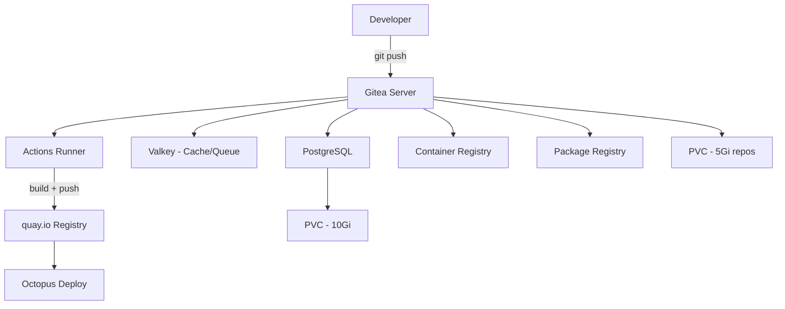

> 💡 **Quick Answer:** Gitea is a lightweight, self-hosted Git forge (GitHub alternative) that runs on <512MB RAM. With PostgreSQL for persistence and Valkey for caching/queues, you get a full-featured Git platform including Actions CI on a single k3s node.

## The Problem

You need a self-hosted Git platform for private repositories and CI/CD pipelines, but:
- GitLab requires 4+ GB RAM minimum — too heavy for a single node
- GitHub Actions is cloud-only — no self-hosted control plane
- You want container registry + package management integrated
- CI runners need to build and push OCI images

## The Solution

Deploy Gitea with PostgreSQL (durable storage) and Valkey (session cache + Actions queue).

### Architecture



### Step 1: Create Namespace and Secrets

```bash
kubectl create namespace gitea

# PostgreSQL credentials
kubectl create secret generic gitea-postgresql \
  --namespace gitea \
  --from-literal=postgres-password=$(openssl rand -hex 16) \
  --from-literal=password=$(openssl rand -hex 16)

# Gitea admin credentials
kubectl create secret generic gitea-admin \
  --namespace gitea \
  --from-literal=username=gitea_admin \
  --from-literal=password=$(openssl rand -hex 16)
```

### Step 2: Deploy PostgreSQL

```yaml
# postgresql.yaml
apiVersion: apps/v1
kind: StatefulSet
metadata:
  name: gitea-postgresql
  namespace: gitea
spec:
  serviceName: gitea-postgresql
  replicas: 1
  selector:
    matchLabels:
      app: gitea-postgresql
  template:
    metadata:
      labels:
        app: gitea-postgresql
    spec:
      containers:
        - name: postgresql
          image: postgres:16-alpine
          ports:
            - containerPort: 5432
          env:
            - name: POSTGRES_DB
              value: gitea
            - name: POSTGRES_USER
              value: gitea
            - name: POSTGRES_PASSWORD
              valueFrom:
                secretKeyRef:
                  name: gitea-postgresql
                  key: password
            - name: PGDATA
              value: /var/lib/postgresql/data/pgdata
          volumeMounts:
            - name: data
              mountPath: /var/lib/postgresql/data
          resources:
            requests:
              memory: 128Mi
              cpu: 100m
            limits:
              memory: 512Mi
  volumeClaimTemplates:
    - metadata:
        name: data
      spec:
        accessModes: ["ReadWriteOnce"]
        resources:
          requests:
            storage: 10Gi
---
apiVersion: v1
kind: Service
metadata:
  name: gitea-postgresql
  namespace: gitea
spec:
  selector:
    app: gitea-postgresql
  ports:
    - port: 5432
```

### Step 3: Deploy Valkey

```yaml
# valkey.yaml
apiVersion: apps/v1
kind: Deployment
metadata:
  name: gitea-valkey
  namespace: gitea
spec:
  replicas: 1
  selector:
    matchLabels:
      app: gitea-valkey
  template:
    metadata:
      labels:
        app: gitea-valkey
    spec:
      containers:
        - name: valkey
          image: valkey/valkey:8.0-alpine
          ports:
            - containerPort: 6379
          command: ["valkey-server", "--maxmemory", "128mb", "--maxmemory-policy", "allkeys-lru"]
          resources:
            requests:
              memory: 64Mi
              cpu: 50m
            limits:
              memory: 192Mi
---
apiVersion: v1
kind: Service
metadata:
  name: gitea-valkey
  namespace: gitea
spec:
  selector:
    app: gitea-valkey
  ports:
    - port: 6379
```

### Step 4: Deploy Gitea

```yaml
# gitea.yaml
apiVersion: apps/v1
kind: Deployment
metadata:
  name: gitea
  namespace: gitea
spec:
  replicas: 1
  selector:
    matchLabels:
      app: gitea
  template:
    metadata:
      labels:
        app: gitea
    spec:
      containers:
        - name: gitea
          image: gitea/gitea:1.23-rootless
          ports:
            - containerPort: 3000
              name: http
            - containerPort: 2222
              name: ssh
          env:
            - name: GITEA__database__DB_TYPE
              value: postgres
            - name: GITEA__database__HOST
              value: gitea-postgresql:5432
            - name: GITEA__database__NAME
              value: gitea
            - name: GITEA__database__USER
              value: gitea
            - name: GITEA__database__PASSWD
              valueFrom:
                secretKeyRef:
                  name: gitea-postgresql
                  key: password
            - name: GITEA__cache__ADAPTER
              value: redis
            - name: GITEA__cache__HOST
              value: "redis://gitea-valkey:6379/0"
            - name: GITEA__queue__TYPE
              value: redis
            - name: GITEA__queue__CONN_STR
              value: "redis://gitea-valkey:6379/1"
            - name: GITEA__session__PROVIDER
              value: redis
            - name: GITEA__session__PROVIDER_CONFIG
              value: "redis://gitea-valkey:6379/2"
            - name: GITEA__server__DOMAIN
              value: git.example.com
            - name: GITEA__server__ROOT_URL
              value: https://git.example.com/
            - name: GITEA__server__SSH_DOMAIN
              value: git.example.com
            - name: GITEA__server__SSH_PORT
              value: "2222"
            - name: GITEA__actions__ENABLED
              value: "true"
            - name: GITEA__packages__ENABLED
              value: "true"
          volumeMounts:
            - name: data
              mountPath: /var/lib/gitea
          resources:
            requests:
              memory: 256Mi
              cpu: 200m
            limits:
              memory: 1Gi
      volumes:
        - name: data
          persistentVolumeClaim:
            claimName: gitea-data
---
apiVersion: v1
kind: PersistentVolumeClaim
metadata:
  name: gitea-data
  namespace: gitea
spec:
  accessModes: ["ReadWriteOnce"]
  resources:
    requests:
      storage: 20Gi
---
apiVersion: v1
kind: Service
metadata:
  name: gitea-http
  namespace: gitea
spec:
  selector:
    app: gitea
  ports:
    - name: http
      port: 3000
---
apiVersion: v1
kind: Service
metadata:
  name: gitea-ssh
  namespace: gitea
spec:
  type: NodePort
  selector:
    app: gitea
  ports:
    - name: ssh
      port: 2222
      nodePort: 30022
```

## Common Issues

| Issue | Cause | Fix |
|-------|-------|-----|
| Gitea can't connect to PostgreSQL | Secret mismatch | Verify both use same secret key |
| SSH clone fails | NodePort not in firewall | Open port 30022 in Hetzner firewall |
| Actions not triggering | Actions not enabled | Set `GITEA__actions__ENABLED=true` |
| Valkey OOM | Too many sessions | Set `maxmemory-policy allkeys-lru` |
| Slow git operations | Insufficient memory | Bump Gitea memory limit to 1Gi |

## Best Practices

1. **Use rootless Gitea image** — runs as non-root user, better security posture
2. **Separate Valkey databases** — cache on /0, queue on /1, sessions on /2
3. **Back up PostgreSQL daily** — `pg_dump` CronJob to object storage
4. **Set `ROOT_URL` correctly** — Gitea generates links based on this
5. **Enable packages registry** — replace separate Docker/Helm registries

## Key Takeaways

- Gitea runs on <512MB RAM — 10× lighter than GitLab
- Valkey (Redis-compatible fork) handles caching, queues, and sessions
- PostgreSQL is the recommended production database (SQLite doesn't scale)
- Built-in Actions CI is GitHub Actions-compatible (reuse existing workflows)
- Container + package registries included — no need for separate Harbor/Nexus
