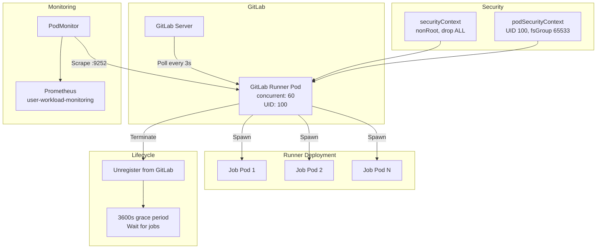

> 💡 **Quick Answer:** Install GitLab Runner via `helm install gitlab-runner gitlab/gitlab-runner -f values.yaml` with the Kubernetes executor. Key settings: `concurrent: 60` for parallel jobs, internal registry in `registriesSkippingTagResolving`, PodMonitor for Prometheus metrics, and hardened `securityContext` dropping all capabilities.

## The Problem

Running CI/CD pipelines at scale on Kubernetes requires:
- **High concurrency** — dozens of parallel jobs across the cluster
- **Internal registries** — air-gapped or private registries with custom image paths
- **Prometheus metrics** — PodMonitor scraping for runner health and job queue visibility
- **Security hardening** — non-root, read-only root filesystem options, dropped capabilities
- **Graceful shutdown** — long-running jobs must complete before runner termination
- **Automatic unregistration** — prevent ghost runners in GitLab when pods terminate

## The Solution

### Helm Values Configuration

```yaml
## GitLab Runner Image — internal registry mirror
image:
  registry: registry.example.com/mirrors
  image: gitlab-org/gitlab-runner
  tag: alpine-v{{.Chart.AppVersion}}

imagePullPolicy: IfNotPresent

## Concurrency and polling
concurrent: 60
checkInterval: 3
shutdown_timeout: 0

## Unregister runners on termination to prevent ghost entries
unregisterRunners: true

## Allow long-running jobs to finish (1 hour grace period)
terminationGracePeriodSeconds: 3600

## Kubernetes executor configuration
runners:
  config: |
    [[runners]]
      [runners.kubernetes]
        namespace = "{{ default .Release.Namespace .Values.runners.jobNamespace }}"
        image = "alpine"

## RBAC and ServiceAccount
rbac:
  create: true
  clusterWideAccess: false

serviceAccount:
  create: true
  name: ""
  annotations: {}
  imagePullSecrets: []

## Security hardening
securityContext:
  allowPrivilegeEscalation: false
  readOnlyRootFilesystem: false
  runAsNonRoot: true
  privileged: false
  capabilities:
    drop: ["ALL"]

podSecurityContext:
  runAsUser: 100
  fsGroup: 65533

## Prometheus metrics via PodMonitor (recommended over ServiceMonitor)
metrics:
  enabled: true
  portName: metrics
  port: 9252

  serviceMonitor:
    enabled: false

  podMonitor:
    enabled: true
    namespace: "openshift-user-workload-monitoring"

## Service disabled (PodMonitor scrapes pods directly)
service:
  enabled: false

## Session server (disabled by default)
sessionServer:
  enabled: false
  serviceType: LoadBalancer
  ingress:
    enabled: false
```

### Key Configuration Decisions

#### Concurrency and Polling

```yaml
concurrent: 60     # Max 60 parallel jobs
checkInterval: 3   # Poll GitLab every 3 seconds
```

`concurrent` controls how many jobs a single runner pod handles simultaneously. For Kubernetes executor, each job spawns a separate pod, so this is effectively the max parallel job pods per runner instance. With `replicas: 3` and `concurrent: 60`, you get up to 180 parallel jobs.

`checkInterval: 3` is aggressive — default is 10 seconds. Lower values reduce job pickup latency but increase GitLab API load.

#### Internal Registry Mirror

```yaml
image:
  registry: registry.example.com/mirrors
  image: gitlab-org/gitlab-runner
  tag: alpine-v{{.Chart.AppVersion}}
```

For air-gapped or restricted environments, mirror the GitLab Runner image to your internal registry. The `{{.Chart.AppVersion}}` template ensures the tag tracks the Helm chart version automatically.

> Combined with KnativeServing's `registriesSkippingTagResolving`, this prevents Kubernetes from failing to resolve tags against unreachable upstream registries.

#### Graceful Shutdown

```yaml
unregisterRunners: true
terminationGracePeriodSeconds: 3600
```

When the runner pod terminates (upgrade, scale-down, node drain):
1. Runner stops accepting new jobs
2. Waits up to 3600 seconds for running jobs to complete
3. Unregisters from GitLab to remove stale entries
4. Pod terminates

Without `unregisterRunners: true`, GitLab shows ghost runners that never pick up jobs.

#### PodMonitor vs ServiceMonitor

```yaml
podMonitor:
  enabled: true
  namespace: "openshift-user-workload-monitoring"
serviceMonitor:
  enabled: false
service:
  enabled: false
```

**PodMonitor is recommended** because:
- Scrapes pods directly — no Service required
- Continues collecting metrics during graceful shutdown (pods marked NotReady are still scraped)
- On OpenShift, place the PodMonitor in `openshift-user-workload-monitoring` namespace for user-workload Prometheus

#### Security Context

```yaml
securityContext:
  allowPrivilegeEscalation: false
  readOnlyRootFilesystem: false
  runAsNonRoot: true
  privileged: false
  capabilities:
    drop: ["ALL"]

podSecurityContext:
  runAsUser: 100
  fsGroup: 65533
```

This runs the runner manager as non-root (UID 100) with all Linux capabilities dropped. The runner manager itself doesn't need privileges — only job pods might need elevated access (configured separately in `runners.config`).

> Note: `readOnlyRootFilesystem: false` is required because GitLab Runner writes to its working directory. If you enable it, mount a writable emptyDir at `/home/gitlab-runner`.

### Runner Executor Configuration

The `runners.config` field uses TOML format with Helm templating:

```yaml
runners:
  config: |
    [[runners]]
      [runners.kubernetes]
        namespace = "{{ default .Release.Namespace .Values.runners.jobNamespace }}"
        image = "alpine"
        
        # Pull policy for job images
        pull_policy = ["if-not-present"]
        
        # Resource limits for job pods
        [runners.kubernetes.pod_spec]
          [runners.kubernetes.pod_spec.containers]
            [[runners.kubernetes.pod_spec.containers]]
              name = "build"
              resources = { requests = { cpu = "500m", memory = "1Gi" }, limits = { cpu = "2", memory = "4Gi" } }
        
        # Node selection for job pods
        [runners.kubernetes.node_selector]
          "node-role.kubernetes.io/worker" = "true"
        
        # Tolerations for job pods
        [[runners.kubernetes.node_tolerations]]
          key = "ci-jobs"
          operator = "Exists"
          effect = "NoSchedule"
```

#### Separate Runner and Job Namespaces

```yaml
runners:
  jobNamespace: "gitlab-jobs"
```

Run the runner manager in an `ops` namespace with restricted RBAC, while job pods execute in a separate `gitlab-jobs` namespace. This provides:
- Network policy isolation between runner management and job execution
- Separate resource quotas for CI workloads
- Cleaner namespace organization

### HPA for Runner Auto-Scaling

```yaml
hpa:
  minReplicas: 1
  maxReplicas: 10
  metrics:
    - type: Pods
      pods:
        metricName: gitlab_runner_jobs
        targetAverageValue: "400m"
```

Scale runner pods based on job queue depth. Requires a custom metrics adapter (e.g., `k8s-prometheus-adapter`) exposing `gitlab_runner_jobs` from Prometheus.



### Installation

```bash
# Add GitLab Helm repo
helm repo add gitlab https://charts.gitlab.io
helm repo update

# Install with custom values
helm install gitlab-runner gitlab/gitlab-runner \
  --namespace gitlab-runner \
  --create-namespace \
  -f values.yaml \
  --set gitlabUrl=https://gitlab.example.com \
  --set runnerToken=glrt-xxxxxxxxxxxxxxxxxxxx

# Verify
kubectl get pods -n gitlab-runner
kubectl logs -n gitlab-runner -l app=gitlab-runner
```

### Verification

```bash
# Check runner registration
kubectl exec -n gitlab-runner deploy/gitlab-runner -- \
  gitlab-runner list

# Check concurrent setting
kubectl exec -n gitlab-runner deploy/gitlab-runner -- \
  cat /home/gitlab-runner/.gitlab-runner/config.toml | grep concurrent

# Verify metrics endpoint
kubectl port-forward -n gitlab-runner deploy/gitlab-runner 9252:9252
curl http://localhost:9252/metrics | grep gitlab_runner

# Check PodMonitor is picked up by Prometheus
kubectl get podmonitor -n openshift-user-workload-monitoring
```

## Common Issues

**Runner shows "connection refused" to GitLab server**

Check `gitlabUrl` is reachable from the runner pod. For internal GitLab instances with self-signed certs, set `certsSecretName` pointing to a Secret with the CA certificate.

**Jobs stuck in "pending" — no runner picks them up**

Verify `runnerToken` is valid and the runner is registered:
```bash
kubectl exec deploy/gitlab-runner -n gitlab-runner -- gitlab-runner verify
```
Check tags match between the job definition and runner configuration.

**Runner pod OOMKilled during many concurrent jobs**

The runner manager process itself uses memory per tracked job. For `concurrent: 60`, set:
```yaml
resources:
  requests:
    memory: 256Mi
    cpu: 200m
  limits:
    memory: 512Mi
    cpu: 500m
```

**Ghost runners in GitLab after upgrade**

Ensure `unregisterRunners: true` is set. If runners are already orphaned:
```bash
# List all runners in GitLab
curl --header "PRIVATE-TOKEN: $TOKEN" \
  "https://gitlab.example.com/api/v4/runners/all?status=offline" | jq '.[].id'
```

**PodMonitor not showing in Prometheus targets**

On OpenShift, verify user-workload-monitoring is enabled:
```bash
oc get configmap cluster-monitoring-config -n openshift-monitoring -o yaml
# Should contain: enableUserWorkload: true
```

## Best Practices

- **Set `concurrent` based on cluster capacity** — each job spawns a pod; don't exceed your node count × jobs-per-node
- **Use `terminationGracePeriodSeconds: 3600`** for production — allows 1-hour jobs to complete during rolling updates
- **PodMonitor over ServiceMonitor** — continues scraping during graceful shutdown
- **Drop all capabilities** on the runner manager — it doesn't need any Linux capabilities
- **Separate runner and job namespaces** for RBAC isolation
- **Mirror runner images** to internal registries for air-gapped environments
- **Set `checkInterval: 3`** only if your GitLab server can handle the API load — default 10s is safer
- **Use `unregisterRunners: true`** always — ghost runners confuse operators and waste GitLab license seats
- **Pin chart version** in CI/CD: `helm install --version 0.75.0` for reproducibility

## Key Takeaways

- GitLab Runner Helm chart uses the Kubernetes executor — each CI job becomes a pod
- `concurrent: 60` + `checkInterval: 3` enables high-throughput CI with fast job pickup
- `unregisterRunners: true` + `terminationGracePeriodSeconds: 3600` ensures clean lifecycle management
- PodMonitor is the recommended metrics collection method (scrapes pods directly, works during shutdown)
- Security context drops all capabilities and runs as non-root UID 100
- Internal registry mirrors need both the `image.registry` override and KnativeServing's `registriesSkippingTagResolving`
- `runners.config` uses TOML with Helm templating — configure job-level resources, node selection, and tolerations there
- HPA on custom `gitlab_runner_jobs` metric enables runner auto-scaling based on queue depth
