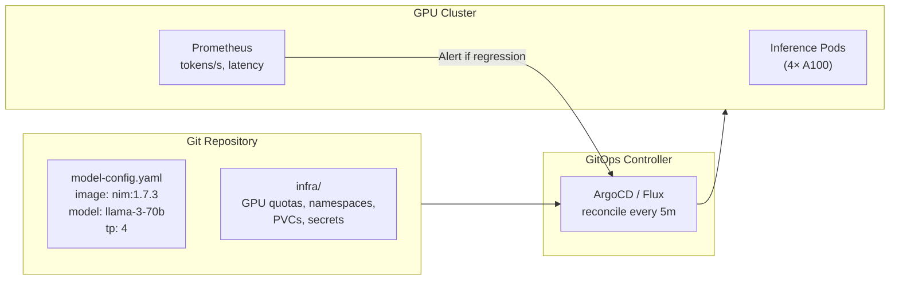

> 💡 **Quick Answer:** GitOps for AI workloads means model versions, serving configs, and GPU resource specs are all declared in Git and reconciled by ArgoCD or Flux. Model updates become Git commits: PR the new model version → review → merge → ArgoCD rolls out new inference pods with zero-downtime canary. This gives you versioned, auditable, rollback-capable AI deployments.

## The Problem

AI deployments without GitOps look like this: someone runs `kubectl apply` with a new model image tag, nobody knows what version is running, rollbacks mean finding the old manifest, and multi-cluster deployments are manual. CNCF's 2026 survey shows GitOps as the maturity signal for Kubernetes operations — and AI workloads need it more than web apps because model changes are riskier (wrong model = wrong answers).



## The Solution

### Repository Structure for AI GitOps

```
ai-platform/
├── base/
│   ├── inference/
│   │   ├── deployment.yaml
│   │   ├── service.yaml
│   │   ├── hpa.yaml
│   │   └── kustomization.yaml
│   └── training/
│       ├── job-template.yaml
│       └── kustomization.yaml
├── models/
│   ├── llama-3-70b/
│   │   ├── kustomization.yaml
│   │   └── values.yaml          # Model-specific config
│   ├── mistral-7b/
│   │   ├── kustomization.yaml
│   │   └── values.yaml
│   └── embedding-model/
│       └── values.yaml
├── environments/
│   ├── staging/
│   │   └── kustomization.yaml   # staging overrides
│   └── production/
│       └── kustomization.yaml   # production overrides
└── clusters/
    ├── gpu-cluster-us/
    │   └── kustomization.yaml
    └── gpu-cluster-eu/
        └── kustomization.yaml
```

### Model Config as Code

```yaml
# models/llama-3-70b/values.yaml
# Every model change is a Git commit
model:
  name: meta-llama/Meta-Llama-3-70B-Instruct
  version: "3.1"
  image: vllm/vllm-openai:v0.6.3

serving:
  tensorParallelSize: 4
  maxModelLen: 8192
  gpuMemoryUtilization: 0.90
  dtype: auto

resources:
  gpu: 4
  gpuType: nvidia-a100-80gb
  memory: 320Gi
  cpu: 16

scaling:
  minReplicas: 2
  maxReplicas: 8
  targetTokensPerSecond: 500

# Change log (in commit message):
# v3.1: Upgraded to Llama 3.1, increased context to 8192
# v3.0: Initial deployment, tp=4, 2 replicas
```

### ArgoCD Application for Model Serving

```yaml
apiVersion: argoproj.io/v1alpha1
kind: Application
metadata:
  name: llama-3-70b-production
  namespace: argocd
spec:
  project: ai-inference
  source:
    repoURL: https://github.com/myorg/ai-platform.git
    path: models/llama-3-70b
    targetRevision: main
    kustomize:
      patches:
        - target:
            kind: Deployment
            name: inference
          patch: |
            - op: replace
              path: /spec/template/spec/containers/0/image
              value: vllm/vllm-openai:v0.6.3
  destination:
    server: https://gpu-cluster-us.internal
    namespace: ai-inference
  syncPolicy:
    automated:
      selfHeal: true
      prune: true
    syncOptions:
      - ServerSideApply=true
      - RespectIgnoreDifferences=true
  # Canary strategy for model updates
  ignoreDifferences:
    - group: apps
      kind: Deployment
      jsonPointers:
        - /spec/replicas    # Let HPA manage replicas
```

### Canary Model Rollout with Argo Rollouts

```yaml
apiVersion: argoproj.io/v1alpha1
kind: Rollout
metadata:
  name: inference-llama-70b
  namespace: ai-inference
spec:
  replicas: 4
  strategy:
    canary:
      steps:
        - setWeight: 10              # 10% traffic to new model version
        - pause: { duration: 10m }   # Monitor for 10 minutes
        - analysis:
            templates:
              - templateName: model-quality-check
        - setWeight: 50
        - pause: { duration: 10m }
        - setWeight: 100
      canaryService: inference-canary
      stableService: inference-stable
  template:
    spec:
      containers:
        - name: vllm
          image: vllm/vllm-openai:v0.6.3
          resources:
            limits:
              nvidia.com/gpu: 4
---
# Analysis: check model quality metrics before promoting
apiVersion: argoproj.io/v1alpha1
kind: AnalysisTemplate
metadata:
  name: model-quality-check
spec:
  metrics:
    - name: latency-p99
      provider:
        prometheus:
          address: http://prometheus:9090
          query: |
            histogram_quantile(0.99, 
              rate(vllm_request_duration_seconds_bucket{rollouts_pod_template_hash="{{args.canary-hash}}"}[5m]))
      successCondition: result[0] < 5.0    # P99 latency < 5s
    - name: error-rate
      provider:
        prometheus:
          address: http://prometheus:9090
          query: |
            rate(vllm_request_failure_total{rollouts_pod_template_hash="{{args.canary-hash}}"}[5m])
            / rate(vllm_request_total{rollouts_pod_template_hash="{{args.canary-hash}}"}[5m])
      successCondition: result[0] < 0.01   # Error rate < 1%
```

### Flux for Multi-Cluster GPU Sync

```yaml
# Sync model configs to multiple GPU clusters
apiVersion: kustomize.toolkit.fluxcd.io/v1
kind: Kustomization
metadata:
  name: ai-models
  namespace: flux-system
spec:
  interval: 5m
  sourceRef:
    kind: GitRepository
    name: ai-platform
  path: ./models
  prune: true
  # Health checks: ensure model pods are serving
  healthChecks:
    - apiVersion: apps/v1
      kind: Deployment
      name: inference-llama-70b
      namespace: ai-inference
  timeout: 30m                          # GPU pods take longer to start
```

### Model Version Promotion Workflow

```bash
# Developer/ML Engineer workflow:
# 1. Update model config in Git
git checkout -b model/llama-3.1-upgrade
vim models/llama-3-70b/values.yaml     # Change model version

# 2. Commit and push
git add -A
git commit -m "Upgrade Llama 3 to 3.1: 8K context, improved reasoning

- tensor_parallel_size unchanged (4)
- max_model_len: 4096 → 8192
- Tested in staging: P99 latency 3.2s, 0% error rate
- Benchmark: +12% on MMLU vs 3.0"
git push origin model/llama-3.1-upgrade

# 3. PR → review → merge
# ArgoCD detects change → canary rollout begins
# Argo Rollouts checks latency + error rate → promotes if healthy

# 4. Rollback (if needed)
git revert HEAD
git push origin main
# ArgoCD auto-reverts to previous model version
```

### Training Job via GitOps

```yaml
# Training jobs also managed via Git
apiVersion: batch/v1
kind: Job
metadata:
  name: finetune-llama-v42
  namespace: ai-training
  annotations:
    argocd.argoproj.io/hook: PreSync     # Run before inference update
spec:
  template:
    spec:
      containers:
        - name: trainer
          image: myorg/llm-trainer:v3.0
          args:
            - "--base-model=meta-llama/Meta-Llama-3-70B"
            - "--dataset=s3://datasets/custom-v42"
            - "--output=s3://models/llama-3-finetuned-v42"
            - "--lora-rank=16"
          resources:
            limits:
              nvidia.com/gpu: 8
      restartPolicy: Never
```

## Common Issues

| Issue | Cause | Fix |
|-------|-------|-----|
| ArgoCD timeout on model deploy | GPU pod takes 10+ min to load model | Increase sync timeout to 30m |
| Canary gets no traffic | Service selector mismatch | Verify canary service matches rollout labels |
| Model rollback slow | Large model image pull | Use pre-cached images on GPU nodes |
| Git repo too large | Model weights in Git | Store weights in S3/GCS; Git tracks config only |
| Flux health check fails | Model not ready in time | Increase Kustomization timeout |

## Best Practices

- **Git tracks config, not weights** — model binaries in object storage, Git has pointers
- **Canary for every model update** — wrong model = wrong answers; validate before promoting
- **Separate inference and training repos** — different cadence, different reviewers
- **Use Argo Rollouts analysis** — automated quality gates on latency, error rate, throughput
- **Tag model versions semantically** — `v3.1-8k-fp16` tells you what changed
- **Monitor tokens/second after rollout** — the real metric for inference quality

## Key Takeaways

- GitOps makes AI deployments versioned, auditable, and rollback-capable
- Model configs, GPU specs, and scaling params are declared in Git
- ArgoCD + Argo Rollouts enables canary model rollouts with quality gates
- Flux syncs model configs across multi-cluster GPU infrastructure
- Git commits replace `kubectl apply` — every model change has a PR and review
- 2026 trend: GitOps is the maturity signal for AI infrastructure on Kubernetes
