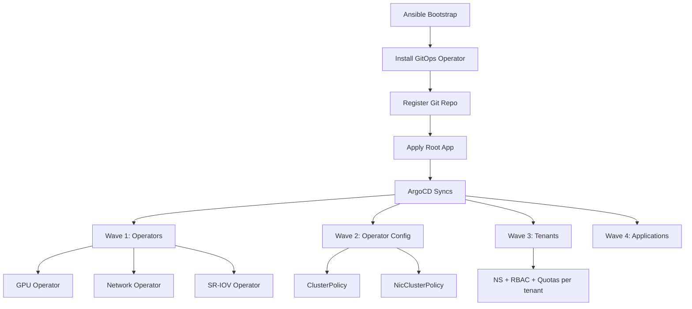

> 💡 **Quick Answer:** Use Ansible for initial bare-metal handshake, then install OpenShift GitOps (ArgoCD) as the single source of truth. A root App-of-Apps pattern manages GPU Operator, Network Operator, SR-IOV, storage classes, and tenant overlays — all from Git.

## The Problem

Bootstrapping a bare-metal GPU cluster involves dozens of interdependent components: GPU Operator, Network Operator, SR-IOV, storage, RBAC, quotas, and tenant configs. Manual setup is error-prone, non-reproducible, and impossible to audit. In air-gapped environments, you also need local mirrors, custom CatalogSources, and CA trust chains.

## The Solution

GitOps-first approach: Git repository is the single source of truth. ArgoCD syncs desired state to the cluster. Every change is a PR, every rollback is a git revert.

### Repository Structure

```bash
gitops/
├── cluster-config/
│   ├── base/
│   │   ├── operators/
│   │   │   ├── gpu-operator.yaml        # NVIDIA GPU Operator subscription
│   │   │   ├── network-operator.yaml     # NVIDIA Network Operator
│   │   │   ├── sriov-operator.yaml       # SR-IOV Network Operator
│   │   │   └── kustomization.yaml
│   │   ├── infra/
│   │   │   ├── storageclasses.yaml       # PowerScale NFS, local NVMe
│   │   │   ├── network-attachments.yaml  # Multus networks
│   │   │   ├── machineconfigs.yaml       # Kernel params, modules
│   │   │   └── kustomization.yaml
│   │   └── kustomization.yaml
│   └── overlays/
│       └── prod/
│           ├── patches/
│           │   ├── gpu-operator-config.yaml
│           │   ├── quotas-tenant-alpha.yaml
│           │   ├── quotas-tenant-beta.yaml
│           │   └── oauth-config.yaml
│           └── kustomization.yaml
├── applications/                          # Helm apps per environment
│   ├── monitoring/
│   ├── logging/
│   └── values-prod.yaml
├── argocd/
│   ├── root-app.yaml                     # App-of-Apps entry point
│   ├── cluster-config-app.yaml
│   └── applicationsets.yaml              # Per-tenant ApplicationSets
└── README.md
```

### Step 1: Ansible Initial Bootstrap

```yaml
# ansible/bootstrap-gitops.yaml
- name: Bootstrap OpenShift GitOps
  hosts: bastion
  tasks:
    - name: Install OpenShift GitOps operator
      kubernetes.core.k8s:
        state: present
        definition:
          apiVersion: operators.coreos.com/v1alpha1
          kind: Subscription
          metadata:
            name: openshift-gitops-operator
            namespace: openshift-operators
          spec:
            channel: latest
            name: openshift-gitops-operator
            source: redhat-operators
            sourceNamespace: openshift-marketplace

    - name: Wait for ArgoCD instance
      kubernetes.core.k8s_info:
        kind: ArgoCD
        namespace: openshift-gitops
        name: openshift-gitops
      register: argocd
      until: argocd.resources | length > 0
      retries: 30
      delay: 10

    - name: Configure Git repository
      kubernetes.core.k8s:
        state: present
        definition:
          apiVersion: v1
          kind: Secret
          metadata:
            name: gpu-cluster-repo
            namespace: openshift-gitops
            labels:
              argocd.argoproj.io/secret-type: repository
          stringData:
            url: "https://git.internal.example.com/platform/gpu-gitops.git"
            username: argocd
            password: "{{ git_token }}"

    - name: Apply root application
      kubernetes.core.k8s:
        state: present
        src: argocd/root-app.yaml
```

### Step 2: Root App-of-Apps

```yaml
# argocd/root-app.yaml
apiVersion: argoproj.io/v1alpha1
kind: Application
metadata:
  name: gpu-cluster-root
  namespace: openshift-gitops
  annotations:
    argocd.argoproj.io/sync-wave: "0"
spec:
  project: default
  source:
    repoURL: https://git.internal.example.com/platform/gpu-gitops.git
    targetRevision: main
    path: argocd
  destination:
    server: https://kubernetes.default.svc
    namespace: openshift-gitops
  syncPolicy:
    automated:
      prune: true
      selfHeal: true
    syncOptions:
      - CreateNamespace=true
      - ServerSideApply=true
```

### Step 3: Cluster Config Application

```yaml
# argocd/cluster-config-app.yaml
apiVersion: argoproj.io/v1alpha1
kind: Application
metadata:
  name: cluster-config
  namespace: openshift-gitops
  annotations:
    argocd.argoproj.io/sync-wave: "1"
spec:
  project: default
  source:
    repoURL: https://git.internal.example.com/platform/gpu-gitops.git
    targetRevision: main
    path: cluster-config/overlays/prod
  destination:
    server: https://kubernetes.default.svc
  syncPolicy:
    automated:
      prune: true
      selfHeal: true
    syncOptions:
      - ServerSideApply=true
```

### Air-Gap Configuration

```yaml
# cluster-config/base/infra/imagedigestmirrorset.yaml
apiVersion: config.openshift.io/v1
kind: ImageDigestMirrorSet
metadata:
  name: gpu-operator-mirror
spec:
  imageDigestMirrors:
    - source: nvcr.io/nvidia
      mirrors:
        - quay.internal.example.com/nvidia-mirror
    - source: registry.k8s.io
      mirrors:
        - quay.internal.example.com/k8s-mirror
---
# Local CatalogSources
apiVersion: operators.coreos.com/v1alpha1
kind: CatalogSource
metadata:
  name: nvidia-gpu-operator-catalog
  namespace: openshift-marketplace
spec:
  sourceType: grpc
  image: quay.internal.example.com/nvidia-mirror/gpu-operator-bundle-catalog:latest
  displayName: NVIDIA GPU Operator
  publisher: NVIDIA
  updateStrategy:
    registryPoll:
      interval: 30m
```

### Bootstrap Flow

```bash
# Full bootstrap sequence:
# 1. Ansible installs OpenShift GitOps operator
ansible-playbook -i inventory bootstrap-gitops.yaml

# 2. Register Git repository with ArgoCD
# 3. Apply root App-of-Apps
# 4. ArgoCD auto-syncs:
#    Wave 0: Root app
#    Wave 1: Cluster config (operators, infra)
#    Wave 2: Operator configs (ClusterPolicy, NicClusterPolicy)
#    Wave 3: Tenant namespaces, RBAC, quotas
#    Wave 4: Applications (monitoring, logging)

# Verify sync status
oc get applications -n openshift-gitops
```



## Common Issues

- **ArgoCD can't reach air-gapped Git** — configure internal Git URL and credentials in ArgoCD secret; verify network connectivity from ArgoCD pod
- **CatalogSource image pull fails** — ensure IDMS mirrors are configured before CatalogSource references; check Quay CA trust
- **Sync order wrong** — use sync waves (`argocd.argoproj.io/sync-wave`) to order operator install before config
- **Self-heal reverts manual changes** — this is intentional; all changes must go through Git
- **GPU Operator subscription pending** — CatalogSource may not have synced; check `oc get catalogsource -n openshift-marketplace`

## Best Practices

- Ansible only for initial bootstrap — everything after is GitOps
- Use sync waves to order: operators → operator configs → tenants → apps
- Air-gap: mirror all images to local Quay before bootstrap
- Store known-good version matrix in Git alongside configs
- Enable auto-prune and self-heal for drift detection
- Use Kustomize overlays for environment-specific patches (dev/staging/prod)
- Test changes in a dev overlay before promoting to prod

## Key Takeaways

- Git commit → PR → ArgoCD sync = reproducible, auditable cluster state
- Ansible handles the chicken-and-egg bootstrap; GitOps handles everything after
- App-of-Apps pattern scales to manage operators, infra, and tenant configs
- Air-gapped clusters need IDMS, CatalogSources, and CA trust before operator install
- Rollback = git revert → ArgoCD auto-syncs previous known-good state
