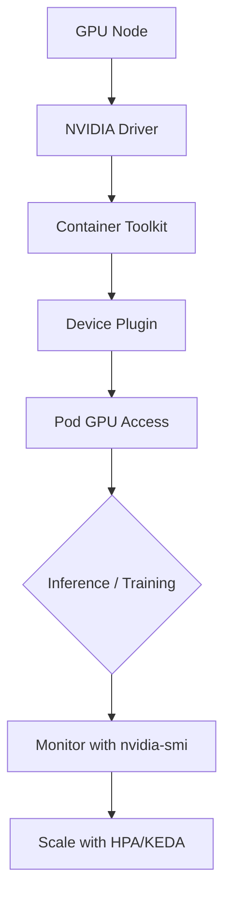

> 💡 **Quick Answer:** Schedule GPU workloads with node affinity and topology on Kubernetes. GPU type selection, multi-GPU locality, and NUMA-aware pod placement.

## The Problem

Schedule GPU workloads with node affinity and topology on Kubernetes. Without proper setup, GPU workloads on Kubernetes suffer from wasted resources, failed scheduling, or degraded inference performance.

## The Solution

### Prerequisites

```bash
# Verify GPU nodes are available
kubectl get nodes -l nvidia.com/gpu.present=true
kubectl describe node <gpu-node> | grep -A5 "Allocatable"

# Check NVIDIA driver and CUDA
kubectl exec -it <gpu-pod> -- nvidia-smi
```

### Configuration

```yaml
# GPU Node Affinity Scheduling K8s — production configuration
apiVersion: v1
kind: Pod
metadata:
  name: gpu-workload
  namespace: gpu-inference
spec:
  containers:
  - name: inference
    image: nvcr.io/nvidia/pytorch:24.07-py3
    resources:
      limits:
        nvidia.com/gpu: 1
      requests:
        nvidia.com/gpu: 1
    env:
    - name: NVIDIA_VISIBLE_DEVICES
      value: "all"
    - name: NVIDIA_DRIVER_CAPABILITIES
      value: "compute,utility"
  nodeSelector:
    nvidia.com/gpu.present: "true"
  tolerations:
  - key: nvidia.com/gpu
    operator: Exists
    effect: NoSchedule
```

### Deployment

```bash
# Apply GPU workload
kubectl apply -f gpu-workload.yaml

# Verify GPU allocation
kubectl describe pod gpu-workload | grep -A3 "Limits"

# Monitor GPU utilization
kubectl exec -it gpu-workload -- nvidia-smi dmon -s pucvmet -d 5
```

### Verification

```bash
# Check GPU is accessible inside the pod
kubectl exec -it gpu-workload -- python3 -c "
import torch
print(f'CUDA available: {torch.cuda.is_available()}')
print(f'GPU count: {torch.cuda.device_count()}')
print(f'GPU name: {torch.cuda.get_device_name(0)}')
print(f'Memory: {torch.cuda.get_device_properties(0).total_mem / 1e9:.1f} GB')
"
```



## Common Issues

**GPU not visible inside pod**

Check that the NVIDIA device plugin DaemonSet is running on the node. Verify with `kubectl get pods -n gpu-operator -l app=nvidia-device-plugin-daemonset`. If missing, the GPU Operator may need reinstalling.

**CUDA version mismatch**

The container CUDA version must be compatible with the host driver. Use `nvidia-smi` on the node to check driver version, then select a compatible container image from NVIDIA NGC catalog.

**Out of memory on GPU**

Reduce batch size, enable gradient checkpointing for training, or use model quantization (AWQ/GPTQ) for inference. Monitor with `nvidia-smi` to track peak memory usage.

## Best Practices

- Always set `resources.limits` for `nvidia.com/gpu` — without it, pods won't get GPU access
- Use node selectors or affinity to target specific GPU types (A100, H100, etc.)
- Monitor GPU utilization with DCGM Exporter + Prometheus — idle GPUs waste expensive resources
- Pin CUDA container versions — don't use `latest` tags in production
- Enable GPU health checks with liveness probes that verify CUDA functionality

## Key Takeaways

- GPU Node Affinity Scheduling K8s is critical for production GPU workloads on Kubernetes
- Proper resource configuration prevents scheduling failures and resource waste
- Monitor GPU utilization to right-size allocations and reduce cloud costs
- Use NVIDIA GPU Operator for automated driver and toolkit lifecycle management
- Combine with KEDA or custom metrics HPA for GPU-aware autoscaling
